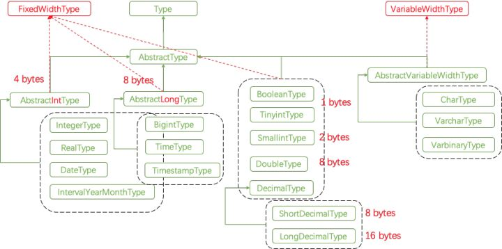
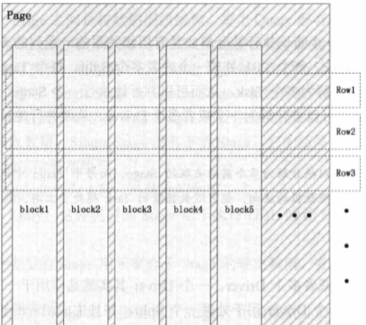
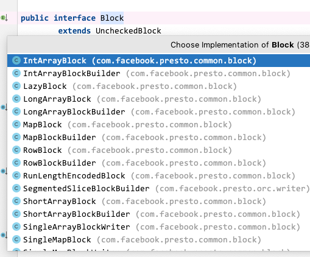
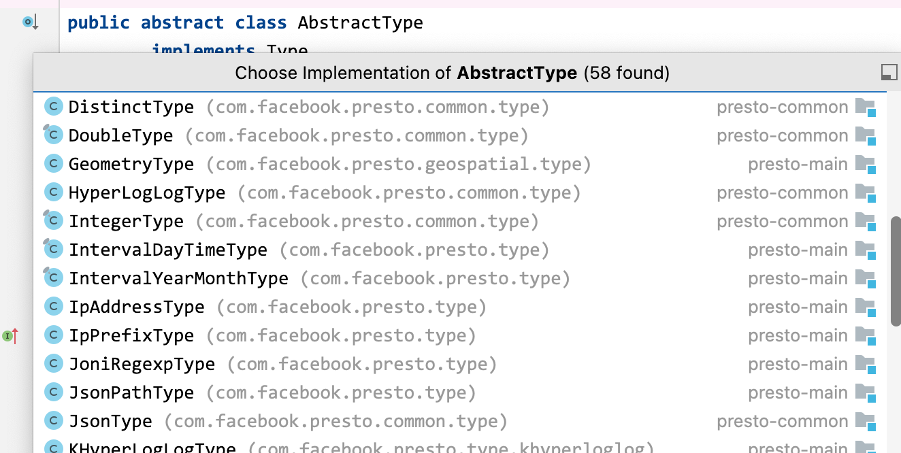
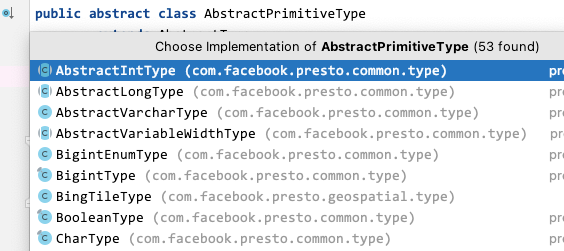

# Presto类型系统浅入

[返回首页](../README.md)

---

## 类型分类

这里我们可以先了解一下[Presto类型系统初探](https://zhuanlan.zhihu.com/p/55299409)中的类型分布。

> 下面的关系图已经过时，不过现在大体的设计还是遵循了这个路线，不影响我们学习。



### 基本类型

*  BooleanType：表示布尔值，通常用于条件和逻辑运算。
*  IntegerType：表示整数值，对应于 Java 的 `int`。
*  BigintType：表示更大范围的整数，对应于 Java 的 `long`。
*  SmallintType：表示较小范围的整数，对应于 Java 的 `short`。
*  TinyintType：表示最小范围的整数，通常用于节省空间的场景。
*  DoubleType：表示双精度浮点数，对应于 Java 的 `double`。
*  RealType：表示单精度浮点数，对应于 Java 的 `float`。

### 字符串和二进制类型

*  VarcharType：表示可变长度的字符串。
*  CharType：表示固定长度的字符串。
*  VarbinaryType：用于存储二进制数据，类似于 Java 的 `byte[]`。

### 日期和时间类型

*  DateType：表示日期。
*  TimeType：表示时间。
*  TimestampType：表示时间戳，即日期和时间的组合。
*  TimestampWithTimeZoneType：表示带有时区信息的时间戳。

### 复杂类型

*  ArrayType：表示数组类型，可以包含一系列同类型的元素。
*  MapType：表示映射类型，包含键值对。
*  RowType：表示结构体或行类型，可以包含多个不同类型的字段。

### 特殊类型

*  JsonType：用于处理 JSON 数据。
*  IPaddressType：专门用于存储 IP 地址。
*  UUIDType：用于处理 UUID。

## 其他关键概念 Slice Block Type

在开始学习这些类型前，我们需要知道 Presto 一些特殊的设计，以及他们之间的关系。

### 底层类型 Slice

Slice 是 Presto 自定义的一种数据结构，主要用于高效的处理二进制数据或原始字节序列。它是 Presto 中处理字符串、二进制数据和其他原始字节序列的关键组件。

片面的理解，可以认为在 Presto 中处理字符串类型时，一般会用到 Slice。

但是为什么要搞一个 Slice 类型呢？深入一点的理解，主要区别如下：

Slice 是一个更底层的数据结构，用于字节级操作，而 Type 类型是更高层次的抽象，代表 SQL 数据类型及其在 Presto 中的行为。在某些 Type 类型的内部实现中，如 VarcharType，Slice 被用作存储实际数据的底层机制。但是 Type 类型还包括了与该数据类型相关的其他逻辑和操作，如数据比较、哈希计算等。
 

### 数据的载体 Block

我们知道 Presto 是一个 OLAP 引擎，是可以对数据进行列式操作的，这里引用以下某本书里的一张图片。

Page 是 Presto 中处理的最小数据单元。一个 Page 对象包含多个 Block 对象，而每个 Block 对象是一个字节数组，存储一个字段的若干行。多个 Block 横切的一行是真实的一行数据。




Block 可以按照另一种更高一层的数据抽象来理解，里面同样有获取数据、数据大小和结构、数据状态，为了我们方便构建数据，还定义了一个 BlockBuilder。

注意，这里有一个接口叫 UncheckedBlock 是 Block 的一个变体，提供了一些无边界检查的数据访问方法。这意味着这些方法不会检查索引的有效性，因此它们比标准的 Block 方法更快，但使用时需要更小心。

这里有个疑问，为什么要设计 Block 呢？  

1. 第一点，这个我们都知道，为了方便列式操作
2. 第二点，是方便内存管理，通过 Block 和 BlockBuilder，Presto 能够有效地管理内存，特别是在处理大量数据时。
3. 第三点，是性能优化，Block 结构允许 Presto 对数据访问和处理进行优化，特别是通过 UncheckedBlock 提供了一种更快的数据访问方式

注意，这里介绍的 Block 与 UncheckedBlock，可以理解为基础接口，还有其他类型比如 Array、Map、Row 等等与类型对应的 Block，这块我们在介绍了类型之后再来介绍它们。



### Slice 与 Block 的关系

可能我这个词语不太对，我是这么理解的，Slice 是类型，Block 是载体。

比如 Block 中，可能有 int，bool，以及 slice 等类型的数据，再比如一个 Block 可能包含多个字符串数据，这些字符串数据是以 Slice 的形式存储的。

### Type 与 Block 的关系

在 Presto 中，Block 和各种 Type（如 IntegerType、VarcharType、JsonType 等）之间的关系是数据存储和表示的核心。这些 Type 和 Block 结构共同构成了 Presto 处理数据的基础。

简单的理解就是，Type 代表数据类型，Block 代表如何存储、访问以及处理数据。

## Presto 为什么要重新定义一套类型

首先，Java 原生数据类型在 SQL 建模场景下存在功能限制。这主要体现在以下几个方面:

SQL 类型系统对数值范围和精度有严格要求。例如 DECIMAL 类型需要支持高精度的定点数运算，这超出了 Java 原生类型的表达能力。同样，SQL 中的时间日期类型(如 `DATE`、`TIME`、`TIMESTAMP`)以及 NULL 值的语义处理，都与 Java 原生类型有明显差异。直接使用 Java 类型难以满足 SQL 标准规范，因此需要专门设计封装。

其次，SQL 系统需要丰富的元数据(metadata)支持。Presto 通过元数据定义了类型的多种属性和操作语义，包括排序性(sortable)、可比较性(comparable)、边界性(bounded)等特性。这些语义属性需要在类型系统层面进行统一管理。

第三，作为 OLAP 引擎，Presto 采用列式存储架构，通过 Block 结构组织数据。自定义类型系统可以更好地适配 Block 的数据访问模式，提升查询性能。

基于以上考虑，Presto 实现了完整的类型系统架构。其核心是 `Type` 接口，该接口定义了类型系统的基础语义和操作规范。下面我们将详细分析这个接口的设计思想。

## Type 接口

接下来开始正经介绍：

Presto 的类型基本都基于这个接口，在这个接口中设计了很多重要的方法。

源码位置： com.facebook.presto.common.type.Type

### 类型识别

以下这 2 个方法主要实现一个是对 Presto 系统自身逻辑使用所需的类型识别，另一个则是对外比如写 SQL 时，显示的 Varchar，Boolean 等等。

- `getTypeSignature()` 方法：获取类型名称，不区分大小写，全局唯一，通常叫内部签名。

1. 类型的唯一标识：返回一个 `TypeSignature` 对象，这个对象代表了类型的唯一标识。在 Presto 中都用这个标识来进行操作。
2. 类型系统的内部工作：这个签名用于 Presto 的类型系统内部，如类型推断、类型匹配和函数重载解析等。
3. 杂类型的支持：Presto 支持复杂的数据类型，如结构体、地图和数组。`getTypeSignature()` 方法允许这些复杂类型以结构化的方式表示，包括其参数和嵌套类型。

- `getDisplayName()` 方法：最终显示的名称，也就是最终用户看到的。

1. 用户友好的类型名称：提供了一个更易于理解和阅读的类型名称，主要是方便用户理解。
2. SQL 标准和兼容性：在 SQL 查询和结果中，显示的类型名称通常遵循 SQL 标准或者是用户更熟悉的格式。例如，尽管内部可能使用不同的表示方法，但对于用户来说，整数类型可能仅显示为 int，以及我们常见的 Varchar Timestamp等等。
3. 区分相似类型：在某些情况下，不同的内部类型可能对用户来说是相同的。`getDisplayName()` 允许这些类型有区分性的展示，即使它们的内部表示可能不同。

### Java 类型映射

主要是提供了一种 Presto 数据类型映射到 Java 类型的机制。

- `getJavaType()` 

1. 内部表示：Presto 需要在内部处理各种数据类型，如整数、浮点数、字符串等。`getJavaType()` 方法指定了在 Java 中执行表达式时，这些 Presto 数据类型应该如何在内存中表示。例如，Presto 中的整数可能在 Java 中表示为 `long` 类型，而字符串可能表示为 `Slice` 类型。
2. 性能优化：Presto 是一个高性能的分布式 SQL 查询引擎，因此在内部处理数据时需要高效地管理内存和计算。通过将 Presto 类型映射到合适的 Java 类型，可以优化数据处理的性能，例如，使用原生类型（如 `int`, `long`, `double`）可以减少对象创建的开销，提高处理速度。
3. 类型安全：Java 是一种静态类型语言，这意味着在编译时就确定了变量的类型。`getJavaType()` 方法允许 Presto 在编译时期就确保类型的正确性，从而减少运行时的类型错误。
4. 与 Java 生态系统的集成：Presto 需要与 Java 生态系统中的其他库和工具集成。通过明确指定每个 Presto 类型在 Java 中的表示，可以更容易地与 Java 代码和库交互。
5. 通用性和扩展性：这种映射机制使得 Presto 能够支持多种数据类型，并且可以轻松地扩展以支持新的数据类型。开发者可以为新的数据类型定义 Java 表示，从而扩展 Presto 的功能。


### 类型参数

在 Java 和许多其他编程语言中，参数化类型是一种允许在定义类、接口或方法时指定一个或多个类型参数的机制。这种机制在 Java 中通常与泛型（Generics）相关联。参数化类型使得代码可以对不同的数据类型进行操作，同时保持类型安全和可重用性。

- `getTypeParameters()` 返回类型参数的列表。主要是用于处理一些复杂类型。

1. 支持复杂类型：Presto 支持多种复杂的数据类型，如数组、地图和结构体。这些类型通常是参数化的，意味着它们基于其他类型构建。例如，一个数组类型可能是基于整数类型的数组，或者是基于字符串类型的数组。
2. 类型的灵活性：`getTypeParameters()` 允许 Presto 灵活地处理这些复杂类型。通过知道一个类型的参数，Presto 可以正确地处理和操作这些类型的数据。
3. 代码的泛化和重用：在 Presto 的内部实现中，参数化类型的支持允许代码更加泛化和可重用。例如，相同的逻辑可以用来处理不同类型的数组或地图，而无需为每种数据类型编写特定的代码。

举例说明：

假设有一个数组类型 `ArrayType(IntegerType)`，这表示一个整数数组。在这里，IntegerType 是 ArrayType 的类型参数。

一般获取类型的参数列表主要用于以下几个场景

1.类型检查和转换：在执行查询时，Presto 需要确保数据类型的正确性。例如，当处理数组或地图类型时，Presto 需要知道其元素或键值的类型。
2.函数和操作符的重载解析：在 SQL 查询中使用函数或操作符时，Presto 需要根据参数类型来解析和选择正确的函数实现。
3.序列化和反序列化：在数据交换和存储过程中，了解复杂类型的具体参数有助于正确地序列化和反序列化数据。

### 块 Block 构建器

块 Block 是 Presto 处理和存储数据的基本机制之一。

简单介绍一下块 `Block` 的概念：`Page` 是 Presto 中处理的最小数据单元。一个 `Page` 对象包含多个 `Block` 对象，而每个 `Block` 对象是一个字节数组，存储一个字段的若干行。多个 `Block` 横切的一行则对应一行实际的数据。

- `createBlockBuilder(BlockBuilderStatus blockBuilderStatus, int expectedEntries, int expectedBytesPerEntry)` 方法用于创建此类型的首选块构建器，这是用于在查询中存储表达式投影后的值的构建器。

该方法有重载，区别在于是否含有 `expectedBytesPerEntry` 参数。重载的目的在于应对那些不需要精确控制每个条目字节大小的场景。

参数解释：

1. BlockBuilderStatus 提供当前 builder 的状态信息
2. expectedEntries 预期的条目数
3. expectedBytesPerEntry 预提条目的字节数，主要方便进行预先分配足够的内存空间


### 值获取和写入和无边界操作

从块 Block 中获取值，和写入值。

获取值：

- `getObjectValue(SqlFunctionProperties properties, Block block, int position)`，从 Block 中指定的位置 Position 获取值，这个方法主要是将原始数据转换为 Java 对象，就是说无论什么类型，都会转换成一个 Java 可以处理的对象。

同时这个方法还有个很关键的点，就是返回的对象必须是 JSON 可序列化的，同时也方便用于将数据转换为可以通过 REST API 等方式传输的格式。

- `boolean getBoolean(Block block, int position)`，有无边界获取
- `long getLong(Block block, int position)`，有无边界获取
- `double getDouble(Block block, int position)`，有无边界获取
- `Slice getSlice(Block block, int position)`，有无边界获取
- `Object getObject(Block block, int position)`, 有无边界获取

写入值：

- `void writeBoolean(BlockBuilder blockBuilder, boolean value)`
- `void writeLong(BlockBuilder blockBuilder, long value)`
- `void writeDouble(BlockBuilder blockBuilder, double value)`
- `void writeSlice(BlockBuilder blockBuilder, Slice value)`
- `void writeObject(BlockBuilder blockBuilder, Object value)`，有重载，区别在于 slice 的 offset 与 length

这里有个关键的概念的 `无边界的操作`，比如 `getBoolean` 有个对应的 `getBooleanUnchecked`，主要目的是不进行边界检查的情况下，操作 Block 中的值。那么为什么要设计这个无边界的操作呢？根据相关资料了解，主要是出于性能优化的考虑，这种设计允许在特定情况下提高数据处理的效率。

因为有边界的检查方法中，会有各种边界检查，比如防止数组越界等错误等等，这些检查可以提高代码的健壮性和安全性，同时也会有性能衰减。所以设计了无边界的操作，这些是为了在一些特定场景中，性能敏感的地方使用。

这里举个简单的例子，比如已经确定数据在 Block 的有效范围内了。可以使用 getDoubleUnchecked 来加速获取值。

```java
// 假设已知 startIndex 和 endIndex 在 block 的有效范围内
for (int position = startIndex; position < endIndex; position++) {
    double value =*Type.getDoubleUnchecked(block, position);
    // 对 value 进行一些计算或操作
}
```

### 可比较性和可排序性 

类型的操作性，比如我们在写 SQL 时， WHERE 子句中字段比较等操作，ORDER BY 子句等等操作。

- `boolean isComparable()` 可比较
- `boolean isOrderable()` 可排序

注意这 2 个方法，的返回值是 boolean，所以这里只是代表类型是否具备可比较和可排序，具体的比较逻辑可以按照 Java 在设计一个实体类一样，Presto 中也是去实现 `equalTo` 和 `hash` 方法来实现比较的功能。

同时实现 `compareTo` 方法，来实现排序的功能。


### 值比较、哈希、追加

根据前面的可排序，可比较介绍，这里我们就可以按照设计一个 Java 实体来理解了。

- `equalTo()` 比较块中的值
- `hash()` 计算哈希
- `appendTo()` 将值追加到块构建器中

### Type 扩展：定长和变长接口

#### FixedWidthType 

接口用于那些在内存中占用固定字节大小的数据类型。这意味着每个数据元素的大小是恒定的，不会根据实际值的不同而改变。

*  特点：
    *  内存效率：由于大小固定，这些类型的数据可以更高效地在内存中存储和访问。
    *  应用场景：典型的固定宽度类型包括整数（如 `INTEGER`, `BIGINT`）、浮点数（如 `DOUBLE`, `REAL`）和日期时间类型（如 `DATE`, `TIMESTAMP`）。

1. getFixedSize**
    
    *  功能：获取此类型的值的固定大小（以字节为单位）。对于实现 `FixedWidthType` 的所有类型，其值的大小是恒定的。
    *  返回值：返回一个整数，表示类型值的固定字节大小。
2. createFixedSizeBlockBuilder**
    
    *  功能：创建一个 `BlockBuilder`，用于构建此类型的数据块。这个 `BlockBuilder` 被初始化为能够容纳指定数量的位置（`positionCount`），每个位置的大小是固定的。
    *  参数：`positionCount` - 预期要存储的元素数量。
    *  返回值：返回一个 `BlockBuilder` 实例，用于构建和存储此类型的数据。


`getFixedSize` 方法允许 Presto 精确地知道每个元素占用多少内存，这对于内存管理和性能优化非常重要。而 `createFixedSizeBlockBuilder` 方法则提供了一种高效创建和管理固定大小数据的方式。这些特性使得 `FixedWidthType` 在处理如整数、浮点数等固定大小数据时非常高效。

#### VariableWidthType

接口用于那些在内存中占用可变字节大小的数据类型。这些类型的数据元素根据实际值的不同，占用的字节大小也不同。

*  特点：
    *  灵活性：可以根据数据的实际内容动态调整所占用的空间。
    *  应用场景：典型的可变宽度类型包括字符串（如 `VARCHAR`）和二进制数据（如 `VARBINARY`）。

#### 设计理解

我们在源码中是可以看到 FixedWidthType 和 VariableWidthType 都 extends Type。

思考一下，为什么要这样设计呢？为什么不都统一在 Type 接口里设计好呢？

我们知道，定长类型与变长类型有些处理逻辑是相悖的，这是一种面向对象设计的 `契约` 概念。

* 首先肯定是避免实现类必须实现它们不需要的方法
* 方便了以后定长类型与变长类型的扩展
* VariableWidthType和FixedWidthType代表了两种不同的"契约"
* 实现FixedWidthType的类型承诺：我的每个值都是固定大小的
* 实现VariableWidthType的类型承诺：我的值可能是变长的
* 这种契约让使用这些类型的代码可以做出相应的优化假设

**类型安全设计**

遵守了这种契约，后续的开发与编译时是能保证类型安全的。

```
// 假设我们需要一个只处理固定长度类型的方法
public void processFixedWidthType(FixedWidthType type) {
    int size = type.getFixedSize();  // 编译时就能确保这个调用是安全的
    // ...
}
```

> 这种设计体现了 "组合优于继承" 的原则，通过接口组合而不是把所有功能都放在一个大接口中，使得系统更加灵活和可维护。这也是为什么现代编程语言和框架倾向于使用小接口而不是大接口的原因。


## Type 后续的抽象类

Type 算是所有类型的基础接口设计，而以下两个抽象类，算是 Presto 对类型的两层抽象。

这两层抽象都处理了特定的关注点，避免的每个具体类型都要实现所有 Type 接口方法

### AbstractType

AbstractType 是作为所有类型的基础抽象类，提供了一些通用的实现和工具方法，它是其他更具体类型类的基础。

设计此抽象类，presto的主要是为所有的类型设计一个统一的基准行为，比如我们可以看到里面的大部分方法都返回了统一的异常，这样就相当于给接口方法一个默认的实现，保证所有的子类在默认的情况下，具有一致的效果。

```
@Override
public boolean equalTo(Block leftBlock, int leftPosition, Block rightBlock, int rightPosition)
{
    throw new UnsupportedOperationException(getTypeSignature() + " type is not comparable");
}
@Override
public int compareTo(Block leftBlock, int leftPosition, Block rightBlock, int rightPosition)
{
    throw new UnsupportedOperationException(getTypeSignature() + " type is not orderable");
}
@Override
```

后续我们可以看到基本常用的子类都继承了它，所以该抽象类，也是起到了 强制子类提供具体实现，方便扩展，同时接口的通用实现放在下一层的抽象类中，也有助于代码的维护，和结构的清晰性和可读性。



### AbstractPrimitiveType AbstractVariableWidthType


继承自AbstractType，专门用于原始类型，避免每个具体类型都要实现所有Type接口方法，提供了默认的错误处理机制，统一管理通用属性（如javaType）。


### 带有类型的抽象类 Long Int Decimal DateTime

从 AbstractType，AbstractPrimitiveType 这些抽象类，往下走，我们可以看到会有很多具体类型的抽象类设计



比如

* AbstractLongType 专门用于处理长整型数据（对应于 Java 中的 `long` 类型）。它提供了处理长整型数据的特定方法。
* AbstractIntType 专门用于处理整型数据（对应于 Java 中的 `int` 类型）。它提供了处理整型数据的特定方法。
* DecimalType 用于表示十进制数，支持固定和可变精度的十进制数。这个类提供了处理十进制数的特定方法。

这里我们先思考一下，已经有一个 AbstractType 了，为什么还要设置具体类型的抽象呢？

在 Presto 中设计了 AbstractLongType， AbstractIntType， DecimalType 具体类型抽象类，是为了提供针对特定数据类型的专属化实现和优化。这些抽象类继承自 AbstractType 并增加了一些新的功能和特性，以适应各自数据类型的特定需求。

这里我们可以分类的理解，分为整型(也包括时间类型)、长整型、大精度类型，那么这些3种类型里面，要设计哪些特殊处理呢？

这样的设计主要有以下 4 个关键点

1.   性能优化
    *   整型：使用专门的IntArrayBlockBuilder
    *   长整型：使用专门的LongArrayBlockBuilder
    *   大精度：根据精度自动选择最优实现
2.   类型安全
    *   整型：处理int到long的安全转换
    *   长整型：直接处理long值
    *   大精度：精度和标度的验证
3.   特殊运算
    *   整型：整数比较逻辑
    *   长整型：特殊的哈希计算
    *   大精度：精度相关的运算
4.   内存优化
    *   整型：固定4字节
    *   长整型：固定8字节
    *   大精度：根据精度选择最优存储方式

这种设计体现了"专门化"的思想，通过为不同数据类型提供专门的实现，既保证了类型安全，又实现了性能优化。每种类型的抽象类都关注于解决该类型特有的问题，使得具体类型的实现更加简单和高效。


## Block 接口

根据前面的介绍，我们知道 Block 在 Presto 中是数据的载体，是 Presto 中最基础的数据存储和处理单元,主要有以下几个作用

1. 数据存储容器
    - Block 作为一个列式存储的容器，用于存储同一类型的多个值
    - 支持不同数据类型（如 int、long、string 等）的存储
    - 提供内存高效的数据存储方式
2. 设计了数据访问接口，比如 Block 里有如下方法
    - getPositionCount 获取Block中的位置数
    - isNull 获取指定位置的值是否为null
    - getSizeInBytes 获取Block在内存中的大小
    - getLogicalSizeInBytes 获取Block的逻辑大小
3. Block 与 Type 类型接口的关系
    - Type 定义了数据类型的行为和操作，Block 提供了实际的数据存储容器
    - Type 负责对 Block 中的数据进行读写操作，例如：
        - 从 Block 中读取 long 类型的值 long getLong(Block block, int position);
        - 向 BlockBuilder 中写入 boolean 值 void writeBoolean(BlockBuilder blockBuilder, boolean value);

Type 与 Block 设计的目的在于实现了数据存储和数据操作的解耦。

## 总结

我们详细了解了 Presto 类型系统的设计理念和实现细节。从基本的类型分类，到底层的 Slice 结构，从 Block 的数据载体设计，到 Type 接口的丰富功能，再到抽象类的层次化实现，我们可以看到 Presto 在类型系统设计上的深思熟虑。

这种设计既保证了类型系统的完整性和扩展性，又通过精心的性能优化确保了高效的数据处理能力。特别是在 Type 接口与 Block 的配合中，展现了优秀的解耦设计思想。

让我们系统地总结一下 Presto 类型系统的核心要点：

### 1. 核心组件

- **Type**: 定义了类型的基本行为和属性
- **Block**: 作为数据的载体，提供高效的列式存储
- **Slice**: 作为底层数据结构，用于高效处理二进制数据

### 2. 类型体系的分层设计

- **基础接口层**: Type 接口定义基本契约
- **抽象实现层**: AbstractType 提供通用实现
- **类型特化层**: 如 AbstractLongType 等针对具体类型的抽象类
- **具体实现层**: 最终的具体类型实现

### 3. 关键设计特点

- **类型安全**: 通过接口契约和类型检查确保类型安全
- **性能优化**: 
  - 通过 Block 的列式存储提升性能
  - 提供无边界检查的操作方法
  - 针对不同类型提供专门的优化实现
- **扩展性**: 通过接口和抽象类的设计，支持新类型的扩展

### 4. 实际应用价值

- 支持 SQL 标准的类型系统
- 提供高效的数据处理能力
- 良好的可维护性和扩展性
- 与 Java 生态系统的良好集成

这种设计不仅满足了 Presto 作为分布式 SQL 查询引擎的需求，也为类型系统的设计提供了很好的参考。
