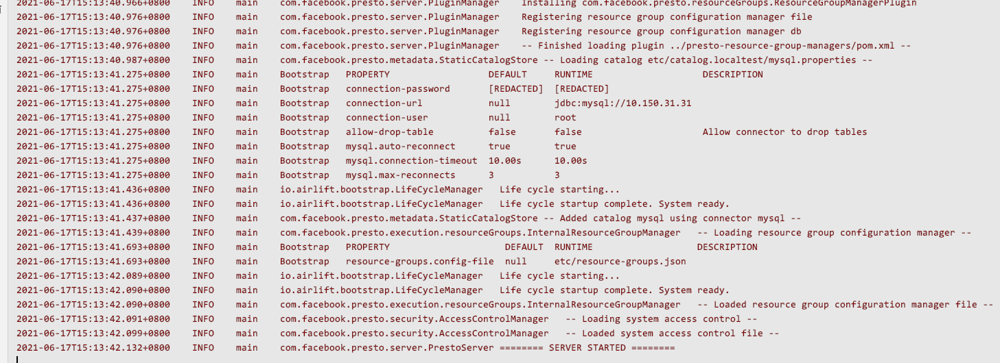
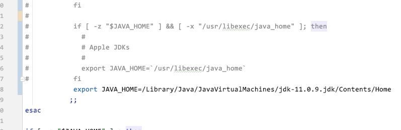
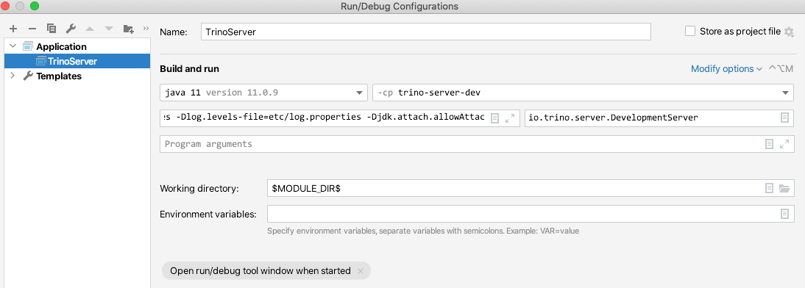
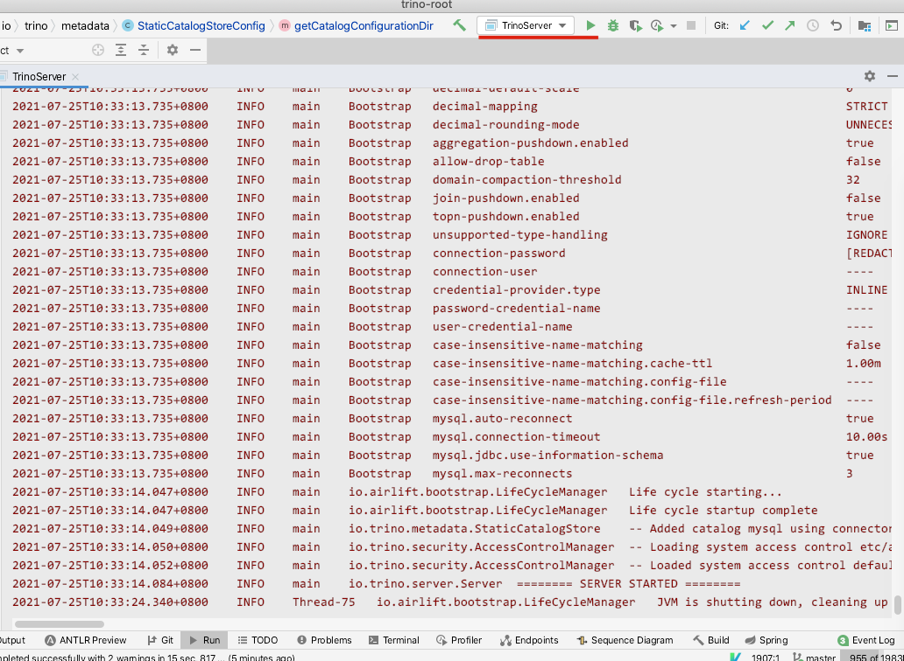
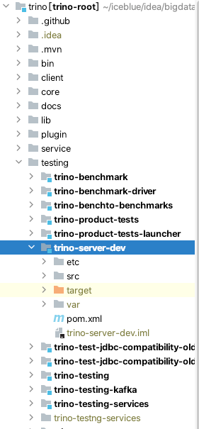
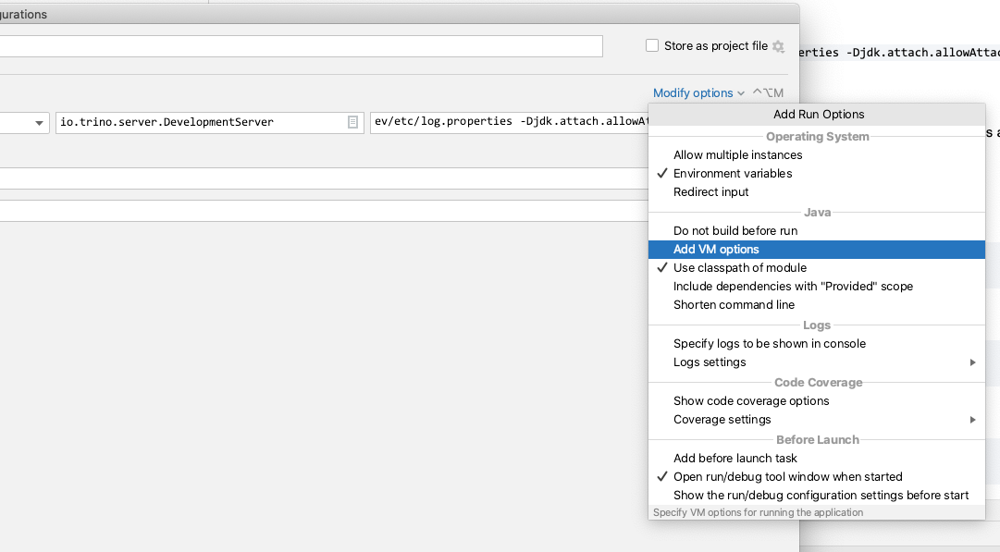
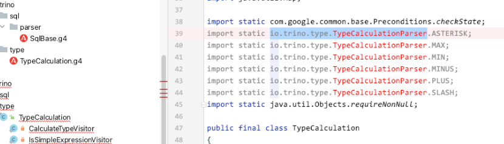
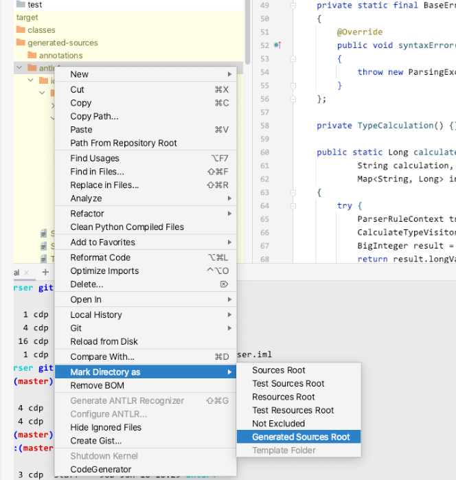
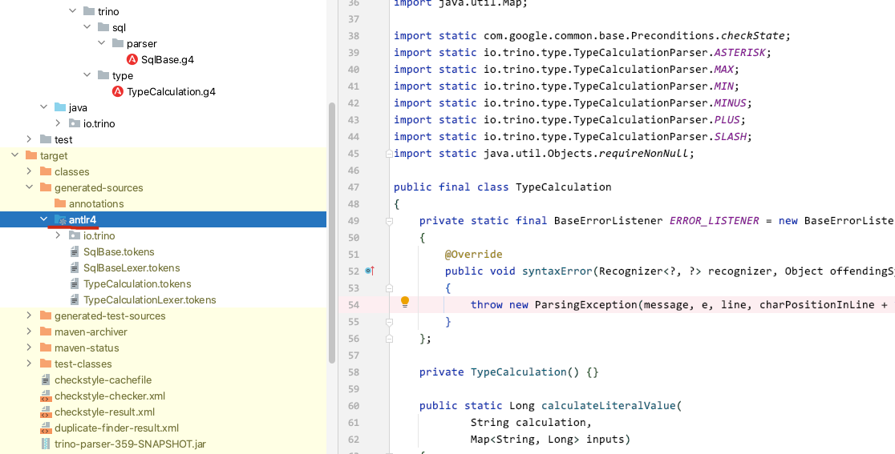

# 源码开发与阅读环境搭建

[返回首页](../README.md)

---

## presto源码环境

第一步：克隆项目并用IDEA打开

> 同样也可以fork到自己的仓库里进行clone

```
git clone git@github.com:prestodb/presto.git
```

第二步：注释掉主pom中的docs模块

因为docs模块会有一些环境需要准备，且这个模块与代码开发没有直接联系。我们暂时可以不需要。故将其注释。

```xml
        <module>presto-benchmark-driver</module>
        <module>presto-server</module>
        <module>presto-server-rpm</module>
<!--        <module>presto-docs</module>-->
        <module>presto-verifier</module>
        <module>presto-testing-server-launcher</module>
        <module>presto-plugin-toolkit</module>
```

第三步：编译与启动

> 注意：只能在mac或者linux环境下完成编译

如果在代码中有一些自己的调试，或者日志输出等。请在pom中添加 `<air.check.skip-extended>true</air.check.skip-extended>` 跳过格式检查。因为如果还没习惯presto的checkstyle的话，这块调试起来特别费时间。可以添加到如下位置：

```xml
    <properties>
        <air.check.skip-extended>true</air.check.skip-extended>
        <air.main.basedir>${project.basedir}</air.main.basedir>

        <air.check.skip-spotbugs>true</air.check.skip-spotbugs
```

然后开始编译打包

```
mvn -T 1C clean package -DskipTests
```

编译完成后，按照正常的流程，再配置catalog即可本地启动测试了。

启动类，复制一下类名到IDEA中按两下shift然后粘贴即可直接到达，找到里面的main方法遍可以进行本地启动：

```
com.facebook.presto.server.PrestoServer
```

正常启动效果如下：



如果需要进行单独某些模块的开发调试，可以参考第四步。

第四步：选择指定的模块

在 `presto-main` 工程里，修改 `etc/config.properties` 里的内容。

主要修改 `plugin.bundles` 里的内容，来选择需要哪些 `plugin` 来进行开发。

比如我现在只需要 `mysql` 和 `resource-group-manager` ，那么我们可以这样设置：

```
plugin.bundles=\
  ../presto-mysql/pom.xml,\
  ../presto-resource-group-managers/pom.xml
```

此时无需再编译，可以直接启动。


## trino源码环境

第一步：克隆项目并打用IDEA打开

> 同样也可以fork到自己的仓库里进行clone

```
git clone git@github.com:trinodb/trino.git
```

第二步：注释掉主pom中的docs模块

因为docs模块会有一些环境需要准备，且这个模块与代码开发没有直接联系。我们暂时可以不需要。故将其注释。

```xml
        <module>core/trino-server-main</module>
        <module>core/trino-server-rpm</module>
        <module>core/trino-spi</module>
<!--        <module>docs</module>-->
        <module>lib/trino-array</module>
        <module>lib/trino-geospatial-toolkit</module>
        <module>lib/trino-matching</module>
```

第三步：编译

这里我们使用了mvnw进行编译

> 注意：如果有多个java环境的话，建议在mvnw中强制执行java_home的路径，见下图



如果在代码中有一些自己的调试，或者日志输出等。请在pom中添加 `<air.check.skip-extended>true</air.check.skip-extended>` 跳过格式检查。因为如果还没习惯presto的checkstyle的话，这块调试起来特别费时间。可以添加到如下位置：

```xml
    <properties>
        <air.check.skip-extended>true</air.check.skip-extended>
        <air.main.basedir>${project.basedir}</air.main.basedir>

        <air.check.skip-spotbugs>true</air.check.skip-spotbugs
```

然后开始编译打包

```
./mvnw -T 1C clean package -DskipTests
```

> 注意：启动方式与presto稍微有点区别

这里我们手动添加应用的启动环境


需要配置以下4项，需要注意的是默认 Run/Debug Configurations 中是不带 `VM Options` 的，需要手动在右上角的 Modify options 中选中 Add VM Options。这样才有配置的地方。不然容易出现错误 `may not be null (for class io.airlift.node.NodeConfig.environment)`

*   Main Class: `io.trino.server.DevelopmentServer`
*   VM Options: `-ea -Dconfig=etc/config.properties -Dlog.levels-file=etc/log.properties -Djdk.attach.allowAttachSelf=true`
*   Working directory: `$MODULE_DIR$`
*   Use classpath of module: `trino-server-dev`

最终配置是这样



保存后点击右上角即可启动




第四步：选择指定的模块

> 这里与presto差不多，主要是模块的位置调整了，见下图



在 `testing/trino-server-dev` 工程里，修改 `etc/config.properties` 里的内容。

主要修改 `plugin.bundles` 里的内容，来选择需要哪些 `plugin` 来进行开发。

比如我现在只需要 `mysql` 和 `resource-group-manager` ，那么我们可以这样设置：

```
plugin.bundles=\
  ../../plugin/trino-resource-group-managers/pom.xml,\
  ../../plugin/trino-mysql/pom.xml
```

此时无需再编译，可以直接启动。

## 编译常见问题

### 问题1：UnknownHostException

错误现象：

```
Downloading https://repo1.maven.org/maven2/org/apache/maven/apache-maven/3.6.3/apache-maven-3.6.3-bin.zip

Exception in thread "main" java.net.UnknownHostException: repo1.maven.org
        at java.net.AbstractPlainSocketImpl.connect(AbstractPlainSocketImpl.java:184)
        at java.net.SocksSocketImpl.connect(SocksSocketImpl.java:392)
        at java.net.Socket.connect(Socket.java:589)
        at sun.security.ssl.SSLSocketImpl.connect(SSLSocketImpl.java:673)
        at sun.security.ssl.BaseSSLSocketImpl.connect(BaseSSLSocketImpl.java:173)
        at sun.net.NetworkClient.doConnect(NetworkClient.java:180)
        at sun.net.www.http.HttpClient.openServer(HttpClient.java:463)
        at sun.net.www.http.HttpClient.openServer(HttpClient.java:558)
        at sun.net.www.protocol.https.HttpsClient.<init>(HttpsClient.java:264)
        at sun.net.www.protocol.https.HttpsClient.New(HttpsClient.java:367)
        at sun.net.www.protocol.https.AbstractDelegateHttpsURLConnection.getNewHttpClient(AbstractDelegateHttpsURLConnection.java:191)
        at sun.net.www.protocol.http.HttpURLConnection.plainConnect0(HttpURLConnection.java:1156)
        at sun.net.www.protocol.http.HttpURLConnection.plainConnect(HttpURLConnection.java:1050)
        at sun.net.www.protocol.https.AbstractDelegateHttpsURLConnection.connect(AbstractDelegateHttpsURLConnection.java:177)
        at sun.net.www.protocol.http.HttpURLConnection.getInputStream0(HttpURLConnection.java:1564)
        at sun.net.www.protocol.http.HttpURLConnection.getInputStream(HttpURLConnection.java:1492)
        at sun.net.www.protocol.https.HttpsURLConnectionImpl.getInputStream(HttpsURLConnectionImpl.java:263)
        at org.apache.maven.wrapper.DefaultDownloader.downloadInternal(DefaultDownloader.java:73)
        at org.apache.maven.wrapper.DefaultDownloader.download(DefaultDownloader.java:60)
        at org.apache.maven.wrapper.Installer.createDist(Installer.java:64)
        at org.apache.maven.wrapper.WrapperExecutor.execute(WrapperExecutor.java:121)
        at org.apache.maven.wrapper.MavenWrapperMain.main(MavenWrapperMain.java:50)

```

解决方案：

网络问题

### 问题2：Could not find artifact com.github.everit-org.json-schema

错误现象：

```
[ERROR] Failed to execute goal on project trino-kafka: Could not resolve dependencies for project io.trino:trino-kafka:trino-plugin:351: Could not find artifact com.github.everit-org.json-schema:org.everit.json.schema:jar:1.12.1 in nexus (http://maven.aliyun.com/nexus/content/groups/public/) -> [Help 1]
[ERROR]
[ERROR] To see the full stack trace of the errors, re-run Maven with the -e switch.
[ERROR] Re-run Maven using the -X switch to enable full debug logging.
[ERROR]
[ERROR] For more information about the errors and possible solutions, please read the following articles:
[ERROR] [Help 1] http://cwiki.apache.org/confluence/display/MAVEN/DependencyResolutionException
[ERROR]
[ERROR] After correcting the problems, you can resume the build with the command
[ERROR]   mvn <args> -rf :trino-kafka
```

解决方案：

检查maven的setting文件里面的设置。可能有写错的地方，或者不小心注释掉了一些东西。

### 问题3：Process exited with an error: 127

错误现象：

```
+ docker run --rm -e TRINO_VERSION -u 501:20 -v /Users/cdp/iceblue/idea/bigdata/presto-related/trino/docs:/docs prestodev/sphinx:3 sphinx-build -j auto -b html -W -d target/doctrees src/main/sphinx target/html
/Users/cdp/iceblue/idea/bigdata/presto-related/trino/docs/build: line 11: docker: command not found
[ERROR] Command execution failed.
org.apache.commons.exec.ExecuteException: Process exited with an error: 127 (Exit value: 127)
    at org.apache.commons.exec.DefaultExecutor.executeInternal (DefaultExecutor.java:404)
    at org.apache.commons.exec.DefaultExecutor.execute (DefaultExecutor.java:166)
    at org.codehaus.mojo.exec.ExecMojo.executeCommandLine (ExecMojo.java:804)
    at org.codehaus.mojo.exec.ExecMojo.executeCommandLine (ExecMojo.java:751)
。。。
。。。
。。。
[ERROR] Failed to execute goal org.codehaus.mojo:exec-maven-plugin:1.6.0:exec (run-sphinx) on project trino-docs: Command execution failed.: Process exited with an error: 127 (Exit value: 127) -> [Help 1]
[ERROR] 
[ERROR] To see the full stack trace of the errors, re-run Maven with the -e switch.
[ERROR] Re-run Maven using the -X switch to enable full debug logging.
[ERROR] 
[ERROR] For more information about the errors and possible solutions, please read the following articles:
[ERROR] [Help 1] http://cwiki.apache.org/confluence/display/MAVEN/MojoExecutionException
[ERROR] 
[ERROR] After correcting the problems, you can resume the build with the command
[ERROR]   mvn <args> -rf :trino-docs

```

解决方案：

需要docker环境，我们暂时没有

可以在pom.xml中将它注释，一般不管是看presto还是trino，都会提前把docs子模块给注释掉。二次开发中这个项目是暂时没用的。

```
        <module>core/trino-server</module>
        <module>core/trino-server-main</module>
        <module>core/trino-server-rpm</module>
        <module>core/trino-spi</module>
<!--        <module>docs</module>-->
        <module>lib/trino-array</module>
        <module>lib/trino-geospatial-toolkit</module>
        <module>lib/trino-matching</module>
        <module>lib/trino-memory-context</module
```

### 问题4：windows编译问题

错误现象：

```
[ERROR] Failed to execute goal com.facebook.presto:presto-maven-plugin:0.3:generate-service-descriptor (default-generate-service-descriptor) on project presto-tpch: Execution default-gen
erate-service-descriptor of goal com.facebook.presto:presto-maven-plugin:0.3:generate-service-descriptor failed: A required class was missing while executing com.facebook.presto:presto-m
aven-plugin:0.3:generate-service-descriptor: com\facebook\presto\tpch\ColumnNaming (wrong name: com/facebook/presto/tpch/ColumnNaming)
[ERROR] -----------------------------------------------------
[ERROR] realm =    extension>com.facebook.presto:presto-maven-plugin:0.3
[ERROR] strategy = org.codehaus.plexus.classworlds.strategy.SelfFirstStrategy
[ERROR] urls[0] = file:/C:/Users/Thinkpad/.m2/repository/com/facebook/presto/presto-maven-plugin/0.3/presto-maven-plugin-0.3.jar
[ERROR] urls[1] = file:/C:/Users/Thinkpad/.m2/repository/com/google/guava/guava/14.0.1/guava-14.0.1.jar
[ERROR] urls[2] = file:/C:/Users/Thinkpad/.m2/repository/com/facebook/presto/presto-spi/0.76/presto-spi-0.76.jar
[ERROR] urls[3] = file:/C:/Users/Thinkpad/.m2/repository/io/airlift/slice/0.7/slice-0.7.jar
[ERROR] urls[4] = file:/C:/Users/Thinkpad/.m2/repository/com/fasterxml/jackson/core/jackson-annotations/2.4.2/jackson-annotations-2.4.2.jar
[ERROR] urls[5] = file:/C:/Users/Thinkpad/.m2/repository/com/fasterxml/jackson/core/jackson-databind/2.4.2/jackson-databind-2.4.2.jar
[ERROR] urls[6] = file:/C:/Users/Thinkpad/.m2/repository/com/fasterxml/jackson/core/jackson-core/2.4.2/jackson-core-2.4.2.jar
[ERROR] urls[7] = file:/C:/Users/Thinkpad/.m2/repository/org/codehaus/plexus/plexus-utils/3.0.17/plexus-utils-3.0.17.jar
[ERROR] Number of foreign imports: 1
[ERROR] import: Entry[import  from realm ClassRealm[maven.api, parent: null]]

```

解决方案：

在原生windows环境尝试过，在cygwin也尝试过。

presto有很多编译打包的流程，就没去兼容win系列。所以我们还是老实更换成mac或者linux环境，即可正常编译、运行。

### 问题5：Invalid configuration property node.environment: may not be null (for class io.airlift.node.NodeConfig.environment)

错误现象：

```
信息: Java version: 11.0.9
2021-06-17T11:39:59.243+0800	INFO	main	io.airlift.log.Logging	Logging to stderr
2021-06-17T11:39:59.244+0800	INFO	main	Bootstrap	Loading configuration
2021-06-17T11:39:59.502+0800	INFO	main	Bootstrap	Initializing logging
WARNING: An illegal reflective access operation has occurred
WARNING: Illegal reflective access by com.google.inject.internal.cglib.core.$ReflectUtils$1 (file:/Users/cdp/.m2/repository/com/google/inject/guice/4.2.3/guice-4.2.3.jar) to method java.lang.ClassLoader.defineClass(java.lang.String,byte[],int,int,java.security.ProtectionDomain)
WARNING: Please consider reporting this to the maintainers of com.google.inject.internal.cglib.core.$ReflectUtils$1
WARNING: Use --illegal-access=warn to enable warnings of further illegal reflective access operations
WARNING: All illegal access operations will be denied in a future release
2021-06-17T11:40:01.518+0800	ERROR	main	io.trino.server.Server	Configuration is invalid
==========

Errors:

1) Invalid configuration property node.environment: may not be null (for class io.airlift.node.NodeConfig.environment)

==========
```

解决方案：

在启动 DevelopmentServer 时 IDEA 的默认 Run/Debug Configurations 中是不带 VM Options 的，需要手动在右上角的 Modify options 中选中 Add VM Options。这样才有配置的地方。不然容易出现错误 may not be null (for class io.airlift.node.NodeConfig.environment)

配置见下图



### 问题6：无法识别antlr的代码

错误现象：

错误现象为parser工程中，找到不相应的代码



解决方案：

此时我们定位target目录中，找到antlr的代码生成目录，右键将其设置为 `Generated Sources Root`



设置完后，目录的图标会变成一个带齿轮的图标，而且此时代码也能识别到相应的代码了。



### 问题7：java.lang.ClassNotFoundException: org.apache.maven.wrapper.MavenWrapperMain

错误现象：

在要对代码进行编译的时候，出现如下错误

```
错误: 找不到或无法加载主类 org.apache.maven.wrapper.MavenWrapperMain
原因: java.lang.ClassNotFoundException: org.apache.maven.wrapper.MavenWrapperMain
```

解决方案：

因为当前目录缺少 `.mvn` 文件夹，在根目录执行以下命令即可解决

```
mvn -N io.takari:maven:wrapper
```

### 问题8：Failed to execute goal org.apache.maven.plugins:maven-enforcer-plugin:3.0.0-M3:enforce

错误现象：

编译的时候有些子工程可以正常编译，有些会出现如下错误

```
[INFO] ------------------------------------------------------------------------
[INFO] BUILD FAILURE
[INFO] ------------------------------------------------------------------------
[INFO] Total time:  48.436 s
[INFO] Finished at: 2021-09-28T14:53:33+08:00
[INFO] ------------------------------------------------------------------------
[ERROR] Failed to execute goal org.apache.maven.plugins:maven-enforcer-plugin:3.0.0-M3:enforce (default) on project presto-plugin-toolkit: Some Enforcer rules have failed. Look above for specific messages explaining why the rule failed. -> [Help 1]
[ERROR] 
[ERROR] To see the full stack trace of the errors, re-run Maven with the -e switch.
[ERROR] Re-run Maven using the -X switch to enable full debug logging.
[ERROR] 
[ERROR] For more information about the errors and possible solutions, please read the following articles:
[ERROR] [Help 1] http://cwiki.apache.org/confluence/display/MAVEN/MojoExecutionException
[ERROR] 
[ERROR] After correcting the problems, you can resume the build with the command
[ERROR]   mvn <args> -rf :presto-plugin-toolkit
```

解决方案：

主要还是因为prestosql或trino都是主力使用jdk11了，这个错误是因为环境没有全部识别为jdk11所导致的。

两个方式解决，整体更换成jdk11的环境，或者在当前命令行中临时替换`export JAVA_HOME`再执行编译。

第二个方式的操作流程如下

```
在当前命令行终端中，指定java环境

export JAVA_HOME=/Library/Java/JavaVirtualMachines/jdk-11.0.9.jdk/Contents/Home

然后再编译打包即可

mvn clean package -DskipTests
```

---

参考

- https://zhuanlan.zhihu.com/p/373609379
- https://learn-bigdata.incubator.edurt.io/docs/Presto/Mistakes/checkstyle-not-success/