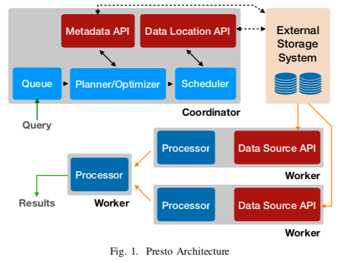
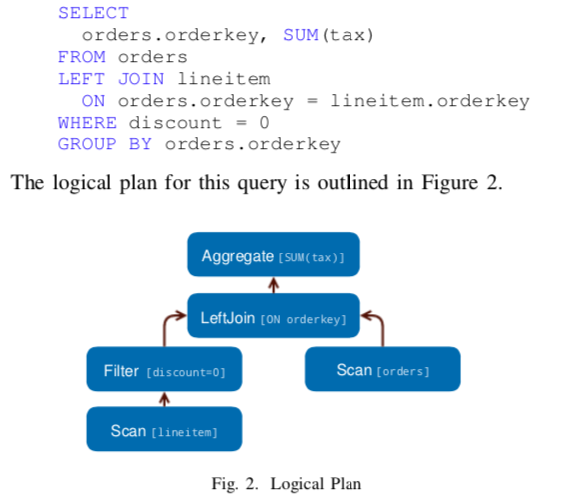
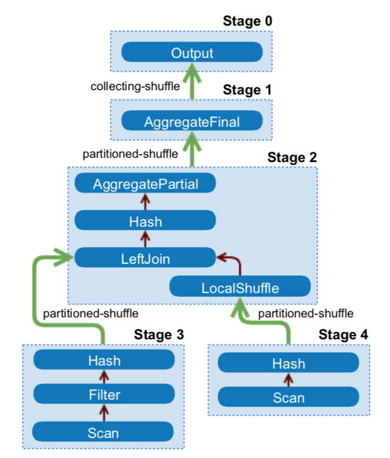
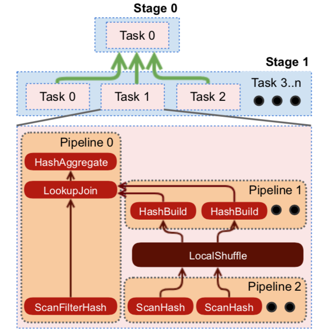
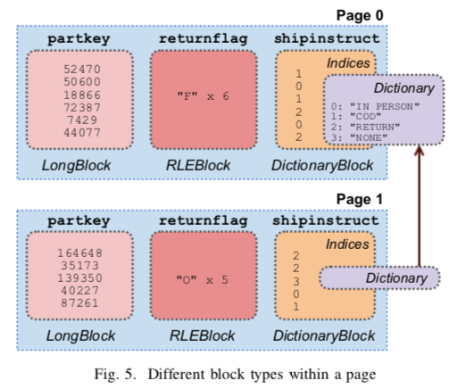
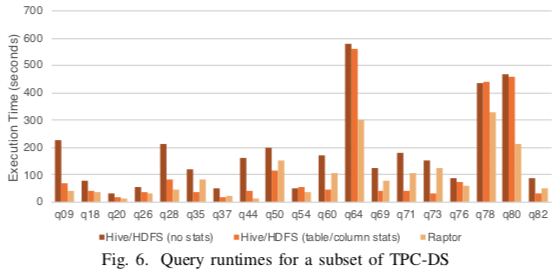
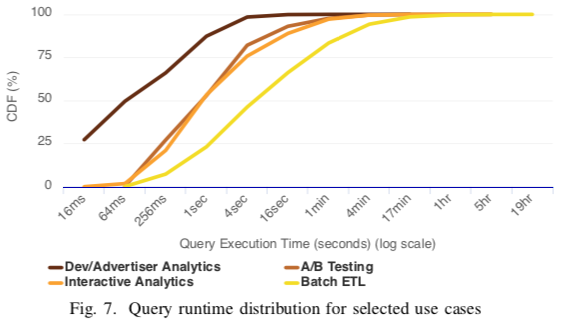
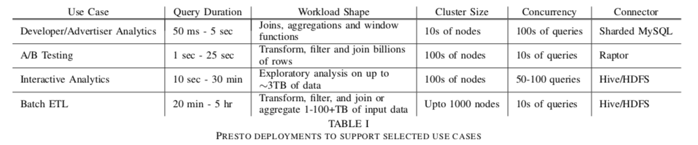
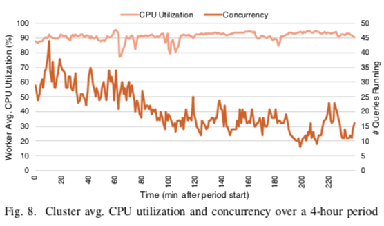

# 论文阅读：Presto_SQL_on_Everything

[返回首页](../README.md)

---

> Raghav Sethi, Martin Traverso∗, Dain Sundstrom∗, David Phillips∗, Wenlei Xie, Yutian Sun, Nezih Yigitbasi, Haozhun Jin, Eric Hwang, Nileema Shingte∗, Christopher Berner∗

Facebook, Inc.

Abstract—Presto is an open source distributed query engine that supports much of the SQL analytics workload at Facebook. Presto is designed to be adaptive, flexible, and extensible. It supports a wide variety of use cases with diverse characteristics. These range from user-facing reporting applications with sub- second latency requirements to multi-hour ETL jobs that aggre- gate or join terabytes of data. Presto’s Connector API allows plugins to provide a high performance I/O interface to dozens of data sources, including Hadoop data warehouses, RDBMSs, NoSQL systems, and stream processing systems. In this paper, we outline a selection of use cases that Presto supports at Facebook. We then describe its architecture and implementation, and call out features and performance optimizations that enable it to support these use cases. Finally, we present performance results that demonstrate the impact of our main design decisions.

**摘要 Presto是一个开源的分布式查询引擎，支持Facebook上的许多SQL分析工作负载。 Presto被设计为自适应，灵活和可扩展的。 它支持具有不同特征的各种用例。 这些范围从具有亚秒级延迟要求的面向用户的报告应用程序到聚集或合并TB级数据的数小时ETL作业。 Presto的Connector API允许插件为数十种数据源提供高性能的I / O接口，这些数据源包括Hadoop数据仓库，RDBMS，NoSQL系统和流处理系统。 在本文中，我们概述了Presto在Facebook支持的一些用例。 然后，我们描述其架构和实现，并介绍使其能够支持这些用例的功能和性能优化。 最后，我们提供性能结果，这些结果证明了我们主要设计决策的影响。**

**Index Terms—SQL, query engine, big data, data warehouse**

** 关键字 SQL查询引擎，大数据，数据仓库 **

## INTRODUCTION 介绍

The ability to quickly and easily extract insights from large amounts of data is increasingly important to technology- enabled organizations. As it becomes cheaper to collect and store vast amounts of data, it is important that tools to query this data become faster, easier to use, and more flexible. Using a popular query language like SQL can make data analytics accessible to more people within an organization. However, ease-of-use is compromised when organizations are forced to deploy multiple incompatible SQL-like systems to solve different classes of analytics problems.

** 快速，轻松地从大量数据中提取见解的能力对于采用技术的组织而言越来越重要。 随着收集和存储大量数据的成本降低，重要的是，查询此数据的工具变得更快，更易于使用和更灵活。 使用流行的查询语言（例如SQL）可以使组织中的更多人可以访问数据分析。 但是，当组织被迫部署多个不兼容的类似SQL的系统来解决不同种类的分析问题时，易用性会降低很多。 **

Presto is an open-source distributed SQL query engine that has run in production at Facebook since 2013 and is used today by several large companies, including Uber, Netflix, Airbnb, Bloomberg, and LinkedIn. Organizations such as Qubole, Treasure Data, and Starburst Data have commercial offerings based on Presto. The Amazon Athena interactive querying service is built on Presto. With over a hundred contributors on GitHub, Presto has a strong open source community.

** Presto是一种开放源代码的分布式SQL查询引擎，自2013年以来已在Facebook上投入生产，如今已被Uber，Netflix，Airbnb，Bloomberg和LinkedIn等多家大型公司使用。 Qubole，Treasure Data和Starburst Data等组织都有基于Presto的商业产品。 Amazon Athena交互式查询服务基于Presto构建。 Presto在GitHub上有100多个贡献者，拥有强大的开源社区。 **

Presto is designed to be adaptive, flexible, and extensible. It provides an ANSI SQL interface to query data stored in Hadoop environments, open-source and proprietary RDBMSs, NoSQL systems, and stream processing systems such as Kafka. A ‘Generic RPC’ connector makes adding a SQL interface to proprietary systems as easy as implementing a half dozen RPC endpoints. Presto exposes an open HTTP API, ships with JDBC support, and is compatible with several industry-standard business intelligence (BI) and query authoring tools. The built-in Hive connector can natively read from and write to distributed file systems such as HDFS and Amazon S3; and supports several popular open-source file formats including ORC, Parquet, and Avro.

** Presto被设计为自适应，灵活和可扩展的。 它提供ANSI SQL接口来查询存储在Hadoop环境，开源和专有RDBMS，NoSQL系统以及流处理系统（例如Kafka）中的数据。 “通用RPC” 连接器使向专有系统添加SQL接口就像实现几个RPC端点一样容易。Presto公开了开放的HTTP API，附带JDBC支持，并且与其他行业标准的商业智能（BI）和查询创作工具兼容。 内置的Hive连接器可以本地读取和写入分布式文件系统（例如HDFS和Amazon S3）； 并支持几种流行的开源文件格式，包括ORC，Parquet和Avro。 **

As of late 2018, Presto is responsible for supporting much of the SQL analytic workload at Facebook, including interac- tive/BI queries and long-running batch extract-transform-load (ETL) jobs. In addition, Presto powers several end-user facing analytics tools, serves high performance dashboards, provides a SQL interface to multiple internal NoSQL systems, and supports Facebook’s A/B testing infrastructure. In aggregate, Presto processes hundreds of petabytes of data and quadrillions of rows per day at Facebook.

** 截至2018年底，Presto负责支持Facebook上的许多SQL分析工作负载，包括交互式/ BI查询和长期运行的批量提取-转换-加载（ETL）作业。 此外，Presto支持多种面向最终用户的分析工具，提供高性能的仪表板，为多个内部NoSQL系统提供SQL接口，并支持Facebook的A / B测试基础架构。 总体而言，Presto在Facebook上每天处理数百PB的数据和数百万行。 **

** Presto has several notable characteristics: presto有以下几个主要特性 **

- It is an adaptive multi-tenant system capable of concurrently running hundreds of memory, I/O, and CPU-intensive queries, and scaling to thousands of worker nodes while efficiently utilizing cluster resources.
  ** 它是一个自适应多租户系统，能够同时运行数百个内存，I / O和CPU密集型查询，并可以扩展到数千个工作节点，同时可以有效地利用群集资源。
  `多租户` **

- Its extensible, federated design allows administrators to set up clusters that can process data from many different data sources even within a single query. This reduces the complexity of integrating multiple systems.
  ** 可扩展的联合设计使管理员可以设置集群，即使在单个查询中也可以处理来自许多不同数据源的数据。 这降低了集成多个系统的复杂性。
  `跨数据源` **

- It is flexible, and can be configured to support a vast variety of use cases with very different constraints and performance characteristics.
  ** 它非常灵活，可以配置为支持各种具有不同约束和性能特征的用例。
  `灵活`
  问题：什么叫灵活呢？约束？性能特征用例？
  **

- It is built for high performance, with several key related features and optimizations, including code-generation. Mul- tiple running queries share a single long-lived Java Virtual Machine (JVM) process on worker nodes, which reduces response time, but requires integrated scheduling, resource management and isolation.
  ** 它是为实现高性能而构建的，具有几个关键的相关功能和优化，包括代码生成。 多个正在运行的查询在工作节点上共享一个长期存在的Java虚拟机（JVM）进程，这减少了响应时间，但需要集成的调度，资源管理和隔离。
  `高性能`
  问题：怎么实现的呢？常驻进程，资源隔离，集成调度？
  **

The primary contribution of this paper is to describe the design of the Presto engine, discussing the specific optimizations and trade-offs required to achieve the characteristics we described above. The secondary contributions are performance results for some key design decisions and optimizations, and a description of lessons learned while developing and maintaining Presto.

** 本文的主要贡献是描述Presto引擎的设计，讨论实现上述特征所需的具体优化和权衡。 次要贡献是一些关键设计决策和优化的性能结果，以及在开发和维护Presto时吸取的教训的描述。 **

Presto was originally developed to enable interactive query- ing over the Facebook data warehouse. It evolved over time to support several different use cases, a few of which we describe in Section II. Rather than studying this evolution, we describe both the engine and use cases as they exist today, and call out main features and functionality as they relate to these use cases. The rest of the paper is structured as follows. In Section III, we provide an architectural overview, and then dive into system design in Section IV. We then describe some important performance optimizations in Section V, present performance results in Section VI, and engineering lessons we learned while developing Presto in Section VII. Finally, we outline key related work in Section VIII, and conclude in Section IX. Presto is under active development, and significant new functionality is added frequently. In this paper, we describe Presto as of version 0.211, released in September 2018.

** Presto最初是为了在Facebook数据仓库上进行交互式查询而开发的。 它随着时间的推移而发展，以支持几种不同的用例，我们在第二节中描述了其中的一些。  
我们没有研究这种演变，而是描述了当今的引擎和用例，并指出了与这些用例相关的主要特征和功能。  
本文的其余部分的结构如下。 在第三节中，我们提供了体系结构概述，然后在第四节中介绍了系统设计。  
然后，我们在第五节中介绍一些重要的性能优化，在第六节中介绍性能结果，并在第七节中介绍在开发Presto时学到的工程课程。  
最后，我们在第VIII节中概述了关键的相关工作，并在第IX节中进行了总结。  
Presto正在积极开发中，并且经常添加重要的新功能。 在本文中，我们描述了2018年9月发布的Presto版本0.211。  **

## USE CASES 用例，我是理解为应用场景

At Facebook, we operate numerous Presto clusters (with sizes up to ∼1000 nodes) and support several different use cases. In this section we select four diverse use cases with large deployments and describe their requirements.

** 在Facebook，我们运营着大量的Presto集群（最大可达1000个节点），并支持几种不同的用例。 在本节中，我们选择四个具有大型部署的不同用例，并描述它们的需求。 **

### A. Interactive Analytics 交互式分析，实时分析

Facebook operates a massive multi-tenant data warehouse as an internal service, where several business functions and organizational units share a smaller set of managed clusters. Data is stored in a distributed filesystem and metadata is stored in a separate service. These systems have APIs similar to that of HDFS and the Hive metastore service, respectively. We refer to this as the ‘Facebook data warehouse’, and use a variant of the Presto ‘Hive’ connector to read from and write to it.

** Facebook 运营着一个庞大的多租户数据仓库作为内部服务，其中多个业务职能和组织单位共享一组较小的托管群集。数据存储在分布式文件系统中，元数据存储在单独的服务中。这些系统的 API 分别类似于 HDFS 和 Hive 元存储服务。我们将其称为"Facebook 数据仓库"，并使用 Presto"Hive" connector的变体读取和写入它。 **

Facebook engineers and data scientists routinely examine small amounts of data (∼50GB-3TB compressed), test hy- potheses, and build visualizations or dashboards. Users often rely on query authoring tools, BI tools, or Jupyter notebooks. Individual clusters are required to support 50-100 concurrent running queries with diverse query shapes, and return results within seconds or minutes. Users are highly sensitive to end-to-end wall clock time, and may not have a good intuition of query resource requirements. While performing exploratory analysis, users may not require that the entire result set be returned. Queries are often canceled after initial results are returned, or use LIMIT clauses to restrict the amount of result data the system should produce.

** Facebook 工程师和数据科学家会定期检查少量数据（∼50GB-3TB 压缩后的）、测试数据，以及构建可视化效果或仪表板。用户通常依赖于查询创作工具、BI 工具或 Jupyter notebooks。需要各个群集来支持具有不同查询形状的 50-100 个并发运行查询，并在几秒钟或几分钟内返回结果。用户对端到端实时性高度敏感，对整个结果集可能没有那么高的要求。执行探索性分析时，用户可能不需要返回整个结果集。查询通常会在返回初始结果后取消，或使用 LIMIT 子句来限制系统应生成的结果数据量。
这块的意思就是，facebook的开发们，会经常进行各种各样的数据探索开发。他们可能对全量结果不关心，因为探索开发结果只看个数据抽样和趋势。对数据响应的实时性要求比较高。而且这些探索开发工作，经常会在好几十个数据源中进行。 **

### B. Batch ETL 跑批

The data warehouse we described above is populated with fresh data at regular intervals using ETL queries. Queries are scheduled by a workflow management system that determines dependencies between tasks and schedules them accordingly. Presto supports users migrating from legacy batch processing systems, and ETL queries now make up a large fraction of the Presto workload at Facebook by CPU. These queries are typically written and optimized by data engineers. They tend to be much more resource intensive than queries in the Interactive Analytics use case, and often involve performing CPU-heavy transformations and memory-intensive (multiple TBs of distributed memory) aggregations or joins with other large tables. Query latency is somewhat less important than resource efficiency and overall cluster throughput.

** 我们上面描述的数据仓库使用 ETL 查询定期填充新数据。查询由工作流调度系统安排，该系统确定任务之间的依赖关系并相应地调度它们。Presto 支持用户从旧式批处理系统迁移，而 ETL 查询现在占 Facebook 上由 CPU 迁移到 Presto 工作负载的很大一部分。这些查询通常由数据工程师编写和优化。它们往往比交互式分析用例中的查询更密集，并且通常涉及执行 CPU 密集型转换和内存密集型（分布式内存的多个 TB）聚合或与其他大型表联接。查询延迟不如资源效率和群集总体吞吐量重要一些。
问题：什么叫支持用户从旧式批处理系统迁移，意思是可以兼容比如我们有一堆hive的跑批任务，可以直接迁移到presto上跑，是能够兼容的么？ **

### C. A/B Testing AB测试

A/B testing is used at Facebook to evaluate the impact of product changes through statistical hypothesis testing. Much of the A/B test infrastructure at Facebook is built on Presto. Users expect test results be available in hours (rather than days) and that the data be complete and accurate. It is also important for users to be able to perform arbitrary slice and dice on their results at interactive latency (∼5-30s) to gain deeper insights. It is difficult to satisfy this requirement by pre-aggregating data, so results must be computed on the fly. Producing results requires joining multiple large data sets, which include user, device, test, and event attributes. Query shapes are restricted to a small set since queries are programmatically generated.

** Facebook使用`A/B测试`通过`假设检验`测试评估产品变更的影响。Facebook的许多A/B测试基础架构都基于Presto。用户希望可以在数小时（而不是几天）内获得测试结果，并且数据是完整而准确的。 对于用户来说，以交互延迟（约5至30秒）执行任意切片和切分其结果以获取更深刻的见解也很重要。通过预汇总数据很难满足此要求，因此必须即时计算结果。 要产生结果，就需要加入多个大型数据集，其中包括用户，设备，测试和事件属性。 由于查询是通过编程生成的，因此查询形状被限制为一小组。
用户在进行A/B test的时候需要查询快速响应，而不能离线T+1，这样来说presto可以很好的来支持用户的A/B test场景。 **

### D. Developer/Advertiser Analytics 开发分析 广告分析

Several custom reporting tools for external developers and advertisers are built on Presto. One example deployment of this use case is Facebook Analytics3, which offers advanced analytics tools to developers that build applications which use the Facebook platform. These deployments typically expose a web interface that can generate a restricted set of query shapes. Data volumes are large in aggregate, but queries are highly selective, as users can only access data for their own applications or ads. Most query shapes contain joins, aggregations or window functions. Data ingestion latency is in the order of minutes. There are very strict query latency requirements (∼50ms-5s) as the tooling is meant to be inter- active. Clusters must have 99.999% availability and support hundreds of concurrent queries given the volume of users.

** 在Presto上构建了一些用于外部开发人员和广告商的自定义报告工具。 此用例的一个示例部署是Facebook Analytics，它为使用Facebook平台构建应用程序的开发人员提供了高级分析工具。 这些部署通常公开一个Web界面，该界面可以生成一组受限的查询形状。 数据总量很大，但查询的选择性很高，因为用户只能访问自己的应用程序或广告的数据。 大多数查询形状都包含联接，聚合或窗口函数。 数据摄取延迟约为数分钟。 由于该工具必须是交互式的，因此有非常严格的查询等待时间要求（约50ms-5s）。 集群必须具有99.999％的可用性，并在给定用户数量的情况下支持数百个并发查询。
问题：开发人员和广告商的自定义报告工具，这个没太明白原文的意思在哪。后面的意思，是可以给不同的用户查询，添加不同的限制吗？ **

## ARCHITECTURE OVERVIEW 架构概述

A Presto cluster consists of a single **coordinator** node and one or more **worker** nodes. The coordinator is responsible for admitting, parsing, planning and optimizing queries as well as query orchestration. Worker nodes are responsible for query processing. Figure 1 shows a simplified view of Presto architecture.

** Presto群集由一个协调器（coordinator）节点和一个或多个工作（worker）节点组成。 协调器负责接纳，解析，计划和优化查询以及查询编排。 工作节点负责查询处理。 图1显示了Presto架构的简化视图。 **

** 理解就是2个概念，coordinator和worker，解析，优化，计划。然后交给worker执行并返回结果。 **

The client sends an HTTP request containing a SQL statement to the coordinator. The coordinator processes the request by evaluating queue policies, parsing and analyzing the SQL text, creating and optimizing distributed execution plan.

** 客户端向协调器发送包含SQL语句的HTTP请求。 协调器通过评估队列策略，解析和分析SQL文本，创建和优化分布式执行计划来处理请求。 **

The coordinator distributes this plan to workers, starts execution of tasks and then begins to enumerate splits, which are opaque handles to an addressable chunk of data in an external storage system. Splits are assigned to the tasks responsible for reading this data.

** 协调器将此计划分发给worker，开始执行任务，然后开始枚举拆分，拆分是外部存储系统中可寻址数据块的不透明句柄。 将拆分分配给负责读取此数据的任务。
问题2：什么叫可寻址数据块的不透明句柄？
我在取数据进行计算的时候，可以对取数方式进行切片实现分布式取数，然后以pipelink方式将数据分散到各个worker中执行**

Worker nodes running these tasks process these splits by fetching data from external systems, or process intermediate results produced by other workers. Workers use co-operative multi-tasking to process tasks from many queries concurrently. Execution is pipelined as much as possible, and data flows between tasks as it becomes available. For certain query shapes, Presto is capable of returning results before all the data is processed. Intermediate data and state is stored in- memory whenever possible. When shuffling data between nodes, buffering is tuned for minimal latency.

** 运行这些任务的工作程序节点通过从外部系统获取数据来处理这些拆分，或处理其他工作程序产生的中间结果。 worker使用协作式多任务处理来同时处理来自许多查询的任务。 执行尽可能通过流式进行，并且数据在任务可用时在任务之间流动。 对于某些查询，Presto能够在处理所有数据之前返回结果。 中间数据和状态将尽可能存储在内存中。 当在节点之间改组数据时，将调整缓冲以使延迟最小。 **

Presto is designed to be extensible; and provides a versa- tile plugin interface. Plugins can provide custom data types, functions, access control implementations, event consumers, queuing policies, and configuration properties. More impor- tantly, plugins also provide connectors, which enable Presto to communicate with external data stores through the Connector API, which is composed of four parts: the Metadata API, Data Location API, Data Source API, and Data Sink API. These APIs are designed to allow performant implementations of connectors within the environment of a physically distributed execution engine. Developers have contributed over a dozen connectors to the main Presto repository, and we are aware of several proprietary connectors.

** Presto被设计为可扩展的； 并提供了一个多功能的插件界面。 插件可以提供自定义数据类型，功能，访问控制实现，事件使用者，排队策略和配置属性。 更重要的是，插件还提供了连接器，使Presto可以通过连接器API与外部数据存储进行通信，该连接器API由四个部分组成：元数据API，数据位置API，数据源API和数据接收器API。 这些API旨在允许在物理分布的执行引擎环境中执行连接器的高性能实现。 我们已经知道一些专有的连接器了，并且开发人员已经为Presto主存储库贡献了十几个连接器。
问题：coordinator会把用户的查询请求解析，生成执行计划。并且把这些计划放到一个外部存储系统中进行拆分，以供worker可以进行实时的流式处理（这一点跟流式处理有啥外系呢？难道这个外部存储系统，有点消息队列的意思么？），并且worker在处理时全是在内存中操作。 **

## SYSTEM DESIGN 系统设计

In this section we describe some of the key design decisions and features of the Presto engine. We describe the SQL dialect that Presto supports, then follow the query lifecycle all the way from client to distributed execution. We also describe some of the resource management mechanisms that enable multi- tenancy in Presto. Finally, we briefly discuss fault tolerance.

** 在本节中，我们将介绍Presto引擎的一些关键设计决策和功能。 我们描述了Presto支持的SQL方言，然后从客户端到分布式执行一直跟踪查询生命周期。 我们还将描述一些使Presto实现多租户的资源管理机制。 最后，我们简要讨论容错能力。 **

### A. SQL Dialect SQL方言

Presto closely follows the ANSI SQL specification. While the engine does not implement every feature described, implemented features conform to the specification as far as possible. We have made a few carefully chosen extensions to the language to improve usability. For example, it is difficult to operate on complex data types, such as maps and arrays, in ANSI SQL. To simplify operating on these common data types, Presto syntax supports anonymous functions (lambda expressions) and built-in higher-order functions (e.g., transform, filter, reduce).

** Presto 严格遵守了 ANSI SQL 标准。尽管引擎未实现所描述的所有功能，但已实现的尽可能符合规范。我们对语言进行了一些精心挑选的扩展，以提高可用性。例如，很难对ANSI SQL中的复杂数据类型（例如映射和数组）进行操作。为简化对这些常见数据类型的操作，Presto语法支持匿名函数（lambda表达式）和内置的高阶函数（例如，transform，filter，reduce）。 **

### B. Client Interfaces, Parsing, and Planning 客户端接口，解析器，执行器

- 1) Client Interfaces: The Presto coordinator primarily exposes a RESTful HTTP interface to clients, and ships with a first-class command line interface. Presto also ships with a JDBC client, which enables compatibility with a wide variety of BI tools, including Tableau and Microstrategy.

** 客户端接口：Presto coordinator主要向客户端公开了一些RESTful HTTP接口，并且还有一个一流的命令行接口。Presto还附带有JDBC客户端，该客户端可与Tableau和Microstrategy等各种BI工具兼容。 **

- 2) Parsing: Presto uses an ANTLR-based parser to convert SQL statements into a syntax tree. The analyzer uses this tree to determine types and coercions, resolve functions and scopes, and extracts logical components, such as subqueries, aggregations, and window functions.

** 解析器：Presto使用基于ANTLR的解析器将SQL语句转换为语法树。分析器使用此树来确定类型和强制，解析函数和范围，并提取逻辑组件，例如子查询，聚合和窗口函数。 **

- 3) Logical Planning: The logical planner uses the syntax tree and analysis information to generate an intermediate representation (IR) encoded in the form of a tree of plan nodes. Each node represents a physical or logical operation, and the children of a plan node are its inputs. The planner produces nodes that are purely logical, i.e. they do not contain any information about how the plan should be executed. Consider

** 逻辑计划：逻辑计划使用语法树和分析信息来生成以计划节点树形式编码的中间语言（IR）。每个节点代表一个物理或逻辑操作，而计划节点的子代为其输入。计划产生的节点纯粹是逻辑上的，它们不包含有关执行计划的任何信息。 **

a simply query:

** 生成的计划大致是先去找lineitem表，然后进行过滤，再接着找orders表。最后对两个表进行聚合。意思是解析成语法树后，每一步的都是一些简单的逻辑操作。 **

### C. Query Optimization 查询优化

The plan optimizer transforms the logical plan into a more physical structure that represents an efficient execution strategy for the query. The process works by evaluating a set of transformation rules greedily until a fixed point is reached. Each rule has a pattern that can match a sub-tree of the query plan and determines whether the transformation should be applied. The result is a logically equivalent sub-plan that replaces the target of the match. Presto contains several rules, including well-known optimizations such as predicate and limit pushdown, column pruning, and decorrelation.

** 优化器将逻辑计划转换为更物理的结构（物理计划），该结构表示查询的有效执行策略。该过程使用贪婪规则评估一组转换直至达到固定点来进行。 每个规则都有一个模式，该模式可以匹配查询计划的子树，并确定是否应应用转换。 结果是在逻辑上等效的子计划，该子计划替换了匹配的目标。 Presto包含一些规则，包括众所周知的优化，例如谓词和限制下推，列修剪和去相关。 **

We are in the process of enhancing the optimizer to perform a more comprehensive exploration of the search space using a cost-based evaluation of plans based on the techniques introduced by the Cascades framework. However, Presto already supports two cost-based optimizations that take table and column statistics into account - join strategy selection and join re-ordering. We will discuss only a few features of the optimizer; a detailed treatment is out of the scope of this paper.

** 我们正在基于Cascades框架引入的技术，使用基于成本的计划评估，来增强优化器以对搜索空间进行更全面的探索。 但是，Presto已经支持两种基于成本的优化，这些优化考虑了表和列的统计信息-联接策略选择和联接重新排序。 我们将只讨论优化器的一些功能； 详细的处理不在本文的讨论范围之内。 问题：这里说到两种基于成本的优化，意思是有套cbo方式么？
**

1) Data Layouts: The optimizer can take advantage of the physical layout of the data when it is provided by the connector Data Layout API. Connectors report locations and other data properties such as partitioning, sorting, grouping,and indices. Connectors can return multiple layouts for a single table, each with different properties, and the optimizer can select the most efficient layout for the query [15] [19]. This functionality is used by administrators operating clusters for the Developer/Advertiser Analytics use case; it enables them to optimize new query shapes simply by adding physical layouts. We will see some of the ways the engine can take advantage of these properties in the subsequent sections.

** 数据布局：当连接器数据布局API提供数据时，优化器可以利用数据的物理布局。 连接器报告位置和其他数据属性，例如分区，排序，分组和索引。 连接器可以为单个表返回多个布局，每个布局都具有不同的属性，优化器可以为查询选择最有效的布局。 管理员在运行Developer / Advertiser Analytics用例的集群中使用此功能； 它使他们只需添加物理布局即可优化新的查询形状。 在随后的部分中，我们将看到引擎利用这些属性的一些方式。
问题：什么叫数据布局？可以理解数据存储的设计吗？行存，列存这种？文中的意思是，根据数据布局的不同可以有不同的优化策略。 可以理解是根据数据的分布可以优化数据本地化计算？ **

2) Predicate Pushdown: The optimizer can work with connectors to decide when pushing range and equality predicates down through the connector improves filtering efficiency.
   For example, the Developer/Advertiser Analytics use case leverages a proprietary connector built on top of sharded MySQL. The connector divides data into shards that are stored in individual MySQL instances, and can push range or point predicates all the way down to individual shards, ensuring that only matching data is ever read from MySQL. If multiple layouts are present, the engine selects a layout that is indexed on the predicate columns. Efficient index based filtering is very important for the highly selective filters used in the Developer/Advertiser Analytics tools. For the Interactive Analytics and Batch ETL use cases, Presto leverages the partition pruning and file-format features (Section V-C) in the Hive connector to improve performance in a similar fashion.

** 谓词下推：优化器可以使用关联器来决定何时通过connector将范围和等式谓词向下推，从而提高过滤效率。
问题：但是什么时候引擎可以下推这些好像木有说。 **

** 例如，Developer / Advertiser Analytics用例利用了在分片MySQL之上构建的专有连接器。 连接器将数据分为存储在各个MySQL实例中的碎片，并可以将范围或点谓词一直向下推至各个碎片，从而确保仅从MySQL读取匹配的数据。 如果存在多个布局，则引擎将选择在谓词列上建立索引的布局。 对于开发人员/广告客户分析工具中使用的高度选择性的过滤器而言，基于索引的有效过滤非常重要。 对于Interactive Analytics和Batch ETL用例，Presto利用Hive连接器中的分区修剪和文件格式功能（第V-C节）以类似的方式提高性能。 **

3) Inter-node Parallelism: Part of the optimization process involves identifying parts of the plan that can be executed in parallel across workers. These parts are known as ‘stages’, and every stage is distributed to one or more tasks, each of which execute the same computation on different sets of input data. The engine inserts buffered in-memory data transfers (shuffles) between stages to enable data exchange. Shuffles add latency, use up buffer memory, and have high CPU overhead. Therefore, the optimizer must reason carefully about the total number of shuffles introduced into the plan. Figure 3 shows how a na ̈ıve implementation would partition a plan into stages and connect them using shuffles.

** 节点并行：优化过程的一部分涉及识别可以跨节点并行执行的计划部分。这些部分称为“stage”，每个阶段分配给一个或多个任务，每个任务对不同的输入数据集执行相同的计算。引擎在各阶段之间插入缓冲的内存数据传输(shuffles)，以支持数据交换。混洗会增加延迟，耗尽缓冲内存，并具有较高的CPU开销。因此，优化器必须仔细考虑引入计划的混洗总数。图3显示了一个天真的实现如何将计划划分为阶段并使用混洗将它们连接起来。
问题：意思要进行stage划分的时候，就会产生shuffles。这一点有点spark的味道了。 还有怎么理解节点并行呢？**

**Data Layout Properties:** The physical data layout can be used by the optimizer to minimize the number of shuffles in the plan. This is very useful in the A/B Testing use case, where almost every query requires a large join to produce experiment details or population information. The engine takes advantage of the fact that both tables participating in the join are partitioned on the same column, and uses a co-located join strategy to eliminate a resource-intensive shuffle.

** 数据布局配置：优化程序可以使用物理数据布局来最大程度地减少计划中的shuffles次数。这在A/B测试用例中非常有用，在该用例中，几乎每个查询都需要大型join才能产生实验详细信息或总体信息。该引擎利用了参与join的两个表在同一列上分区这一事实，并使用一种共存连接策略来消除资源密集型shuffle。
问题：意思感觉就像是利用了数据布局的套路，找到可能会要产生的shuffle的地方进行一些优化处理，让其减少shuffle的出现。 **

If connectors expose a data layout in which join columns are marked as indices, the optimizer is able to determine if using an index nested loop join would be an appropriate strategy. This can make it extremely efficient to operate on normalized data stored in a data warehouse by joining against production data stores (key-value or otherwise). This is a commonly used feature in the Interactive Analytics use case.

** 如果连接器公开了将join列标记为索引的数据布局，则优化器可以确定使用`索引嵌套循环join`是否是合适的策略。
问题：什么是索引嵌套循环join**

**Node Properties:** Like connectors, nodes in the plan tree can express properties of their outputs (i.e. the partitioning, sorting, bucketing, and grouping characteristics of the data)

** 节点配置：与连接器一样，计划树中的节点可以表示其输出的属性（即数据的分区、排序、分组和分组特征） **

Fig. 3. Distributed plan for Figure 2. The connector has not exposed any data layout properties, and shuffle reduction optimizations have not been applied. Four shuffles are required to execute the query.

** 图2的分布式计划。连接器未公开任何数据布局属性，并且未应用减少shuffle的优化方法。 需要四次shuffle才能执行查询。 **

and preferred properties, which are taken into account when introducing shuffles. Redundant shuffles are simply elided, but in other cases the properties of the shuffle can be changed to reduce the number of shuffles required. Presto greedily selects partitioning that will satisfy as many required properties as possible to reduce shuffles. This means that the optimizer may choose to partition on fewer columns, which in some cases can result in greater partition skew. As an example, this optimization applied to the plan in Figure 3 causes it to collapse to a single data processing stage.

** 和首选属性，在引入改组时要考虑到这些属性。冗余shuffles被简单地省略了，但是在其他情况下可以更改shuffle的属性以减少所需的shuffle数量。Presto贪婪地选择能够满足尽可能多的属性要求的分区，以减少shuffles。这意味着优化器可能选择在更少的列上进行分区，这在某些情况下可能导致更大的分区倾斜。例如，应用于图3中的计划的这种优化导致它崩溃到单个数据处理阶段。
问题：这里没看懂，啥是根据配置选择竟可能符合要求多的分区来减少shuffle，与图3的例子，哪里对应上了呢？ **

4) Intra-node Parallelism: The optimizer uses a similar mechanism to identify sections within plan stages that can benefit from being parallelized across threads on a single node. Parallelizing within a node is much more efficient than inter-node parallelism, since there is little latency overhead, and state (e.g., hash-tables and dictionaries) can be efficiently shared between threads. Adding intra-node parallelism can lead to significant speedups, especially for query shapes where concurrency constrains throughput at downstream stages:

** 节点内部的并行：优化器使用类似的机制来识别计划中的stages是否可以受益于在单个节点上的线程并行化。节点内的并行化比节点之间并行要有效得多，因为几乎没有时间等待开销，并且状态（例如哈希表和字典）可以在线程之间有效地共享。添加节点内并行性可以显着的加速，尤其是对于查询形状，其中并发会限制下游阶段的吞吐量： **

- The Interactive Analytics involves running many short one-off queries, and users do not typically spend time trying to optimize these. As a result, partition skew is common, either due to inherent properties of the data, or as a result of common query patterns (e.g., grouping by user country while also filtering to a small set of countries). This typically manifests as a large volume of data being hash-partitioned on to a small number of nodes.

** 交互式分析涉及运行许多简短的一次性查询，并且用户通常不会花费时间来优化这些查询。 结果，由于数据的固有属性，或者由于常见的查询模式（例如，按用户国家/地区分组，同时也过滤到一小部分国家/地区），分区偏斜是常见的。 这通常表现为大量数据被哈希分区到少量节点上。 **

- Batch ETL jobs often transform large data sets with little or no filtering. In these scenarios, the smaller number of nodes involved in the higher levels of the tree may be insufficient to quickly process the volume of data generated by the leaf stage. Task scheduling is discussed in Section IV-D2.

** 批处理ETL作业经常转换大型数据集，而几乎或着就没有过滤。在这些情况下，树的较高级别所涉及的节点数量较少，可能不足以快速处理由叶子阶段生成的数据量。 任务调度在第IV-D2节中讨论。 **

In both of these scenarios, multiple threads per worker performing the computation can alleviate this concurrency bottleneck to some degree. The engine can run a single sequence of operators (or pipeline) in multiple threads. Figure 4 shows how the optimizer is able to parallelize one section of a join.

** 在这两种情况下，每个worker执行计算的多个线程可以在一定程度上缓解此并发瓶颈。 引擎可以在多个线程中运行单个运算符序列（或管道）。 图4显示了优化器如何并行化连接的一个部分。 **

Fig. 4. Materialized and optimized plan corresponding to Figure 3, showing tasks, pipelines, and operators. Pipeline 1 and 2 are parallelized across multiple threads to speed up the build side of a hash-join.

** 图4.与图3相对应的物化和优化计划，显示了任务，管道和操作员。 管道1和2在多个线程之间并行化，以加快哈希联接的构建速度。
问题：反正这句没大看明白，图是看明白了，由刚才的4个shuffle减少到2个shuffle。 这一节的中心思想，差不多就是减少shuffle来解决数据倾斜的问题。 **

### D. Scheduling 调度

**问题：调度这一段基本都没看懂**

The coordinator distributes plan stages to workers in the form of executable tasks, which can be thought of as single processing units. Then, the coordinator links tasks in one stage to tasks in other stages, forming a tree of processors linked to one another by shuffles. Data streams from stage to stage as soon as it is available.

**coordinator以可执行任务的形式将计划stage分配给worker，可将其视为单个处理单元。然后，coordinator将一个stage的任务链接到其他stage任务中，形成一个处理树，通过shuffle相互链接。stage只要是可用的就能以数据流的方式从一个stage流向另一个stage。**

A task may have multiple pipelines within it. A pipeline consists of a chain of operators, each of which performs a single, well-defined computation on the data. For example, a task performing a hash-join must contain at least two pipelines; one to build the hash table (build pipeline), and one to stream data from the probe side and perform the join (probe pipeline). When the optimizer determines that part of a pipeline would benefit from increased local parallelism, it can split up the pipeline and parallelize that part independently. Figure 4 shows how the build pipeline has been split up into two pipelines, one to scan data, and the other to build partitions of the hash table. Pipelines are joined together by a local in-memory shuffle.

** 一个任务可能有多个pipeline。pipeline由一连串的运算符组成，每个运算符都对数据执行一个明确定义的计算。 例如，执行hash join的任务必须包含至少两个pipeline。一种用于构建哈希表（构建pipeline），另一种用于从探测端传输数据并执行join（探测pipeline）。 当coordinator确定pipeline的一部分将从局部并行性提高中受益时，它可以拆分pipeline并独立地并行化该部分。 图4显示了构建pipeline如何被拆分为两个pipeline，一个用于扫描数据，另一个用于构建哈希表的分区。管道通过本地内存shuffle连接在一起。
什么是运算符呢？
问题：这里有个地方，什么叫本地内存shuffle呢？都shuffle了，还可以本地进行？ **

To execute a query, the engine makes two sets of scheduling decisions. The first determines the order in which stages are scheduled, and the second determines how many tasks should be scheduled, and which nodes they should be placed on.

** 为了执行查询，引擎将制定两组调度策略。 第一组【stage 调度】确定调度stage的顺序，第二组【任务调度】确定应调度多少个任务以及应将它们放置在哪个节点上。
问题：没有理解这两种调度**

1) Stage Scheduling: Presto supports two scheduling policies for stages: all-at-once and phased. All-at-once minimizes wall clock time by scheduling all stages of execution concurrently; data is processed as soon as it is available. This scheduling strategy benefits latency-sensitive use cases such as Interactive Analytics, Developer/Advertiser Analytics, and A/B Testing. Phased execution identifies all the strongly connected components of the directed data flow graph that must be started at the same time to avoid deadlocks and executes those in topological order. For example, if a hash-join is executed in phased mode, the tasks to schedule streaming of the left side will not be scheduled until the hash table is built. This greatly improves memory efficiency for the Batch Analytics use case.

** stage 调度：Presto支持两种stage调度策略：`一次完成`并分阶段进行。通过同时调度执行的所有stage，一次性可以最大程度地减少挂钟时间；数据只要可用，就会对其进行处理。这种调度策略有利于对实时性要求比较高的用例，如交互式分析、开发人员/广告客户分析和A/B测试。`分阶段执行`确定有向数据流图中所有必须紧密连接的组件，这些组件必须同时启动以避免死锁，并按拓扑顺序执行那些死锁。例如，如果在分阶段模式下执行hash join，则在构建哈希表之前，将不会计划用于调度左侧流的任务。 这大大提高了Batch Analytics用例的内存效率。
问题：为什么一次性执行，会比分阶段执行要速度快呢？还有那个什么左侧是啥？ **

When the scheduler determines that a stage should be scheduled according to the policy, it begins to assign tasks for that stage to worker nodes.

** 当调度程序确定应根据策略调度某个stage时，它将开始将该stage的任务分配给worker节点。 **

2) Task Scheduling: The task scheduler examines the plan tree and classifies stages into leaf and intermediate stages. Leaf stages read data from connectors; while intermediate stages only process intermediate results from other stages.

** 任务调度：任务计划程序检查计划树并将stage分为叶子stage和中间stage。 叶stage从connector读取数据； 而中间stage仅处理其他stage的中间结果。 **

**Leaf Stages** ：For leaf stages, the task scheduler takes into account the constraints imposed by the network and connectors when assigning tasks to worker nodes. For example, shared- nothing deployments require that workers be co-located with storage nodes. The scheduler uses the Connector Data Layout API to decide task placement under these circumstances. The A/B Testing use case requires predictable high-throughput, low-latency data reads, which are satisfied by the Raptor connector. Raptor is a storage engine optimized for Presto with a shared-nothing architecture that stores ORC files on flash disks and metadata in MySQL.

** 叶stage：对于叶阶段，任务调度程序在将任务分配给worker节点时会考虑到网络和connector的约束。 例如，无共享部署要求将工作程序与存储节点放在同一位置。 在这种情况下，调度程序使用连接器数据布局API来决定任务的放置。 A/B测试用例需要可预测的高吞吐量，低延迟数据读取，Raptor connector可以满足要求。 Raptor是针对Presto优化的存储引擎，采用无共享架构，可将ORC文件存储在闪存磁盘中，并在MySQL中存储元数据。
问题：raptor是啥？ **

Profiling shows that a majority of CPU time across our production clusters is spent decompressing, decoding, filtering and applying transformations to data read from connectors. This work is highly parallelizable, and running these stages on as many nodes as possible usually yields the shortest wall time. Therefore, if there are no constraints, and the data can be divided up into enough splits, a leaf stage task is scheduled on every worker node in the cluster. For the Facebook data warehouse deployments that run in shared-storage mode (i.e. all data is remote), every node in a cluster is usually involved in processing the leaf stage. This execution strategy can be network intensive.

** 分析显示，我们整个生产集群中的大部分CPU时间都花在了对从connector读取的数据进行解压缩，解码，过滤和应用转换上。 这项工作是高度可并行化的，并且在尽可能多的节点上运行这些阶段通常会产生最短的挂墙时间。 因此，如果没有约束，并且可以将数据划分为足够的拆分，则在群集中的每个工作节点上计划一个叶stage任务。 对于以共享存储模式运行的Facebook数据仓库部署（即所有数据都是远程的），群集中的每个节点通常都参与叶stage的处理。 此执行策略可能会占用大量网络资源。 **

The scheduler can also reason about network topology to optimize reads using a plugin-provided hierarchy. Network- constrained deployments at Facebook can use this mechanism to express to the engine a preference for rack-local reads over rack-remote reads.

** 调度程序还可以使用插件提供的层次结构来推理网络拓扑，以优化读取。 Facebook上受网络限制的部署可以使用此机制向引擎表达对机架本地读取的偏好，而不是对机架远程读取的偏好。 **

**Intermediate Stages**: Tasks for intermediate stages can be placed on any worker node. However, the engine still needs to decide how many tasks should be scheduled for each stage. This decision is based on the connector configuration, the properties of the plan, the required data layout, and other deployment configuration. In some cases, the engine can dynamically change the number of tasks during execution. Section IV-E3 describes one such scenario.

** 中间stage：中间stage的任务可以放在任何worker节点上。 但是，引擎仍然需要确定每个stage应计划多少个任务。 该决定基于connector配置，计划的属性，所需的数据布局以及其他部署配置。 在某些情况下，引擎可以在执行过程中动态更改任务数。 IV-E3节描述了一种这样的情况。 **

3) Split Scheduling: When a task in a leaf stage begins execution on a worker node, the node makes itself available to receive one or more splits (described in Section III). The information that a split contains varies by connector. When reading from a distributed file system, a split might consist of a file path and offsets to a region of the file. For the Redis key-value store, a split consists of table information, a key and value format, and a list of hosts to query, among other things.

** 调度拆分：当叶子stage中的任务开始在worker节点上执行时，该节点使其本身可用于接收一个或多个拆分（在第III节中进行了介绍）。 拆分包含的信息因connector而异。 从分布式文件系统读取时，拆分可能包含文件路径和文件区域的偏移量。 对于Redis键值存储，拆分包括表信息，键和值格式以及要查询的主机列表等。
问题：意思就是可以拆分读取，来从分布式文件系统进行高效读取。或者kv这种，能拆分出段落来分段读取。 **

Every task in a leaf stage must be assigned one or more splits to become eligible to run. Tasks in intermediate stages are always eligible to run, and finish only when they are aborted or all their upstream tasks are completed.

** 叶子stage中的每个任务都必须分配一个或多个拆分，才有资格运行。 处于中间stage的任务始终有资格运行，并且仅在中止任务或完成其所有上游任务时才完成。 **

**Split Assignment**: As tasks are set up on worker nodes, the coordinator starts to assign splits to these tasks. Presto asks connectors to enumerate small batches of splits, and assigns them to tasks lazily. This is a an important feature of Presto and provides several benefits:

** 任务分配拆分：在工作节点上设置任务后，coordinator开始为这些任务分配拆分。 Presto要求connector枚举小批量的拆分，然后将它们懒加载地分配给任务。 这是Presto的重要功能，并提供了许多好处 **

- Decouples query response time from the time it takes the connector to enumerate a large number of splits. For example, it can take minutes for the Hive connector to enumerate partitions and list files in each partition directory.
  **使查询响应时间与连接器枚举大量拆分之间的时间脱钩。 例如，Hive连接器可能需要几分钟来枚举分区并列出每个分区目录中的文件**

- Queries that can start producing results without processing all the data (e.g., simply selecting data with a filter) are frequently canceled quickly or complete early when a LIMIT clause is satisfied. In the Interactive Analytics use case, it is common for queries to finish before all the splits have even been enumerated.
  **可以迅速产生结果而无需处理所有数据的查询（例如，仅使用过滤器选择数据）通常会迅速取消，或者在满足LIMIT子句时提早完成。 在Interactive Analytics用例中，通常需要在所有列举均未列举之前完成查询。**

- Workers maintain a queue of splits they are assigned to process. The coordinator simply assigns new splits to tasks with the shortest queue. Keeping these queues small allows the system to adapt to variance in CPU cost of processing different splits and performance differences among workers.
  **worker维护分配给他们的拆分队列。 coordinator只是将新的拆分分配给队列最短的任务。 将这些队列保持在较小的水平，可使系统适应处理不同拆分的CPU成本差异以及工作人员之间的性能差异。**

- Allows queries to execute without having to hold all their metadata in memory. This is important for the Hive connector, where queries may access millions of splits and can easily consume all available coordinator memory.
  **允许执行查询而不必将所有元数据保存在内存中。 这对于Hive连接器很重要，在该连接器中查询可以访问数百万个拆分，并且可以轻松消耗所有可用的协调器内存。**

These features are particularly useful for the Interactive Analytics and Batch ETL use cases, which run on the Facebook Hive-compatible data warehouse. It’s worth noting that lazy split enumeration can make it difficult to accurately estimate and report query progress.

**这些功能对于在与Facebook Hive兼容的数据仓库上运行的Interactive Analytics和Batch ETL用例特别有用。 值得注意的是，延迟分割枚举可能使准确估算和报告查询进度变得困难。**

### E. Query Execution 查询执行

1) Local Data Flow: Once a split is assigned to a thread, it is executed by the driver loop. The Presto driver loop is more complex than the popular Volcano (pull) model of recursive iterators [1], but provides important functionality. It is much more amenable to cooperative multi-tasking, since operators can be quickly brought to a known state before yielding the thread instead of blocking indefinitely. In addition, the driver can maximize work performed in every quanta by moving data between operators that can make progress without additional input (e.g., resuming computation of resource-intensive or explosive transformations). Every iteration of the loop moves data between all pairs of operators that can make progress.

**本地数据流：将拆分分配给线程后，将由驱动程序循环执行拆分。 Presto驱动程序循环使用流行的Volcano（拉）递归迭代器模型，但提供了重要的功能。 协作多任务处理更容易接受，因为可以在生成线程之前将操作员迅速带入已知状态，而不是无限期地进行阻塞。 另外，驾驶员可以通过在无需额外输入（例如，恢复对资源密集或爆炸性转换的计算的恢复）的操作员之间移动数据来最大化在每个量子上执行的工作。 循环的每次迭代都会在可取得进步的所有运算符对之间移动数据。
问题：没看懂**

The unit of data that the driver loop operates on is called a page, which is a columnar encoding of a sequence of rows. The Connector Data Source API returns pages when it is passed a split, and operators typically consume input pages, perform computation, and produce output pages. Figure 5 shows the structure of a page in memory. The driver loop continuously moves pages between operators until the scheduling quanta is complete (discussed in Section IV-F1), or until operators cannot make progress.

**driver循环所操作的数据单位称为page，这是行序列的列编码。 connector数据源API在传递拆分后会返回页面，并且运算符通常会消耗输入page，执行计算并生成输出page。 图5显示了内存中page的结构。 driver循环在operator之间连续移动page，直到调度量完成（在第IV-F1节中讨论），或者直到operator无法取得进展为止。**

2) Shuffles: Presto is designed to minimize end-to-end latency while maximizing resource utilization, and our inter- node data flow mechanism reflects this design choice. Presto uses in-memory buffered shuffles over HTTP to exchange in- termediate results. Data produced by tasks is stored in buffers for consumption by other workers. Workers request intermedi- ate results from other workers using HTTP long-polling. The server retains data until the client requests the next segment using a token sent in the previous response. This makes the acknowledgement implicit in the transfer protocol. The long- polling mechanism minimizes response time, especially when transferring small amounts of data. This mechanism offers much lower latency than other systems that persist shuffle data to disk [4], [21] and allows Presto to support latency-sensitive use cases such as Developer/Advertiser Analytics.

**shuffle：Presto的设计是最小化端到端延迟，同时最大限度地提高资源利用率，我们的节点间数据流机制反映了这种设计选择。Presto通过HTTP上使用内存缓冲shuffle来交换中间结果。任务产生的数据存储在缓冲区中，以供其他worker使用。 worker使用HTTP长轮询从其他worker请求中间结果。 服务器保留数据，直到客户端使用在先前响应中发送的令牌请求下一个段。 这使得确认隐含在传输协议中。 长轮询机制最大程度地缩短了响应时间，尤其是在传输少量数据时。 与将随机数据持久保存到磁盘的其他系统相比，该机制提供的延迟要低得多，并允许Presto支持对延迟敏感的用例，例如Developer / Advertiser Analytics。**

The engine tunes parallelism to maintain target utilization rates for output and input buffers. Full output buffers cause split execution to stall and use up valuable memory, while un- derutilized input buffers add unnecessary processing overhead.

引擎调整并行度以维持输出和输入缓冲区的目标利用率。 完整的输出缓冲区会导致拆分执行停顿并耗尽宝贵的内存，而未充分利用的输入缓冲区会增加不必要的处理开销。

The engine continuously monitors the output buffer utiliza- tion. When utilization is consistently high, it lowers effective concurrency by reducing the number of splits eligible to be run. This has the effect of increasing fairness in sharing of net- work resources. It is also an important efficiency optimization when dealing with clients (either end-users or other workers) that are unable to consume data at the rate it is being produced. Without this functionality, slow clients running complex multi- stage queries could hold tens of gigabytes worth of buffer memory for long periods of time. This scenario is common even when a small amount of result data (∼10-50MB) is being downloaded by a BI or query authoring tool over slow connections in the Interactive Analytics use case.

引擎会持续监视输出缓冲区的使用情况。 当利用率始终很高时，它将通过减少有资格运行的拆分数来降低有效的并发性。 这具有增加共享网络资源公平性的作用。 当与无法以产生速率消费数据的客户端（最终用户或其他工作人员）打交道时，这也是重要的效率优化。 如果没有此功能，运行复杂的多级查询的慢速客户端可能会长时间保留价值数十GB的缓冲内存。 即使BI或查询创作工具通过Interactive Analytics用例中的慢速连接下载少量结果数据（〜10-50MB），这种情况也是很常见的。

On the receiver side, the engine monitors the moving aver- age of data transferred per request to compute a target HTTP request concurrency that keeps the input buffers populated while not exceeding their capacity. This backpressure causes upstream tasks to slow down as their buffers fill up.

在接收器端，引擎监视每个请求传输的数据的移动平均值，以计算目标HTTP请求并发性，该并发性使输入缓冲区在不超过其容量的情况下得到填充。 这种背压会导致上游任务在缓冲区填满时减慢速度。

3) Writes: ETL jobs generally produce data that must be written to other tables. An important driver of write perfor- mance in a remote-storage environment is the concurrency with which the write is performed (i.e. the aggregate number of threads writing data through the Connector Data Sink API).

写：ETL作业通常会产生必须写入其他表的数据。 远程存储环境中写入性能的重要驱动因素是执行写入的并发性（即通过连接器数据接收器API写入数据的线程总数）。

意思要我们注意写入并发性么？

Consider the example of a Hive connector configured to use Amazon S3 for storage. Every concurrent write to S3 creates a new file, and hundreds of writes of a small aggregate amount of data are likely to create small files. Unless these small units of data can be later coalesced, they are likely to create unacceptably high overheads while reading (many slow metadata operations, and latency-bound read performance). However, using too little concurrency can decrease aggre- gate write throughput to unacceptable levels. Presto takes an adaptive approach again, dynamically increasing writer concurrency by adding tasks on more worker nodes when the engine determines that the stage producing data for the write exceeds a buffer utilization threshold (and a configurable per- writer data written threshold). This is an important efficiency optimization for the write-heavy Batch ETL use case.

考虑配置为使用Amazon S3进行存储的Hive连接器的示例。 对S3的每次并发写入都会创建一个新文件，数百次对少量数据的写入可能会创建小文件。 除非稍后可以合并这些较小的数据单元，否则它们很可能在读取时产生不可接受的高开销（许多慢的元数据操作和延迟绑定的读取性能）。 但是，使用太少的并发会降低总的写吞吐量到不可接受的水平。 Presto再次采用了一种自适应方法，当引擎确定生成用于写操作的数据的阶段超过缓冲区利用率阈值（和可配置的写作者数据写阈值）时，通过在更多工作节点上添加任务来动态地增加写者并发性。 对于繁重的批处理ETL用例，这是重要的效率优化。

意思presto有一种自适应的结果写入方式，控制写入文件的大小、数量，来优化写入。

### F. Resource Management 资源管理

One of the key features that makes Presto a good fit for multi- tenant deployments is that it contains a fully-integrated fine- grained resource management system. A single cluster can execute hundreds of queries concurrently, and maximize the use of CPU, IO, and memory resources.

使Presto非常适合多租户部署，有个关键功能是它包含一个完全集成的细粒度资源管理系统。 一个群集可以同时执行数百个查询，并最大程度地利用CPU，IO和内存资源。

1) CPU Scheduling: Presto primarily optimizes for overall cluster throughput, i.e. aggregate CPU utilized for processing data. The local (node-level) scheduler additionally optimizes for low turnaround time for computationally inexpensive queries, and the fair sharing of CPU resources amongst queries with similar CPU requirements. A task’s resource usage is the aggregate thread CPU time given to each of its splits. To minimize coordination overhead, Presto tracks CPU resource usage at the task level and makes scheduling decisions locally.

**CPU调度**：Presto主要针对整体集群吞吐量进行优化，即用于处理数据的聚合CPU。 本地（节点级）调度程序还针对计算成本低廉的查询优化了较短的周转时间，并在具有类似CPU要求的查询之间公平地共享了CPU资源。 任务的资源使用情况是分配给每个拆分的总线程CPU时间。 为了最大程度地减少协调开销，Presto会在任务级别跟踪CPU资源的使用情况，并在本地做出调度决策。

Presto schedules many concurrent tasks on every worker node to achieve multi-tenancy and uses a cooperative multi-tasking model. Any given split is only allowed to run on a thread for a maximum quanta of one second, after which it must relinquish the thread and return to the queue. When output buffers are full (downstream stages cannot consume data fast enough), input buffers are empty (upstream stages cannot produce data fast enough), or the system is out of memory, the local scheduler simply switches to processing another task even before the quanta is complete. This frees up threads for runnable splits, helps Presto maximize CPU usage, and is highly adaptive to different query shapes. All of our use cases benefit from this granular resource efficiency.

Presto在每个worker节点上调度许多并发任务，以实现多租户，并使用一个协作的多任务模型。任何给定的拆分仅允许在线程上运行的最大数量为一秒，此后必须放弃线程并返回队列。 当输出缓冲区已满（下游阶段无法足够快地消耗数据），输入缓冲区为空（上游阶段无法足够快地生成数据）或系统内存不足时，本地调度程序甚至可以在量化之前转换为处理另一个任务 完成了。 这样可以释放线程以进行可运行的拆分，帮助Presto最大限度地利用CPU，并高度适应不同的查询形状。 我们所有的用例都受益于这种精细的资源效率。

意思是有个查询阈值？在指定时间内没有查到，则放弃？

When a split relinquishes a thread, the engine needs to decide which task (associated with one or more splits) to run next. Rather than predict the resources required to complete a new query ahead of time, Presto simply uses a task’s aggregate CPU time to classify it into the five levels of a multi-level feedback queue [8]. As tasks accumulate more CPU time, they move to higher levels. Each level is assigned a configurable fraction of the available CPU time. In practice, it is challenging to accomplish fair cooperative multi-tasking with arbitrary workloads. The I/O and CPU characteristics for splits vary wildly (sometimes even within the same task), and complex functions (e.g., regular expressions) can consume excessive amounts of thread time relative to other splits. Some connectors do not provide asynchronous APIs, and worker threads can be held for several minutes.

当拆分放弃线程时，引擎需要确定下一个要运行的任务（与一个或多个拆分相关）。 Presto并没有预测提前完成一个新查询所需的资源，而是仅使用任务的总CPU时间将其分类为多级反馈队列的五个级别。 随着任务累积更多的CPU时间，它们将移至更高的级别。 每个级别都分配了可用CPU时间的可配置部分。 在实践中，要在任意工作负载下完成公平的协作多任务处理是一项挑战。 拆分的I/O和CPU特性变化很大（有时甚至在同一任务内），并且复杂的函数（例如正则表达式）相对于其他拆分可能会占用过多的线程时间。 某些连接器不提供异步API，并且工作线程可以保留几分钟。

有多个级别来控制释放？

The scheduler must be adaptive when dealing with these constraints. The system provides a low-cost yield signal, so that long running computations can be stopped within an oper- ator. If an operator exceeds the quanta, the scheduler ‘charges’ actual thread time to the task, and temporarily reduces future execution occurrences. This adaptive behavior allows us to handle the diversity of query shapes in the Interactive Ana- lytics and Batch ETL use cases, where Presto gives higher priority to queries with lowest resource consumption. This choice reflects the understanding that users expect inexpensive queries to complete quickly, and are less concerned about the turnaround time of larger, computationally-expensive jobs. Running more queries concurrently, even at the expense of more context-switching, results in lower aggregate queue time, since shorter queries exit the system quickly.

在处理这些约束时，调度程序必须是自适应的。 该系统提供了低成本的产量信号，因此可以在操作员中停止长时间运行的计算。 如果操作员超过了数量，则调度程序将“实际”线程时间“计入”任务，并临时减少将来执行的次数。 这种适应性行为使我们能够在Interactive Analytics和Batch ETL用例中处理查询形状的多样性，其中Presto为具有最低资源消耗的查询赋予更高的优先级。 这种选择反映了这样的理解，即用户希望廉价查询快速完成，而不必担心较大的计算性工作的周转时间。 同时运行更多查询，即使以牺牲更多上下文切换为代价，也可以减少总计队列时间，因为较短的查询会迅速退出系统。

2) Memory Management: Memory poses one of the main resource management challenges in a multi-tenant system like Presto. In this section we describe the mechanism by which the engine controls memory allocations across the cluster.

**内存管理**：在像Presto这样的多租户系统中，内存构成了主要的资源管理挑战之一。 在本节中，我们描述引擎用来控制整个群集中的内存分配的机制。

Memory Pools: All non-trivial memory allocations in Presto must be classified as user or system memory, and reserve memory in the corresponding memory pool. User memory is memory usage that is possible for users to reason about given only basic knowledge of the system or input data (e.g., the memory usage of an aggregation is proportional to its cardinality). On the other hand, system memory is memory usage that is largely a byproduct of implementation decisions (e.g., shuffle buffers) and may be uncorrelated with query shape and input data volume.

内存池：Presto中的所有非平凡的内存分配都必须归类为用户或系统内存，并在相应的内存池中保留。 用户内存是用户可以根据给定的系统或输入数据的基本知识进行推理的内存使用情况（例如，聚合的内存使用情况与其基数成正比）。 另一方面，系统内存是内存使用量，它在很大程度上是实施决策的副产品（例如shuffle缓冲区），并且可能与查询形状和输入数据量无关。

The engine imposes separate restrictions on user and total (user + system) memory; queries that exceed a global limit (aggregated across workers) or per-node limit are killed. When a node runs out of memory, query memory reservations are blocked by halting processing for tasks. The total memory limit is usually set to be much higher than the user limit, and only a few queries exceed the total limit in production.

引擎对用户和总（用户+系统）内存施加了单独的限制； 超过全局限制（跨worker汇总）或每个节点限制的查询将被kill。 当节点内存不足时，查询内存预留将通过暂停任务处理而被阻塞。 通常将总内存限制设置为远远高于用户限制，并且只有少数查询超出生产中的总限制。

The per-node and global user memory limits on queries are usually distinct; this enables a maximum level of permissible usage skew. Consider a 500 node cluster with 100GB of query memory available per node and a requirement that individual queries can use up to 5TB globally. In this case, 10 queries can concurrently allocate up to that amount of total memory. However, if we want to allow for a 2:1 skew (i.e. one partition of the query consumes 2x the median memory), the per-node query memory limit would have to be set to 20GB. This means that only 5 queries are guaranteed to be able to run without exhausting the available node memory.

每个节点和全局用户对查询的内存限制通常是不同的； 这样可以最大程度地允许使用偏斜。 考虑一个500节点的群集，每个节点有100GB的查询内存，并且要求单个查询在全局范围内最多使用5TB。 在这种情况下，最多可以同时有10个查询分配总内存量。 但是，如果我们希望允许2：1的偏差（即查询的一个分区消耗的内存是中值内存的2倍），则每个节点的查询内存限制必须设置为20GB。 这意味着在不耗尽可用节点内存的情况下，仅保证5个查询能够运行。

It is important that we be able to run more than 5 queries concurrently on a 500-node Interactive Analytics or Batch ETL cluster. Given that queries in these clusters vary wildly in their memory characteristics (skew, allocation rate, and allocation temporal locality), it is unlikely that all five queries allocate up to their limit on the same worker node at any given point in time. Therefore, it is generally safe to overcommit the memory of the cluster as long as mechanisms exist to keep the cluster healthy when nodes are low on memory. There are two such mechanisms in Presto – spilling, and reserved pools.

重要的是，我们必须能够在500节点的Interactive Analytics或Batch ETL群集上同时运行5个以上的查询。 鉴于这些集群中的查询在其内存特征（偏斜，分配率和分配时间局部性）方面存在巨大差异，因此这五个查询在任何给定时间点都不可能在同一工作节点上分配最多它们的限制。 因此，只要存在当节点内存不足时保持群集健康的机制，通常可以安全地过量使用群集的内存。 Presto中有两种此类机制`溢出池`和`保留池`。

**Spilling: ** When a node runs out of memory, the engine invokes the memory revocation procedure on eligible tasks in ascend- ing order of their execution time, and stops when enough memory is available to satisfy the last request. Revocation is processed by spilling state to disk. Presto supports spilling for hash joins and aggregations. However, we do not configure any of the Facebook deployments to spill. Cluster sizes are typically large enough to support several TBs of distributed memory, users appreciate the predictable latency of fully in- memory execution, and local disks would increase hardware costs (especially in Facebook’s shared-storage deployments).

**溢出池**：当节点的内存不足时，引擎将按执行时间的升序对合格的任务调用内存撤销过程，并在有足够的内存可满足最后一个请求时停止。 通过将状态溢出到磁盘来处理吊销。 Presto支持为哈希联接和聚合溢出。 但是，我们不会将任何Facebook部署配置为溢出。 群集的大小通常足够大以支持数TB的分布式内存，用户欣赏完全内存执行的可预测延迟，并且本地磁盘会增加硬件成本（尤其是在Facebook的共享存储部署中）。

**Reserved Pool:** If a node runs out of memory and the cluster is not configured to spill, or there is no revocable memory remaining, the reserved memory mechanism is used to unblock the cluster. The query memory pool on every node is further sub divided into two pools: general and reserved. When the general pool is exhausted on a worker node, the query using the most memory on that worker gets ‘promoted’ to the reserved pool on all worker nodes. In this state, the memory allocated to that query is counted towards the reserved pool rather than the general pool. To prevent deadlock (where different workers stall different queries) only a single query can enter the reserved pool across the entire cluster. If the general pool on a node is exhausted while the reserved pool is occupied, all memory requests from other tasks on that node are stalled. The query runs in the reserved pool until it completes, at which point the cluster unblocks all outstanding requests for memory. This is somewhat wasteful, as the reserved pool on every node must be sized to fit queries running up against the local memory limits. Clusters can be configured to instead kill the query that unblocks most nodes.

保留池 ：如果节点的内存不足，并且群集未配置为溢出，或者没有剩余的可撤消内存，则保留的内存机制用于取消阻止群集。每个节点上的查询内存池进一步分为两个池：常规池和保留池。当工作节点上的通用池耗尽时，使用该工作人员上最大内存的查询将“提升”为所有工作节点上的保留池。在这种状态下，分配给该查询的内存计入保留池而不是通用池。为了防止出现死锁（不同的工作人员停止不同的查询），只有一个查询可以进入整个集群的保留池。如果在保留池被占用时节点上的通用池已用完，则该节点上其他任务的所有内存请求都将停止。该查询将在保留池中运行，直到完成为止，此时群集将取消阻塞所有未完成的内存请求。这在某种程度上是浪费的，因为必须调整每个节点上的保留池的大小，以适合在本地内存限制下运行的查询。可以将群集配置为取消杀死取消阻止大多数节点的查询。

### G. Fault Tolerance 容错

Presto is able to recover from many transient errors using low-level retries. However, as of late 2018, Presto does not have any meaningful built-in fault tolerance for coordinator or worker node crash failures. Coordinator failures cause the cluster to become unavailable, and a worker node crash failure causes all queries running on that node to fail. Presto relies on clients to automatically retry failed queries.

Presto能够使用低级重试从许多瞬时错误中恢复。然而，截至2018年末，Presto对于coordinator或worker崩溃故障没有任何有意义的内置容错功能。coordinator故障会导致集群变得不可用，而worker崩溃则会导致在该节点上运行的所有查询失败。Presto依赖客户端自动重试失败的查询。

问题：低级重试是啥，低成本重试么，是个什么概念呢？

In production at Facebook, we use external orchestration mechanisms to run clusters in different availability modes depending on the use case. The Interactive Analytics and Batch ETL use cases run standby coordinators, while A/B Testing and Developer/Advertiser Analytics run multiple active clus- ters. External monitoring systems identify nodes that cause an unusual number of failures and remove them from clusters, and nodes that are remediated automatically re-join the cluster. Each of these mechanisms reduce the duration of unavailability to varying degrees, but cannot hide failures entirely.

在Facebook的生产中，我们使用外部编排机制，根据用例以不同的可用性模式运行集群。交互式分析和批处理ETL用例运行备用coordinator，而A/B测试和开发人员/广告客户分析运行多个活动群集。外部监控系统识别导致异常数量故障的节点，并将其从集群中删除，并且被修复的节点会自动重新加入集群。这些机制都在不同程度上缩短了不可用的持续时间，但不能完全隐藏故障。

问题：意思可以搞多个coordinator来实现主备，ha这种套路？

Standard checkpointing or partial-recovery techniques are computationally expensive, and difficult to implement in a sys- tem designed to stream results back to clients as soon as they are available. Replication-based fault tolerance mechanisms [6] also consume significant resources. Given the cost, the expected value of such techniques is unclear, especially when taking into account the node mean-time-to-failure, cluster sizes of ∼1000 nodes and telemetry data showing that most queries complete within a few hours, including Batch ETL. Other researchers have come to similar conclusions.

标准的检查点或部分恢复技术在计算上非常昂贵，而且很难在一个设计为一旦结果可用就将结果流式传输回客户端的系统中实现。基于复制的容错机制也会消耗大量资源。考虑到成本，这类技术的预期价值尚不清楚，尤其是考虑到节点平均故障时间、1000个节点的集群大小以及遥测数据表明大多数查询在几个小时内完成，包括批处理ETL。其他研究人员也得出了类似的结论。

问题：基于复制的容错。

However, we are actively working on improved fault tol- erance for long running queries. We are evaluating adding optional checkpointing and limiting restarts to sub-trees of a plan that cannot be run in a pipelined fashion.

但是，我们正在积极改进长时间运行查询的故障容忍度。我们正在评估添加可选检查点和限制重新启动到不能以流水线方式运行的计划的子树。

## QUERY PROCESSING OPTIMIZATIONS 查询执行优化

In this section, we describe a few important query processing optimizations that benefit most use cases.

在本节中，我们描述了一些有益于大多数用例的重要查询处理优化。

### A. Working with the JVM 使用JVM时的优化

Presto is implemented in Java and runs on the Hotspot Java Virtual Machine (JVM). Extracting the best possible performance out of the implementation requires playing to the strengths and limitations of the underlying platform. Performance-sensitive code such as data compression or checksum algorithms can benefit from specific optimizations or CPU instructions. While there is no application-level mech- anism to control how the JVM Just-In-Time (JIT) compiler generates machine code, it is possible to structure the code so that it can take advantage of optimizations provided by the JIT compiler, such as method inlining, loop unrolling, and intrinsics. We are exploring the use of Graal [22] in scenarios where the JVM is unable to generate optimal machine code, such as 128-bit math operations.

Presto用Java实现，并在Hotspot Java虚拟机（JVM）上运行。 从实现中提取最佳性能要求发挥基础平台的优势和局限性。 性能敏感的代码（例如数据压缩或校验和算法）可以从特定的优化或CPU指令中受益。 尽管没有应用程序级机制来控制JVM即时（JIT）编译器如何生成机器代码，但是可以对代码进行结构化，以便可以利用JIT编译器提供的优化，例如 作为方法内联，循环展开和内部函数。 我们正在探索在JVM无法生成最佳机器代码（例如128位数学运算）的情况下使用Graal [22]。

The choice of garbage collection (GC) algorithm can have dramatic effects on application performance and can even influence application implementation choices. Presto uses the G1 collector, which deals poorly with objects larger than a certain size. To limit the number of these objects, Presto avoids allocating objects or buffers bigger than the ‘humongous’ threshold and uses segmented arrays if necessary. Large and highly linked object graphs can also be problematic due to maintenance of remembered set structures in G1 [10]. Data structures in the critical path of query execution are imple- mented over flat memory arrays to reduce reference and object counts and make the job of the GC easier. For example, the HISTOGRAM aggregation stores the bucket keys and counts for all groups in a set of flat arrays and hash tables instead of maintaining independent objects for each histogram.

垃圾收集（GC）算法的选择会对应用程序性能产生巨大影响，甚至可能影响应用程序实现的选择。 Presto使用G1收集器，该收集器无法处理大于特定大小的对象。 为了限制这些对象的数量，Presto避免分配大于“巨大”阈值的对象或缓冲区，并在必要时使用分段数组。 大型且高度链接的对象图也可能由于维护G1中记忆的集合结构而出现问题[10]。 查询执行的关键路径中的数据结构通过平面内存阵列实现，以减少引用和对象计数，并使GC的工作更加轻松。 例如，HISTOGRAM聚合将存储桶的密钥和所有组的计数存储在一组平面数组和哈希表中，而不是为每个直方图维护独立的对象。

### B. Code Generation 代码生成

One of the main performance features of the engine is code generation, which targets JVM bytecode. This takes two forms:

引擎的主要性能特征之一是针对JVM字节码的代码生成。 这有两种形式：

1) Expression Evaluation: The performance of a query en- gine is determined in part by the speed at which it can evaluate complex expressions. Presto contains an expression interpreter that can evaluate arbitrarily complex expressions that we use for tests, but is much too slow for production use evaluating billions of rows. To speed this up, Presto generates bytecode to natively deal with constants, function calls, references to variables, and lazy or short-circuiting operations.

表达式评估：查询引擎的性能部分取决于它评估复杂表达式的速度。 Presto包含一个表达式解释器，该表达式解释器可以评估我们用于测试的任意复杂表达式，但对于评估数十亿行的生产使用而言太慢了。 为了加快速度，Presto生成字节码以本地处理常量，函数调用，对变量的引用以及延迟或短路操作。

2) Targeting JIT Optimizer Heuristics: Presto generates bytecode for several key operators and operator combinations. The generator takes advantage of the engine’s superior knowl- edge of the semantics of the computation to produce bytecode that is more amenable to JIT optimization than that of a generic processing loop. There are three main behaviors that the generator targets:
   
   面向JIT Optimizer启发式：Presto会为几个关键运算符和运算符组合生成字节码。 生成器利用引擎在计算语义方面的高级知识来生成比通用处理循环更适合JIT优化的字节码。 生成器针对的三个主要行为：
   

- Since the engine switches between different splits from distinct task pipelines every quanta (Section IV-F1), the JIT would fail to optimize a common loop based implementa-tion since the collected profiling information for the tight processing loop would be polluted by other tasks or queries.

  由于引擎每个量子在不同任务管道的不同拆分之间进行切换（第IV-F1节），因此JIT无法优化基于通用循环的实现，因为为紧密处理循环收集的性能分析信息可能会被其他任务污染，或者 查询。

- Even within the processing loop for a single task pipeline, the engine is aware of the types involved in each com-putation and can generate unrolled loops over columns. Eliminating target type variance in the loop body causes allowing it to inline virtual methods.

  即使在单个任务管道的处理循环内，引擎也知道每个计算所涉及的类型，并且可以在列上生成展开的循环。 消除循环主体中的目标类型差异可以使其内联虚拟方法。

- As the bytecode generated for every task is compiled into a separate Java class, each can be profiled independently by the JIT optimizer. In effect, the JIT optimizer further adapts a custom program generated for the query to the data actually processed. This profiling happens independently at each task, which improves performance in environments where each task processes a different partition of the data. Furthermore, the performance profile can change over the lifetime of the task as the data changes (e.g., time-series data or logs), causing the generated code to be updated.

  由于为每个任务生成的字节码被编译成一个单独的Java类，因此JIT优化器可以分别对每个字节进行概要分析。 实际上，JIT优化器还使为查询生成的定制程序适应实际处理的数据。 此剖析在每个任务上独立发生，从而提高了每个任务处理数据的不同分区的环境中的性能。 此外，性能简档可以随着数据（例如，时序数据或日志）的变化而在任务的整个生命周期中变化，从而导致所生成的代码被更新。

Generated bytecode also benefits from the second order ef- fects of inlining. The JVM is able to broaden the scope of optimizations, auto-vectorize larger parts of the computation, and can take advantage of frequency-based basic block layout to minimize branches. CPU branch prediction also becomes far more effective [7]. Bytecode generation improves the engine’s ability to store intermediate results in registers or caches rather than in memory [16].

生成的字节码还受益于内联的二阶效果。 JVM能够扩大优化范围，自动向量化较大部分的计算，并且可以利用基于频率的基本块布局来最大程度地减少分支。 CPU分支预测也变得更加有效[7]。 字节码生成提高了引擎将中间结果存储在寄存器或缓存中而不是内存中的能力[16]。

### C. File Format Features 文件格式特性

Scan operators invoke the Connector API with leaf split information and receive columnar data in the form of Pages. A page consists of a list of Blocks, each of which is a column with a flat in-memory representation. Using flat memory data structures is important for performance, especially for complex types. Pointer chasing, unboxing, and virtual method calls add significant overhead to tight loops.

扫描运算符使用叶拆分信息来调用Connector API，并以Pages的形式接收列数据。 一个页面由一个块列表组成，每个块都是一列，具有平坦的内存表示形式。 使用平面存储器数据结构对性能非常重要，特别是对于复杂类型。 指针追逐，拆箱和虚拟方法调用会给紧密循环增加大量开销。

Connectors such Hive and Raptor take advantage of specific file format features where possible [20]. Presto ships with custom readers for file formats that can efficiently skip data sections by using statistics in file headers/footers (e.g., min- max range headers and Bloom filters). The readers can convert certain forms of compressed data directly into blocks, which can be efficiently operated upon by the engine (Section V-E).

Hive和Raptor等连接器会尽可能利用特定的文件格式功能[20]。 Presto随附了针对文件格式的自定义阅读器，这些阅读器可以通过使用文件标题/页脚中的统计信息（例如，最小-最大范围标题和Bloom过滤器）有效地跳过数据部分。 读取器可以将某些形式的压缩数据直接转换为块，可以由引擎有效地对其进行操作（第V-E节）。

Figure 5 shows the layout of a page with compressed encod- ing schemes for each column. Dictionary-encoded blocks are very effective at compressing low-cardinality sections of data and run-length encoded (RLE) blocks compress repeated data. Several pages may share a dictionary, which greatly improves memory efficiency. A column in an ORC file can use a single dictionary for an entire ‘stripe’ (up to millions of rows).

图5显示了具有每一列压缩编码方案的页面布局。 字典编码的块在压缩数据的低基数部分方面非常有效，游程长度编码的（RLE）块对重复的数据进行压缩。 多个页面可以共享一个字典，这可以大大提高存储效率。 ORC文件中的一列可以将单个字典用于整个“条带”（最多数百万行）。

### D. Lazy Data Loading 数据懒加载

Presto supports lazy materialization of data. This functionality can leverage the columnar, compressed nature of file formats such as ORC, Parquet, and RCFile. Connectors can generate lazy blocks, which read, decompress, and decode data only when cells are actually accessed. Given that a large fraction of CPU time is spent decompressing and decoding and that it is common for filters to be highly selective, this optimization is highly effective when columns are infrequently accessed. Tests on a sample of production workload from the Batch ETL use case show that lazy loading reduces data fetched by 78%, cells loaded by 22% and total CPU time by 14%.

Presto支持数据的惰性实现。 此功能可以利用ORC，Parquet和RCFile等文件格式的列压缩特性。 连接器可以生成惰性块，仅当实际访问单元时才读取，解压缩和解码数据。 鉴于大部分的CPU时间都花在了解压缩和解码上，并且过滤器具有高度选择性是很常见的，所以当不经常访问列时，这种优化非常有效。 对Batch ETL用例的生产工作负载样本进行的测试表明，延迟加载将提取的数据减少了78％，将单元加载的数据减少了22％，将总CPU时间减少了14％。

### E. Operating on Compressed Data 数据的压缩操作

Presto operates on compressed data (i.e. dictionary and run- length-encoded blocks) sourced from the connector wherever possible. Figure 5 shows how these blocks are structured within a page. When a page processor evaluating a transfor- mation or filter encounters a dictionary block, it processes all of the values in the dictionary (or the single value in a run- length-encoded block). This allows the engine to process the entire dictionary in a fast unconditional loop. In some cases, there are more values present in the dictionary than rows in the block. In this scenario the page processor speculates that the un-referenced values will be used in subsequent blocks. The page processor keeps track of the number of real rows produced and the size of the dictionary, which helps measure the effectiveness of processing the dictionary as compared to processing all the indices. If the number of rows is larger than the size of the dictionary it is likely more efficient to process the dictionary instead. When the page processor encounters a new dictionary in the sequence of blocks, it uses this heuristic to determine whether to continue speculating.

Presto操作来自connector的压缩数据（即字典和运行长度编码块）。图5显示了这些块在页面中的结构。当计算转换或过滤器的页面处理器遇到字典块时，它会处理字典中的所有值（或运行长度编码块中的单个值）。这允许引擎以快速无条件循环的方式处理整个字典。在某些情况下，字典中的值多于块中的行。在这种情况下，页处理器推测未引用的值将在后续块中使用。页面处理器跟踪生成的实际行数和字典的大小，这有助于衡量处理字典的效率，与处理所有索引相比。如果行数大于字典的大小，则处理字典可能更有效。当页面处理器遇到块序列中的一个新字典时，它使用这个启发式来决定是否继续推测。

没看懂

Presto also leverages dictionary block structure when build- ing hash tables (e.g., joins or aggregations). As the indices are processed, the operator records hash table locations for every dictionary entry in an array. If the entry is repeated for a subsequent index, it simply re-uses the location rather than re-computing it. When successive blocks share the same dictionary, the page processor retains the array to further reducethenecessarycomputation.

在构建哈希表（例如，联接或聚合）时，Presto还利用字典块结构。 在处理索引时，操作员会记录数组中每个字典条目的哈希表位置。 如果为后续索引重复该条目，则它只是重复使用该位置，而不是重新计算它。 当连续的块共享同一字典时，页面处理器将保留该数组以进一步减少必要的计算。

Presto also produces intermediate compressed results during execution. The join processor, for example, produces dictio- nary or run-length-encoded blocks when it is more efficient to do so. For a hash join, when the probe side of the join looks up keys in the hash table, it records value indices into an array rather than copying the actual data. The operator simply produces a dictionary block where the index list is that array, and the dictionary is a reference to the block in the hash table.

Presto在执行期间还会产生中间压缩结果。 例如，如果连接处理器效率更高，则可以生成字典或游程长度编码的块。 对于哈希联接，当联接的探针侧在哈希表中查找键时，它将值索引记录到数组中，而不是复制实际数据。 运算符只是生成一个字典块，其中索引列表是该数组，而字典是对哈希表中该块的引用。

## PERFORMANCE 性能

In this section, we present performance results that demon- strate the impact of some of the main design decisions described in this paper.

在本节中，我们将展示性能结果，以证明本文中描述的一些主要设计决策的影响。

### A. Adaptivity 自适应性

Within Facebook, we run several different connectors in production to allow users to process data stored in various internal systems. Table 1 outlines the connectors and deployments that are used to support the use cases outlined in Section II.

在Facebook内部，我们在生产中运行几个不同的connector，以允许用户处理存储在各种内部系统中的数据。表1概述了用于支持第二节中概述的用例的connector和部署。

To demonstrate how Presto adapts to connector character- istics, we compare runtimes for queries from the TPC-DS benchmark at scale factor 30TB. Presto is capable of running all TPC-DS queries, but for this experiment we select a low-memory subset that does not require spilling.

为了演示Presto是如何适应connector特性的，我们比较了TPC-DS基准测试在30TB比例下查询的运行时。Presto能够运行所有的TPC-DS查询，但是在这个实验中，我们选择了一个不需要溢出的低内存子集。

We use Presto version 0.211 with internal variants of the Hive/HDFS and Raptor connectors. Raptor is a shared-nothing storage engine designed for Presto. It uses MySQL for metadata and stores data on local flash disks in ORC format. Raptor supports complex data organization (sorting, bucketing, and temporal columns), but for this experiment our data is randomly partitioned. The Hive connector uses an internal service similar to the Hive Metastore and accesses files encoded in an ORC-like format on a remote distributed filesystem that is functionally similar to HDFS (i.e., a shared-storage architecture). Performance characteristics of these connector variants are similar to deployments on public cloud providers.

我们使用Presto版本0.211和内部变种的配置单元/HDFS和raptor connector。raptor是为Presto设计的一款无共享存储引擎。它使用MySQL作为元数据，并以ORC格式将数据存储在本地闪存盘上。Raptor支持复杂的数据组织（排序、bucketing和时态列），但是对于这个实验，我们的数据是随机分区的。配置单元连接器使用与配置单元元存储类似的内部服务，并访问在功能上类似于HDFS（即共享存储体系结构）的远程分布式文件系统上以类似于ORC格式编码的文件。这些连接器变体的性能特征类似于公共云提供商上的部署。

啥叫无共享存储引擎

Every query is run with three settings on a 100-node test cluster: (1) Data stored in Raptor with table shards randomly distributed between nodes. (2) Data stored in Hive/HDFS with no statistics. (3) Data stored in Hive/HDFS along with table and column statistics. Presto’s optimizer can make cost- based decisions about join order and join strategy when these statistics are available. Every node is configured with a 28-core Intel Xeon E5-2680 v4 CPU running at 2.40GHz, 1.6TB of flash storage and 256GB of DDR4 RAM.

在一个100节点的测试集群上，每一个查询都有三个设置：（1）数据存储在Raptor中，表碎片在节点之间随机分布。（2） 数据存储在配置单元/HDFS中，没有统计信息。（3） 存储在配置单元/HDFS中的数据以及表和列统计信息。当这些统计数据可用时，Presto的优化器可以对连接顺序和连接策略做出基于成本的决策。每个节点都配置了一个28核的Intel Xeon  E5-2680v4 CPU，运行速度为2.40GHz，1.6TB闪存和256GB DDR4 RAM。

Figure 6 shows that Presto query runtime is greatly impacted by the characteristics of connectors. With no change to the query or cluster configuration, Presto is able to adapt to the connector by taking advantage of its characteristics, including throughput, latency, and the availability of statistics. It also demonstrates how a single Presto cluster can serve both as a traditional enterprise data warehouse (that data must be ingested into) and also a query engine over a Hadoop data warehouse. Data engineers at Facebook frequently use Presto to perform exploratory analysis over the Hadoop warehouse andthenloadaggregaTtiemer(meisnualftesrpeorirodfsrtaertq)uently-accesseddata into Raptor for faster analysis and low-latency dashboards.

图6显示了Presto查询运行时受connector特性的极大影响。在不改变查询或集群配置的情况下，Presto能够利用connector的特性（包括吞吐量、延迟和统计信息的可用性）来适应connector。它还演示了一个Presto集群如何既可以作为传统的企业数据仓库（数据必须被吸收到其中），又可以作为Hadoop数据仓库上的查询引擎。Facebook的数据工程师经常使用Presto对Hadoop仓库进行探索性分析，并将聚集数据加载到Raptor中，以实现更快的分析和低延迟的仪表盘。

### B. Flexibility 灵活性

Presto’s flexibility is in large part due to its low-latency data shuffle mechanism in conjunction with a Connector API that supports performant processing of large volumes of data. Fig-ure 7 shows a distribution of query runtimes from production deployments of the selected use cases. We include only queries that are successful and actually read data from storage. The results demonstrate that Presto can be configured to effectively serve web use cases with strict latency requirements (20-100ms) as well as programmatically scheduled ETL jobs that run for several hours.

Presto的灵活性很大程度上归功于其低延迟的数据shuffle机制，以及支持对大量数据进行高性能处理的Connector API。 图7显示了来自所选用例的生产部署的查询运行时的分布。 我们仅包含成功的查询，并且实际上从存储中读取数据。 结果表明，可以将Presto配置为有效地服务于具有严格延迟要求（20-100ms）的Web用例以及以编程方式调度的ETL作业，这些作业可以运行几个小时。

问题：什么叫低延迟的数据shuffle，或者怎么来理解。

### C. Resource Management 资源管理

Presto’s integrated fine-grained resource management system allows it to quickly move CPU and memory resources between queries to maximize resource efficiency in multi-tenant clus- ters. Figure 8 shows a four hour trace of CPU and concurrency metrics from one of our Interactive Analytics clusters. Even as demand drops from a peak of 44 queries to a low of 8 queries, Presto continues to utilize an average of ∼90% CPU across worker nodes. It is also worth noting that the scheduler prioritizes new and inexpensive workloads as they arrive to maintain responsiveness (Section IV-F1). It does this by allocating large fractions of cluster-wide CPU to new queries within milliseconds of them being admitted.

Presto的集成式细粒度资源管理系统使它能够在查询之间快速移动CPU和内存资源，以最大程度地提高多租户集群的资源效率。 图8显示了来自我们的Interactive Analytics集群之一的四个小时的CPU和并发指标跟踪。 即使需求从44个查询的峰值下降到8个查询的低点，Presto仍继续在每个工作节点上平均使用约90％的CPU。 还值得注意的是，调度程序会在它们到达时保持其响应性的同时对新的廉价工作负载进行优先级排序（第IV-F1节）。 它通过在允许的毫秒级内将很大一部分集群范围的CPU分配给新查询来实现。

## ENGINEERING LESSONS 工程课程

Presto has been developed and operated as a service by a small team at Facebook since 2013. We observed that some engi- neering philosophies had an outsize impact on Presto’s design through feedback loops in a rapidly evolving environment:

自2013年以来，Presto由Facebook的一个小团队开发并作为一项服务进行服务。我们观察到，一些工程哲学通过快速变化的环境中的反馈循环对Presto的设计产生了巨大的影响：

**Adaptiveness over configurability:** As a complex multi-tenant query engine that executes arbitrary user defined com-putation, Presto must be adaptive not only to different query characteristics, but also combinations of characteristics. For example, until Presto had end-to-end adaptive backpressure     (Section IV-E2), large amounts of memory and CPU was utilized by a small number of jobs with slow clients, which adversely affected latency-sensitive jobs that were running concurrently. Without adaptiveness, it would be necessary to narrowly partition workloads and tune configuration for each workload independently. That approach would not scale to the wide variety of query shapes that we see in production.

可配置性方面的适应性：作为执行任意用户定义的计算的复杂的多租户查询引擎，Presto必须不仅适应于不同的查询特征，而且还必须适应特征的组合。 例如，在Presto具有端到端的自适应背压（第IV-E2节）之前，少量具有慢客户端的作业会占用大量内存和CPU，这会对同时运行的对延迟敏感的作业产生不利影响。 如果没有适应性，则有必要对工作负载进行狭窄分区，并分别调整每个工作负载的配置。 这种方法无法扩展到我们在生产中看到的各种各样的查询形状。

**Effortless instrumentation:** Presto exposes fine-grained per-formance statistics at the qurey and node lovel. We maintain our own libraries for efficient statistics collection which use flat-memory for approximate data structures. It is important to encourage observable system design and allow engineers to instrument and understand the performance of their code. Our libraries make adding statistics as easy as annotating a method. As a consequence, the median Presto worker node exports ∼10,000 real-time performance counters, and we collect and store operator level statistics (and merge up to task and stage level) for every query. Our investment in telemetry tooling allows us to be data-driven when optimizing the system.

轻松的仪器：Presto在Qurey和Node Lovel上提供了细粒度的性能统计信息。 我们维护自己的库以进行有效的统计信息收集，这些库使用平面内存来近似数据结构。 鼓励可观察的系统设计并允许工程师检测和理解其代码的性能非常重要。 我们的库使添加统计信息与注释方法一样容易。 结果，Presto辅助节点的中位数导出了约10,000个实时性能计数器，并且我们为每个查询收集并存储了操作员级别的统计信息（并合并到任务和阶段级别）。 我们对遥测工具的投资使我们可以在优化系统时以数据驱动。

**Static configuration:** Operational issues in a complex system like Presto are difficult to root cause and mitigate quickly. Configuration properties can affect system performance in ways that are hard to reason about, and we prioritize being able to understand the state of the cluster over the ability to change configuration quickly. Unlike several other systems at Facebook, Presto uses static rather than dynamic configura- tion wherever possible. We developed our own configuration library, which is designed to fail ‘loudly’ by crashing at startup if there are any warnings; this includes unused, duplicated, or conflicting properties. This model poses its own set of challenges. However, with a large number of clusters and configuration sets, it is more efficient to shift complexity from operational investigations to the deployment process/tooling.

静态配置：像Presto这样的复杂系统中的操作问题很难找到根本原因并难以迅速缓解。 配置属性可能会以难以理解的方式影响系统性能，因此，相对于快速更改配置的能力，我们优先考虑能够了解群集的状态。 与Facebook上的其他几个系统不同，Presto尽可能使用静态而非动态配置。 我们开发了自己的配置库，该库旨在在出现任何警告时因启动崩溃而“大声”失败； 这包括未使用，重复或冲突的属性。 该模型提出了自己的挑战。 但是，对于大量的群集和配置集，将复杂性从运营调查转移到部署过程/工具会更有效。

Vertical integration: Like other engineering teams, we design custom libraries for components where performance and effi- ciency are important. For example, custom file-format readers allow us to use Presto-native data structures end-to-end and avoid conversion overhead. However, we observed that the ability to easily debug and control library behaviors is equally important when operating a highly multi-threaded system that performs arbitrary computation in a long-lived process.

垂直集成：与其他工程团队一样，我们为性能和效率很重要的组件设计定制库。 例如，自定义文件格式的读取器使我们能够端到端使用Presto-native数据结构并避免转换开销。 但是，我们观察到，当操作一个高度多线程的系统并在一个长寿命的过程中执行任意计算时，轻松调试和控制库行为的能力同样重要。

Consider an example of a recent production issue. Presto uses the Java built-in gzip library. While debugging a se- quence of process crashes, we found that interactions between glibc and the gzip library (which invokes native code) caused memory fragmentation. For specific workload combi- nations, this caused large native memory leaks. To address this, we changed the way we use the library to influence the right cache flushing behavior, but in other cases we have gone as far as writing our own libraries for compression formats.

考虑一个近期生产问题的例子。 Presto使用Java内置的gzip库。 在调试过程崩溃的顺序时，我们发现glibc和gzip库（调用本机代码）之间的交互会导致内存碎片。 对于特定的工作负载组合，这会导致大量本机内存泄漏。 为了解决这个问题，我们改变了使用库来影响正确的缓存刷新行为的方式，但是在其他情况下，我们甚至为压缩格式编写了自己的库。

Custom libraries can also improve developer efficiency – reducing the surface area for bugs by only implementing necessary features, unifying configuration management, and supporting detailed instrumentation to match our use case.

定制库还可以提高开发人员效率–仅通过实现必要的功能，统一配置管理并支持详细的工具以匹配我们的用例，从而减少了漏洞的产生。

### RELATED WORK 相关事宜

Systems that run SQL against large data sets have become popular over the past decade. Each of these systems present a unique set of tradeoffs. A comprehensive examination of the space is outside the scope of this paper. Instead, we focus on some of the more notable work in the area.

Apache Hive [21] was originally developed at Facebook to provide a SQL-like interface over data stored in HDFS, and executes queries by compiling them into MapReduce [9] or Tez [18] jobs. Spark SQL [4] is a more modern system built on the popular Spark engine [23], which addresses many of the limitations of MapReduce. Spark SQL can run large queries over multiple distributed data stores, and can operate on intermediate results in memory. However, these systems do not support end-to-end pipelining, and usually persist data to a filesystem during inter-stage shuffles. Although this improves fault tolerance, the additional latency causes such systems to be a poor fit for interactive or low-latency use cases.

Products like Vertica [15], Teradata, Redshift, and Oracle Exadata can read external data to varying degrees. However, they are built around an internal data store and achieve peak performance when operating on data loaded into the system. Some systems take the hybrid approach of integrating RDBMS-style and MapReduce execution, such as Microsoft SQL Server Polybase [11] (for unstructured data) and Hadapt [5] (for performance). Apache Impala [14] can provide in- teractive latency, but operates within the Hadoop ecosystem. In contrast, Presto is data source agnostic. Administrators can deploy Presto with a vertically-integrated data store like Raptor, but can also configure Presto to query data from a variety of systems (including relational/NoSQL databases, proprietary internal services and stream processing systems) with low overhead, even within a single Presto cluster.

Presto builds on a rich history of innovative techniques developed by the systems and database community. It uses techniques similar to those described by Neumann [16] and Diaconu et al. [12] on compiling query plans to significantly speed up query processing. It operates on compressed data where possible, using techniques from Abadi et al. [3], and generates compressed intermediate results. It can select the most optimal layout from multiple projections a la` Vertica and C-Store [19] and uses strategies similar to Zhou et al. [24] to minimize shuffles by reasoning about plan properties.

## CONCLUSION 结论

In this paper, we presented Presto, an open-source MPP SQL query engine developed at Facebook to quickly process large data sets. Presto is designed to be flexible; it can be configured for high-performance SQL processing in a variety of use cases. Its rich plugin interface and Connector API make it extensible, allowing it to integrate with various data sources and be effective in many environments. The engine is also designed to be adaptive; it can take advantage of connector features to speed up execution, and can automatically tune read and write parallelism, network I/O, operator heuristics, and scheduling to the characteristics of the queries running in the system. Presto’s architecture enables it to service workloads that require very low latency and also process expensive, long- running queries efficiently.

Presto allows organizations like Facebook to deploy a single SQL system to deal with multiple common analytic use cases and easily query multiple storage systems while also scaling up to ∼1000 nodes. Its architecture and design have found a niche within the crowded SQL-on-Big-Data space. Adoption at Facebook and in the industry is growing quickly, and our open-source community continues to remain engaged.

## ACKNOWLEDGEMENT 感谢

We would like to thank Vaughn Washington, Jay Tang, Ravi Murthy, Ahmed El Zein, Greg Leclercq, Varun Gajjala, Ying Su, Andrii Rosa, Rebecca Schlussel, German Gil, Jiexi Lin, Masha Basmanova, Rongrong Zhong, Shixuan Fan, Elon Azoulay, Timothy Meehan, and many others at Facebook for their contributions to this paper and to Presto. We’re thankful to David DeWitt, Nathan Bronson, Mayank Pundir, and Pedro Pedreira for their feedback on drafts of this paper.

We are very grateful for the contributions and continued support of Piotr Findeisen, Grzegorz Kokosin ́ski, Łukasz Osip- iuk, Karol Sobczak, Piotr Nowojski, and the rest of the Presto open-source community.

REFERENCES

- [1] Volcano - An Extensible and Parallel Query Evaluation System. IEEE Transactions on Knowledge and Data Engineering, 6(1):120–135, 1994.
- [2] SQL – Part 1: Framework (SQL/Framework). ISO/IEC 9075-1:2016, International Organization for Standardization, 2016.
- [3] D. Abadi, S. Madden, and M. Ferreira. Integrating Compression and Execution in Column-Oriented Database Systems. In SIGMOD, 2006.
- [4] M. Armbrust, R. S. Xin, C. Lian, Y. Huai, D. Liu, J. K. Bradley, X. Meng, T. Kaftan, M. J. Franklin, A. Ghodsi, and M. Zaharia. Spark SQL: Relational Data Processing in Spark. In SIGMOD, 2015.
- [5] K. Bajda-Pawlikowski, D. J. Abadi, A. Silberschatz, and E. Paulson. Efficient Processing of Data Warehousing Queries in a Split Execution Environment. In SIGMOD, 2011.
- [6] M. Balazinska, H. Balakrishnan, S. Madden, and M. Stonebraker. Fault-tolerance in the borealis distributed stream processing system. In SIGMOD, 2005.
- [7] B. Chattopadhyay, L. Lin, W. Liu, S. Mittal, P. Aragonda, V. Lychagina, Y. Kwon, and M. Wong. Tenzing A SQL Implementation On The MapReduce Framework. In PVLDB, volume 4, pages 1318–1327, 2011.
- [8] F. J. Corbato ́, M. Merwin-Daggett, and R. C. Daley. An Experimental Time-Sharing System. In Proceedings of the Spring Joint Computer Conference, 1962.
- [9] J. Dean and S. Ghemawat. MapReduce: Simplified Data Processing on Large Clusters. In OSDI, 2004.
- [10] D. Detlefs, C. Flood, S. Heller, and T. Printezis. Garbage-first Garbage Collection. In ISMM, 2004.
- [11] D. J. DeWitt, A. Halverson, R. V. Nehme, S. Shankar, J. Aguilar-Saborit, A. Avanes, M. Flasza, and J. Gramling. Split Query Processing in Polybase. In SIGMOD, 2013.
- [12] C. Diaconu, C. Freedman, E. Ismert, P.-A. Larson, P. Mittal, R. Stoneci-pher, N. Verma, and M. Zwilling. Hekaton: SQL Server’s Memory-Optimized OLTP Engine. In SIGMOD, 2013.
- [13] G. Graefe. The Cascades Framework for Query Optimization. IEEE Data Engineering Bulletin, 18(3):19–29, 1995.
- [14] M. Kornacker, A. Behm, V. Bittorf, T. Bobrovytsky, C. Ching, A. Choi, J. Erickson, M. Grund, D. Hecht, M. Jacobs, I. Joshi, L. Kuff, D. Kumar, A. Leblang, N. Li, I. Pandis, H. Robinson, D. Rorke, S. Rus, J. Russell, D. Tsirogiannis, S. Wanderman-Milne, and M. Yoder. Impala: A Modern, Open-Source SQL Engine for Hadoop. In CIDR, 2015.
- [15] A. Lamb, M. Fuller, R. Varadarajan, N. Tran, B. Vandiver, L. Doshi, and C. Bear. The Vertica Analytic Database: C-Store 7 Years Later. PVLDB, 5(12):1790–1801, 2012.
- [16] T. Neumann. Efficiently Compiling Efficient Query Plans for Modern Hardware. PVLDB, 4(9):539–550, 2011.
- [17] A. Rasmussen, M. Conley, G. Porter, R. Kapoor, A. Vahdat, et al. Themis: An I/O-Efficient MapReduce. In SoCC, 2012.
- [18] B. Saha, H. Shah, S. Seth, G. Vijayaraghavan, A. Murthy, and C. Curino. Apache Tez: A Unifying Framework for Modeling and Building Data Processing Applications. In SIGMOD, 2015.
- [19] M. Stonebraker, D. J. Abadi, A. Batkin, X. Chen, M. Cherniack, M. Ferreira, E. Lau, A. Lin, S. Madden, E. O’Neil, et al. C-Store: A Column-oriented DBMS. In VLDB, 2005.
- [20] D. Sundstrom. Even faster: Data at the speed of Presto ORC, 2015. https://code.facebook.com/posts/370832626374903/ even- faster- data- at- the- speed- of- presto- orc/.
- [21] A. Thusoo, J. S. Sarma, N. Jain, Z. Shao, P. Chakka, N. Zhang, S. Anthony, H. Liu, and R. Murthy. Hive A Petabyte Scale Data Warehouse Using Hadoop. In ICDE, 2010.
- [22] T. Wu ̈rthinger, C. Wimmer, A. Wo ̈ß, L. Stadler, G. Duboscq, C. Humer, G. Richards, D. Simon, and M. Wolczko. One VM to Rule Them All. In ACM Onward! 2013, pages 187–204. ACM, 2013.
- [23] M. Zaharia, M. Chowdhury, T. Das, A. Dave, J. Ma, M. McCauly, M. J. Franklin, S. Shenker, and I. Stoica. Resilient Distributed Datasets: A Fault-Tolerant Abstraction for In-Memory Cluster Computing. In NSDI, 2012.
- [24] J. Zhou, P. A. Larson, and R. Chaiken. Incorporating partitioning and parallel plans into the scope optimizer. In ICDE, 2010.