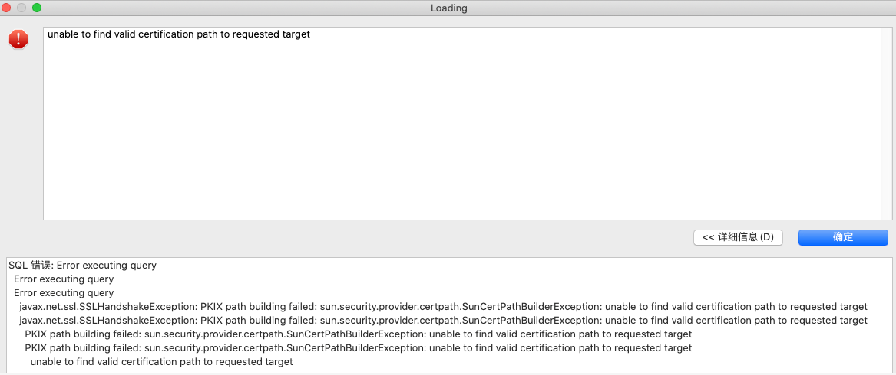

# 如何配置访问控制

[返回首页](../README.md)

---

## 简述

>这个功能 Presto 与 Trino 的配置方式差不多。所以会配置其中一个了，理论上也应该会配另一个了。
>
>目前大部分都是在 Trino 下做开发与运维，所以本文会主要以 Trino 来讲解。(这里也顺便吐槽一下，Presto 与 Trino 的文档确实说的太浅了)。

在阅读本文前我们先思考一个问题，`让用户登录一个系统，需要输入哪些条件是最简单的呢？`，按我多年运维的经验，最简单的就是 `账号、密码、网络地址`，其他的不能再多了。稍微多一个，就会难道 99% 的人。

曾经给公司使用了原始 Presto 的登录认证，用户登录的时候需要配置证书，就这一个小小的证书配置几乎难倒了 99.99% 的人，最难受的就是文档写得再详细，用户也看不懂。因为大部分用户的认知都停留在 `账号、密码、网络地址` 上。有时候真不能怪用户，多出来的任何一项都大概率超过用户的认知。

最后一句话描述就是：`如何只输入账号和密码、网络地址就可以访问 Presto、Trino` (注意！官方的默认情况是不支持这一点的)

所以，你如果有同样的痛点和需求，那么请接着往下读。

>补充：这里说的证书是指，HTTPS 与 TLS 证书，一些参考 https://en.wikipedia.org/wiki/Transport_Layer_Security

**注意：本文只讲解访问控制的登录认证，与账号密码和简单的证书配置，暂时不涉及 LDAP、OAuth、Kerberos、JWT 这些。**

## 官方文档指引

- Presto 
    - https://prestodb.io/docs/current/security/password-file.html
    - https://prestodb.io/docs/current/security/tls.html
 
- Trino
    - https://trino.io/docs/current/security/overview.html
    - https://trino.io/docs/current/security/tls.html
    - https://trino.io/docs/current/security/authentication-types.html
    - https://trino.io/docs/current/security/password-file.html


这些文档综合下来，如果想实现一个简单的访问控制，大致流程为：

1. 如果要配置访问控制，就必须开启 SSL 加密的认证方式。
2. 账号密码验证方式可以选择本地密码文件验证或 LDAP 等其他认证服务。
3. 服务端默认的启动为无加密的 HTTP 方式，开启认证则为标准 HTTPS 加密方式，官方的建议如果开启了认证，最好是把 HTTP 方式隐藏或者不提供。
4. 开启 SSL 加密认证，需要证书才能登录，可以自行制作一个 Java Keystores and Truststores 证书，并且把这个证书导入到运行的 JDK 当中。
5. 最后用户在登录时需要连接 HTTPS 端口，且开启 SSL 然后添加证书指定的参数，用户才能正常登录。

## 官方推荐方式实践

### 服务端配置(密码文件的方式)

>为了演示方便，使用本地密码文件的方式。后续上生产都还是建议使用 LDAP。

`etc/config.properties` 中添加如下配置

```
http-server.authentication.type=PASSWORD

http-server.https.enabled=true
http-server.https.port=38081

http-server.https.keystore.path=jks证书文件的位置
http-server.https.keystore.key=jks证书的key
```

新增 `password-authenticator.properties` 配置文件

添加如下内容

```
password-authenticator.name=file
file.password-file=密码文件的路径
```

设置账号密码

```
touch password.db

htpasswd -B -C 10 password.db test
```

密码文件设置后里面的内容如下


### 证书制作

这一步，主要是 `CN` 这一项的填写，填写了 `什么`，客户端在连接的时候就写 `什么`。

比如我填写了 `localhost`，客户端在连接时就需要用 `localhost` 的地址。这个地址就是你 `Coordinator` 的地址。需要注意的是，证书里用了域名那 Presto 的配置都建议使用域名，反之 IP 同理。

可以使用交互式命令操作

```
keytool -genkeypair -alias trino_2022 -keyalg RSA -validity 8888 -keystore trino_2022.jks
```

此时会提示要输出口令，我们使用这个口令

```
trino_pass_2022
```

```
输入密钥库口令:  
再次输入新口令: 
您的名字与姓氏是什么?
  [Unknown]:  localhost
您的组织单位名称是什么?
  [Unknown]:  
您的组织名称是什么?
  [Unknown]:  
您所在的城市或区域名称是什么?
  [Unknown]:  
您所在的省/市/自治区名称是什么?
  [Unknown]:  
该单位的双字母国家/地区代码是什么?
  [Unknown]:  
CN=localhost, OU=Unknown, O=Unknown, L=Unknown, ST=Unknown, C=Unknown是否正确?
  [否]:  是  

输入 <trino> 的密钥口令
        (如果和密钥库口令相同, 按回车):  

Warning:
JKS 密钥库使用专用格式。建议使用 "keytool -importkeystore -srckeystore trino.jks -destkeystore trino.jks -deststoretype pkcs12" 迁移到行业标准格式 PKCS12。
```

也可以使用便捷命令，一次性完成所有操作

```
keytool -genkeypair -alias trino_2022 -validity 8888 -keyalg RSA -dname \
"CN=localhost,O=Unknown,L=Unknown,S=Unknown,C=Unknown" -keypass trino_pass_2022 \
-keystore trino_2022.jks -storepass trino_pass_2022 -storetype JKS
```

### 证书的导入与导出

#### 导出

制作完证书后，需要把证书导入到 JDK 中。因为使用带有证书的 JDK 运行了 Presto 或 Trino 时，才具有认证效果。

默认证书是 JKS 格式的，必须先从 JKS 格式导出成 CRT 格式。才能导入。

导出命令，这里注意 JKS 的路径不能写错：

```
keytool -export -file ./trino_2022.crt -alias trino_2022 -keystore ./trino_2022.jks
```

#### 导入


导入前我们需要确定下 JAVA_HOME 的环境

```
$ export JAVA_HOME=/Library/Java/JavaVirtualMachines/jdk-11.0.13.jdk/Contents/Home
$ export PATH=$JAVA_HOME/bin:$PATH

$ java -version
java version "11.0.13" 2021-10-19 LTS
Java(TM) SE Runtime Environment 18.9 (build 11.0.13+10-LTS-370)
Java HotSpot(TM) 64-Bit Server VM 18.9 (build 11.0.13+10-LTS-370, mixed mode)
```

导入的时候为了减少出错的风险，建议写绝对路径。

```
keytool -import -alias trino_2022 -keystore /Library/Java/JavaVirtualMachines/jdk-11.0.13.jdk/Contents/Home/lib/security/cacerts -file /tmp/trino_2022.crt
```

这里会提示需要输入密码，`注意` 这里不是刚才设置证书的密码，而是 `jdk cacerts 的密码` 默认为 `changeit`。

加深印象，导入证书的密码为

```
changeit
changeit
changeit
```

成功导入后，会出现如下提示：

```
警告: 使用 -cacerts 选项访问 cacerts 密钥库
输入密钥库口令:  
所有者: CN=localhost, OU=Unknown, O=Unknown, L=Unknown, ST=Unknown, C=Unknown
发布者: CN=localhost, OU=Unknown, O=Unknown, L=Unknown, ST=Unknown, C=Unknown
序列号: 7d1dabcf
生效时间: Sat Nov 06 22:55:09 CST 2021, 失效时间: Tue Nov 04 22:55:09 CST 2031
证书指纹:
         SHA1: 85:DA:70:7B:1F:CF:B9:DC:1D:07:DA:7C:77:82:59:16:85:08:D5:24
         SHA256: B2:11:AC:30:F0:BD:D5:BB:BB:8B:F1:54:2B:44:B9:8D:8E:9C:65:59:F3:23:46:96:5B:BB:6F:6B:E3:3C:72:76
签名算法名称: SHA256withRSA
主体公共密钥算法: 2048 位 RSA 密钥
版本: 3

扩展: 

#1: ObjectId: 2.5.29.17 Criticality=false
SubjectAlternativeName [
  IPAddress: 192.168.3.202
]

#2: ObjectId: 2.5.29.14 Criticality=false
SubjectKeyIdentifier [
KeyIdentifier [
0000: 9F AD 53 4D 79 15 EE 7D   77 5D E7 6B E9 57 B9 4B  ..SMy...w].k.W.K
0010: 19 9E DB D1                                        ....
]
]

是否信任此证书? [否]:  是
证书已添加到密钥库中
```

查看下证书是否正确导入

```
cd /Library/Java/JavaVirtualMachines/jdk-11.0.13.jdk/Contents/Home/lib/security


$ keytool -list -keystore cacerts | grep trino_2022
警告: 使用 -cacerts 选项访问 cacerts 密钥库
输入密钥库口令:  changeit
trino_2022, 2022年2月2日, trustedCertEntry,

```

### 客户端连接

有两种方式连接，使用原生 jar 包，或者使用 DataGrip，DBeaver 这类工具。

**使用原生jar方式**

```
java -jar trino-cli-363-executable.jar --server="https://localhost:38081" --keystore-path="/tmp/trino_2022.jks" --keystore-password="trino_pass_2022" --user="test" --password
```

**使用客户端工具连接的方式**

>使用工具连需要多配置 3 个参数

|         key         |     value     |
| ------------------- | ------------- |
| SSL                 | true          |
| SSLKeyStorePassword | 制作证书的密码 |
| SSLKeyStorePath     | jks的位置      |


这个地方的 `SSLKeyStorePassword` 就是我们刚才设置的 `trino_pass_2022`。


**需要注意的地方**

Trino 的客户端，不像 MySQL 客户端设置了明显的错误提示。

SSL 类的设置，属于客户端的提示，比如我想知道账号密码错误，目前的反馈是这样的。

密码错误：


只有使用原生 jar 包连接，才会出现明确一点的错误。

```
$ java -jar trino-cli-363-executable.jar --server="https://localhost:38081" --keystore-path="/tmp/trino_2022.jks" --keystore-password="trino_pass_2022" --user="test" --password
Password: 
trino> show catalogs;
Error running command: Authentication failed: Access Denied: Invalid credentials
```

密码正确的连接：


```
$ java -jar trino-cli-363-executable.jar --server="https://localhost:38081" --keystore-path="/tmp/trino_2022.jks" --keystore-password="trino_pass_2022" --user="test" --password
Password: 
trino> show catalogs;
  Catalog  
-----------
 localfile 
 mysql     
 system    
(3 rows)

Query 20220202_024044_00000_6e94r, FINISHED, 1 node
Splits: 19 total, 19 done (100.00%)
1.03 [0 rows, 0B] [0 rows/s, 0B/s]

```

这里也变相算是个小坑吧。没有明确告诉用户是哪里错了。从 JDBC 客户端的角度来看，是 `连接成功、认证失败`。只有使用原始客户端登录才能看到详细的错误。

## 便捷方式实践(需要少量二次开发)

看完前面的实践，可以说这一套流程下来，对用户的学习成本和心智成本是相当高了。

那么我们能不能实现 `只需要账号密码`，而不用证书，就能完成登录呢？

官方文档里是没有做任何介绍，我们只能走读源码来找找蛛丝马迹了。

### 客户端部分

使用官方 JDBC 客户端连接的时候，必须要设置 `SSL=true` 和 `证书`，才能配置账号密码连接，不然只输入账号密码的话就会出现如下错误。


而且只配 `SSL=true` 不配 `证书` 也不行，会出现如下错误。


我们跟一下源码，发现 JDBC 的部分有一个 `useSecureConnection`，它代表是否设置了 SSL。


所以使用账号密码连接，就必须配置 SSL，配置 SSL 就必须要有证书，这样就会陷入到那个麻烦的配置问题上。

其实在这个地方，把 JDBC 客户端的 SSL 验证逻辑取消掉，也是可行的。缺点就是用户不能使用官方的 JDBC jar 包，大量用户的 jar 包变更还是不太友好。

### 服务端部分

我们再看看服务端的代码。

这里调用栈比较深，我的习惯是从启动的时候开始看，因为 Presto、Trino 在启动的时候会按照功能分门别类加载。比如这个访问控制的账号密码相关的，我们就可以轻易的看出来是 `ServerSecurityModule` 这个模块加载的。


跟进去后，我们发现这个模块会加载我们前面在官方文档中看到的各种验证方式，比如 Kerberos、OAuth2、JWT 等等。而且发现第一个加载的就是一个 `AuthenticationFilter` 身份验证过滤器。


跟到 `身份验证过滤器` 里面，我们可以发现，使用了安全的连接方式会走 `authenticator` 里面去，比如我们前面设置的基于密码文件来进行身份验证。如果不使用安全连接的方式，则走 `InsecureAuthenticator` 我把它称为不安全的身份验证。

通过断点调试，我们在默认启动 presto 的时候，http 的访问方式确是走的 `不安全的身份验证`。

服务端的修改，我们只需要注释掉那个安全访问方式的判断，然后把 `不管用什么方式连接，都会走到 authenticator` 逻辑。


这里简单的理解就是，如果使用 `authenticator` 是会验证账号密码，具体逻辑可以参考 `io.trino.server.security.Authenticator` 接口里的 `authenticate` 实现。如下图：


如果使用 `InsecureAuthenticator` 则不会验证账号密码。查看代码里连密码字段都没去取，反而有逻辑检查如果你设置了密码，还会给你抛个异常。不允许使用不安全的身份验证逻辑中进行密码验证。


## 总结

### 想法

跟完以上代码。我们可以得到两个关键点。

1. 在不修改客户端的前提下(主要是要对用户无感知，分发 jar 也是一个麻烦事)。只有开启 SSL 认证并配置好证书才能进行账号密码验证。
2. 服务端也有强逻辑来判断，只有是在安全的访问方式下才会进行账号密码验证。

那么我们可以使用如下方式绕过这些：

1. 服务端只开启不安全的访问模式，只开启 HTTP 默认的访问方式。
2. 服务端开启密码验证服务，设置 `http-server.authentication.type=PASSWORD`。
3. 使用代理服务，比如 Nginx，方式为访问 Nginx 的 `HTTPS`，然后 Nginx 帮我们代理到 Presto 的 `HTTP` 上。这样客户端就可以在不用配置证书的情况下把账号密码传过来。(注意！客户端在访问时需要把端口改成 443)。
4. 服务端在 `身份验证` 逻辑部分，修改一下 HTTP 访问方式会走到的 `InsecureAuthenticator 不安全的身份验证方式` 逻辑，使所有逻辑都走到 `authenticator` 正常的身份验证方式中去，目的是让 HTTP 的方式也能验证账号密码。(这个方式不一定是最好的，只是比较粗暴)
5. 但是有个地方需要注意 Nginx 配置 HTTPS 代理是需要证书的，这里必须是公共信任的证书才会起到刚才我们所说的效果。如果使用自签的 SSL 证书则会出现如下错误。




### 实践

最后假设我们搞了一个收费的且有根认证的证书，我们可以参考如下 `Nginx` 配置，将证书配置进去。

>注意！以下只是参考，最后请自行修改调整。或者查阅 Nginx 官方文档。

```
server {
    listen       443 ssl;
    server_name  localhost;             #域名

    # 增加ssl
    ssl_certificate      /ssl/server.crt;  #server证书公钥
    ssl_certificate_key  /ssl/server.key;  #server私钥

    ssl_session_cache    shared:SSL:1m;
    ssl_session_timeout  5m;

    ssl_protocols  TLSv1 TLSv1.1 TLSv1.2;

    ssl_ciphers  HIGH:!aNULL:!MD5;  # 密码加密方式

    # 指向presto的地址和http端口
    location / {
        proxy_pass        http://192.168.1.4:8080;
    }
}
```

下面的图片，是我用了公司的 nginx，并配置了收费证书代理presto，客户端访问后的效果。


### 结论

如果前期规模不大，然后公司内部又能建立好自己的包管理体系。又或者对用户客户端使用包的分发能够接受的话，直接修改 JDBC 客户端可以说是改动量较小的一个方式。

如果用户量规模较多涉及大量客户端使用包分发的时候，还是建议文中推荐的方式，修改服务端并使用一个代理服务来工作。

又或者用户能够接受以及学会配置证书，这样也行。(相信我，支持工作量相当庞大)。