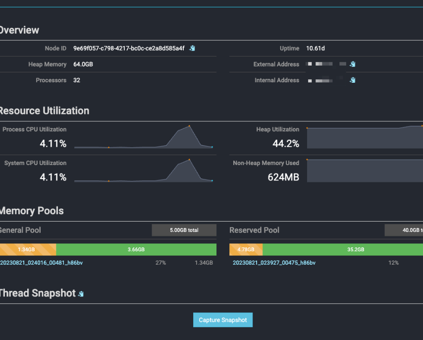
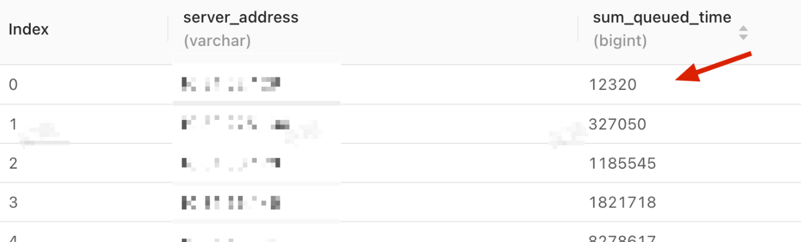

# Presto内存池使用调整

[返回首页](../README.md)

---

## 背景

Presto 默认会给 Worker 开启 2 个内存池，这里面会有一些潜在的性能问题。

注意！这里的问题，是指默认的内存池情况不适用于我当前的业务，所以需要根据自身的业务来看待这个问题，不要盲目认为这样的调整一定适合你。

早期为了使用 Presto Local Cache 的缓存功能，我们整体从 Trino 迭代到了 Presto，结果发现 Presto 查询会比 Trino 要慢一些。

## 现象

### 查询耗时

我们是在 6 月份进行了迁移，迁移后发现明显变慢。


### 排队情况

集群很容易出现排队，经常出现集群里就 1 个查询，然后新进来的查询会排队。


### Worker的信息

在默认的情况下，Presto 有 2 个内存池，大部分都使用 General Pool，当有特别大的查询时才会使用 Reserved Pool。



一般情况下，查询都会去抢 General Pool 内存池，我们发现，5GB 的内存不适用于我们的业务场景。


## 分析

其实这个 调优点 ，大部分来自于经验。

因为早在 2021 以前维护 Presto 的时候，内存池的调整一般都是首要修改点。

当后期拆分到 PrestoSQL 和 Trino 的时候，新的社区把这个优化点调整了默认设置，减轻了用户的调优成本，所以在从 Trino 迁移回 Presto 的时候容易 `疏忽` 这一点。


## 原理

以前的记录：


大致原因就是，Presto 分配给用户能用的内存池，可以理解有 2 个 General Pool 和 Reserved Pool，这个内存池是由 Presto 管理的，主要是避免了反复与操作系统申请，提升内存的使用效率。

但是，默认情况下 Reserved Pool 会比 General Pool 大很多，而且只有出现大查询才会用 Reserved Pool，这里的大小是指单个查询可以使用内存的限制，而不是整个集群的内存限制。

又因为我们定位 Presto 给了 adhoc 和 bi 等场景，所以面对的大量查询都是小查询，因为我们添加了一些比较严格的限制，当一些大查询工作时都会先被那些限制给拦截掉，最终 Reserved 内存池几乎很难用上。

这里社区建议是可以将内存池合并，只使用 General，这样在面对 adhoc 和 bi 等场景时会很具有优势。

## 调整

调整后的内存使用情况：

相当于把 2 个内存池合并，不再分大查询和小查询，都来共用这 45G 的内存池，这样吞吐能力会有所提升。


其实在 Trino 中这 2 个内存池默认是合并的，所以 Trino 集群默认开启后就只有 1 个内存池，如下图：


## 调整后的效果

合并了内存池，主要是提升了内存池的上限，查询耗时不会变快，收益最大的是查询的吞吐能力变强了。

所以最后相应监控的的指标，应该为查询耗时削微降低，排队几率和耗时明显减少




## 内存池解释

在 Presto 引擎中，有两种类型的内存分配：User 和 System。

User Memory 是和输入的数据强相关的。（例如，聚合的内存使用）。

System Memory 是执行的副产品（比如表扫描和写入缓冲区），并且不一定与查询输入聚合等操作有很强的相关性。

Presto 会为这两种内存分配 Worker 的 Memory Pools。

Memory Pools 由 2个 pools 组成 General Pool 和 Reserved Pool，如图所示


- General Pool：General Pool 提供 User Memory 和 System Memory 的分配。
- Reserved Pool : 当有一个 Worker 的 General Pool 内存耗尽，Reserved Pool 将会发挥作用。这个时候 Coordinator 将会选出集群出消耗内存最大的查询，并将该查询分配给所有 Worker 的 Reserved Pool。

> Reserved Pool 的值等于 query.max-total-memory-per-node 的大小。
> query.max-total-memory-per-node 是单个节点 User memory 和 System memory 占用的最大值。

而且 Reserved Pool 是启动时系统预留的，一起动就会占用，所以这里有一个问题，在实际中的情况来讲，我们会极少使用到 Reserved Pool，而且它还占用了很多的内存资源。

因为在面向 **即席查询、报表查询、等一些小型查询时** ，很难用到 Reserved Pool 内存池，如果基于中小型查询场景配置查询限制的话，大查询都会先被这些限制给拦截 kill，就更难使用到 Reserved Pool。

所以我们可以通过配置参数，禁用 Reserved Pool。如图所示

config.properties

```
experimental.reserved-pool-enabled=false
```

效果如下


