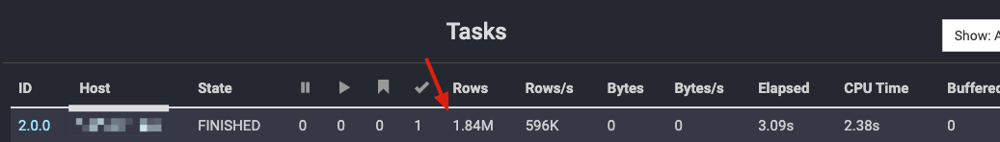
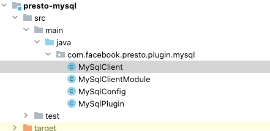
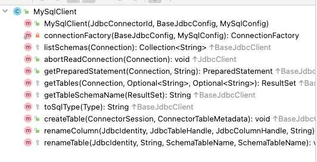
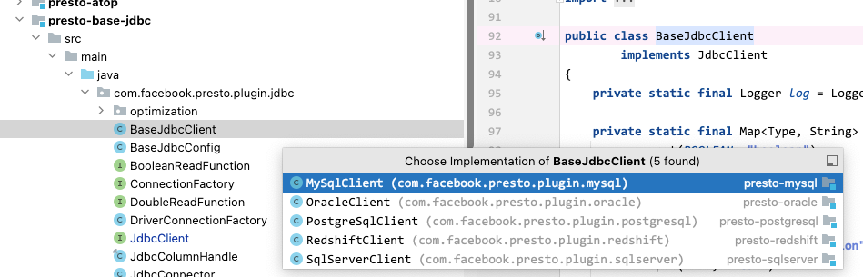
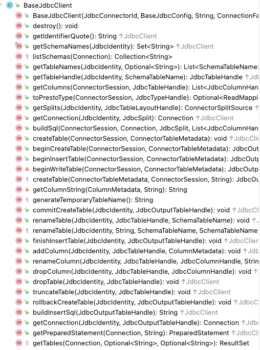
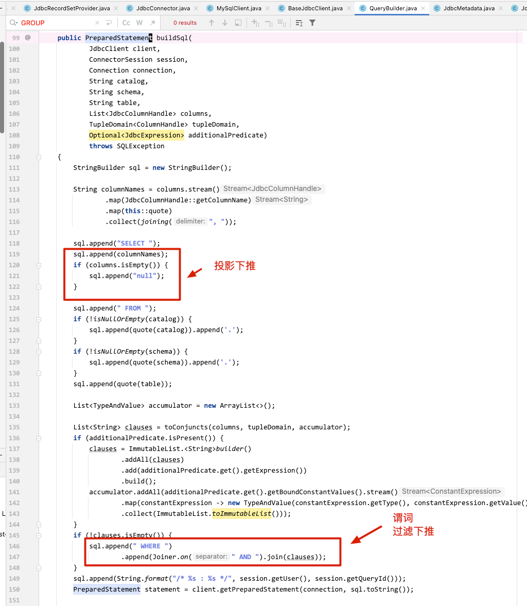
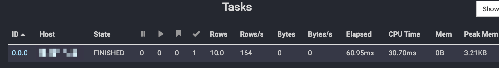
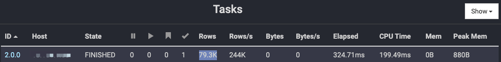
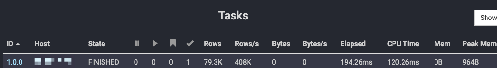
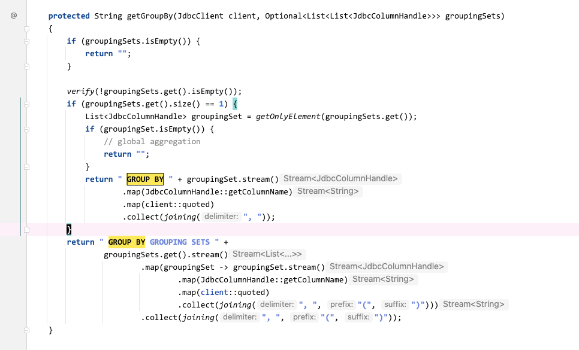

# Presto查询Doris问题

[返回首页](../../../README.md)

---

Doris 与 StarRocks 都是近几年很流行的 OLAP 引擎，但是对于已经基于 Hadoop、Hive、Spark、Flink 等生态构建的数仓体系，想再用上 Doris 一般会增加一些数据同步成本，和数据查询成本(这里的成本不是指性能，而我公司的数据架构体系中的对接、适配成本)。

这里暂时不谈彼此之间的优缺点，主要是聊在面向 OLAP 对接各个应用、或者数据平台时的一些问题。

比如对接报表平台、查数平台、数据接口服务，早期大概率可能都是 Hive、Presto、Spark、Impala 等对接方式，此时再对接 Doris 时，相当于要多一份 OLAP 对接工作。为了不改动上层应用的对接架构，如果已有 Presto 的情况下对 Connector 进行优化调整是一个性价比不错的方式，这里主要聊一个使用 Presto JDBC Connector 来查询 Doris 的问题。

为什么要用 Presto 去对接 Doris，主要还是遗留问题，迁移的工作不可能一下子就能做到全面的割接，都是渐进式的慢慢来，而且对外对接的方式 Hive、Presto、Spark 等等已经迭代了很多年了不会轻易改动，此时再增加一个新的适配，成本是较高的。

恰好 Presto 中有 JDBC Connector，经了解和沟通，发现适配好了之后 Presto 查询 Doris 的速度与裸查 Doris 勉强持平，所以去优化调整 Presto JDBC Connector 的成本相较于再适配一种新的 OLAP 引擎要成本低一些。

同时我们也可以借这个机会，学习一下 JDBC Connector 的工作流程。

## 目前的问题

数据量不是很大，在 Doris 中查询可以秒出，但是在 Presto 使用 JDBC Connector 查询则需要 30~40 秒。

Doris 秒出

```sql
doris> select count(*) from doris.audit_log;
+----------+
| count(*) |
+----------+
|  1842877 |
+----------+
1 rows in set (0.10 sec)
```

```sql
doris> select client_ip, count(*) as u_cnt from doris.audit_log group by client_ip order by u_cnt desc limit 10;
+----------------------+-------+
| client_ip            | u_cnt |
+----------------------+-------+
| 10.112.***.***:47146 |   234 |
| 10.112.***.***:45294 |   230 |
| 10.112.***.***:40678 |   228 |
| 10.112.***.***:48544 |   228 |
| 10.112.***.***:49330 |   228 |
| 10.112.***.***:38598 |   226 |
| 10.112.***.***:39542 |   224 |
| 10.112.***.***:56510 |   224 |
| 10.112.***.***:54748 |   222 |
| 10.112.***.***:51016 |   222 |
+----------------------+-------+
10 rows in set (0.10 sec)
```


Presto 中要 30 多秒

```sql
presto> select count(*) from doris.audit_log;
  count(*)  
-----------
  1842877
  
[Latency: client-side: 0:33, server-side: 0:33] [1.84M rows, 0B] [330K rows/s, 0B/s]
```


```sql
presto:default> select client_ip, count(*) as u_cnt from doris.audit_log group by client_ip order by u_cnt desc limit 10;
      client_ip       | u_cnt
----------------------+-------
 10.112.***.***:47146 |   234
 10.112.***.***:45294 |   230
 10.112.***.***:48544 |   228
 10.112.***.***:49330 |   228
 10.112.***.***:40678 |   228
 10.112.***.***:38598 |   226
 10.112.***.***:39542 |   224
 10.112.***.***:56510 |   224
 10.112.***.***:54748 |   222
 10.112.***.***:51034 |   222
(10 rows)

[Latency: client-side: 0:06, server-side: 0:06] [1.84M rows, 0B] [330K rows/s, 0B/s]
```

查看具体 Stage 可以发现， 输入的 Rows 是 1.84M 正好与 count(*) 的 1842877 差不多，可以理解是将数据都读到 Presto 中进行计算了，没有进行下推。




## 我们先看看 presto 投递到 doris中变成什么样了

### group by 测试

变成查询对应 group by 那一列的所有数据

```sql
presto> select client_ip, count(*) as u_cnt from doris.audit_log group by client_ip order by u_cnt desc limit 10;
```

```sql
doris: SELECT `client_ip` FROM `doris`.`audit_log`/* **** : 20240128_082015_00011_mv9mr */
```

### limit 测试

变成查询对应表的所有数据

```sql
presto> select * from doris.audit_log limit 1;
```

```sql
doris: SELECT 所有的字段 FROM `doris`.`audit_log`/* **** : 20240128_083051_00013_mv9mr */
```

### distinct 测试

变成查询 distinct 那一列的所有数据

```sql
presto> select distinct(client_ip) from doris.audit_log limit 10;
```

```sql
doris: SELECT `client_ip` FROM `doris`.`audit_log`/* ares : 20240128_084002_00015_mv9mr */
```

### Presto -> JDBC -> Doris 的转变

可以判断，JDBC Connector 这块是先查出来所有数据，然后在 Presto 进行计算，没有下推或者说下推的逻辑需要调整。

(可能是为了方便跨数据源 JOIN 所以这里在读数据的时候，不会做什么操作)

经过验证发现，GROUP BY，COUNT，ORDER BY，LIMIT，DISTINCT，这些常用算子也没下推下去。

接下来我们来看看 Presto JDBC Connector 的相关实现。

## JDBC Connector 解析

Presto JDBC Connector 的 Plugin 相当比较简单，源码布局如下。



大部分 JDBC 的相关逻辑都在 MySqlClient 中，比如 创建表，查看表，字段改名字等。



在 MySql Connector 中只是重写了部分逻辑，JDBC 的所有基础操作，都在 BaseJdbcClient 中定义了






### 发现已有的下推



对应的 SQL 变化如下：

```sql
presto> select client_ip,scan_rows from doris.audit_log where client_ip = '10.112.***.***:45690' limit 10;
```

```sql
doris: SELECT `client_ip`, `scan_rows` FROM `doris`.`audit_log` WHERE (`client_ip` = '10.112.***.***:45690')/* ares : 20240128_094150_00018_mv9mr */
```

## Trino 测试

###  limit 测试

此时我们换过来，看看 Trino 这边是怎么进行转换的

```sql
trino> select * from doris_test.*** limit 10;
```

```sql
doris: SELECT `deal_id`, `order_id`, `payment_number`, `course_id`, `sku_id`, `business_type`, `business_brand`, `primary_classification`, `secondary_classification`, `business_type_name`, `user_tag`, `belong_type`, `paid_time`, `current_time`, `status`, `buyer_amount`, `is_third_party_order`, `third_party_paid_amount` FROM `doris_test`.`***` LIMIT 10
```

发现下推了，只读了 10 行数据。



### group by 测试

```sql
presto> select client_ip, count(*) as u_cnt from doris.audit_log group by clinet_ip order by u_cnt desc limit 10;
```

这里聚合没有下推，但是投影下推了，相当于扫描了一整列的数据进来。

```sql
trino: SELECT `client_ip` FROM `doris`.`audit_log`;
```



### distinct 测试

```sql
trino> select distinct(client_ip) from doris.audit_log limit 10;
```

发现只下推了投影

```sql
doris: SELECT `business_brand` FROM `doris`.`audit_log`;
```



### Trino JDBC 相关源码

trino 中的 group by 下推相关实现




## 下推实现验证

### distinct


### aggregate


### limit


### cast


### date


## 参考

- https://github.com/trinodb/trino/issues/17329
- https://github.com/trinodb/trino/issues/8653
- https://github.com/myfjdthink/trino-doris-demo
- https://github.com/footprintanalytics/trino


打开的代码

- com.facebook.presto.plugin.jdbc.JdbcClient
- com.facebook.presto.plugin.jdbc.BaseJdbcClient
- com.facebook.presto.plugin.jdbc.QueryBuilder
- com.facebook.presto.plugin.jdbc.JdbcMetadata
- com.facebook.presto.plugin.jdbc.optimization.JdbcComputePushdown