# Presto从零开始实现一个Connector_实现流程简述与测试

[返回首页](../../README.md)

---

## 1 实现流程参考

> 注意这个系列只讲 Presto (Trino 会单开系列)，只会在文中一些关键点说明功能的对比，不会大面的讲。

官方文档以及源码中对 Connector 的开发讲解的比较少，基本上就只 `点` 了几个接口需要我们实现。

https://prestodb.io/docs/0.285.1/develop/connectors.html

比如实现的先后顺序，是否有一个流程化的东西，这些基本就是靠自己理解和摸索了。

这个系列的文章，是平常在进行 Connector 开发的一个总结，主要讲开发流程(不一定对，仅供参考)，从功能实现流程，到单元测试，以及日志和监控都会讲到。

按照我的个人习惯，一般会用这样流程进行开发 `配置 -> 工程入口 -> 主要功能 -> 细节功能 -> 测试 -> 运维`，可以理解为比如我们要实现一个什么功能，它一定是会有一些基础配置或者自定义配置，然后它的入口都是什么，里面有哪些主要功能，就是必须要有这些功能才能跑起来，以及哪些细节锦上添花的功能，最后进行开发时如何单元测试，如何集成测试，如何运维等等。 

### 1.1 Config 配置

配置，即为 Connector 的一些自定义配置，比如 Hive Connector 中 HMS 的地址，Hadoop 的 core-site hdfs-site 的地址，这些参数的获取的设置都是需要开发的。

在 Presto 中配置的开发主要是借助了 Airlift Config 注解方便将配置名进行映射，其他则无需实现某某接口即可完成开发。

比如以下参考，我只需要按照配置需求进行实现，最后在 Module 中 bind 以下，即可完成配置开发。

> 在 Presto 的源码中，有的命名可能叫 HudiConfig 或者 KuduClientConfig 意思都差不多，都是配置的意思。

**注意！在 Config 注解添加配置名是，符号尽量只用 . 和 - 不要用 [下划线]**

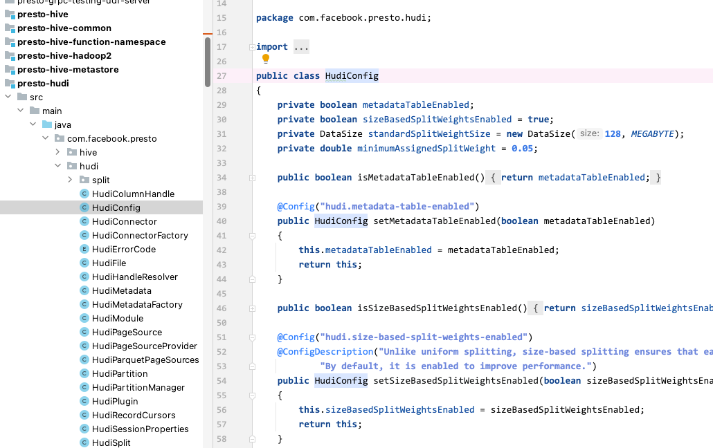

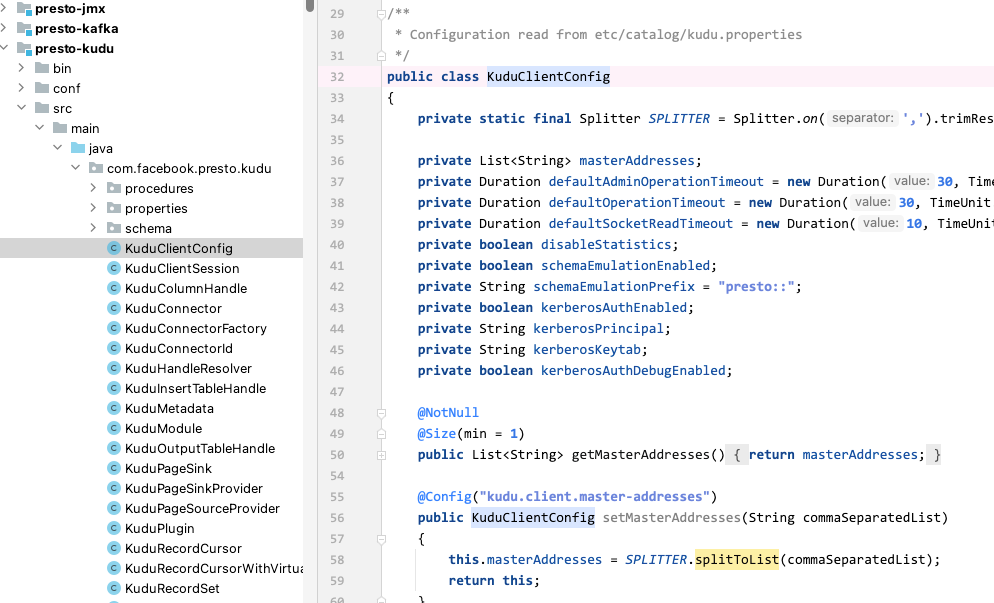


### 1.2 Plugin 入口 与 Presto 对接

Plugin，可以理解为 Connector 与 Presto 进行对接所用。

实现 com.facebook.presto.spi.plugin 接口，这一步主要是为 Plugin 设置名称(有的可能也会把名称设置后置)，以及选择 Connector 的进入方式，有 `ClientModule` 和 `ConnectorFactory` 两种方式，然后开始 Connector 的正式创建。

这两种的主要区别是如果要开发的 Connector 是基于 JDBC 且没有太多定制化的需求，那么使用 ClientModule 可以更加简单和直接。但如果你的 Connector 需要进行一些自定义的逻辑或者与非 JDBC 的数据源进行交互，那么应该使用 ConnectorFactory 方式。

所以在 Presto Connector 中可以理解有 2 大类 Connector `基于 JDBC` 和 `不基于 JDBC`，往深的父类中查看它们都属于 plugin 接口，所以也可以理解它们都遵循 Presto 的 Plugin 开发规范。

如下图：

**ConnectorFactory方式**

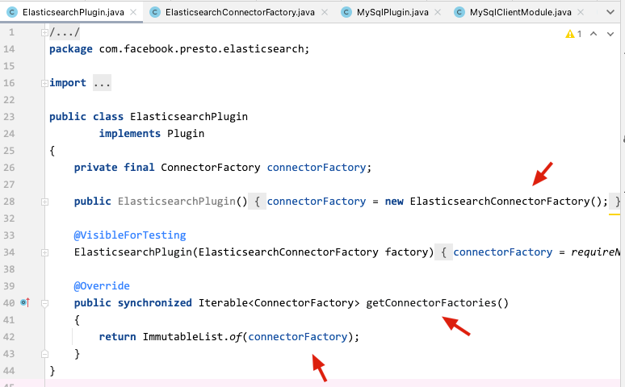

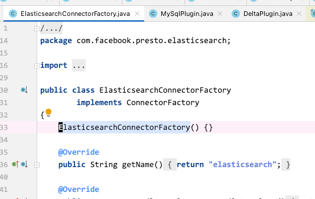

**ClientModule方式**

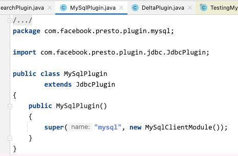


#### 1.2.1 简单补充一下是否基于 JDBC 开发 Connector 的区别

Plugin 接口中主要由 getConnectorFactories 方法来返回自定义开发的 Connector，然后与 Presto Plugin 体系去对接等操作。

**开发一个 Connector 在 Plugin 这一侧主要是完成 getConnectorFactories 方法的重写。**

```java
@Override
public synchronized Iterable<ConnectorFactory> getConnectorFactories()
{
    return ImmutableList.of(connectorFactory);
}
```

需要明白一个概念 Plugin 是一个通用的接口，它可以用于注册各种不同类型的插件，包括但不限于 Connector、BlockEncoding、Type、Function、SystemAccessControl、EventListener、ResourceGroupConfigurationManager 等。而 JdbcPlugin 类是一个具体的实现类，它专门用于注册 JDBC 连接器所以它在 getConnectorFactories 方法中返回了一个 JdbcConnectorFactory 实例，需要注意的是，这里还多了一个 module 和 classLoader。

```java
@Override
public Iterable<ConnectorFactory> getConnectorFactories()
{
    return ImmutableList.of(new JdbcConnectorFactory(name, module, getClassLoader()));
}
```

解释一下 module 和 classLoader：

- module，用于配置 JDBC 连接器的依赖关系和初始化。
- getClassLoader，获取当前线程的类加载器，从而在 JDBC 连接器中可以加载类和资源文件，可以按照加载 JDBC Driver 驱动来理解。


### 1.3 ConnectorFactory 与 ClientModule 的区别

讲解了前面的 Plugin 区别后，在具体的 Connector 实现上就会有 2 个细微的区别点。

ConnectorFactory 与 ClientModule 方式。

在 ConnectorFactory 中 create 方法里会根据开发的需求注入各种模块，搭配 Guice 创建的 Injector 可以很灵活的满足各种搭配，比如自定义 Connector 中需要 Json 功能，需要特殊验证功能，以及其他功能，这里都可以通过新增 bind 的 module 来实现。再看 ClientModule 这边，就可以把它理解为是一个 module 会更合适。

我自己的理解，***ClientModule 主要为 Connector 自身的一些功能、配置、依赖等等。比如 Presto Hive 就可以在 HiveClientModule 中看到这个 Connector 的所有功能、配置、依赖等，而 Hive 的 ConnectorFactory，HiveConnectorFactory 中，主要就不仅仅是 HiveClientModule 了，它还通过 Airlieft 的 Bootstrap 加载了很多其他的 module，比如 Event、Json、MBean、HiveS3、Cache 等等，来完成达到 Hive Connector 运行时所需要的所有功能。
    
ConnectorFactory 方式可以参考

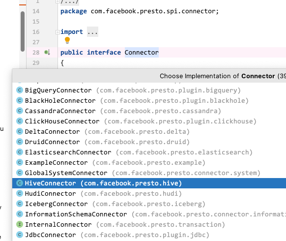

ClientModule 方式可以参考

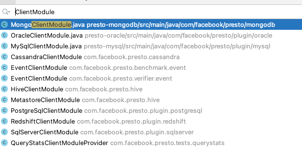


### 1.4 Connector 核心功能

实现 Connector 主要有以下 4 点(还有其他的，主要这 4 点在官方文档里也介绍了，参考其他 Connector 实现中这些也经常出现，所以这里主要介绍一下它们)。

- ConnectorTransactionHandle 事务
- ConnectorMetadata 元数据
- ConnectorSplit 数据分割，我理解叫数据切片，比如一个 Split 对应 HDFS 中的一个数据文件
- ConnectorRecordSetProvider 获取 Split 中的每一行的数据

常用功能点对应了以下需要重写的方法，以及一些常见的方法：

- beginTransaction() 事务
- getMetadata() 元数据
- getSplitManager() 数据分割
- getPageSourceProvider() 数据 Page
- getSessionProperties() 查询上下文配置
- getRecordSetProvider() 数据记录获取器
- rollback() 回滚

#### 1.4.1 ConnectorTransactionHandle

一般会在 Connector 的实现类中，重写 beginTransaction 方法来完成事务的相关开发，本章暂时不讲解。

#### 1.4.2 ConnectorMetadata

定义 Connector 中所有 Metadata 的相关操作，一般会以一个 MetadataFactory 工厂方法会创建的入口，具体的操作都在 Metadata 的实现类中。需要注意的是 MetadataFactory 工厂方法主要起到在创建 Metadata 实现类时的一些约束、检查、传参等等工作。

对应接口 **com.facebook.presto.spi.connector.ConnectorMetadata**

在 Metadata 接口中定义了所有元数据的操作，下面罗列出来一些常见需要重写的方法：

  - listSchema：获取库列表
  - listTables：获取表列表
  - getTableHandle：获取SQL中的表实例，ExampleTableHandle实现了ConnectorTableHandle接口，在获取分片和表字段的信息时需要用到该实例。
  - getTableLayouts：获取表的布局信息。
  - getTableMetadata：获取表的元数据信息，主要包含了表字段信息、所在的Schema、Owner等。
  - listTableColumns：获取当前schema下所有表的Column元数据信息。
  - getColumnHandles：获取表的列信息。
  - getColumnMetadata：获取表的某一列的元数据信息，包含了字段名称、类型等相关信息。
    
这里需要注意的是，一般都是直接实现 ConnectorMetadata 接口，完成对应的方法重写即可，但是有时候工程的设计需要，会单独抽象出一个 Client 类来，它代表这个 Connector 的一些专属自定义实现。比如：

ClickHouse 这里就是一个很好的例子，因为 Presto 对接 ClickHouse 的时候算是 JDBC 的方式，所以在元数据的获取也是要走 JDBC 的方式，相关的实现可能就会放在 ClickHouseClient 进行专属自定义实现，ClickHouseMetadata 这里就是一个调用。

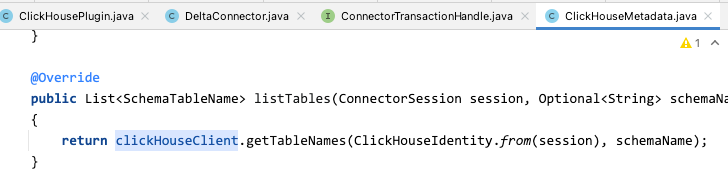

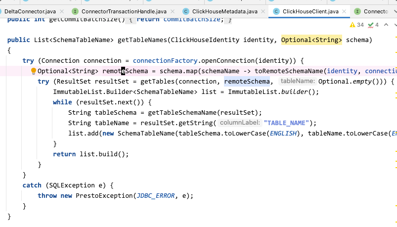

再放一个 Hive 的例子，这里的获取就不是用 JDBC 了，而是调用了 delegate.getAllTables 这个抽象方法，其中 delegate 又会有多种 Hive 元数据的相关具体实现

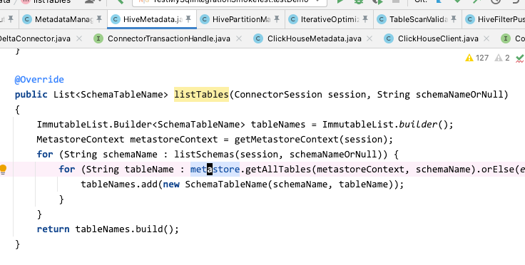

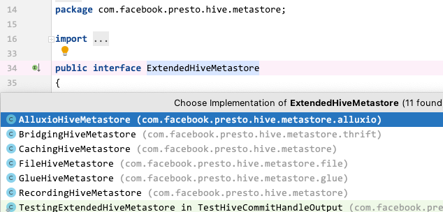


#### 1.4.3 ConnectorSplit

定义 Connector 与对应引擎 Split 的操作，我是理解为数据分割的操作。

Split 的流程为首先实现 ConnectorSplitManager 接口，主要重写里面的 getSplit 方法完成如何将数据源中的数据切分成若干个 ConnectorSplit，然后以符合 ConnectorSplitSource 接口的方式返回。

ConnectorSplitSource 是一个接口，Presto 在读取 Split 中的数据时，主要是调用了里面的 getNextBatch 的抽象方法，然后不同的 Connector 在 Next 部分会有不同的实现。

然后再实现 ConnectorSplit 接口，里面主要提供了 Split 与 数据源中的一个数据分区或者一个数据分片的对应关系、描述了数据切分的元数据信息、数据范围、数据大小，以及我们会用到的查询亲和性，Split 与 Node 的选举等等功能。

对应接口

- **com.facebook.presto.spi.connector.ConnectorSplitManager**
- **com.facebook.presto.spi.ConnectorSplit**


参考以下 Presto ClickHouse 的实现

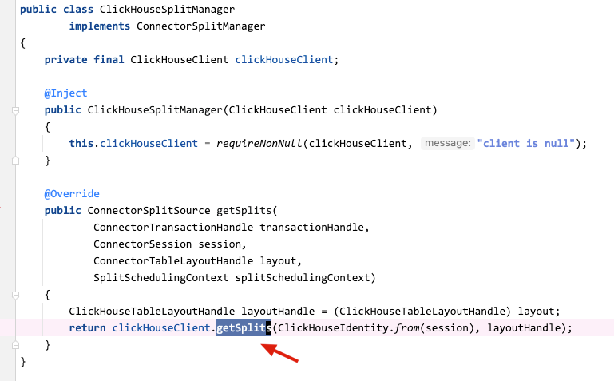

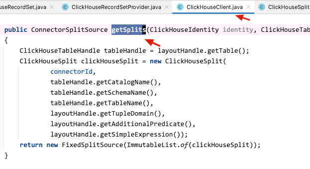

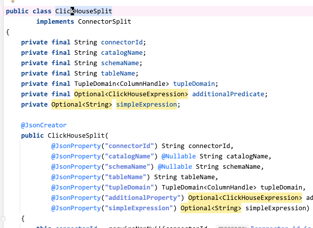


##### 1.4.3.1 简单补充一下 Split 的查询亲和性

在实现 ConnectorSplit 接口时，还有一个比较重要的知识点，`查询亲和性`。

因为 Presto 引入了缓存功能，为了保证缓存的命中率，将 Split 与查询的调度设计了一套亲和性的功能，反映到 Split 层面就是需要来重写 getNodeSelectionStrategy 和 getPreferredNodes 方法，这里简单介绍一下它们：

- getNodeSelectionStrategy() 为 Split 与 节点的亲和性配置，有硬亲和、软亲和、不亲和。
- getPreferredNodes() 为 Split 选择 N 个首选节点进行工作，具体怎么选择则需要搭配 Presto 中的一些指标自行计算，比如节点繁忙值，缓存等等。

其他详情可以查看源码：presto-spi/src/main/java/com/facebook/presto/spi/ConnectorSplit.java

#### 1.4.4 ConnectorRecordSetProvider

有了数据分割的操作，那么就会有对分割 (Split) 中具体的数据操作，专业点说可以叫处理查询结果记录集，以及提供对记录集的迭代访问和数据读取，所以 Presto 为我们准备了  RecordSet 相关接口。

实现流程为首先对 ConnectorRecordSetProvider 接口进行实现，主要是 getRecordSet 方法的重写，用于根据查询结果元数据和 Split 信息创建一个 RecordSet 实例。

在 getRecordSet 方法中会返回符合 RecordSet 接口的实例，RecordSet 代表一个查询结果的记录集它包含了查询结果的元数据信息和一系列 RecordCursor 对象，主要是里面的 cursor 方法，用于迭代访问查询结果记录的 RecordCursor 对象。

最后在要读取具体数据时则是实现 RecordCursor 接口，可以将它理解为查询结果记录的游标，主要为里面的 advanceNextPosition 方法。

对应接口：

- com.facebook.presto.spi.connector.ConnectorRecordSetProvider
- com.facebook.presto.spi.RecordSet
- com.facebook.presto.spi.RecordCursor

当我们看到 `游标` 这个词的时候是不是很熟悉，没错就是你们想的那个，JDBC 的那个游标。

所以在使用 Record 相关接口的时候，发现是基于 JDBC 开发的 Connector 用的相对多一点(具体可以看里面的相关源码来分辨，这里也不绝对)，如下图：

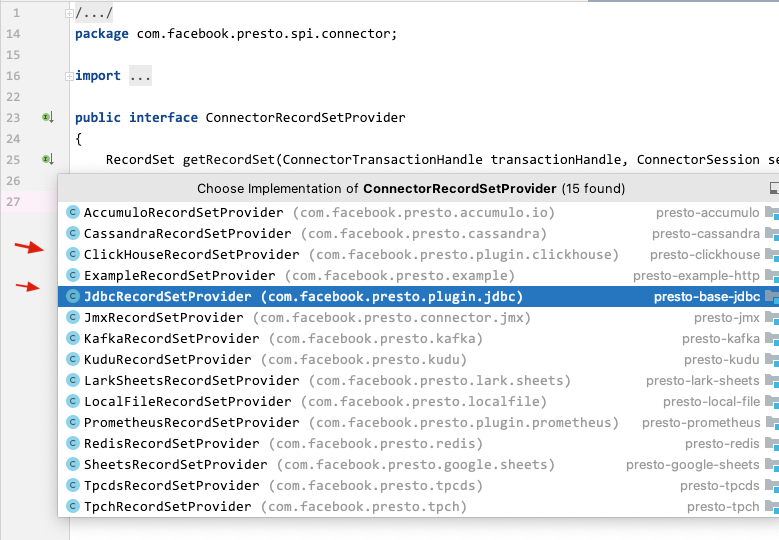

##### 1.4.4.1 其他的 Connector 是怎么读取数据的呢

这里我们思考一下，Presto Hive Connector 是怎么读数据的呢？

思考思考，首先肯定不是 Presto 把 SQL 按照 JDBC 的方式投递到 Hive-server2 里去查，那样肯定会慢也不符合常识。

我们在配置 Presto Hive Connector 的时候，有没有印象，配置过元数据的地址，所以这里我们是不是可以大胆假设一下：

```
会不会有可能，基于 Hive 的元数据，然后得到 HDFS 的地址，直接去读对应的文件了呢(比如 txt、parquet、orc)。

同时元数据、文件这些信息都有，查询下推等等各种优化是不是就方便实现了呢？
```

这里借用一下大佬的文章 https://zhuanlan.zhihu.com/p/344559757 ，大概流程如下，详情可以阅读原文：

```
Presto 会多线程异步加载 Hive 文件元信息到队列中，然后虚拟切分构建 Split，此时因为 Split 中已经有了元数据等相关信息，所以分发到 Worker 后可以根据这些信息直接去读对应的文件，同时在读取时也会根据 Split 的构建信息读取恰好可以处理的量级进行计算，然后向后传递(可以理解执行计划中的下一个 Stage)，然后再读，以此 Pipeline 的方式流动起来。
```

## 2 工程结构

经过前面的介绍，一般 Connector 的工程结构如下，这里以 Presto ClickHouse Connector 举例：

```
presto-clickhouse
├── main
│   └── java
│       └── com
│           └── facebook
│               └── presto
│                   └── plugin
│                       └── clickhouse
                            // 配置
│                           ├── ClickHouseConfig.java

                            // Connector 相关
│                           ├── ClickHousePlugin.java
│                           ├── ClickHouseClient.java
│                           ├── ClickHouseConnector.java
│                           ├── ClickHouseConnectorFactory.java
│                           ├── ClickHouseConnectorId.java
│                           ├── ClickHouseModule.java
│                           ├── ConnectionFactory.java

                            // 元数据
│                           ├── ClickHouseMetadata.java
│                           ├── ClickHouseMetadataFactory.java

│                           ├── ClickHouseOutputTableHandle.java

                            // 写数据
│                           ├── ClickHousePageSink.java
│                           ├── ClickHousePageSinkProvider.java

                            // 读数据
│                           ├── ClickHouseRecordCursor.java
│                           ├── ClickHouseRecordSet.java
│                           ├── ClickHouseRecordSetProvider.java
│                           ├── ClickHouseSplit.java
│                           ├── ClickHouseSplitManager.java

                            // 表定义映射、配置相关
│                           ├── ClickHouseTableHandle.java
│                           ├── ClickHouseTableLayoutHandle.java
│                           ├── ClickHouseTableProperties.java

                            // 事务
│                           ├── ClickHouseTransactionHandle.java

                            // 其他省略
│                           ├── ***
│                           ├── ***
│                           ├── ***
│                           └── optimization   // 查询优化，下推，过滤，投影等优化都在这
│                               ├── ClickHouseComputePushdown.java
│                               ├── ClickHouseExpression.java
│                               ├── ClickHouseFilterToSqlTranslator.java
│                               ├── ClickHousePlanOptimizerProvider.java
│                               └── function
│                                   ├── ClickHouseTranslationUtil.java
│                                   └── OperatorTranslators.java
└── test
    └── java
        └── com
            └── facebook
                └── presto
                    └── plugin
                        └── clickhouse // 单元测试
                               

```

## 3 工程测试

完成的 Connector 的开发，我们肯定需要进行单元测试。

最开始我都是将 Connector 的代码开发打包后，放到测试服务器中，将 jar 包等信息解压到 Plugin 目录然后重新启动 Presto 服务进行测试，这样效率太慢了，而且也不太符合开发的测试规范。

其实 Presto 已经为我们提供好了集成测试环境，这里进行简单举例。

流程为：

1. 创建一个测试需要的 QueryRunner 它可以理解为是一个集成的 Presto
2. 集成 AbstractTestIntegrationSmokeTest 抽象类，搭配 QueryRunner 进行集成冒烟测试

### 3.1 创建 QueryRunner

这里的 QueryRunner 主要是指测试包 (presto-tests) 中的 com.facebook.presto.tests.DistributedQueryRunner。

在构建 QueryRunner 时，我们一般会将自己开发的 Connector 注册进来，这样就相当于集成测试环境有了你当前开发的 Connector 功能。同时如果还需要进行跨数据源的测试，还可以继续注册其他数据源。

然后再设置一些 Connector 中需要的关键参数、session等。

举个例子，我们可以看到这里创建了一个 TPCH Plugin 和一个 MySQL Plugin，并将 TPCH Catalog 中的相关库表复制到 MySQL Catalog 中，用于后面的测试。

**presto-mysql/src/test/java/com/facebook/presto/plugin/mysql/MySqlQueryRunner.java**

```java
public static QueryRunner createMySqlQueryRunner(String jdbcUrl, Map<String, String> connectorProperties, Iterable<TpchTable<?>> tables)
        throws Exception
{
    DistributedQueryRunner queryRunner = null;
    try {
        queryRunner = new DistributedQueryRunner(createSession(), 3);
        queryRunner.installPlugin(new TpchPlugin());
        queryRunner.createCatalog("tpch", "tpch");
        connectorProperties = new HashMap<>(ImmutableMap.copyOf(connectorProperties));
        connectorProperties.putIfAbsent("connection-url", jdbcUrl);
        connectorProperties.putIfAbsent("allow-drop-table", "true");
        queryRunner.installPlugin(new MySqlPlugin());
        queryRunner.createCatalog("mysql", "mysql", connectorProperties);
        copyTpchTables(queryRunner, "tpch", TINY_SCHEMA_NAME, createSession(), tables);
        return queryRunner;
    }
    catch (Throwable e) {
        closeAllSuppress(e, queryRunner);
        throw e;
    }
}
```


### 3.2 集成冒烟测试

首先我们需要继承 com.facebook.presto.tests.AbstractTestIntegrationSmokeTest 抽象类，因为，它的父类 AbstractTestQueryFramework 中定义了 createQueryRunner 抽象方法，我们需要重写它来实现前面定义的 QueryRunner。

在 AbstractTestQueryFramework 中，准备了很多 assert 工具方法，方便我们测试

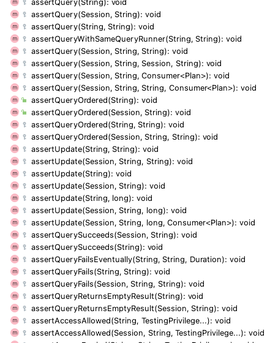

这里简单说几个平常测试时会常用的：

- assertQuery，测试 SQL 的结果是否与预期的一致。
- assertQueryFails，测试 SQL 返回的异常是否与预期的一致
- assertUpdate，测试 SQL 的影响行数是否与预期的一致，如果不传则代表不校验行数，比如执行 DROP 的时候

最后我们看一个测试：

```java
@Test
public void testDemo()
{
    Session session = testSessionBuilder()
            .setCatalog("mysql")
            .setSchema("test_database")
            .build();
    assertQuery(session, "SELECT 1+1", "SELECT 2");
}
```

完整的代码，可以参考 **presto-mysql/src/test/java/com/facebook/presto/plugin/mysql/TestMySqlIntegrationSmokeTest.java** 或者其他 IntegrationSmokeTest


### 3.3 自定义集成测试

因为我们继承了 AbstractTestIntegrationSmokeTest -> AbstractTestQueryFramework

这样的话，我们使用 mvn test 的时候，也会把 AbstractTestIntegrationSmokeTest 里面的测试 case 给跑一遍，如下

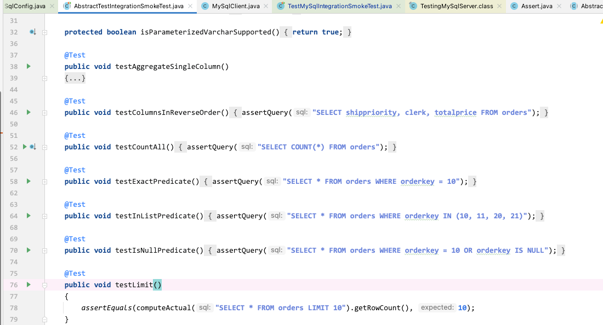

那么，如果我不想这样呢？我只想构建我自定义的集成测试呢？

流程还是差不多，我们继续要借助 QueryRunner 然后集成测试中的一些 init、destroy 就需要自己来实现。

而且我们是可以把 QueryRunner 拿过来赋值到我们的一个引用中的，这样我们可以灵活控制测试

比如以下代码

```java
public class TestDorisSimpleSmokeTest
{
    // 省略，与 TestMySqlIntegrationSmokeTest 类似

    @BeforeTest
    public void init() throws Exception {
        dorisQueryRunner = createDorisQueryRunner(mysqlServer, ORDERS);
    }

    ...

    private String testSql(@Language("SQL") String sql) throws Exception {
        MaterializedResult result = dorisQueryRunner.execute(sql);
        return result.getMaterializedRows().toString();
    }

    @Test
    public void testDemo()
            throws Exception
    {
        assertThat(testSql("SELECT 1+1"))
                .isEqualTo("[[2]]");
    }
}
```

## 4 总结

本文简单讲解了 Presto Connector 开发流程，比如以我的理解是先从配置开始，然后找入口、找核心功能、细节功能，最后再是测试和运维等等。

然后描述了 Connector 的工程结构大概是什么样的，都需要有哪些文件。

最后我们开发完 Connector 了，如何在本地进行工程测试，如果是靠那种打包发到 Presto 集群中进行部署测试，那样效率就太低了，所以一定要学习如何使用 presto-tests 包进行本地集成测试。
