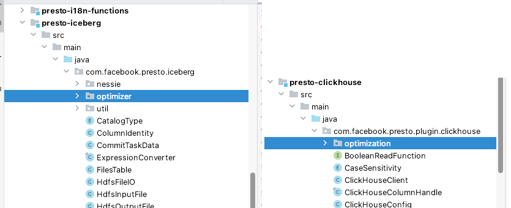
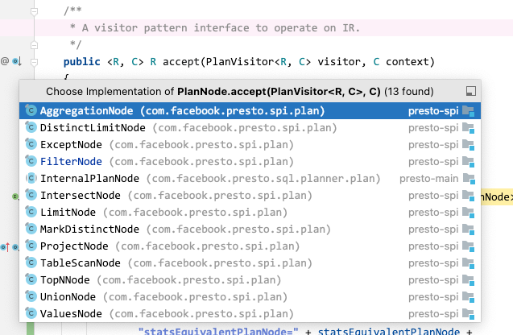
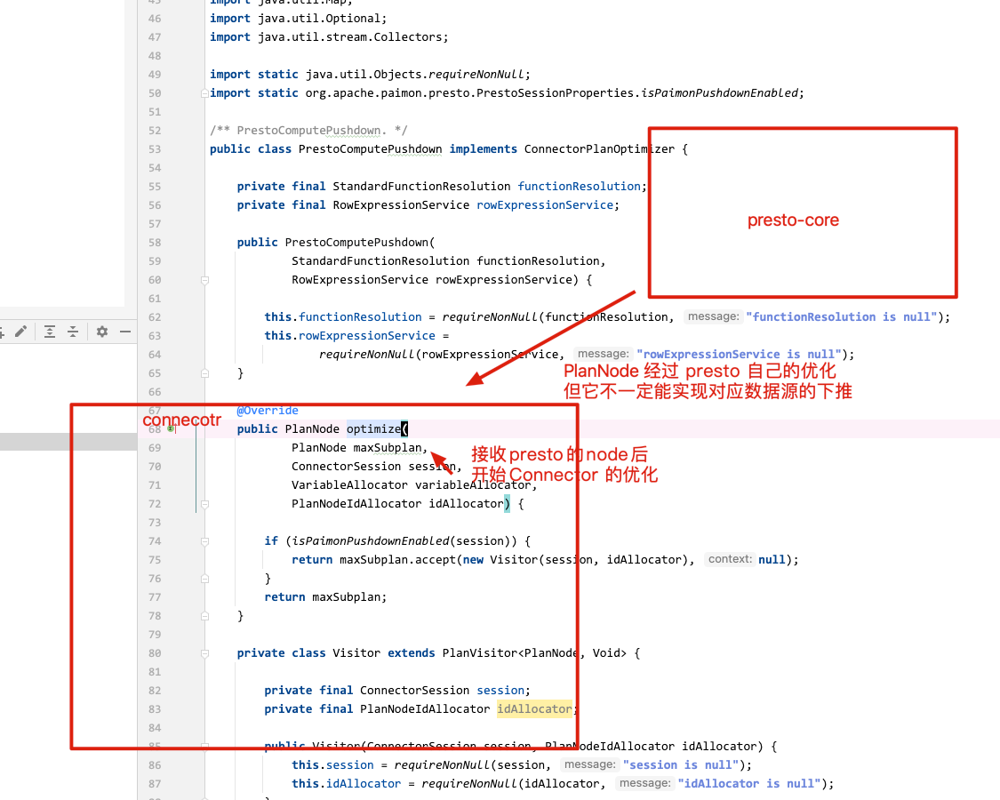

# Presto如何实现查询下推_引

## 参考

我们先参考其他 Connector 中的大概代码布局，发现大部分 Connector 中，都有一个 optimizer 的相关实现，参考发现，相关的查询优化逻辑大部分都是在这里面来实现。

这里需要明确，到这一步的时候 SQL 已经经过 Presto 核心的一些相关优化了，这里面属于对应 Connector 的专属优化。

以接下来要举的例子，比如我的查询在 Presto Coordinator 中已经完成了优化，但是谓词下推的优化还不能正常推到对应的引擎中(Redis、Clickhouse、以及 Paimon 等，简单举例，如果不下推下去的话，就相当于把所有的数据都查到 Presto 中，然后在 Presto 引擎中再去过滤、计算等等)，此时需要就查询计划按照对应引擎允许下推的方式重新优化。

(注意！这里跟包名没关系，只是约定都使用 optimizer 等)




## 关键接口

Presto 中，需要实现 ConnectorPlanOptimizerProvider 接口，即可完成对应 Connector 的查询计划的逻辑优化与物理优化。

我们实现对应的查询优化即完成前面说的下推，这里我们可以先思考一个问题，是在逻辑优化中实现，还是在物理优化中实现呢，而且看了 Presto 源码中其他引擎的 Connector 的优化时，在逻辑优化与物理优化的实现中都有，那么它们的区别是什么呢？

```java
public interface ConnectorPlanOptimizerProvider
{
    /**
     * The plan optimizers to be applied before having the notion of distribution.
     */
    Set<ConnectorPlanOptimizer> getLogicalPlanOptimizers();

    /**
     * The plan optimizers to be applied after having the notion of distribution.
     * The plan will be only executed on a single node.
     */
    Set<ConnectorPlanOptimizer> getPhysicalPlanOptimizers();
}

```

## 关键实现

参考其他的优化实现中发现，大部分都是对入参的 PlanNode 进行 visit 操作，流程则用以下伪代码表示：

```java
public class PrestoComputePushdown implements ConnectorPlanOptimizer {
    ...
    ...
    
    @Override
    public PlanNode optimize(...) {...}
    

    private class Visitor extends PlanVisitor<PlanNode, Void> {
        ...
        
        @Override
        public PlanNode visitFilter(...) {...}
        
        @Override
        public PlanNode visitAggregation(...) {...}
        
        ...
    }
}
```

关键的优化操作，就在比如 visitFilter、visitAggregation 等相关方法实现，根据方法名的不同我们可以发现是对不同的场景进行专属优化，比如有过滤、聚合、投影、TopK、去重等等。

了解更多的信息，可以参考相关接口源码 `com/facebook/presto/spi/plan/PlanVisitor.java`。


## 下推实现思路

以最近实现的 presto-paimon-connector 的例子举例，详情代码如下：

[PrestoComputePushdown.java](https://github.com/apache/incubator-paimon-presto/blob/main/paimon-presto-common/src/main/java/org/apache/paimon/presto/PrestoComputePushdown.java)

这里就不贴代码了，主要来讲几个实现中的关键点。

### 构造方法

在构建优化时，会根据我们的需要初始化一个辅助工具。比如在我们这个优化中，就用到了 StandardFunctionResolution 和 RowExpressionService。

- StandardFunctionResolution 是一个服务接口，它在Presto中用于处理与函数解析相关的操作。在SQL查询和表达式处理中，经常需要对函数（如聚合函数、数学函数、字符串函数等）进行解析和处理。
- RowExpressionService 是另一个关键服务，它在处理行表达式（Row Expressions）时发挥作用。行表达式是Presto内部用于表示列、常量、函数调用等的一种结构。在查询计划中，几乎所有的操作（如过滤、投影、聚合等）都可以表示为对行表达式的操作。

### 入口方法 optimize

谓词下推，也算是查询计划优化的一种，所以我们在继承 ConnectorPlanOptimizer 接口后，需要实现 optimize 方法它就是我们查询计划优化的入口。

通过也会进行参数相关的联动配置，比如我根据 Session 中的配置来随时控制是否开启这个优化等等，都可以在这个入口方法中进行，起到筛选，优化准备，的一些操作。

核心就在 optimize 方法的四个入参。

1. PlanNode maxSubplan，代表当前正在优化的查询计划的一部分或整个查询计划；
2. ConnectorSession session，当前查询会话的上下文信息。这包括用户身份、时区、语言设置、会话特定的配置和属性；
3. VariableAllocator variableAllocator，负责分配和管理查询计划中使用的变量。在构建或修改查询计划时，可能需要创建新的变量；
4. PlanNodeIdAllocator idAllocator，负责为查询计划中的每个节点分配唯一的标识符（ID）。每个 PlanNode 在查询计划中都有一个唯一的ID，以区分不同的节点；

### 开始优化

优化主要是对 PlanNode 进行操作，所以优化的思路可以按照 Parser 的 Visitor 模型来理解，核心就是找到 Node 然后进行各种操作。

操作的方式一般分为两种，可能还有其他的技法，我目前只发现了两种。

#### PlanNode 中的 accept 方式

在 Presto 中解析 SQL 后，执行计划会使用 PlanNode 抽象类来表示 SQL 中的各个节点。

先用我简单的理解描述一下这个方法，accept 方法就是访问者设计模式（Visitor Pattern）的一部分。这种模式在处理对象结构（如树或图）时非常有用，特别是当你需要对这些结构进行操作或遍历时。一般我们的查询计划都是一个树形结构，所以我们经常要在树中遍历，迭代，此时 accept 方法就特别管用，因为它每个节点都可以接受一个访问者并将其传递给其子节点。

同时，我们有时候可能只是想到达某个节点，因为树形结构的特性，我们没法一把子直接就能搂到某个节点(这里需要有点解析器，解析SQL到AST的知识，如果不理解可以先补补)，此时我们也可以通过访问者模式，在不修改节点类的情况下，到达某个节点然后进行节点的新增、修改、改写等等操作。

更重要的一点，就是解耦了数据结构的操作，因为这样的方式允许将数据结构（如查询计划树）与对它们的操作（如优化、转换）解耦。这样，可以在不改变节点类的情况下添加新的操作，大部分 SQL 都会这样来做优化。

此时我们再看下面的方法源码，就好理解了。

```java
@Override
public PlanNode optimize(
        PlanNode maxSubplan,
        ConnectorSession session,
        VariableAllocator variableAllocator,
        PlanNodeIdAllocator idAllocator) {
    if (isPaimonPushdownEnabled(session)) {
        return maxSubplan.accept(new Visitor(session, idAllocator), null);
    }
    return maxSubplan;
}

...
...
...

/**
 * The basic component of a Presto IR (logic plan).
 * An IR is a tree structure with each PlanNode performing a specific operation.
 */
public abstract class PlanNode {
    ...
    ...
    
    /**
     * A visitor pattern interface to operate on IR.
     */
    public <R, C> R accept(PlanVisitor<R, C> visitor, C context) { return visitor.visitPlan(this, context);
    
    ...
    ... 
}

```



#### 计划重写 ConnectorPlanRewriter 抽象类方式

经过前面的介绍，我们知道核心就是要遍历 PlanNode 然后进行优化。此时我们在看看另外一种实现：

```java
public PlanNode optimize(
        PlanNode maxSubplan,
        ConnectorSession session,
        VariableAllocator variableAllocator,
        PlanNodeIdAllocator idAllocator)
{
    return rewriteWith(new Rewriter(session, idAllocator), maxSubplan);
}
```

这个 rewriteWith 方法是什么呢？对应源码在这 `src/main/java/com/facebook/presto/spi/ConnectorPlanRewriter.java`，我这里就不贴代码了。感兴趣的可以自己去看。

我讲一些个人的简单薄见：核心都是用 accept 方法去迭代，只是 ConnectorPlanRewriter.rewriteWith 计划重写方法提供了一些默认实现，相当于提供了一个通用的重写框架，简化了遍历和修改的操作，实现会削微简单一些。

### 一个疑问

比如我现在要优化 `select * from where a=1;` 这个 a=1 能下推到对应引擎或存储中去，而不是全搂到 Presto 进行，这算什么优化呢？对应 visit 方法的时候，是什么呢？


### 优化实现

基于以上的疑问，


