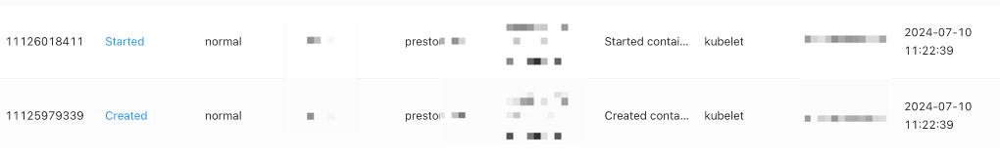
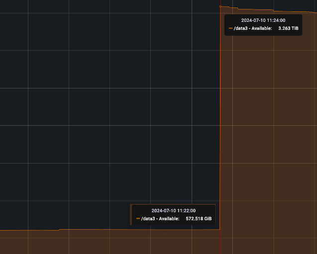
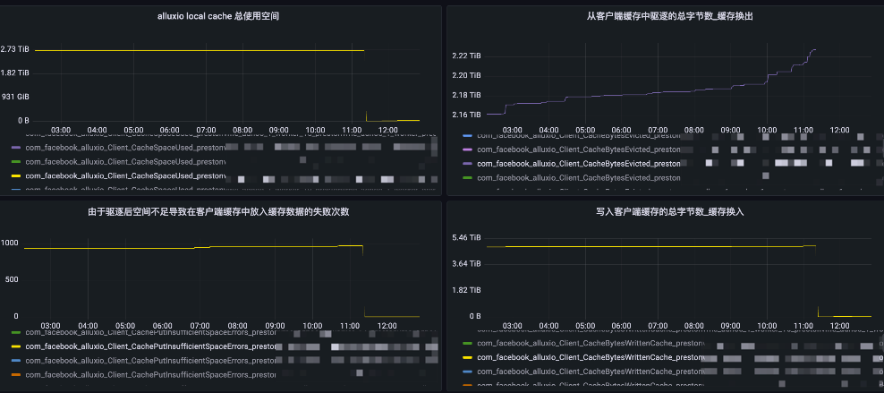
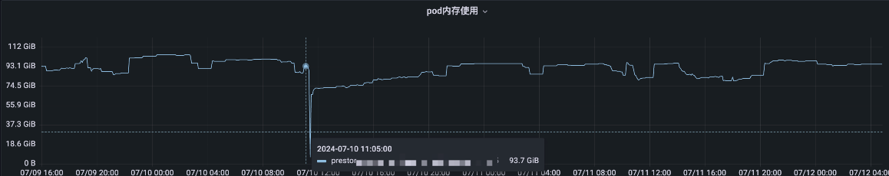
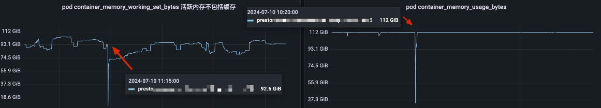
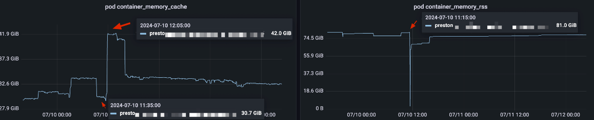
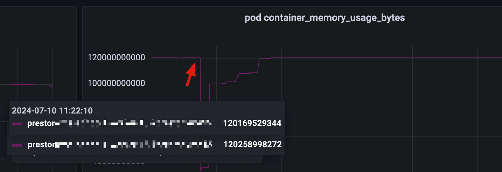
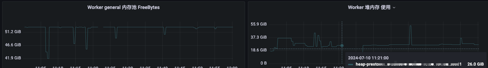
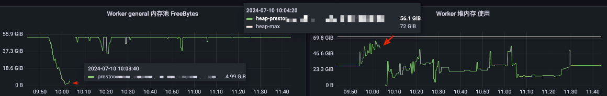

# Presto排查Worker宕机问题_缓存与内存问题排查_上

[返回首页](../README.md)

---

## 现象

近期有出现 Presto worker 挂掉的情况，K8s 里有看到重新启动的事件。



因为是 k8s 部署的 presto 环境，可以看到最后 pod 挂掉的日志，如下：

```
2024-07-10T10:26:32.414+0800    ERROR   20240710_022631_00635_3qevr.1.0.32-111-56       

alluxio.client.file.cache.NoExceptionCacheManager       
Failed to get page PageId
    {ileId=8ac79973285671fa729d832614afaf50, PageIndex=5}, 
    offset 0 cacheContext 
    CacheContext{
        cacheIdentifier=null, 
        cacheQuota=alluxio.client.quota.CacheQuota$1@1f, 
        cacheScope=CacheScope{id=.}, 
        hiveCacheContext=null, 
        isTemporary=false
    }

...
...
...

java.lang.RuntimeException: java.lang.InterruptedException
        at alluxio.client.file.cache.TimeBoundPageStore.get(TimeBoundPageStore.java:101)
        at alluxio.client.file.cache.LocalCacheManager.getPage(LocalCacheManager.java:711)
        at alluxio.client.file.cache.LocalCacheManager.get(LocalCacheManager.java:503)
        at alluxio.client.file.cache.CacheManagerWithShadowCache.get(CacheManagerWithShadowCache.java:67)
        at alluxio.client.file.cache.NoExceptionCacheManager.get(NoExceptionCacheManager.java:105)
        at alluxio.client.file.cache.LocalCacheFileInStream.localCachedRead(LocalCacheFileInStream.java:186)
        at alluxio.client.file.cache.LocalCacheFileInStream.bufferedRead(LocalCacheFileInStream.java:144)
        at alluxio.client.file.cache.LocalCacheFileInStream.readInternal(LocalCacheFileInStream.java:242)
        at alluxio.client.file.cache.LocalCacheFileInStream.positionedRead(LocalCacheFileInStream.java:287)
        
...
...
...

2024-07-10T11:13:37.231+0800    ERROR   20240710_031333_01407_3qevr.16.0.1-2-91 alluxio.client.file.cache.NoExceptionCacheManager       Failed to get page PageId{FileId=3b71d14bcc5c6ff6af8afdff1243b676, PageIndex=381}, offset 530484 cacheContext CacheContext{cacheIdentifier=null, cacheQuota=alluxio.client.quota.CacheQuota$1@1f, cacheScope=CacheScope{id=.}, hiveCacheContext=null, isTemporary=false}
java.lang.RuntimeException: java.lang.InterruptedException
        at alluxio.client.file.cache.TimeBoundPageStore.get(TimeBoundPageStore.java:101)
        at alluxio.client.file.cache.LocalCacheManager.getPage(LocalCacheManager.java:711)
        at alluxio.client.file.cache.LocalCacheManager.get(LocalCacheManager.java:503)
        at alluxio.client.file.cache.CacheManagerWithShadowCache.get(CacheManagerWithShadowCache.java:67)
        at alluxio.client.file.cache.NoExceptionCacheManager.get(NoExceptionCacheManager.java:105)
        
        ... 60 more


java.lang.OutOfMemoryError: Java heap space
Dumping heap to java_pid7.hprof ...
Heap dump file created [38170670829 bytes in 61.779 secs]
Terminating due to java.lang.OutOfMemoryError: Java heap space
```

从上述日志可以看出几个关键问题：

1. 首先出现了缓存读取异常：
   - Alluxio 缓存管理器无法获取页面数据
   - 抛出了 InterruptedException 异常
   - 这表明在读取缓存数据时被中断
2. 最终导致进程崩溃的是内存溢出：
   - 出现 Java heap space OOM 错误
   - 生成了约 38GB 大小的堆转储文件
   - 这说明 JVM 堆内存已经耗尽
3. 流程理解：
   - 从缓存读取异常到最终 OOM
   - 可能是由于缓存读取失败导致数据积压在内存中
   - 或者是在处理缓存异常时消耗了过多内存

这个错误初步最开始的信息看着像 Alluxio 无法获取缓存数据，但是其实是因为内存不足而导致的 OOM，引发的 Worker 宕机。

我们再继续查看 K8s 的 Pod 信息，发现确实在 11:22:39 这个时间点左右重新启动了一次。

```
Namespace:    presto

***
***
***

Start Time:   Wed, 12 Jun 2024 19:35:44 +0800

***
***
***

Containers:

    ***
    ***
    ***
    ***
    State:          Running
      Started:      Wed, 10 Jul 2024 11:22:39 +0800
    Last State:     Terminated
      Reason:       Error
      Exit Code:    3
      Started:      Tue, 25 Jun 2024 16:05:54 +0800
      Finished:     Wed, 10 Jul 2024 11:22:36 +0800
    Ready:          True
    Restart Count:  3
```

## 缓存问题思考

因为在错误日志里，看到有 `alluxio.client.file.cache.NoExceptionCacheManager  Failed to get page` 等相关信息，初步是缓存空间问题，比如空间用满了没有正常换入换出导致程序挂掉。

(但是仔细一想，空间不够应该是会持续报错，不至于会导致挂掉，所以暂时排除了这个想法)

这里是目前的缓存配置
```
# data
cache.enabled=true
cache.type=ALLUXIO
cache.base-directory=file:///presto_cache/data
cache.validation-enabled=false
cache.alluxio.max-cache-size=2900GB
```

因为是挂了 pv pvc 来当做缓存磁盘使用，查看对应物理机的磁盘监控没有用满的情况，最后的峰值还有 500G 的空闲空间。

下图的500多G是磁盘空闲空间，后面上涨到3.2T左右是代表有 POD 重启了，释放了磁盘空间。



如果假设缓存有问题，那么应该查看它的换入换出监控，如果只有进没有出的，那就可能是缓存有问题。

Worker 的缓存空间配置的是 2.83T 使用，磁盘是有约 3.5T，查看对应挂掉 pod 的换入换出监控，发现是有正常的换入换出的，并且缓存空间最高才使用到 2.73T，还远远没有达到上限。



所以，可以排除是缓存空间问题。这里指的缓存空间问题，主要是指，缓存把磁盘空间用满了，触发了 K8s 的驱逐的问题。

> 这里补充一下，为什么会有这个怀疑，因为当前维护的集群早期会经常有磁盘空间不够 K8s 把 Pod 驱除而出现的 Worker 挂掉的情况，所以会往这个方面怀疑。

## 内存问题思考

所以我们应该从日志的最后一个信息入手排查问题，可是这里有个尴尬的地方，没有配置 K8s 的相关转储配置，所以每次 OOM 挂掉后，即使生产了 dump 文件，就没真正的存下来。(算是一个技术债，后续会调整)

```
java.lang.OutOfMemoryError: Java heap space
Dumping heap to java_pid7.hprof ...
Heap dump file created [38170670829 bytes in 61.779 secs]
Terminating due to java.lang.OutOfMemoryError: Java heap space
```

接下来只能从其他角度入手分析，首先说一下 Presto Worker 在 K8s 环境中部署的内存配置

内存配置如下：

- Pod 内存 request limit 均配置的 112G
- Presto Worker 堆内存配置的 72G
- Presto Worker Memory Pools 由默认的两个缩减为一个 General Pool 配置为 53G
 
Pod 层面的内存使用







首先从 container_memory_usage_bytes 角度来看，就是内存用超过 112G 然后 OOM 挂掉了。




Presto Worker 应用层面的内存使用

查看当时应用层面的监控，内存池和堆内存的余量都比较充足。

内存池是直接发生了采集中断，堆内存是使用了 26G 然后也中断 (可以判断为因为 Worker 挂了，所以监控数据没有采集到)



因为这个 pod 的应用采集数据不太明显，我们再看另外一个的，可以明显发现，内存池用光，堆内存用满，然后也是会出现监控中断，挂掉的情况。



查阅 K8s 文档，可以知道，内存的监控指标含义如下。

```
container_memory_cache 表示容器使用的缓存内存。
container_memory_mapped_file 表示容器使用的映射文件内存。
container_memory_rss 表示容器的常驻内存集（Resident Set Size），即实际使用的物理内存量。
container_memory_swap 表示容器使用的交换内存量。
container_memory_usage_bytes 表示容器当前使用的内存量，包括常驻内存和缓存，**缓存部分往往会有很多处于空闲**。
container_memory_working_set_bytes 表示容器的工作集，即容器当前活跃使用的内存量，不包括缓存。
container_memory_max_usage_bytes 表示容器历史上使用过的最大内存量。
container_memory_failcnt 表示容器内存失败计数，即无法分配所需内存的次数。
container_memory_failures_total 表示容器内存分配失败的总次数。
```

从以上 pod 内存监控来看。在对应宕机的时间点前后

- container_memory_rss  81.0G`
- container_memory_cacahe 31.3G

这2个内存加起来，可以理解为我container使用的内存，81.6+34.9=116.5 超过了 pod 的 112 G，所以可以判断为是内存不足导致的挂掉。

## 初步问题结论

当给 Presto 开启了缓存使用后，相当于将 Presto 由原来的只读类型 OLAP 引擎 (我们自身业务限定，Presto 只定位查询，Hive 和 SparkSQL 负责写)，改为 `读` `写` 类型OLAP 引擎。

在 K8s 环境中，会出现又读又写的场景，此时会大量使用 page cache，因为一个 Pod 只有100多G，Worker 的堆内存值有 72G，相当于留给 Pod 的 PageCache 也就在 30G 左右的范围，同时 Presto 的查询结果返回，与查询缓存输入写入，都是同步操作，所以 PageCache 会容易出现短暂的高峰使用，然后引发内存不足导致 Pod 被驱逐。


## 后续TODO

1. 为什么会出现 Alluxio 缓存读取异常
2. 为什么 JVM 堆内存监控显示使用正常，但最终还是出现了 OOM
3. 是否存在内存泄漏的可能
4. 一个pod中，Pagecache的可用阈值多少是合理的