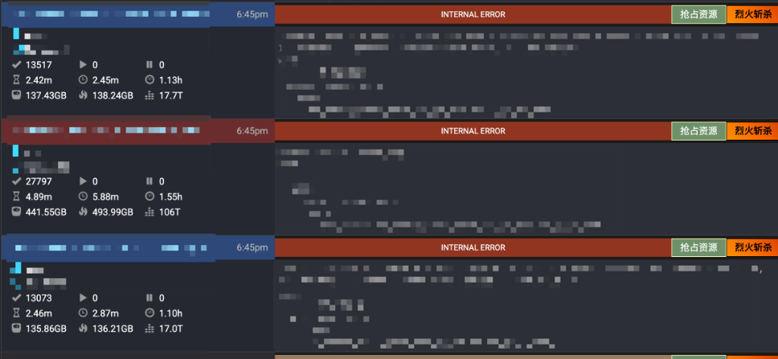
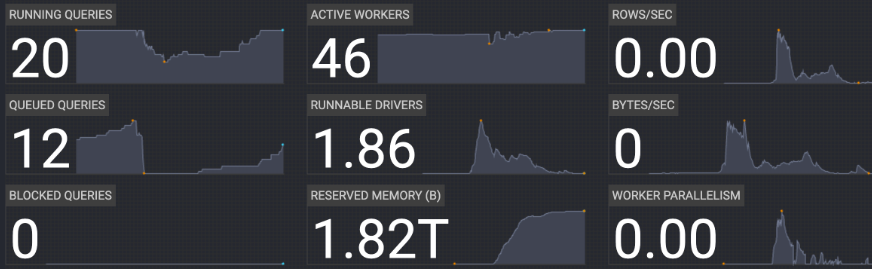
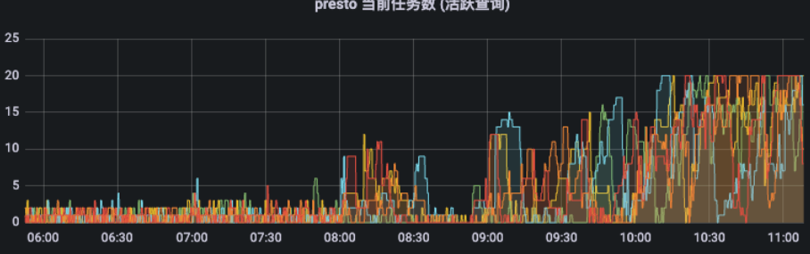
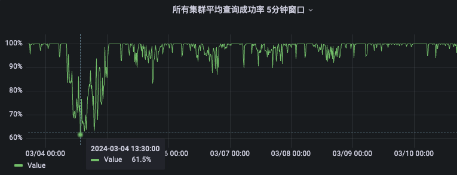
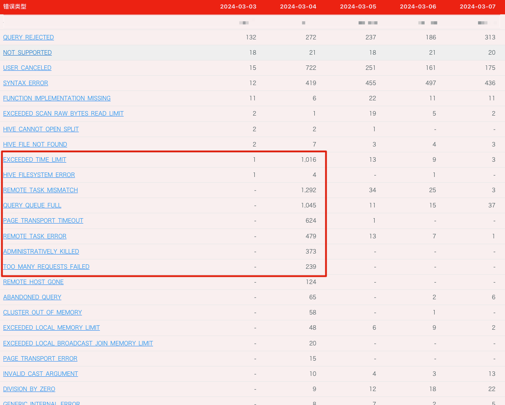
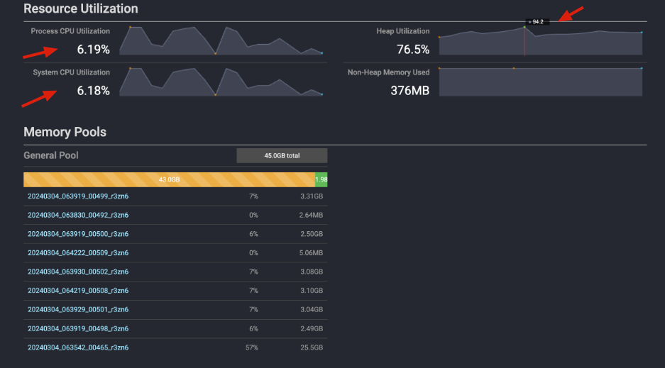
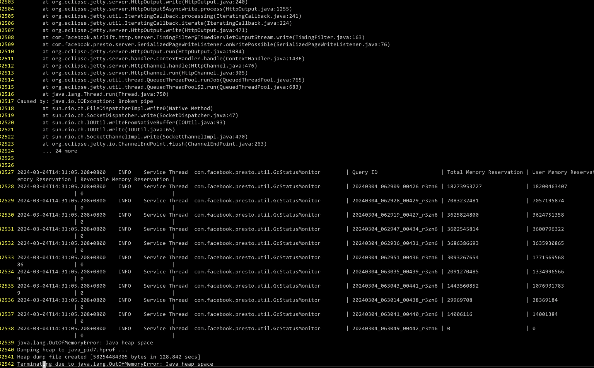
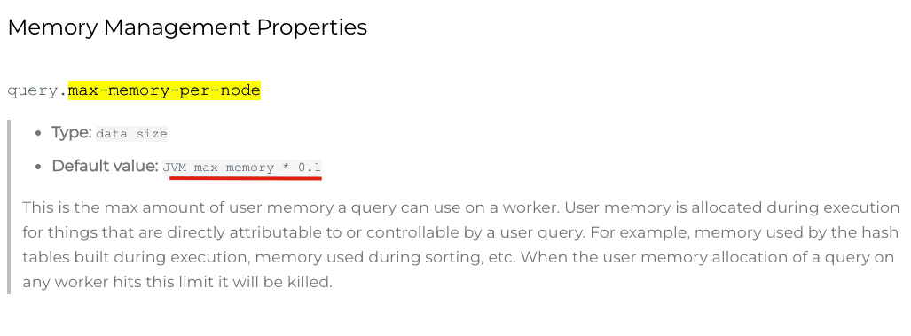
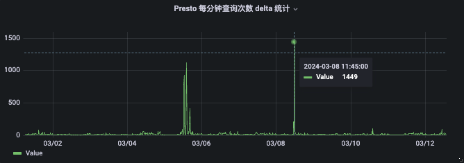

# Presto的Worker为什么会挂掉

## 背景

平常在维护 Presto 集群时，经常会出现跑了某个 SQL 后会挂掉一个或多个 Worker，因为 Presto MPP 架构的特性，与这个 Worker 相关的 SQL 都会挂掉。

正好这里有一次类似的情况，借着这次问题的排查，我们一起学习一下 Presto 的 Worker 为什么会挂掉，以及锻炼排查问题的能力。

### 线索1 频繁出现 INTERNAL_ERROR 错误

这里有代表性的错误，但全是这个错误，但还有其他错误。



对应错误信息。

```
com.facebook.presto.spi.PrestoException: Could not communicate with the remote task. The node may have crashed or be under too much load. This is probably a transient issue, so please retry your query in a few minutes. 
	at com.facebook.presto.server.remotetask.ContinuousTaskStatusFetcher.updateTaskStatus(ContinuousTaskStatusFetcher.java:290)
	at com.facebook.presto.server.remotetask.ContinuousTaskStatusFetcher.success(ContinuousTaskStatusFetcher.java:218)
	at com.facebook.presto.server.remotetask.ContinuousTaskStatusFetcher.success(ContinuousTaskStatusFetcher.java:67)
```

### 线索2 Worker 频繁重启



### 线索3 查询量上升

观察核心监控数据，确实有点像异常情况，这里思考一下是真的查询量暴涨了，还是异常了呢？



## 提出假设

- 往好的方面想，就是查询量比较大
- 往坏的方面想，是有异常SQL

## 验证假设

如何来验证这些假设呢？

可以查看一下 `成功率`，是不是降低了，如果是降低了那证明有异常的 SQL。

然后看一下 `错误查询分类` 都在频繁出现了哪些错误。

> 这个假设是事后想的了，当时在解决这个问题的时候，我没有这样想，当时的思路有点懵逼，没有冷静。
> 同时也可以想想，这个假设流程有没有 `问题` ？


### 查看成功率



### 查看错误分类




## 第一次假设结论

成功率大幅度下降，而且一些平常不怎么出现的错误，也是往常的几百甚至上千倍量，比如 REMOTE_TASK_MISMATCH，REMOTE_TASK_ERROR 这些错误，都可以理解为，`集群不稳定，比如 Worker 挂掉了，在这个 Worker 中的所有查询都会挂掉`。

## 再次假设

假设是某些异常 SQL 导致的，我该如何排查呢？

我们知道，比如某个 Worker 因为这类问题挂掉，在 Worker 中所有查询都会受影响，而且挂掉的 SQL 会出现同样的错误，Presto 在这里不会明确指出来是因为某某 SQL 的什么问题导致 Worker 挂掉的。

我当时的想法是，继续查看 UI 上的实时监控和 Worker 的监控，看看有不有什么线索。

### UI 实时监控

UI 中因为的查询量很大，至少有往常的 10~20 倍，一直盯着看确实没看出明确的线索。

唯一看到的线索就是 `有 SQL，算到某个百分比后，大家都卡着不动，然后会挂掉一些 Worker，紧接着一些 SQL 又失败掉，如此反复`，只是这个现象反复，但是还没找到很明确的 SQL。

### Worker 监控

Worker 的监控中发现，跑的 SQL 很多，但 CPU 用的不多，内存却用的很满。

从使用趋势来看，内存有随时用满的情况。

> 从这里的现象来看，也比较符合 SQL 查询比较多的情况，此时还没有明确往其他方向想。




## 暂停思考一下

根据前面的线索，其实排查到这思路已经是懵逼状态了，目前是知道有异常的SQL，但是没有找到问题的根源。

而且我前面的各种排查与假设，都是有一种过拟合的情况，比如根据错误分类判断问题，发现这种方式是禁不起考验的 `比如某个错误分类出现的次数较多，它有可能是被影响的结果，不一定是问题的原因`，错误分类它也是一个排查问题的方向，但是对于目前的问题，它不具备 `直接证明` 的能力，如果继续使用这种方式排查问题，只会加重误导自己。

```


如果是你碰到了这个情况，你会怎么思考和排查这个问题呢？


应该使用哪个指标，或者什么方式来 直接证明 问题呢？


```

## 最后排查 Worker 挂掉的原因

**经过讨论和沟通，我们对其中有一个点比较疑惑，Presto 是有自我保护功能的，就是当一个 SQL 超限时集群会自动 KILL 达到自我保护的效果，而不会是 Worker 挂掉导致集群不稳定，因为这是有点违背常识的，那么为什么这次会出现频繁的 Worker 重启呢(因为挂掉了，K8s 保护机制会自动拉起，我们看到的现象就是反复重启)。**

**(这里也可以这样理解，Presto 集群的默认配置，肯定是将集群调节在一个比较平衡的状态，就是能适应各类查询而且不至于会出现频繁宕机的情况，那么这里可以合理的怀疑，系统有Bug或者我们修改了配置)**

**问题排查到这应该是顺着线索往下走，查一下 Worker 为什么会挂掉，比如日志等等。**

这次排查的 Presto 是在 K8s 中部署的，可以理解一个 Worker 对应了一个 Pod。

那么一个 Worker 挂掉，此时在 K8s 中这个 Pod 就已经消失了，然后 K8s 会对它进行重启，此时因为没有配置那种异常信息重定向等等操作，所以就一直偷懒没有查这个问题，而且平常这个问题也不多，导致这次的问题没有头绪。

冷静的想了想，`因为异常，所以 Worker 挂掉，然后一批 SQL 继续受影响，如此反复，那么此时关键点就是排查 Worker 为什么挂掉。`

最后咨询了高手，在 Pod 重启时 (时间比较短的话)，可以使用命令查看上一次的日志信息。这里就不过多介绍，关键字为 `kubectl logs previous` 可以自行搜索。

查看到日志如下：




我们发现了几个重要的线索

1. 这是一个 Worker 出现了 OOM 打出来最后的异常信息；
2. 这个 Worker 当时有差不多 11 个查询在运行；
3. 这些查询最多的有占用 18G 内存；
4. 这些查询内存占用加起来差不多 40G 左右。

然后根据前面 Worker 的监控我们可以看到，堆内存配置了 64G，Worker里的那个工作内存池差不多是 40G。

最后根据 OOM 的错误可以判断，查询还在一直申请内存，然后 Worker 的堆内存不够了，所以 OOM 了，导致后续的 Worker 挂掉，查询挂掉。

那么为什么会 OOM 呢，我们是有配置一些内存限制的呀？

## 重新检查配置

> 这个时候第一思绪竟然不是觉得配置配的有问题，而是其他的问题，在经过沟通和查资料发现，最后确实是配置的不合理造成的。

贴一下 Presto 中的关键配置

```
presto
query.max-total-memory-per-node=40GB
query.max-memory-per-node=40GB

jvm
-Xmx64G
```

简单解释一下就是，Presto 的查询最多只能用 40G 内存，每个 Worker 的 jvm 堆内存配置的 64G。

我们查看一下官方文档




看到里面的建议是查询可用内存与 JVM 默认是 10 倍内存比，比如 64G JVM，那么这里 query.max-memory-per-node 配个5~6G，然后集群里跑 10 个查询是没问题的。

此时再看看我们的 40G 与 64G，顿时恍然大悟。

用前面那个 OOM 举例，最多的查询才用到 18G 按照限制它还可以继续申请，至少可以到 40G，但是 JVM 只有 64G，而且此时又有 10 多个 SQL 都是这样的情况，因为限制比较高，所有查询都可以往 40G 这个量级申请，所以 OOM 了，然后 Worker 挂掉，查询都挂掉。

不过这样也可以理解，如果按照社区的默认配置，那么对集群的运行是保守稳定的，这样 Worker 不会因为 OOM 挂掉，但是对大查询就不太友好，所以这个 40G 是对大查询友好的，如果这样超配内存限制就需要对资源进行比较精细的调度和管控，不然因为 MPP 的架构，频繁的 Worker 重启，对整体集群影响确实很大。

## 总结

这次的问题排查，有几个关键点收益很大：

1. 出现异常的时候一定要顺着问题查到关键位置，不要偷懒，比如我的关键位置就是频繁 Worker 重启，那么就需要查一下为什么 Worker 会重启。
2. 不管是已知现象，还是新的问题，都应该按照一个合理的流程排查一下，而不是误认为就是`查询量很大`，却不认为是`异常`。
3. 比如这个 OOM 导致的挂掉，其实我早就知道这个问题了，可是我为什么一直不排查呢？这里需要反思一下。
4. 在这个过程中 `降级、限流、回滚` 一个个常见的保护手段都没有，这里就不谈了，准备单独写一篇文章来介绍。

最后，根据内存超限配置的情况我们定位到了一些异常内存使用的 SQL，恰好那天这些 SQL 对应的应用也出现了问题一直在死循环的向 Presto 投递，我们将其都暂时后 Presto 恢复了正常。(这里我们的内存超配也是一个隐患点，以后会再单独出一篇文章来讲如何监控以及调优这块)。

所以结论就是，Presto 的 JVM max memory 与 query.max-memory-per-node 配置关系到你集群的一个服务模式，是应对大查询，还是小查询。

**这个配置的比例很关键，一定要慎重配置。**


## 重新思考这次问题的排查

回头来看看前面说的看监控、和查问题过拟合、以及直接证明问题的这个点，那么我应该看什么指标来定位以及证明问题呢？

我觉得应该是有一个监控，能够直接证明集群有问题的，比如我这次 SQL 查询量很大，不管是正常的请求 SQL 还是异常的，其实都应该属于 `异常` 情况，反过来想比如每 N 时间可以承受 M 个 SQL，假设有一天 M 直接放大了成千上百倍，即使都是正常的 SQL，那也肯定出问题了。

所以，此时我们就可以使用 `查询次数` 这个监控来直接证明这个问题。

> 这里确实在当时排查问题的时候没有意识到，算是为以后涨经验了。




