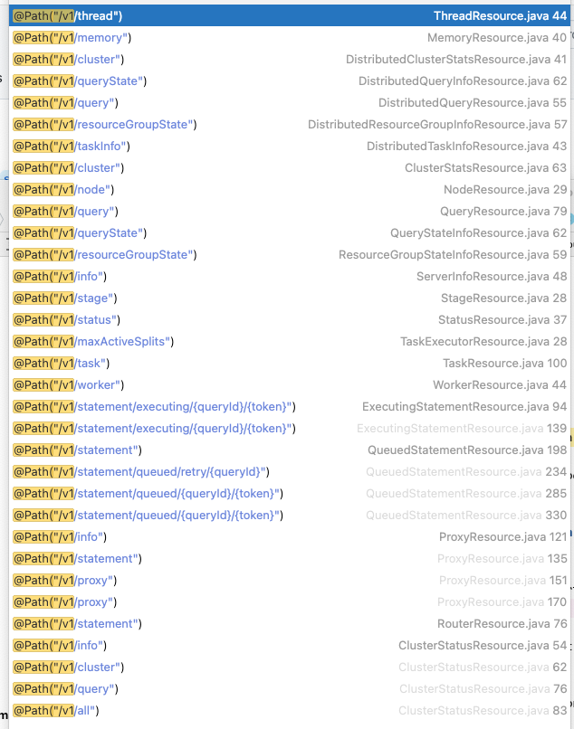
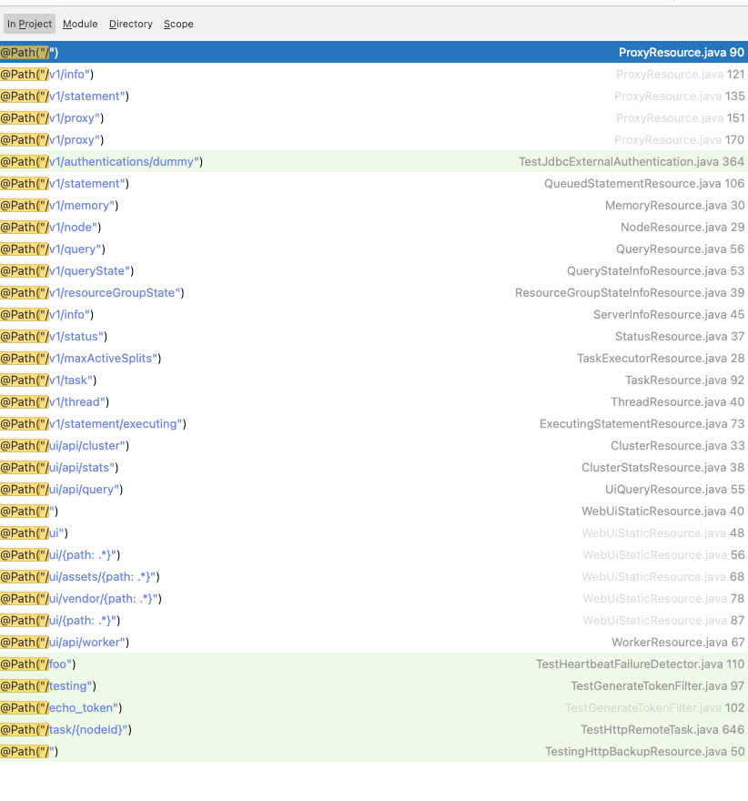

# 基础监控接口

[返回首页](../README.md)

---

Presto 和 Trino 自身是通过 Airlift 轻量级后端框架开发的，我们在 WebUI 上看到的一些简单的监控数据，都是有对应监控接口的，我们可以在这些监控接口中获得一些简单的数据用于监控。

## Presto



## Trino

Trino 这边会把一些 WebUI 里的接口，调整了一下，不过也大同小异。



## 接口简述

Presto 与 Trino 这些接口都差不多，会新开一片文章来介绍它们的区别，并使用一个实际的例子来演示，比如开发一个 网关 可以同时代理 Presto 和 Trino。

以下对它们进行简单的介绍。

### info

查看整体

```
http://0.0.0.0:8080/v1/info
```

查看整体状态

```
http://0.0.0.0:8080/v1/info/state
```

### node 节点

查看所有node信息

```
http://0.0.0.0:8080/v1/node
```

查看所有node中的失败信息

```
http://0.0.0.0:8080/v1/node/failed
```

### query 查询

所有查询概述，登录ui看到的那个列表

这个接口是受限制 Coordinator 对查询的保存数的，默认是只保存 100 个，如果还想看很多查询的相关信息，建议使用 Event Listener 的方式将查询的 query 持久化保存起来。

```
http://0.0.0.0:8080/v1/query
```

### task 任务

```
http://0.0.0.0:8080/v1/task
```

### service 服务

可以看到所有注册进来的节点，Coordinator 与 Worker。

```
http://0.0.0.0:8080/v1/service
```

### cluster 集群

整体状态

```
http://0.0.0.0:8080/v1/cluster
```

```
{
  "runningQueries": 0,
  "blockedQueries": 0,
  "queuedQueries": 0,
  "activeWorkers": 15,
  "runningDrivers": 0,
  "reservedMemory": 0.0,
  "totalInputRows": 518089265913,
  "totalInputBytes": 65099807693962,
  "totalCpuTimeSecs": 1810247
}
```

### status 节点状态

```
http://0.0.0.0:8080/v1/status
```

```
{
  "nodeId": "coordinator_bigdata_001",
  "nodeVersion": {
    "version": "0.203"
  },
  "environment": "bigdata_presto_cluster",
  "coordinator": true,
  "uptime": "4.14d",
  "externalAddress": "0.0.0.0",
  "internalAddress": "0.0.0.0",
  "memoryInfo": {
    "totalNodeMemory": "60129542144B",
    "pools": {
      "reserved": {
        "maxBytes": 25769803776,
        "reservedBytes": 0,
        "reservedRevocableBytes": 0,
        "queryMemoryReservations": {
          
        },
        "queryMemoryRevocableReservations": {
          
        },
        "freeBytes": 25769803776
      },
      "general": {
        "maxBytes": 34359738368,
        "reservedBytes": 0,
        "reservedRevocableBytes": 0,
        "queryMemoryReservations": {
          
        },
        "queryMemoryRevocableReservations": {
          
        },
        "freeBytes": 34359738368
      }
    }
  },
  "processors": 40,
  "processCpuLoad": 0.0062446155574938066,
  "systemCpuLoad": 0.033896111919435444,
  "heapUsed": 21368786312,
  "heapAvailable": 85899345920,
  "nonHeapUsed": 366581480
}
```

### 带账号密码的形式

```
curl -s -u 账号:密码 http://0.0.0.0:8080/v1/node
```

```
curl -s -u 账号:密码 http://0.0.0.0:8080/v1/service
```