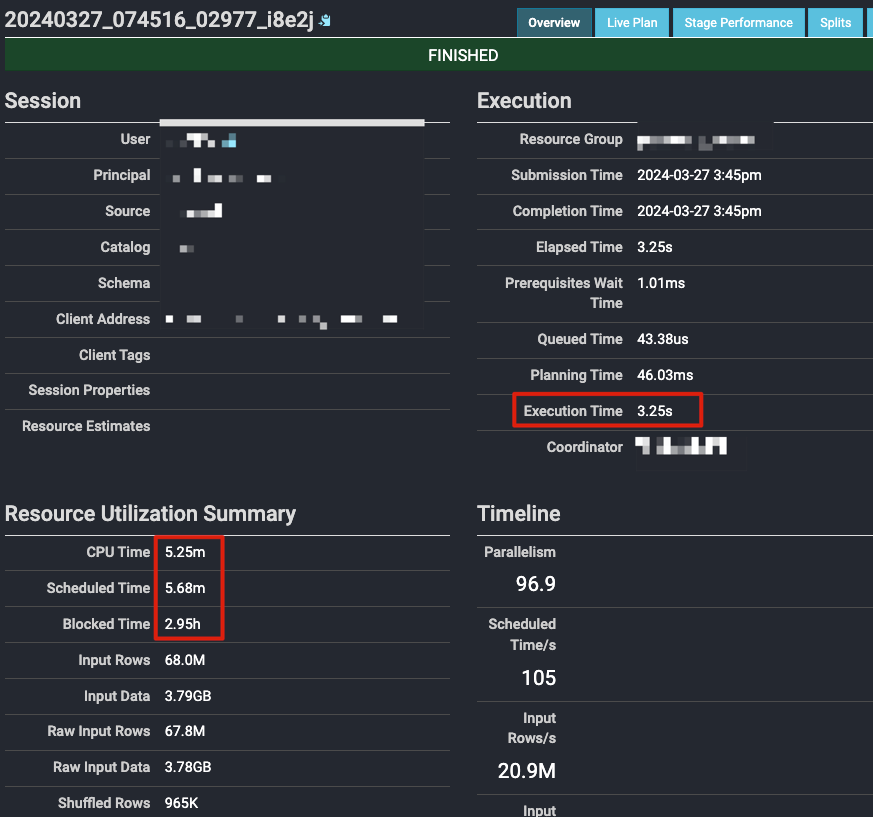
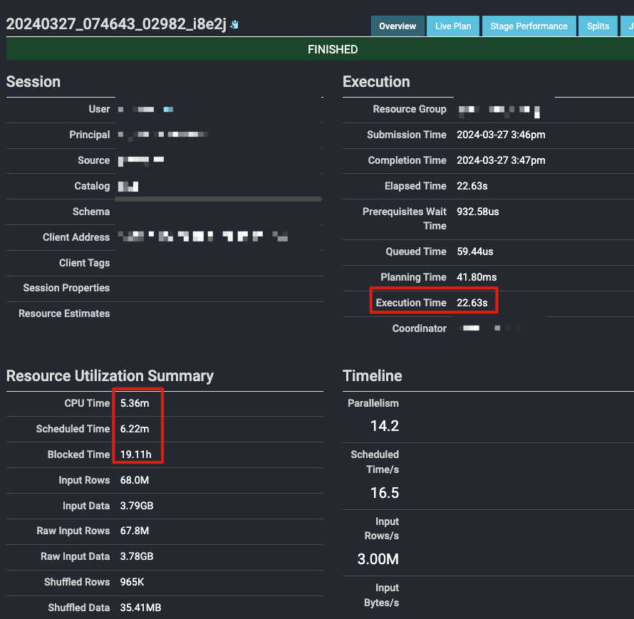
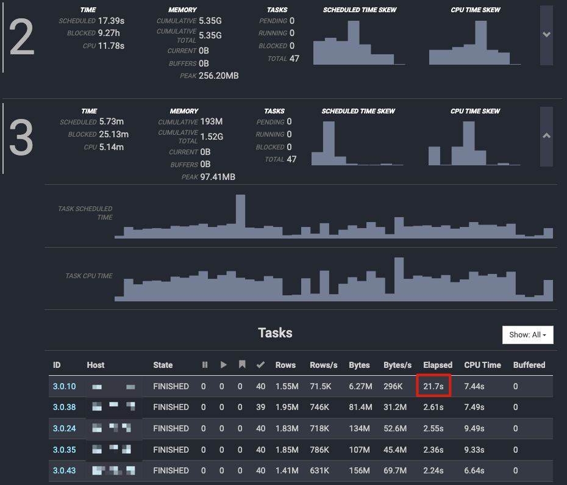
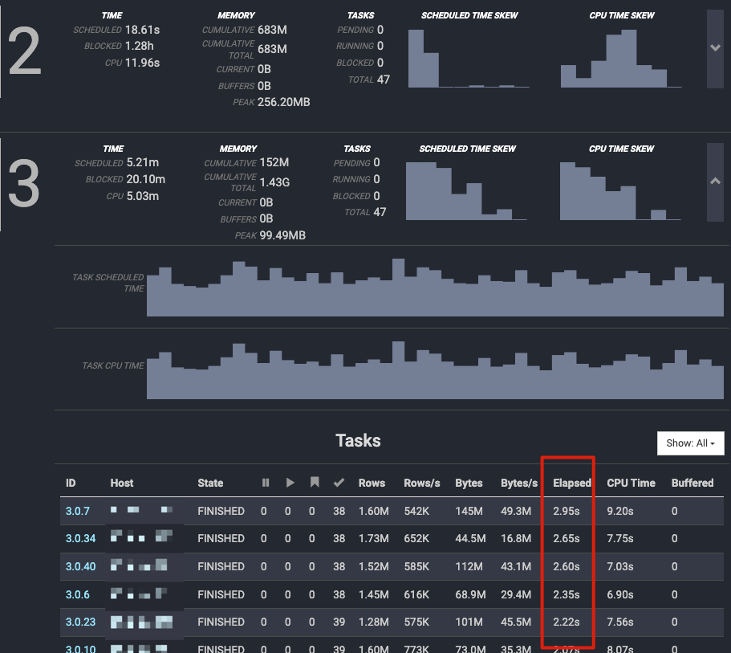
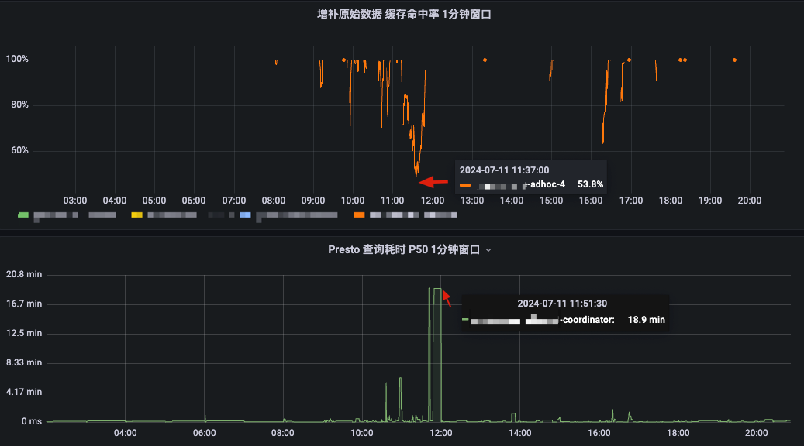

# 如何发现当前Presto集群的性能瓶颈_IO瓶颈

[返回首页](../README.md)

---

前面我们通过各种案例的方式讲解了一些常见的性能瓶颈，本文我们来讲讲 `IO瓶颈`。

## 场景一：缓存没有正确配置导致某个 Task 慢

屏蔽了敏感信息 SQL 如下

```sql
SELECT
  字段1,
  COUNT DISTINCT 字段2
FROM
  (
     table1
     LEFT JOIN table2 ON ***_id = ***_id
  )
WHERE
  ***
GROUP BY
  ***
ORDER BY
  1 DESC
LIMIT
  100
```

### 查询的简略信息

会发现跑起来有时候需要 20 多秒，有时候只有 3 秒。 

快的 3 秒左右：




慢的 20 秒左右：




### 查询的某个 Stage 中的 Task 信息

我们可以打开 Overview 页面的下面 Stage 部分，然后找找里面有不有 Elapsed 时间不一致的 Stage：

慢的




快的




### Task 中详细的数据

快的

```
        "operatorSummaries": [
          {
            "stageId": 3,
            "stageExecutionId": 0,
            "pipelineId": 2,
            "operatorId": 0,
            "planNodeId": "660",
            "operatorType": "ScanFilterAndProjectOperator",
            "totalDrivers": 7,
            "addInputCalls": 5043,
            "addInputWall": "95.68ms",
            "addInputCpu": "0.00ns",
            "addInputAllocation": "0B",
            "rawInputDataSize": "81.32MB",
            "rawInputPositions": 1945211,
            "inputDataSize": "81.32MB",
            "inputPositions": 1945211,
            "sumSquaredInputPositions": 810232961935,
            "getOutputCalls": 2030,
            "getOutputWall": "1.83s",
            "getOutputCpu": "1.76s",
            "getOutputAllocation": "0B",
            "outputDataSize": "31.78MB",
            "outputPositions": 954429,
            "physicalWrittenDataSize": "0B",
            "additionalCpu": "0.00ns",
            "blockedWall": "0.00ns",
            "finishCalls": 0,
            "finishWall": "0.00ns",
            "finishCpu": "0.00ns",
            "finishAllocation": "0B",
            "userMemoryReservation": "0B",
            "revocableMemoryReservation": "0B",
            "systemMemoryReservation": "0B",
            "peakUserMemoryReservation": "0B",
            "peakSystemMemoryReservation": "9.22MB",
            "peakTotalMemoryReservation": "9.22MB",
            "spilledDataSize": "0B",
            "runtimeStats": {
              ...
              ...
              ...
              "storageReadTimeNanos": {
                "name": "storageReadTimeNanos",
                "unit": "NANO",
                "sum": 95677553,
                "count": 35,
                "max": 10680828,
                "min": 743625
              },
              ...
              ...
              ...
            }
          }
```

慢的

```
        "operatorSummaries": [
          {
            "stageId": 3,
            "stageExecutionId": 0,
            "pipelineId": 2,
            "operatorId": 0,
            "planNodeId": "660",
            "operatorType": "ScanFilterAndProjectOperator",
            "totalDrivers": 8,
            "addInputCalls": 4124,
            "addInputWall": "20.87s",
            "addInputCpu": "0.00ns",
            "addInputAllocation": "0B",
            "rawInputDataSize": "6.21MB",
            "rawInputPositions": 1548937,
            "inputDataSize": "6.21MB",
            "inputPositions": 1548937,
            "sumSquaredInputPositions": 335570270649,
            "getOutputCalls": 1646,
            "getOutputWall": "22.54s",
            "getOutputCpu": "1.64s",
            "getOutputAllocation": "0B",
            "outputDataSize": "26.47MB",
            "outputPositions": 800714,
            "physicalWrittenDataSize": "0B",
            "additionalCpu": "0.00ns",
            "blockedWall": "0.00ns",
            "finishCalls": 0,
            "finishWall": "0.00ns",
            "finishCpu": "0.00ns",
            "finishAllocation": "0B",
            "userMemoryReservation": "0B",
            "revocableMemoryReservation": "0B",
            "systemMemoryReservation": "0B",
            "peakUserMemoryReservation": "0B",
            "peakSystemMemoryReservation": "2.15MB",
            "peakTotalMemoryReservation": "2.15MB",
            "spilledDataSize": "0B",
            "runtimeStats": {
              ...
              ...
              ...
              
              "storageReadTimeNanos": {
                "name": "storageReadTimeNanos",
                "unit": "NANO",
                "sum": 20868277488,
                "count": 32,
                "max": 20815882471,
                "min": 724840
              },
              
              ...
              ...
              ...
              
            }
          }
```

### 初步判断

从 Json 数据里可以很明显的看出，是 storageReadTimeNanos 慢了，它的含义就是从存储里读取数据的花费时间。

快的是 20868277488 = 20.86 秒，慢的是 95677553 = 0.09 秒，可以初步判断出，慢的是从远端存储里读的，缓存击穿了，快的是命中缓存了。

不过这样来判断，证据和理由不够直接和明确，因为就单纯一个读数据变慢了，会有多个因素。

### 进一步探索

虽然我们在前面已经知道了 Stage 里某些 Task 的执行耗时有倾斜，也知道是读数据变慢了。

但是，只通过一个读数据耗时指标，不具有说服力，所以我们再进一步我们找找其他证明线索。

#### 从查询执行计划来

**Scheduled Time 和 处理行数 差异**

```
快 SQL
Fragment 3 [SOURCE]
    CPU: 5.03m, Scheduled: 5.21m, Input: 67989968 rows (3.79GB); per task: avg.: 1446595.06 std.dev.: 215595.32, Output: 746944 
```

```
慢 SQL
Fragment 3 [SOURCE]
    CPU: 5.14m, Scheduled: 5.73m, Input: 67989968 rows (3.79GB); per task: avg.: 1446595.06 std.dev.: 572537.27, Output: 746944 
```

可以发现，快 SQL 的 Scheduled Time 比慢 SQL 的要少，同时 std.dev 也要少。

> Scheduled Time 的含义可以理解为除了计算以外的所有耗时。
> std.dev. 的含义可以理解为每个任务处理的数据行数的标准差。比如下面的含义就是每个任务平均处理 1446595.06 行，快 SQL 标准差为 215595.32 行，慢 SQL 标准差为 572537.27 行。

这里可以判断有调度不合理、数据倾斜、慢节点、缓存是否击穿等可能性。

#### 从缓存角度来看

因为这个问题主要是讲缓存方面，所以可以先暂时排除调度不合理、数据倾斜、慢节点等问题，这些会放到其他场景介绍。

我们看看执行计划里 Fragment 3 的读数据算子 ScanFilterProject 的信息：
  
```
快 SQL

- ScanFilterProject[table = TableHandle {connectorId='hive', connectorHandle='HiveTableHandle
{schemaName=***, tableName=***, analyzePartitionValues=Optional.empty}', layout='Optional
[***]'}, grouped = false, filterPredicate = ***, projectLocality = LOCAL] => [***]
        Estimates: {rows: 67798161 (4.61GB), cpu: 4339082304.00, memory: 0.00, network: 0.00}/{rows: ? (?), 
cpu: 8678164608.00, memory: 0.00, network: 0.00}/{rows: ? (?), cpu: ?, memory: 0.00, network: 0.00}

        CPU: 1.11m (21.33%), 
        Scheduled: 1.30m (23.04%),  <-- 这里
        Output: 34117843 rows (1.10GB)
        
        Input avg.: 214551.14 rows, Input std.dev.: 46.49%
        
        ***
        
        Input: 67798161 rows (3.78GB), Filtered: 49.68%
```


```
慢 SQL
- ScanFilterProject[table = TableHandle {connectorId='hive', connectorHandle='HiveTableHandle
{schemaName=***, tableName=***, analyzePartitionValues=Optional.empty}', layout='Optional
[***]'}, grouped = false, filterPredicate = ***, projectLocality = LOCAL] => [***]
        Estimates: {rows: 67798161 (4.61GB), cpu: 4339082304.00, memory: 0.00, network: 0.00}/{rows: ? (?), 
cpu: 8678164608.00, memory: 0.00, network: 0.00}/{rows: ? (?), cpu: ?, memory: 0.00, network: 0.00}

        CPU: 1.16m (21.81%), 
        Scheduled: 2.15m (32.58%), <-- 这里
        Output: 34117843 rows (1.10GB)
        
        Input avg.: 214551.14 rows, Input std.dev.: 46.49%
        
        ***
        
        Input: 67798161 rows (3.78GB), Filtered: 49.68%
```

在读数据的算子里，我们可以看到 CPU 的花费、数据输入量、数据的标准差基本都差不多，主要的区别在 Scheduled 上，这个算子对应 SQL 中的 table1。

我们此时再查看对应的缓存规则，发现 `没有对该表进行缓存`，最后将该表配置到缓存规则里即可。

#### 从监控角度来看

这个 SQL 当时的监控数据没有现场了，我们从近期的一个很典型的例子来看：

当缓存命中率下降时，查询耗时会上升，再去查看审计日志，可以发现确实是读了很多新表。



由此可以证明，两个监控是有正相关性的。

### 总结

1. 为什么有时快，有时慢？这是另外一个问题，因为是多集群且都开启了缓存，集群之前的缓存配置没有统一，出现了这个时快时慢的问题。
2. Scheduled Time，可以从字面理解 `调度耗时`，我的理解是除 CPU 计算花费以外的所有时间，比如在等待 split 或者 数据 input，可以假设有 IO 瓶颈，优先查 IO 方面的问题，但不一定是 IO 方面的问题，这里要分清楚。
3. 一般 CPU Time 与 Schedule Time 比值较大时，大概率 `有` IO 瓶颈，反之没有。(这里没有绝对，可以用这个方式提前假设排查)
4. std.dev，是处理行数的标准差，可以用来判断数据计算是否均衡，一般可能有分区策略、数据倾斜、调度不合理、预处理干扰、缓存IO等问题的可能性。
5. 缓存命中率下降时，查询耗时会上升。

