# 如何发现当前Presto集群的性能瓶颈

[返回首页](../README.md)

---

## 背景

Presto虽然提供了强大的WebUI，但在运维角度如何定位真正的慢查询、如何发现当前查询的性能瓶颈、如何分辨当前服务的业务对象是否适合在Presto中工作，成为了难题。

接下来我们以案例的方式，来探讨和挖掘如何应对这些问题，以及后续制定什么样的运维手段可以达到快速定位、排查、调优的效果。

## 前提

接下来的案例，应该是站在更高的角度去看待它，比如业务场景角度，比如架构角度。

目的是，我们不应该将Presto定位成OLAP银弹，而是寻找它更适合的业务场景，排除那些不适合的，使其可以快速失败，或者拦截。

## 不适合的场景

根据日常维护的经验，和对架构的理解，以下场景是Presto不适合的：

- 高并发场景
- 在线业务数据处理
- 低延迟数据写入与响应
- 大规模ETL场景
- 与事务强关联就场景


## 案例1 数据量很小但查询却很慢

### 排查经过

SQL 逻辑不复杂这里是查的 hudi 表，发现查询完需要 4 分钟。

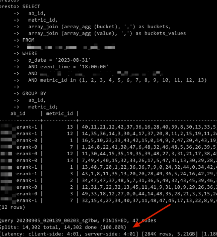

在页面的统计信息中显示也是4分钟

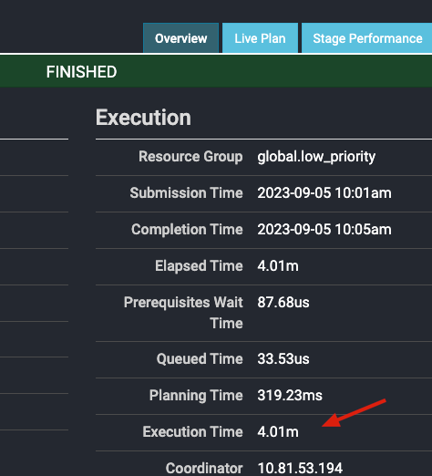

需要注意的是，这里可以先排除集群资源紧张，队列竞争的问题，因为这个SQL在多次验证的结果下，查询时长都要4分钟左右。

在执行计划中，初步可以看到 stage2 的资源需求是最大的，cpu耗时和split，都比其他的stage较多

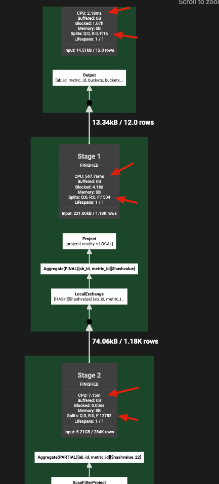


查看stage 详细，也确实是stage2比1和0，需要资源更多，读入的split更多

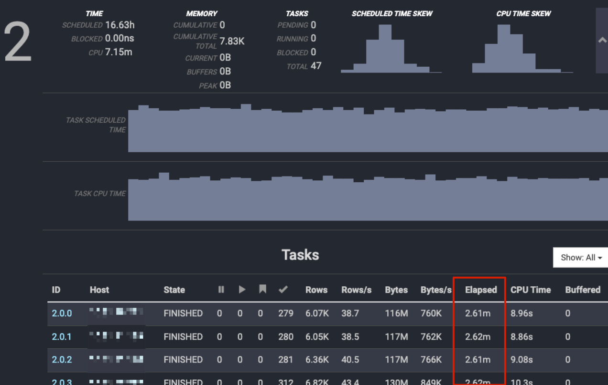

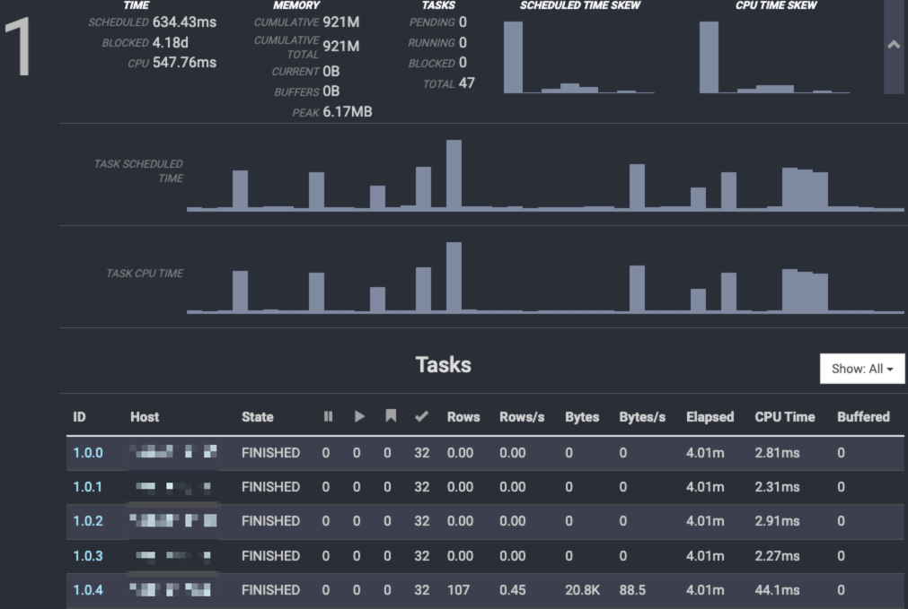

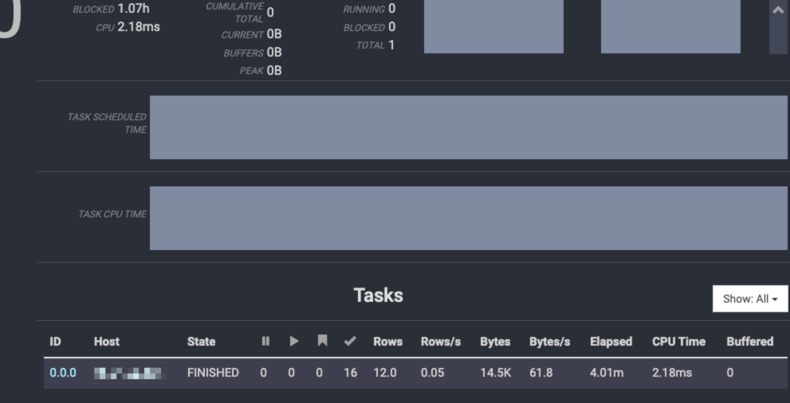

排查一下SQL查询的数据，是否会有小文件的情况，因为小文件太多的话SQL会产生大量的Split。

很多慢查询的常见问题，可能就是文件太碎，Split太多造成的。

```
[PRODUCTION]$ hdfs dfs -count -q /user/***/tables/hudi_main.db/abtest/*
        none             inf            none             inf           18          265           16287744 /user/***/tables/hudi.db/abtest/.hoodie
        none             inf            none             inf            1         8120         3556393812 /user/***/tables/hudi.db/abtest/2023-08-30
        none             inf            none             inf            1        12783         5596049664 /user/***/tables/hudi.db/abtest/2023-08-31
        none             inf            none             inf            1        11480         5020598946 /user/***/tables/hudi.db/abtest/2023-09-01
        none             inf            none             inf            1        10701         4680086975 /user/***/tables/hudi.db/abtest/2023-09-02
        none             inf            none             inf            1            0                  0 /user/***/tables/hudi.db/abtest/2023-09-03
[PRODUCTION]$ hdfs dfs -ls /user/***/tables/hudi_main.db/abtest/2023-08-31 | wc -l
12784
```

每个分区差不多1万多个小文件，每个文件不到1MB。

```
426.4 K  1.2 M  /user/***/tables/hudi.db/abtest/2023-08-31/000f2a24-c496-4214-92e9-fbb28d592437-0_20-235-0_20230831100405481.parquet
```

关键线索：发现单分区在 5GB 的样子。

```
5.2 G  15.6 G  /user/***/tables/hudi.db/abtest/2023-08-31
```

此时再回头重新查看执行计划：

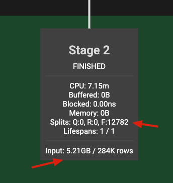

我们可以计算一下，input 量，除以 完成的 split 数，得到410.18的数值，正好与我们前面查看的某个分区中，单个parquet文件的大小相近。

```
(5 MB * 1024 * 1024) / 12782 Split = 410.18 KB

```

与我们查看原始数据的大小差不多，所以这里可以判断，sql的查询时间，大部分都耗费在split读数据上面了。

### 总结

在大数据环境中，小文件的危害是巨大的，不光对存储有影响对计算也会造成影响。

站在Presto运维角度来看，如果发现某个Stage的Input量级与Split量级产生了一些极端数值，此时我们可以往小文件的思路方向去排查问题。

站在数仓角度或者大数据架构角度来看，是需要着手投入小文件的治理。

站在平台的角度(此处不限于数据平台)，是否可以提示用户慢在哪了，比如“查询的***表因为小文件太多，可能会影响查询性能。”

TODO 统计 SQL查询小文件的比例

1. SQL维度，1个SQL中只要有表涉及到小文件，既算1次
2. SQL明细维度，1个SQL中有多少比例的表，是有小文件问题

## 案例2 逻辑很简单但查询速度不理想

### 排查经过

同样也是SQL逻辑不复杂，就是根据某几个字段分组然后对某几个字段聚合，取的数据也不是很多，就是过滤条件稍微有点多。

也可以按照计算逻辑稍微有点复杂理解。

查询需要2分钟左右。削微有点慢了。

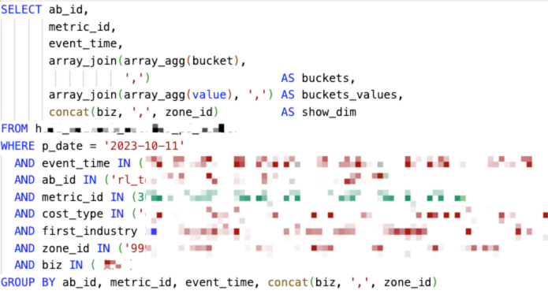


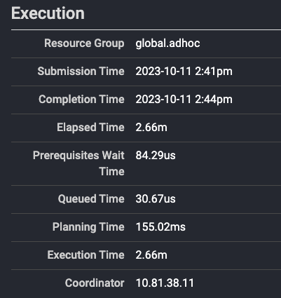

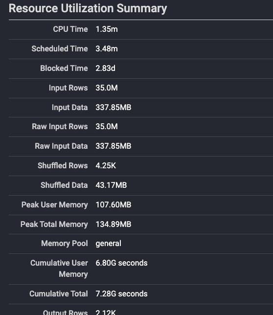

查看执行计划，发现计划比较简单

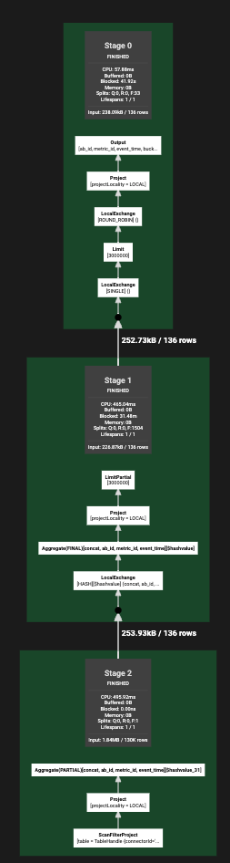

此时的一个思路，(排除小文件问题，已经讲过一个了，肯定不会讲第二个)我们可以往执行计划的方向探索。

站在集群运维的角度，如何在保证业务逻辑的前提下能让SQL提速呢。此时我们可以查看到，查询Prerequisites Wait和Queued和Planning耗时都不高，只有Execution耗时最高，那么此时可以排除比如元数据拉取慢，HDFS集群网络波动，等等外接因素。单纯就是SQL算的慢了。

可以初步判断该SQL的性能瓶颈在于，计算的横向扩展的不够，受执行逻辑的限制只能慢慢算。

此时我们可以考虑将SQL进行横向拆分，一般常用的做法有使用子查询、with语句、union等方式，大致意思为将需要进行的逻辑等份拆分成多分，使其可以并行计算。

拆分后的逻辑如下：

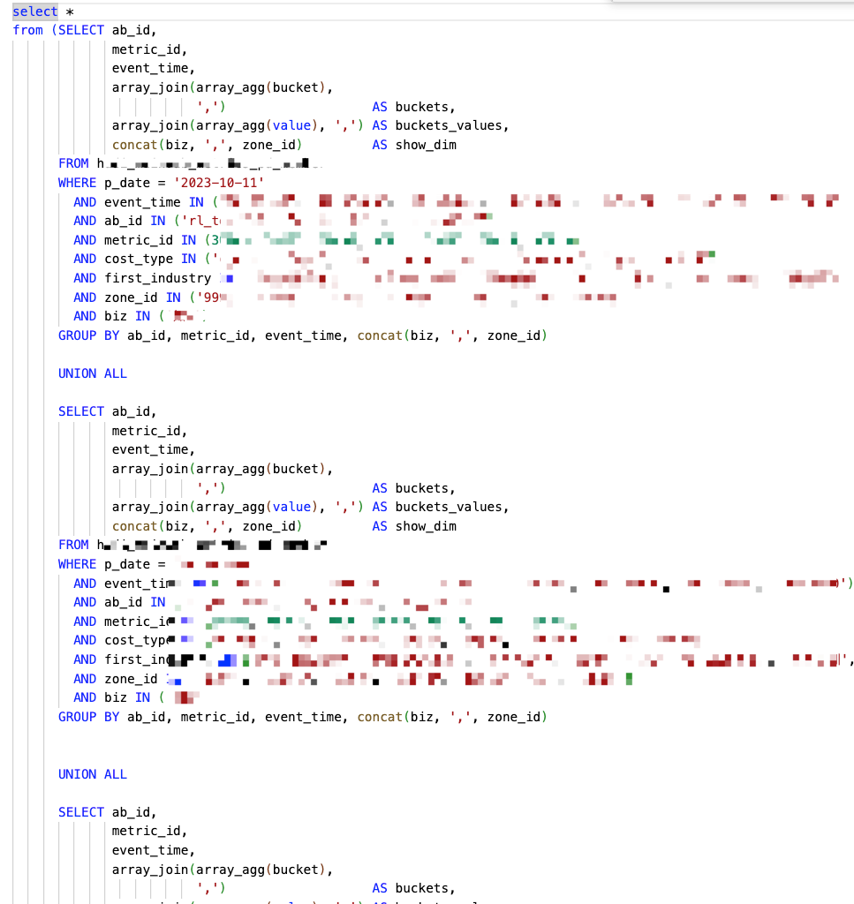

执行计划发生了变化，很明显的发现那些原来的输入部分，按SQL的逻辑拆分出去了，并且实现了并行计算。

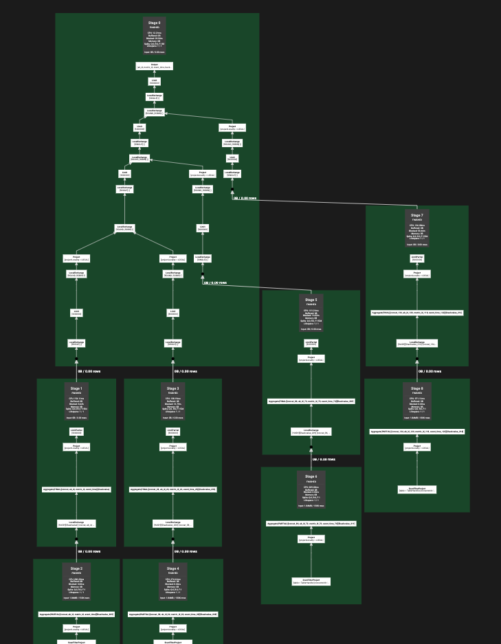

查询耗时也缩短至20秒。

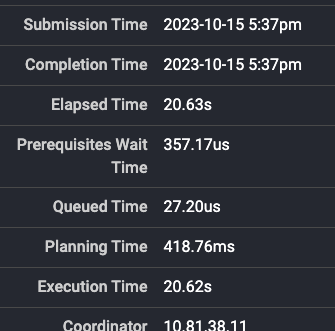


### 总结

此类SQL的性能瓶颈可能就在于执行计划层面，变相的算限速了。

这类的优化，在合理的数据范围内，比如这个SQL的输入量都没超过500MB，适当的进行空间换时间的方式优化是可行的。

TODO 

- 应该是presto有自动优化，或者是我们没找到，或者是命中的要求比较高，可以找一找
- 如果拆分执行计划之后，并行逻辑多了，是否会造成多读数据的情况

## 案例3 大量JSON字符串操作

### 排查经过

SQL同样也很简单，逻辑为解析json字段，然后取一部分数据。

过滤条件就只有一个分区条件，没有相关业务逻辑。

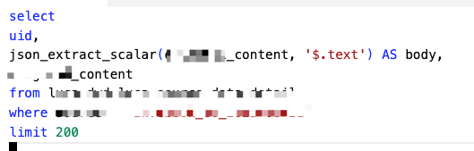

这里就不贴执行计划和其他参考信息了。这个地方主要是想表达的问题是，SQL在对一个字段进行JSON操作。

同样，这也只是个简单的举例，也有可能会出现大量的JSON操作。

此时我们可以结合 presto json 补充文档 TODO，可以理解当presto操作大量json数据的时候是特别耗性能的。

那么我们此时应该是可以思考，这个SQL的性能瓶颈可能不在于集群能力了，而是在于业务场景是否适合presto了。

### 总结

咨询用户得知，只是想在ETL之前先简单查看一下表中的数据。

当面临这类业务场景时，可以推荐使用抽样函数，文档：https://prestodb.io/docs/current/sql/select.html?highlight=sample#tablesample


## 案例4 超过内存限制

### 排查经过

### 总结

## 案例5 集群卡住

- CPU瓶颈 线程堆栈 火焰图
- IO瓶颈
    - 内存 采集下General Pool，在运行的内存情况
    - 网络 网卡
    - 磁盘 读写
    

TODO

1. 一个OLAP引擎，在运行一个SQL的时候，是不是应该尽可能的占满资源
2. cpu和内存使用率，与最终的资源使用率和满载率的一个比值，以至于，最后如何设置集群的查询限制，来达到既能满足查询，又能满足高资源利用率。

### 排查经过

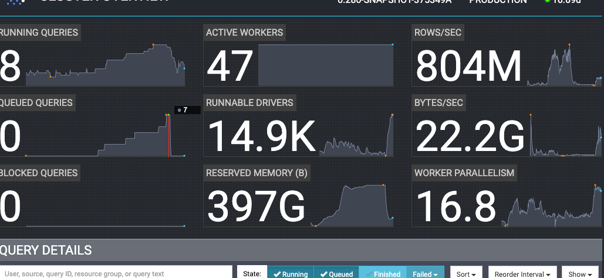


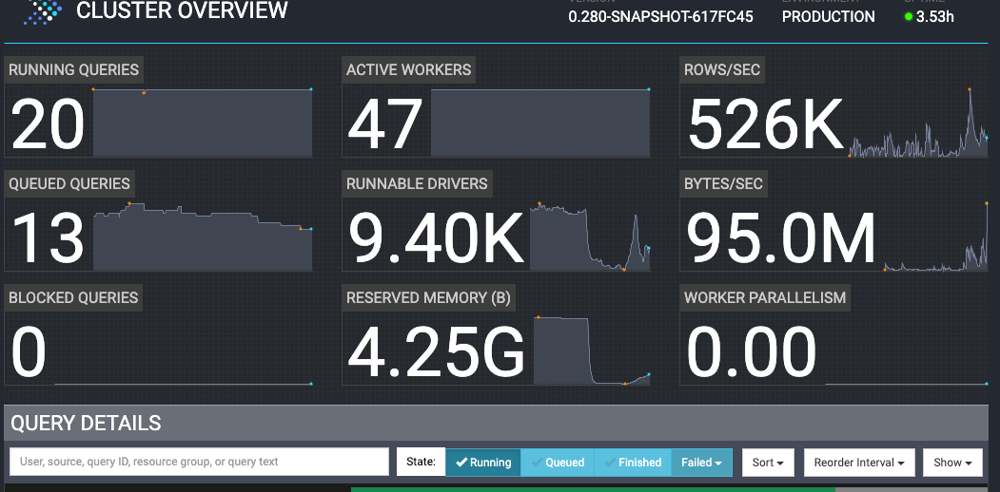


TODO 火焰图


