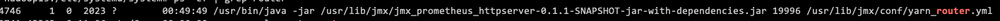

# 对接Prometheus生态

[返回首页](../README.md)

---

对接 Prometheus 生态，最重要的就是将监控数据以 metrics 的形式 + 一个可以 GET 访问的接口暴露出来。

而 Presto 和 Trino 的默认监控方式，暂时还没有方便的对接方式，比如打开一个开关就会有一个 metrics 接口之类。一般是使用它的 WebUI，或者去用 WebUI 中对应的接口去监控。(比如我们早期不太熟悉的时候，就是起了一个脚本，定时获取里面的数据进行监控。)

在 Prometheus 的 exporter 生态中，监控方式一般有两种，嵌入式与外挂式。简单介绍一下这两种模式：


## 嵌入式

也可以叫 java agent 这是一种比较方便的方式，因为不需要再单独维护一个服务，只需要新增一个 jar 包，然后增加一个配置，最后重启即可。

Presto 与 Trino 的配置基本类似。

Trino 配置参考：

```
-server
-Xmx16G
-XX:InitialRAMPercentage=80
-XX:MaxRAMPercentage=80
-XX:G1HeapRegionSize=32M
-XX:+ExplicitGCInvokesConcurrent
-XX:+ExitOnOutOfMemoryError
-XX:+HeapDumpOnOutOfMemoryError
-XX:-OmitStackTraceInFastThrow
-XX:ReservedCodeCacheSize=512M
-XX:PerMethodRecompilationCutoff=10000
-XX:PerBytecodeRecompilationCutoff=10000
-Djdk.attach.allowAttachSelf=true
-Djdk.nio.maxCachedBufferSize=2000000
-XX:+UnlockDiagnosticVMOptions
-XX:+UseAESCTRIntrinsics
# Disable Preventive GC for performance reasons (JDK-8293861)
-XX:-G1UsePreventiveGC
-javaagent:/usr/lib/trino/jmx/jmx_prometheus_javaagent-0.16.1.jar=监控暴露端口:/usr/lib/trino/jmx/trino_exporter.yaml
```

Presto 配置参考：

```
-server
-Xmx16G
-XX:+UseG1GC
-XX:G1HeapRegionSize=32M
-XX:+UseGCOverheadLimit
-XX:+ExplicitGCInvokesConcurrent
-XX:+HeapDumpOnOutOfMemoryError
-XX:+ExitOnOutOfMemoryError
-javaagent:/usr/lib/presto/jmx/jmx_prometheus_javaagent-0.16.1.jar=监控暴露端口:/usr/lib/presto/jmx/presto_exporter.yaml
```


配置完成启动后，会在进程中看到相关监控的信息。

Trino

```
root      6650     1  1 Apr21 ?        00:25:01 
java -cp /data8/trino-server-414/lib/* -server -Xmx64G 
-XX:-UseBiasedLocking -XX:+UseG1GC -XX:G1HeapRegionSize=32M -XX:+ExplicitGCInvokesConcurrent -XX:+ExitOnOutOfMemoryError 
-XX:+HeapDumpOnOutOfMemoryError -XX:-OmitStackTraceInFastThrow -XX:ReservedCodeCacheSize=512M -XX:PerMethodRecompilationCutoff=10000 
-XX:PerBytecodeRecompilationCutoff=10000 -Djdk.attach.allowAttachSelf=true -Djdk.nio.maxCachedBufferSize=2000000 
-Djava.library.path=/usr/lib/hadoop/lib/native:/usr/lib/hadoop/share/hadoop/common/lib:/data8/trino-server-414/hadoop-lzo 
-javaagent:/data8/bak/jmx_prometheus_javaagent-0.16.1.jar=20081:/data8/bak/trino_exporter.yaml -Dnode.environment=trino_414_test 
-Dnode.data-dir=/data8/trino-server-414/data -Dlog.levels-file=/data8/trino-server-414/etc/log.properties 
-Dlog.output-file=/data8/trino-server-414/data/var/log/server.log -Dlog.enable-console=false 
-Dconfig=/data8/trino-server-414/etc/config.properties io.trino.server.TrinoServer
```

Presto

```
root     31049     1 99 10:29 ?        00:00:09 
java -cp /data8/presto-server-0.279/lib/* -server -Xmx64G 
-XX:+UseG1GC -XX:G1HeapRegionSize=32M -XX:+UseGCOverheadLimit -XX:+ExplicitGCInvokesConcurrent -XX:+HeapDumpOnOutOfMemoryError 
-XX:+ExitOnOutOfMemoryError -Djava.library.path=/usr/lib/hadoop/lib/native:/usr/lib/hadoop/lzo/lib:/data8/presto-server-0.279/hadoop-lzo 
-javaagent:/data8/bak/jmx_prometheus_javaagent-0.16.1.jar=20082:/data8/bak/trino_exporter.yaml -Dnode.environment=test 
-Dnode.id=cdp_presto_test -Dnode.data-dir=/data8/presto-server-0.279/data -Dlog.levels-file=/data8/presto-server-0.279/etc/log.properties 
-Dlog.output-file=/data8/presto-server-0.279/data/var/log/server.log -Dlog.enable-console=false 
-Dconfig=/data8/presto-server-0.279/etc/config.properties com.facebook.presto.server.PrestoServer
```

再来请求一下监控暴露端口，即可得到 metrics 格式的监控数据。

## 外挂式

嵌入式的方式，如果是要对 agent 程序调整或者配置更新什么的，因为与被监控的程序强耦合会有一些不方便的地方。此时在 Prometheus 生态中还提供了另一种外挂的方式，使用的 jmx 包为  jmx_prometheus_httpserver。


此时我们只需要准备一个的 jmx 配置，以及一个服务的启动脚本即可，一般我们会用一个 systemd 来维护这个脚本。

jmx 配置，这里的 8888 是 java 程序暴露出来的 jmx 接口地址：

```
hostPort: localhost:8888
blacklistObjectNames: ["org.apache.derby:*", "org.apache.logging.log4j2:*", "com.jolbox.bonecp:*"]

rules:
  - pattern: ".*"
```

systemd 配置，这里的 9999 可以理解为将 jmx 转换为 metrics 后的接口：

```
[Unit]
Description=Prometheus Jmx Exporter httpserver service
After=syslog.target network.target

[Service]
LimitNOFILE=1000000
#LimitCORE=infinity
LimitSTACK=10485760
User=root
ExecStart=/usr/bin/java -jar /usr/lib/jmx/jmx_prometheus_httpserver-0.1.1-SNAPSHOT-jar-with-dependencies.jar 9999 /usr/lib/jmx/conf/jmx的配置.yml
Restart=always
RestartSec=30s
Environment="JAVA_HOME=/usr/java/jdk"
SuccessExitStatus=143

[Install]
WantedBy=multi-user.target
```

这里以一个 yarn router 的最后效果举例。



在 linux 它相当于是一个独立的程序，然后我们监控指标，都从这个程序的 19996 端口获取，然后监控程序的调整和配置更新不会影响到主程序。


## 总结

嵌入式和外挂式都各有好处。

嵌入式的好处是运维方便，或者说几乎没有运维，但是后续的调整以及还会对主程序产生轻微的性能损耗。

外挂式的好熟就是，灵活方便，可以随意变更不影响主程序，缺点就是多了运维成本。


