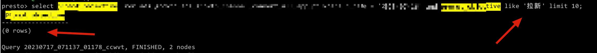
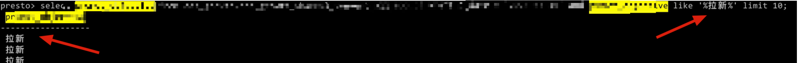
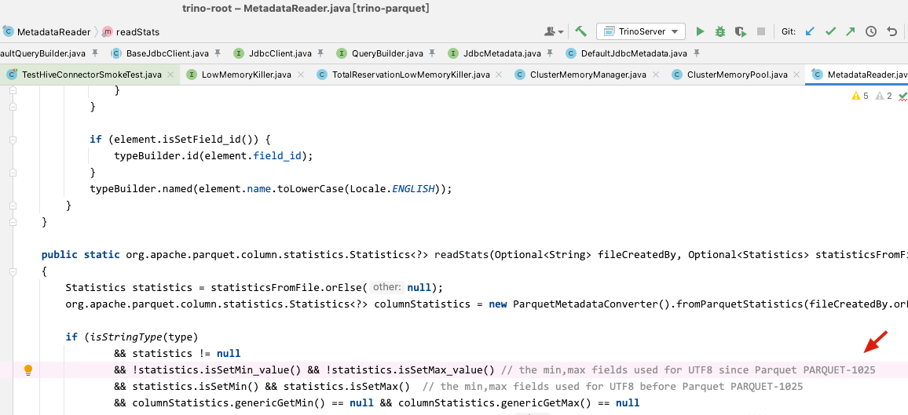

# Presto中文问题

[返回首页](../README.md)

---

## 背景

> 版本 0.280

在 Presto 的 WHERE 中带有中文的查询，会有查不到数据的情况，如下图。

在不修改的情况下，需要带一些比如 like 或者去空格等等奇怪的操作(让人误以为字段里有脏数据)才能查出来。

该问题主要体现在 Parquet 数据上。





## 排查

在 Issues 中以及踩过坑的人提示，在 Trino 中找到了相关线索 https://github.com/trinodb/trino/issues/3517

这个 PR 主要是在读取 Parqeut 的元数据时(列的元数据)，处理包含非 ASCII 字符的最小值和最大值字符串不正确导致无法使用中文的问题。

举例，有如下 Parquet 数据，在统计信息里，中文也会根据编码来排序出 min max：

```
...
...

city:     BINARY LZO DO:0 FPO:4 SZ:68979/90480/1.31 VC:224686 ENC:RLE,BIT_PACKED,PLAIN_DICTIONARY ST:[min: 上海, max: 黑龙江, num_nulls: 0]

...
...
```

简单解释一下 PR 里做出的修改，就是 Presto 在读取 Parquet 数据时中文字符属于非 ASCII 字符，Presto 在处理非 ASCII 字符时忽略了 Parquet 升级统计信息调整的问题所导致。



PR 里有说到 PARQUET-1025 https://issues.apache.org/jira/browse/PARQUET-1025 有调整中 Parquet 中列的最大最小统计信息。

可以理解为，Parquet 1.10.0 版本开始，列的统计信息会发生变化，需要注意一下集群里的版本。

Presto 目前就是直接裸读，如果集群里有过 Parqeut 的版本变更，可能会有问题。

Trino 这边的修改就是，先通过 `ParquetMetadataConverter` 转换统计信息，如果发现使用的是旧格式的 UTF-8 统计信息，并且新的统计信息没有设置 min 和 max，则调用 `tryReadOldUtf8Stats` 方法进行处理，增加了一个向下兼容读取的方法，而 Presto 这边直接认为用户会升到最新 (它真的，我哭死)。

目前，我这里是 0.280 的版本，是参考了 Trino 移植了该功能。

## 总结

因为这类问题没有明确的报错，查问题时会容易掉入思想捷径的陷阱。

通过这次解决问题，可以得到一个排查问题的路线总结：

先查社区 issues，然后再先从底层存储向上反着查，因为这样在查的路径中，有可能会看到代码里的 TODO 或者注释。


