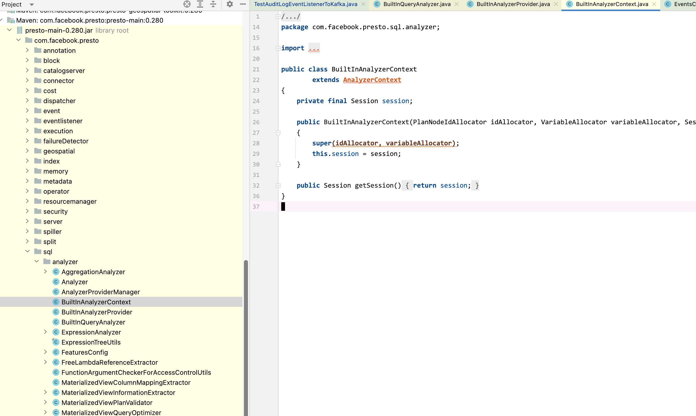
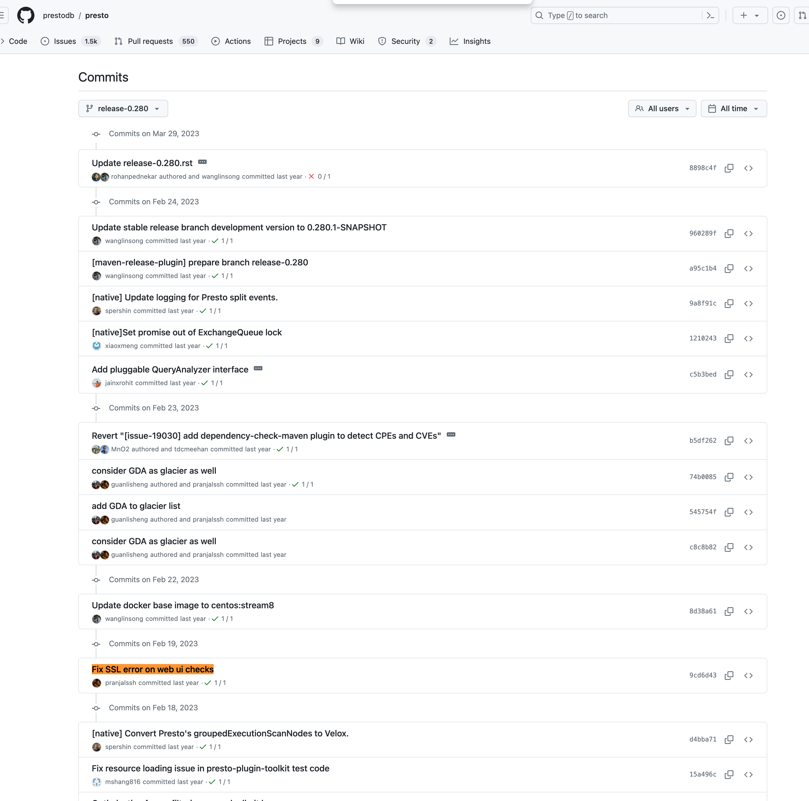

# Presto单元测试错误NoClassDefFoundError_QueryAnalyzer_引发的版本使用思考

[返回首页](../README.md)

---

## 背景

在进行 presto 插件开发时，单元测试出现了一个 NoClassDefFoundError 的错误。

根据经验，可能是引的包版本不同，里面有一些被删掉的类然后我引用到了，而出现的问题。

但是我印象中，我都是根据 tag 来切版本使用的，为什么还会出现这个问题？

## 问题现象

执行任意单元错误，会出现如下错误

```
java.lang.NoClassDefFoundError: com/facebook/presto/spi/analyzer/QueryAnalyzer

	at java.lang.ClassLoader.defineClass1(Native Method)
	at java.lang.ClassLoader.defineClass(ClassLoader.java:757)
	at java.security.SecureClassLoader.defineClass(SecureClassLoader.java:142)
	at java.net.URLClassLoader.defineClass(URLClassLoader.java:473)
	at java.net.URLClassLoader.access$100(URLClassLoader.java:74)
	at java.net.URLClassLoader$1.run(URLClassLoader.java:369)
	at java.net.URLClassLoader$1.run(URLClassLoader.java:363)
	at java.security.AccessController.doPrivileged(Native Method)
	at java.net.URLClassLoader.findClass(URLClassLoader.java:362)
	at java.lang.ClassLoader.loadClass(ClassLoader.java:419)
	at sun.misc.Launcher$AppClassLoader.loadClass(Launcher.java:352)
	at java.lang.ClassLoader.loadClass(ClassLoader.java:352)
	at com.facebook.presto.server.ServerMainModule.setup(ServerMainModule.java:308)
	at com.facebook.airlift.configuration.AbstractConfigurationAwareModule.configure(AbstractConfigurationAwareModule.java:43)
	at com.google.inject.spi.Elements$RecordingBinder.install(Elements.java:344)
	at com.google.inject.spi.Elements.getElements(Elements.java:103)
	at com.google.inject.spi.Elements.getElements(Elements.java:96)
	at com.facebook.airlift.configuration.ConfigurationFactory.registerConfigurationClasses(ConfigurationFactory.java:164)
	at com.facebook.airlift.bootstrap.Bootstrap.initialize(Bootstrap.java:210)
	at com.facebook.presto.server.testing.TestingPrestoServer.<init>(TestingPrestoServer.java:338)
	at com.facebook.presto.tests.DistributedQueryRunner.createTestingPrestoServer(DistributedQueryRunner.java:397)
	at com.facebook.presto.tests.DistributedQueryRunner.<init>(DistributedQueryRunner.java:273)
	at com.facebook.presto.tests.DistributedQueryRunner.<init>(DistributedQueryRunner.java:97)
	at com.facebook.presto.tests.DistributedQueryRunner$Builder.build(DistributedQueryRunner.java:996)
	at com.zhihu.presto.plugin.auditlog.persistence.TestAuditLogEventListenerToKafka.createQueryRunner(TestAuditLogEventListenerToKafka.java:57)
	at com.facebook.presto.tests.AbstractTestQueryFramework.init(AbstractTestQueryFramework.java:83)
	at sun.reflect.NativeMethodAccessorImpl.invoke0(Native Method)
	at sun.reflect.NativeMethodAccessorImpl.invoke(NativeMethodAccessorImpl.java:62)
	at sun.reflect.DelegatingMethodAccessorImpl.invoke(DelegatingMethodAccessorImpl.java:43)
	at java.lang.reflect.Method.invoke(Method.java:498)
	at org.testng.internal.MethodInvocationHelper.invokeMethod(MethodInvocationHelper.java:104)
	at org.testng.internal.Invoker.invokeConfigurationMethod(Invoker.java:515)
	at org.testng.internal.Invoker.invokeConfigurations(Invoker.java:217)
	at org.testng.internal.Invoker.invokeConfigurations(Invoker.java:144)
	at org.testng.internal.TestMethodWorker.invokeBeforeClassMethods(TestMethodWorker.java:169)
	at org.testng.internal.TestMethodWorker.run(TestMethodWorker.java:108)
	at org.testng.TestRunner.privateRun(TestRunner.java:756)
	at org.testng.TestRunner.run(TestRunner.java:610)
	at org.testng.SuiteRunner.runTest(SuiteRunner.java:387)
	at org.testng.SuiteRunner.runSequentially(SuiteRunner.java:382)
	at org.testng.SuiteRunner.privateRun(SuiteRunner.java:340)
	at org.testng.SuiteRunner.run(SuiteRunner.java:289)
	at org.testng.SuiteRunnerWorker.runSuite(SuiteRunnerWorker.java:52)
	at org.testng.SuiteRunnerWorker.run(SuiteRunnerWorker.java:86)
	at org.testng.TestNG.runSuitesSequentially(TestNG.java:1293)
	at org.testng.TestNG.runSuitesLocally(TestNG.java:1218)
	at org.testng.TestNG.runSuites(TestNG.java:1133)
	at org.testng.TestNG.run(TestNG.java:1104)
	at com.intellij.rt.testng.IDEARemoteTestNG.run(IDEARemoteTestNG.java:65)
	at com.intellij.rt.testng.RemoteTestNGStarter.main(RemoteTestNGStarter.java:105)
Caused by: java.lang.ClassNotFoundException: com.facebook.presto.spi.analyzer.QueryAnalyzer
	at java.net.URLClassLoader.findClass(URLClassLoader.java:387)
	at java.lang.ClassLoader.loadClass(ClassLoader.java:419)
	at sun.misc.Launcher$AppClassLoader.loadClass(Launcher.java:352)
	at java.lang.ClassLoader.loadClass(ClassLoader.java:352)
	... 50 more


Test ignored.

===============================================
Default Suite
Total tests run: 1, Failures: 0, Skips: 1
Configuration Failures: 1, Skips: 0
===============================================
```

发现引的包中，确实没有




## 检查社区的分支代码

找到问题了，我选择的版本与实际社区tag发布的版本，中间有几个pr的差距(漏了一些代码)，找了几个历史的 tag 以及 branch 发现我是截取版本的时候选错了




## 历史 tag


## 总结

建议以后在选择源代码版本时，最好选带有 prepare release 的 pr 后，代表已经封版，可以 checkout 了。
