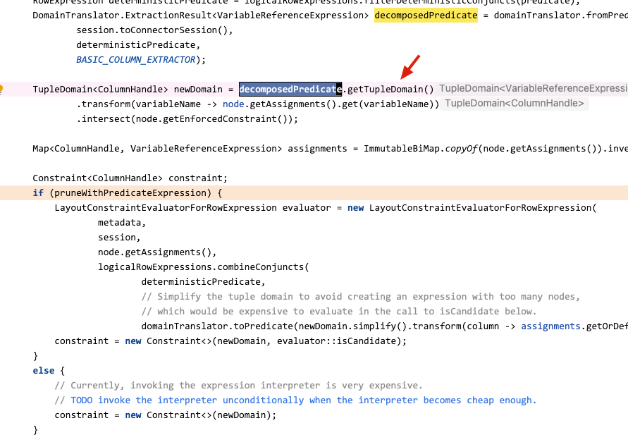
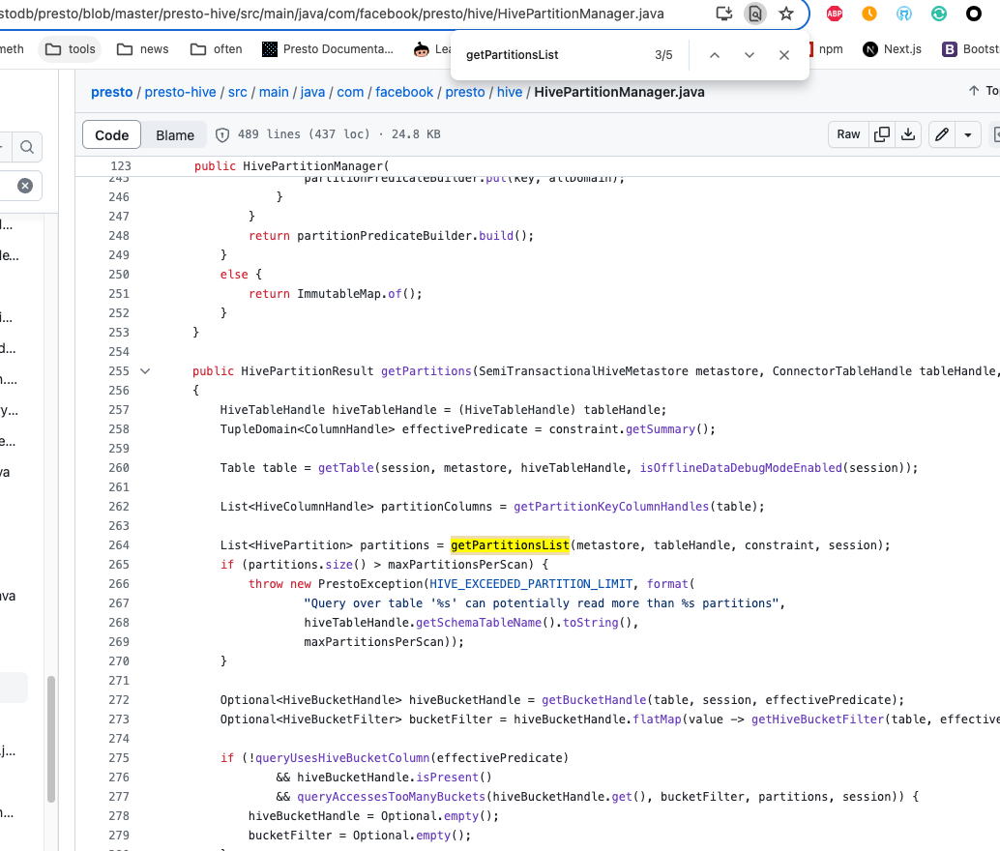
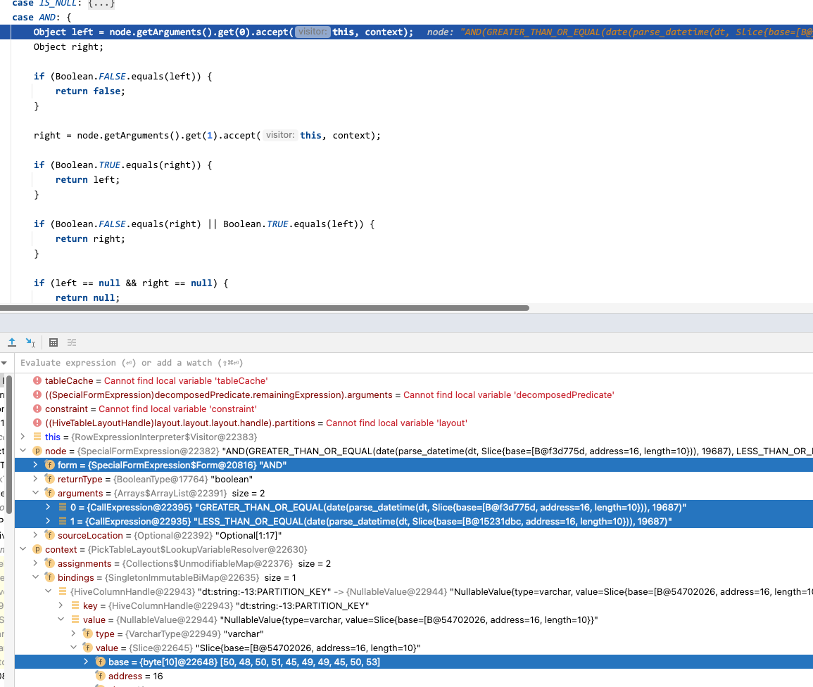

# presto错误格式分区问题

[返回目录](../README.md)

---

## 背景

在对 Hive 表进行查询时，遇到了一些错误格式的分区，这个错误是指与其他分区的 `格式` 不一致。

比如这样


或者这样


再或者有一些乱码的分区，中文字符的分区，等等，主要就是与其他分区的格式不一致，一般错误的操作导致的。

因为我们的 Hive 没有对创建分区时开启校验 hook 所以这里会埋下可以创建但是无法能查询的隐患，而且这个隐患仅仅只在 Presto 和 Trino 中出现，Hive 和 SparkSQL 都是可以自动忽略掉 `错误格式` 的分区的。

查询的时候就会遇到如下的错误，就是 SQL 只要查询了含有错误格式分区的表时，不管有没有查错误的分区，都会报错。

```sql
select * 
from cdp_hive_test.test_csv_1 
where
    (
        DATE(parse_datetime(dt, 'yyyy-MM-dd')) >= DATE('2023-11-26') 
        and DATE(parse_datetime(dt, 'yyyy-MM-dd')) <= DATE('2023-11-26')
    )
limit 1;
```


同时，如果还开启了最大分区扫描限制 hive.max-partitions-per-scan，还会触发另外一个错误 `明明 WHERE 中输入了分区条件，却还是扫描了所有分区，导致触发分区扫描上限的限制`。


## 目前的问题

相当于目前我们有 2 个问题：

1. 错误格式分区问题
2. 查询会扫描所有分区问题


## 第一轮排查

根据之前在参考 Trino 给 Presto 实现查询时必须要带分区条件限制，类似 Hive 的严格模式功能时，知道这个功能的入口点应该在 PickTablelayout 这一层，我们可以先在这来找一些线索。

发现第一个线索就是在构建 constraint 时是 “空”，因为在其他很多逻辑中我们会用这个变量。


### 顺着 constraint 往上找，发现最根源是依赖分解后的谓词去提取然后构建 constraint

decomposedPredicate 分接后的谓词


在这段代码分解谓词后：

```java
DomainTranslator.ExtractionResult<VariableReferenceExpression> decomposedPredicate = domainTranslator.fromPredicate(
                session.toConnectorSession(),
                deterministicPredicate,
                BASIC_COLUMN_EXTRACTOR);
```

因为 SQL 中 WHERE 子句里比较方式的不同在后续构建  constraint 的时候会有问题，比较方式有以下两种：

### 明确的比较

```sql
WHERE
  (
    p_date >= '2023-07-28'
    and p_date <= '2023-07-28'
  )
```

分解后的对象信息

```
decomposedPredicate = {DomainTranslator$ExtractionResult@21445} 
 tupleDomain = {TupleDomain@21449} "TupleDomain{...}"
  domains = {Optional@21453} "Optional[{p_date=com.facebook.presto.common.predicate.Domain@50f4bb5}]"
   value = {Collections$UnmodifiableMap@21460}  size = 1
    {VariableReferenceExpression@21464} "p_date" -> {Domain@21465} 
     key = {VariableReferenceExpression@21464} "p_date"
     value = {Domain@21465} 
      values = {SortedRangeSet@21467} 
       type = {VarcharType@21468} "varchar"
       lowIndexedRanges = {TreeMap@21469}  size = 1
        {Marker@21474}  -> {Range@21475} 
         key = {Marker@21474} 
          type = {VarcharType@21468} "varchar"
          valueBlock = {Optional@21580} "Optional[VariableWidthBlock(1280538863){positionCount=1,slice=Slice{base=[B@6599700a, address=16, length=10}}]"
          bound = {Marker$Bound@21581} "EXACTLY"
         value = {Range@21475} 
          low = {Marker@21474} 
           type = {VarcharType@21468} "varchar"
           valueBlock = {Optional@21580} "Optional[VariableWidthBlock(1280538863){positionCount=1,slice=Slice{base=[B@6599700a, address=16, length=10}}]"
           bound = {Marker$Bound@21581} "EXACTLY"
          high = {Marker@21584} 
           type = {VarcharType@21468} "varchar"
           valueBlock = {Optional@21587} "Optional[VariableWidthBlock(1280538863){positionCount=1,slice=Slice{base=[B@5a4942d4, address=16, length=10}}]"
           bound = {Marker$Bound@21581} "EXACTLY"
      nullAllowed = false
 remainingExpression = {ConstantExpression@21450} "true"
```

### 带函数的比较

```sql
WHERE
  (
    DATE(parse_datetime("cdp_hive_test"."***"."p_date", 'yyyy-MM-dd')) 
    >= DATE('2023-07-28')
    
    AND 
    
    DATE(parse_datetime("cdp_hive_test"."***"."p_date", 'yyyy-MM-dd')) 
    <= DATE('2023-07-28')
  )
```

分解后的对象信息

```
decomposedPredicate = {DomainTranslator$ExtractionResult@21832} 
 tupleDomain = {TupleDomain@21835} "TupleDomain{ALL}"
  domains = {Optional@21839} "Optional[{}]"
 remainingExpression = {SpecialFormExpression@21836} "AND(GREATER_THAN_OR_EQUAL(date(parse_datetime(p_date, Slice{base=[B@14192078, address=16, length=10})), CAST(Slice{base=[B@4a674c7d, address=16, length=10})), LESS_THAN_OR_EQUAL(date(parse_datetime(p_date, Slice{base=[B@30c928ae, address=16, length=10})), CAST(Slice{base=[B@305cbf37, address=16, length=10})))"
  form = {SpecialFormExpression$Form@21841} "AND"
  returnType = {BooleanType@21842} "boolean"
  arguments = {Arrays$ArrayList@21843}  size = 2
   0 = {CallExpression@21849} "GREATER_THAN_OR_EQUAL(date(parse_datetime(p_date, Slice{base=[B@14192078, address=16, length=10})), CAST(Slice{base=[B@4a674c7d, address=16, length=10}))"
   1 = {CallExpression@21850} "LESS_THAN_OR_EQUAL(date(parse_datetime(p_date, Slice{base=[B@30c928ae, address=16, length=10})), CAST(Slice{base=[B@305cbf37, address=16, length=10}))"
  sourceLocation = {Optional@21844} "Optional[2:8]"
```

### 问题

带函数的比较时，分解后的谓词执行  decomposedPredicate.getTupleDomain() 方法就会得到一个空，在 Presto 中叫 TupleDomain{ALL}。

在对 `newDomain` 以及后面的 `Constraint<ColumnHandle> constraint;` 赋值都会有问题，相当于会赋值为空

以及后续的谓词相关约束的检查就会失真，比如我要判断 SQL 中的谓词是否有明确传入分区信息(p_date)，如果用函数的方式，因为 getTupleDomain 得到了空，会产生误判断。

那么此时该如何解决这个问题呢？是因为分解谓词的问题吗？


### 第一次假设与验证

怀疑是不是因为函数包裹的问题，开始调整 SQL 进行验证，比如我不用 parse_datetime 函数，直接用类型转换。

```sql
select id
from hive.cdp_hive_test.***
WHERE
  (
    DATE(p_date) >= DATE('2023-07-28')
    AND DATE(p_date) <= DATE('2023-07-28')
  )
limit 1;
```

第一次获得的分裂的谓词

```
decomposedPredicate = {DomainTranslator$ExtractionResult@24514} 
 tupleDomain = {TupleDomain@24517} "TupleDomain{ALL}"
  domains = {Optional@24521} "Optional[{}]"
 remainingExpression = {SpecialFormExpression@24518} "AND(GREATER_THAN_OR_EQUAL(date(p_date), CAST(Slice{base=[B@5a26b4f8, address=16, length=10})), LESS_THAN_OR_EQUAL(date(p_date), CAST(Slice{base=[B@74f4687f, address=16, length=10})))"
  form = {SpecialFormExpression$Form@24523} "AND"
  returnType = {BooleanType@24524} "boolean"
  arguments = {Arrays$ArrayList@24525}  size = 2
   0 = {CallExpression@24530} "GREATER_THAN_OR_EQUAL(date(p_date), CAST(Slice{base=[B@5a26b4f8, address=16, length=10}))"
   1 = {CallExpression@24531} "LESS_THAN_OR_EQUAL(date(p_date), CAST(Slice{base=[B@74f4687f, address=16, length=10}))"
  sourceLocation = {Optional@24526} "Optional[1:18]"
```

多次迭代后获得的分裂的谓词

```
decomposedPredicate = {DomainTranslator$ExtractionResult@24779} 
 tupleDomain = {TupleDomain@24784} "TupleDomain{ALL}"
 remainingExpression = {SpecialFormExpression@24785} "AND(GREATER_THAN_OR_EQUAL(date(p_date), 19566), LESS_THAN_OR_EQUAL(date(p_date), 19566))"
  form = {SpecialFormExpression$Form@24523} "AND"
  returnType = {BooleanType@24524} "boolean"
  arguments = {Arrays$ArrayList@24788}  size = 2
   0 = {CallExpression@24745} "GREATER_THAN_OR_EQUAL(date(p_date), 19566)"
   1 = {CallExpression@24746} "LESS_THAN_OR_EQUAL(date(p_date), 19566)"
  sourceLocation = {Optional@24789} "Optional[1:18]"
```

最后到在 TableScanValidator 中也就是查询必须带分区条件的限制时，传入的 Node 中分区已经已经是扫描了所有的分区了


目前线索还是停留在因为 constraint 为空，所以后续的很多流程会有问题。

### 继续跟代码往 constraint 的最源头找

发现核心问题还是在 domainTranslator.fromPredicate 获得谓词时，TupleDomain 时为空，因为为空所以 newDomain 无法构建，所以后续的 constraint 也就是空




目前第一轮排查暂时结束，目前不确定我的这个排查与假设是否正确，所以我重新梳理了一下问题。

## 第一次梳理问题

当谓词中有时间函数时，比如 `WHERE DATE(parse_datetime("dt", 'yyyy-MM-dd')) >= DATE('2023-11-26')` 在 PickTablelayout 中构建 TableLayout 的时候会出现 `分区裁剪优化` 失效，带来的问题就是将对应分区中的所有分区信息都拉到 presto 中进行后续的相关操作。

> 注意，可能不是分区裁剪优化失效，这里只是我的假设。


比如 hive.max-partitions-per-scan 假设我现在限制一个sql只能最大只能扫描2个分区(这是举例，还有其他的相关限制以及操作)，那么此时因为前面的失效而扫描了7个分区，会大于2，导致查询无法成功进行。

### 支持带时间函数的谓词下推吗？

目前怀疑是 presto 的执行计划中出了问题，扫了所有分区(也就是元数据层面)，那么实际到 hive hdfs 的时候，也会扫所有的分区吗？

测试一下

```
presto:default> select * from cdp_hive_test."test_csv_1$partitions";
     dt
------------
 2023-11-25
 2023-11-26
 2023-11-27
 2023-11-28
(4 rows)
```


```sql
select * from hive.cdp_hive_test.test_csv_1
where 
    (
        DATE(parse_datetime("dt", 'yyyy-MM-dd')) >= DATE('2023-11-26')
        and DATE(parse_datetime("dt", 'yyyy-MM-dd')) <= DATE('2023-11-26')
    )
;
```

每个分区都是1个文件，所以正常的情况下，应该是只会有一个split

```
$ hdfs dfs -count -q /user/hive/warehouse/cdp_hive_test.db/test_csv_1/*
        none             inf            none             inf            1            1                225 /user/hive/warehouse/cdp_hive_test.db/test_csv_1/dt=2023-11-25
        none             inf            none             inf            1            1                225 /user/hive/warehouse/cdp_hive_test.db/test_csv_1/dt=2023-11-26
        none             inf            none             inf            1            1                225 /user/hive/warehouse/cdp_hive_test.db/test_csv_1/dt=2023-11-27
        none             inf            none             inf            1            1                225 /user/hive/warehouse/cdp_hive_test.db/test_csv_1/dt=2023-11-28
```


此时我们再试一下查所有分区

```sql
select * from hive.cdp_hive_test.test_csv_1
where 
    (
        DATE(parse_datetime("dt", 'yyyy-MM-dd')) >= DATE('2023-11-01')
    )
;
```

这样就是 4 个分区


接下来，继续调试，用只查 2023-11-26 这个分区条件的，就是说只用一个分区条件查询。

第一次进到 PickTablelayout


前面构建 layout 时会先要获得分区，获得分区的时候也会用到 constraint


因为 constraint 是空，这样获取分区的时候，会获得所有分区


后面的一些列操作，所有分区参与工作


### 问题假设

好的，我们还是回到前面的问题，当谓词中有时间函数时，比如 `WHERE DATE(parse_datetime("dt", 'yyyy-MM-dd')) >= DATE('2023-11-26')` 在 PickTablelayout 中构建 TableLayout 的时候假设会出现 `分区裁剪优化` 失效，带来的问题就是将对应分区中的所有分区信息都拉到 presto 中进行后续的相关操作。我现在假设是因为 constraint 为空导致的。

因为后续的很多操作，比如分区获取，table构建，等等，都会依赖在 PickTablelayout 构建的 constraint，因为 constraint 为空 这个空是指 constraint.getSummary() 返回 TupleDomain{ALL} 没有字段信息。

而构建 constraint 会先将谓词进行提取，然后构建 newDomain，最后用 newDomain 去构建 constraint，对应的代码如下


```java
DomainTranslator.ExtractionResult<VariableReferenceExpression> decomposedPredicate = domainTranslator.fromPredicate(
                session.toConnectorSession(),
                deterministicPredicate,
                BASIC_COLUMN_EXTRACTOR);
                
TupleDomain<ColumnHandle> newDomain = decomposedPredicate.getTupleDomain()
***
***
***

constraint = new Constraint<>(newDomain, evaluator::isCandidate);
***

constraint = new Constraint<>(newDomain)
***
***

```

其中关键在这个 BASIC_COLUMN_EXTRACTOR 提取器的代码，这里提取出来是空，后续的相关构建就都为空了。

这个提取器有个问题就是，只能提取那种写明变量的，比如 p_date = ***，一些有表达式的不会提取，源码如下：

```java
ColumnExtractor<VariableReferenceExpression> BASIC_COLUMN_EXTRACTOR = (expression, domain) -> {
    if (expression instanceof VariableReferenceExpression) {
        return Optional.of((VariableReferenceExpression) expression);
    }
    return Optional.empty();
};
```

一般谓词部分的表达式有以下几种，比如带有函数会在 CallExpression 表达式中。

那么此时我是不是可以加个规则，比如 decomposedPredicate 分解出来后，里面成员的 remainingExpression 的 arguments 的 ArrayList 中，里面的 CallExpression 表达式的 arguments 全是 CallExpression + ConstantExpression 的样子了，因为这样可以代表 Node 优化的差不多了，会往后续的流程走了，我再添加一个谓词的重新提取，相当于参考 BASIC_COLUMN_EXTRACTOR 实现一个新的提取器，可以提取 CallExpression 呢？

> 这里的意思就是，我将那种 WHERE 中带有函数表达式的语句也能像 p_date=2020-01-01 这样直接是常量的方式提取出来，方便后续构建 constraint。


提取器传入的是 RowExpression 接口类型，我还需要在 EXTRACTOR 新增一种 CallExpression 的提取


目前的几个线索：

- 为什么 PickTablelayout 的谓词提取只提取 VariableReferenceExpression 表达式的呢？
- 是不是因为提取器的问题，导致 constraint 没有成功构建，以至于后续的很多流程无法有效进行呢？


### 发现了第一个线索

Node 调用 PickTablelayout 是一个循环的动作，相当于一直在迭代优化，里面会进行不断的优化。

比如 `DATE(parse_datetime("dt", 'yyyy-MM-dd')) >= DATE('2023-11-01')` 这里的 `DATE('2023-11-01')` 会多次迭代后优化成一个常量。

可以简单看看迭代的源码，下面贴几个关键部分的代码，不过这里不做过多解释。


正好这里我看到，在迭代多次后 decomposedPredicate 由之前的全是 CallExpression，迭代成了，CallExpression + ConstantExpression，这意味着什么呢，我暂时把它理解为，将 where 中的谓词右边用于比较的部分进行了常量折叠。

我们看一次细节。第一次进来的 decomposedPredicate。


多次迭代(可能是最后一次迭代的) decomposedPredicate


```
当时这里的心里活动是，还在想我应该要去实现一个新的提取器，其实是错误的。

因为我实现了之后，这里提取出来的字段会影响整个执行计划优化的迭代，相当于假设本来要迭代优化4次的，因为我的修改迭代2次就出去了，会导致里面的逻辑有不一致的情况。

后来暂时没有思路了，觉得去 Trino 中调试，看看各个流程中的对象是如何构建的。
```

### Trino 中测试

流程跟 Presto 那边也差不多，在 pushFilterIntoTableScan 方法中，需要构建一个 constraint ，后续的很多操作都会依赖它进行。

最开始迭代的 constraint 信息，注意此时的 predicate = {Optional@22940} "Optional.empty" 是空

```
constraint = {Constraint@26697} "Constraint[summary=ALL, expression=Call[functionName=name='$and', arguments=[Call[functionName=name='$greater_than_or_equal', arguments=[Call[functionName=name='$cast', arguments=[Call[functionName=name='parse_datetime', arguments=[dt::varchar, Slice[hash=1508350752,length=10]::varchar(10)]]]], 19687::date]], Call[functionName=name='$less_than_or_equal', arguments=[Call[functionName=name='$cast', arguments=[Call[functionName=name='parse_datetime', arguments=[dt::varchar, Slice[hash=1508350752,length=10]::varchar(10)]]]], 19687::date]]]]]"
 summary = {TupleDomain@22930} "ALL"
 expression = {Call@26705} "Call[functionName=name='$and', arguments=[Call[functionName=name='$greater_than_or_equal', arguments=[Call[functionName=name='$cast', arguments=[Call[functionName=name='parse_datetime', arguments=[dt::varchar, Slice[hash=1508350752,length=10]::varchar(10)]]]], 19687::date]], Call[functionName=name='$less_than_or_equal', arguments=[Call[functionName=name='$cast', arguments=[Call[functionName=name='parse_datetime', arguments=[dt::varchar, Slice[hash=1508350752,length=10]::varchar(10)]]]], 19687::date]]]]"
  functionName = {FunctionName@24588} "name='$and'"
  arguments = {ImmutableCollections$List12@26748}  size = 2
   0 = {Call@26752} "Call[functionName=name='$greater_than_or_equal', arguments=[Call[functionName=name='$cast', arguments=[Call[functionName=name='parse_datetime', arguments=[dt::varchar, Slice[hash=1508350752,length=10]::varchar(10)]]]], 19687::date]]"
   1 = {Call@26753} "Call[functionName=name='$less_than_or_equal', arguments=[Call[functionName=name='$cast', arguments=[Call[functionName=name='parse_datetime', arguments=[dt::varchar, Slice[hash=1508350752,length=10]::varchar(10)]]]], 19687::date]]"
  type = {BooleanType@24590} "boolean"
 assignments = {ImmutableCollections$MapN@26706}  size = 2
  "dt" -> {HiveColumnHandle@26650} "dt:string:PARTITION_KEY"
  "data1" -> {HiveColumnHandle@26652} "data1:string:REGULAR"
 predicate = {Optional@22940} "Optional.empty"
 predicateColumns = {Optional@22940} "Optional.empty"
```

Trino 跟 Presto 也一样，在第一次获取分区信息时，会获得所有分区。(我这个测试表只有 4 个分区)


并且在多次迭代后发现 constraint 不再是空，里面的 predicate 有明确的信息了

```
constraint = {Constraint@27019} "Constraint[summary=ALL, expression=Call[functionName=name='$and', arguments=[Call[functionName=name='$greater_than_or_equal', arguments=[Call[functionName=name='$cast', arguments=[Call[functionName=name='parse_datetime', arguments=[dt::varchar, Slice[hash=1508350752,length=10]::varchar(10)]]]], 19687::date]], Call[functionName=name='$less_than_or_equal', arguments=[Call[functionName=name='$cast', arguments=[Call[functionName=name='parse_datetime', arguments=[dt::varchar, Slice[hash=1508350752,length=10]::varchar(10)]]]], 19687::date]]]], predicate=io.trino.sql.planner.iterative.rule.PushPredicateIntoTableScan$$Lambda$3655/0x0000000801f0e0b8@11fd2515, predicateColumns=[dt:string:PARTITION_KEY]]"
 summary = {TupleDomain@22930} "ALL"
 expression = {Call@27025} "Call[functionName=name='$and', arguments=[Call[functionName=name='$greater_than_or_equal', arguments=[Call[functionName=name='$cast', arguments=[Call[functionName=name='parse_datetime', arguments=[dt::varchar, Slice[hash=1508350752,length=10]::varchar(10)]]]], 19687::date]], Call[functionName=name='$less_than_or_equal', arguments=[Call[functionName=name='$cast', arguments=[Call[functionName=name='parse_datetime', arguments=[dt::varchar, Slice[hash=1508350752,length=10]::varchar(10)]]]], 19687::date]]]]"
  functionName = {FunctionName@24588} "name='$and'"
  arguments = {ImmutableCollections$List12@27029}  size = 2
   0 = {Call@27031} "Call[functionName=name='$greater_than_or_equal', arguments=[Call[functionName=name='$cast', arguments=[Call[functionName=name='parse_datetime', arguments=[dt::varchar, Slice[hash=1508350752,length=10]::varchar(10)]]]], 19687::date]]"
   1 = {Call@27032} "Call[functionName=name='$less_than_or_equal', arguments=[Call[functionName=name='$cast', arguments=[Call[functionName=name='parse_datetime', arguments=[dt::varchar, Slice[hash=1508350752,length=10]::varchar(10)]]]], 19687::date]]"
  type = {BooleanType@24590} "boolean"
 assignments = {ImmutableCollections$MapN@27026}  size = 2
  "dt" -> {HiveColumnHandle@26650} "dt:string:PARTITION_KEY"
  "data1" -> {HiveColumnHandle@26652} "data1:string:REGULAR"
 predicate = {Optional@27027} "Optional[io.trino.sql.planner.iterative.rule.PushPredicateIntoTableScan$$Lambda$3655/0x0000000801f0e0b8@11fd2515]"
 predicateColumns = {Optional@27028} "Optional[[dt:string:PARTITION_KEY]]"
```

跟代码发现，此时会走一个谓词的求值器逻辑，相当于重新提取谓词。


重新提取了后，constraint 中就有了信息了，此时也可以确定后续的分区是可以正确筛出来的


最后迭代完，就只会扫描对应的分区了。


trino的前期迭代，也是会扫描出所有分区

当迭代进行到 pruneWithPredicateExpression 时，意思是使用谓词表达式进行裁剪，会走到trino 一个 LayoutConstraintEvaluator 布局约束求值器中，此时会这个求值器将谓词提取出来，用户构建 constraint

```
if (pruneWithPredicateExpression && !TRUE_LITERAL.equals(decomposedPredicate.getRemainingExpression())) {
    LayoutConstraintEvaluator evaluator = new LayoutConstraintEvaluator(
            plannerContext,
            typeAnalyzer,
            session,
            symbolAllocator.getTypes(),
            node.getAssignments(),
            combineConjuncts(
                    plannerContext.getMetadata(),
                    splitExpression.getDeterministicPredicate(),
                    // Simplify the tuple domain to avoid creating an expression with too many nodes,
                    // which would be expensive to evaluate in the call to isCandidate below.
                    domainTranslator.toPredicate(session, newDomain.simplify().transformKeys(assignments::get))));
    constraint = new Constraint(newDomain, expressionTranslation.connectorExpression(), connectorExpressionAssignments, evaluator::isCandidate, evaluator.getArguments());
}
```


构建完后，此时 constraint 就会有谓词的信息

```
constraint = {Constraint@27760} "Constraint[summary=ALL, expression=Call[functionName=name='$and', arguments=[Call[functionName=name='$greater_than_or_equal', arguments=[Call[functionName=name='$cast', arguments=[Call[functionName=name='parse_datetime', arguments=[dt::varchar, Slice[hash=1508350752,length=10]::varchar(10)]]]], 19687::date]], Call[functionName=name='$less_than_or_equal', arguments=[Call[functionName=name='$cast', arguments=[Call[functionName=name='parse_datetime', arguments=[dt::varchar, Slice[hash=1508350752,length=10]::varchar(10)]]]], 19687::date]]]], predicate=io.trino.sql.planner.iterative.rule.PushPredicateIntoTableScan$$Lambda$3655/0x0000000801f0e0b8@3b244ef6, predicateColumns=[dt:string:PARTITION_KEY]]"
 summary = {TupleDomain@22930} "ALL"
 expression = {Call@27767} "Call[functionName=name='$and', arguments=[Call[functionName=name='$greater_than_or_equal', arguments=[Call[functionName=name='$cast', arguments=[Call[functionName=name='parse_datetime', arguments=[dt::varchar, Slice[hash=1508350752,length=10]::varchar(10)]]]], 19687::date]], Call[functionName=name='$less_than_or_equal', arguments=[Call[functionName=name='$cast', arguments=[Call[functionName=name='parse_datetime', arguments=[dt::varchar, Slice[hash=1508350752,length=10]::varchar(10)]]]], 19687::date]]]]"
  functionName = {FunctionName@24588} "name='$and'"
  arguments = {ImmutableCollections$List12@27816}  size = 2
   0 = {Call@27820} "Call[functionName=name='$greater_than_or_equal', arguments=[Call[functionName=name='$cast', arguments=[Call[functionName=name='parse_datetime', arguments=[dt::varchar, Slice[hash=1508350752,length=10]::varchar(10)]]]], 19687::date]]"
   1 = {Call@27821} "Call[functionName=name='$less_than_or_equal', arguments=[Call[functionName=name='$cast', arguments=[Call[functionName=name='parse_datetime', arguments=[dt::varchar, Slice[hash=1508350752,length=10]::varchar(10)]]]], 19687::date]]"
  type = {BooleanType@24590} "boolean"
 assignments = {ImmutableCollections$MapN@27768}  size = 2
  "dt" -> {HiveColumnHandle@27347} "dt:string:PARTITION_KEY"
  "data1" -> {HiveColumnHandle@27349} "data1:string:REGULAR"
 predicate = {Optional@27769} "Optional[io.trino.sql.planner.iterative.rule.PushPredicateIntoTableScan$$Lambda$3655/0x0000000801f0e0b8@3b244ef6]"
  value = {PushPredicateIntoTableScan$lambda@27773} 
   arg = {LayoutConstraintEvaluator@27706} 
    assignments = {RegularImmutableMap@27709}  size = 2
     {Symbol@27716} "dt" -> {HiveColumnHandle@27347} "dt:string:PARTITION_KEY"
     {Symbol@27717} "data1" -> {HiveColumnHandle@27349} "data1:string:REGULAR"
    evaluator = {ExpressionInterpreter@27710} 
    arguments = {SingletonImmutableSet@27711}  size = 1
     0 = {HiveColumnHandle@27347} "dt:string:PARTITION_KEY"
 predicateColumns = {Optional@27770} "Optional[[dt:string:PARTITION_KEY]]"
  value = {ImmutableCollections$Set12@27832}  size = 1
   0 = {HiveColumnHandle@27347} "dt:string:PARTITION_KEY"
```

### Trino 中测试的结论

得出结论，在 Trino 这边

1. 第一次获得分区时，也是会获得所有分区，是在优化迭代中将分区过滤掉。
2. 当多次迭代无法正常构建 decomposedPredicate 时，会进入到一个 `pruneWithPredicateExpression` 逻辑，初步理解为 `用谓词表达式进行修剪`，此时就能正常构建 constraint 并且后续的流程也会将前面扫描到的所有分区按照谓词给过滤掉。

### 回来看 presto 的流程


PickTablelayout 中也会有 pruneWithPredicateExpression 逻辑，经过多次调试，是会有走这个逻辑，这里就不贴相关信息了。


### 有点思路闭塞了 无意中发现了细微区别

```
Trino 和 Presto 在 PickTablelayout 中迭代都差不多，也都有 pruneWithPredicateExpression，最终迭代后 constraint 也都有信息，分区最终也会过滤掉。

那么现在问题在哪呢？思路有点闭塞了，我现在假设是不是 Presto 代码有 bug 呢？去翻翻最近的更新的代码。
```

发现新的线索

我们当前版本是 0.280 ，其获取分区的相关代码，与 Presto 最新版本有区别

0.280


最新版本




相关pr https://github.com/prestodb/presto/pull/21947

不过我觉得，这不是问题的关键，我应该还是没找到问题的根源在哪。


## 第二次梳理问题 发现了分区裁剪的真正问题

```
整理下思路，进行第二次梳理
```

### 目前的线索

前面的理解，可以说是对了一半，就是在 PickTablelayout 以及相关优化时，所有与分区相关的操作，在获得分区时不应该在里面做最大分区扫描限制判断，应该将这个限制逻辑后置。因为前面还没开始优化时，有可能会获得表的所有分区(元数据)，此时如果最大分区扫描数配的比较少的话，容易触发这个限制。

源码如下，因为此时还没开始优化，是有可能把所有分区都读进来的。在最新的 Presto 以及 Trino 中，都已经将这个分区数的限制拦截都后置了，挪到了 loadSplit 的地方进行确实比较合适。


目前我先用一个比较简单的方式实现，后续进行presto版本升级的时候，再完成修复该问题。

### 扫描分区上限的简易修改

这里我们也可以像之前参考 Trino 实现查询时必须要分区条件一样，再增加一个校验规则即可，比如我偷懒的可以加在这个地方，这样也相当于后置了，因为这里获得的分区是最后裁剪优化过的。


### 继续第二个问题 错误分区没有办法忽略

> 这个问题社区里好早就有人提了，为什么不解决呢 https://github.com/prestodb/presto/issues/1431

比如有如下错误格式的分区，查询时会直接挂掉的，即使已经写明了分区条件。

(可能会因为 Presto 分组执行的特性，偶然成功一次，不过这不是重点)

(暂时我们没有做创建分区时的检验拦截，用户是可以直接创建的，而不知道查询时会报错)

```
presto:default> select * from hive.cdp_hive_test."test_csv_1$partitions";
     dt
------------
 20210425
 2021042512
 2023-11-25
 2023-11-26
 2023-11-27
 2023-11-28
```

此时再去查询 Trino 则是直接挂掉，Presto 会成功查出数来，但是还会抛一个错误出来。


解析代码流程如下

#### 1 获取分区 HivePartitionManager#getPartitions

开始获得分区时，要先获得一个分区迭代器 getPartitionsIterator 然后再转成数组 getPartitionsAsList

> 注意，这里的获得分区，在最后的评估判断时有一个逻辑，来判断分区是否符合需要的分区，我理解应该就是我们常说的分区裁剪。并且执行计划多次迭代的的时候都会走这个逻辑，只是不同的优化时，分区数量不同。


在获得分区迭代器时，需要调用 parseValuesAndFilterPartition 去过滤出符合条件的分区


####  2 解析分区信息并根据约束条件过滤分区

parseValuesAndFilterPartition 是解析分区信息并根据约束条件过滤分区的方法，逻辑如下：

关键判断在 `constraint.predicate().get().test(partition.getKeys())`

简单说一下这个判断，获取 constraint 中的 predicate (这里也可以理解是一个符合 Java8 的 java.util.function.Predicate接口的对象)，然后使用分区的 key 作为输入来 test 这个谓词。这个 test 不是一个具体的 test 方法，而是当时构建 constraint 的 predicate (符合 Java8 的 java.util.function.Predicate接口) 的一个验证方法 (方法名可以叫别的，不一定就是test)。


#### 3 补充 Java8 的 Predicate 接口

我们可以看到，在 PickTablelayout 中当走到 pruneWithPredicateExpression (用谓词表达式进行修剪) 逻辑时，会构建一个 LayoutConstraintEvaluatorForRowExpression。

我把它理解为一个 RowExpression 的 Layout Constraint 求值器，同时构建了一个符合 Java8 的 java.util.function.Predicate 接口 test 的抽象方法 `isCandidate`。

所以在调用 constraint.predicate().get().test(partition.getKeys()) 中的 test 时，最终会走到 PickTableLayout$LayoutConstraintEvaluatorForRowExpression#isCandidate 中进行判断，因为 isCandidate 方法是符合 Predicate接口 test 抽象方法签名的`boolean test(T t);`，在构建时可以使用 Java8 的方式 `***::isCandidate` 的来指定。

这里可以简单补充一下 Java8 的函数式 Predicate 接口知识：


```java
// 定义一个 Person
public class Person {
    private String name;
    private int age;

    public Person(String name, int age) { this.name = name; this.age = age; }
    public String getName() { return name; }
    public int getAge() { return age; }
}

// 定义一个检查项
public class PersonChecker {
    public boolean isAdult(Person person) { return person.getAge() >= 18; }
}

// 开始检查
import java.util.function.Predicate;

PersonChecker checker = new PersonChecker();
Predicate<Person> isAdultPredicate = person -> checker.isAdult(person);

// java8 函数式风格
Predicate<Person> isAdultPredicate = checker::isAdult;

这样的好处，我觉得主要是方便代码重用，搭配 Java8 Lambda，在其他操作比如过滤，分离，等可以提高代码的抽象级别，同时还可以使用 Stream 的并行处理。
```

#### 4 评估分区是否要裁剪

回归主题，总结一下就是源码中 evaluator::isCandidate 与 Predicate 的 test 抽象方法对应上的方式是通过 Java8 的方法引用特性。这允许将 isCandidate 方法作为Constraint 构造器中的谓词条件传递，从而在需要评估约束条件时，动态调用 isCandidate 方法来执行实际的逻辑判断。这种模式增强了代码的模块化和可重用性，同时使得逻辑表达更加清晰。


isCandidate 方法的具体判断是在 `Object optimized = TryFunction.evaluate(() -> evaluator.optimize(inputs), true);` 这一段。

其中 evaluate 可以理解是为 SQL WHERE 中 各种表达式构建的一个`翻译器` RowExpressionInterpreter，它主要定义了 一些 Visitor 中操作的具体实现，比如 visitCall、visitConstant、visitVariableReference 等。


实际判断时，是对那个 Input 中的 Slice 进行判断


此时 Slice 是 20210425

```
>>> ''.join(chr(byte) for byte in [50, 48, 50, 49, 48, 52, 50, 53])
'20210425'
```

开始判断，先走 optimize 方法


因为 expression 是 SpecialFormExpression 类型，所以会继续走到 visitSpecialForm 方法。


比如我的 SQL 中 WHERE 里是 *** and *** 就会走到 visitSpecialForm 的 AND 逻辑去进行真正的比较。


比较时，node 就是我们 SQL 解析后的那个 AST 的 node，context 则是要进行 accept 的数据，这里看到 accept 我们可以知道它是访问者模式 (可以自行补充解析器解析 SQL 后的 AST 与 Visitor 的相关知识，这里不做过多解释)，accept 可以使其在各个 node 中进行传递。

比如这里的具体比较 node.getArguments().get(0) 得到的是 CallExpression 类型，所以会走到 CallExpression 中去进行判断，见下图：


进到 CallExpression 时，我们看到了熟悉的 visitor，此时它还没开始走真正的逻辑，而是继续 visitor，因为这里的 visitCall 只是算一个 accept 的衔接


最终会走到翻译器 RowExpressionInterpreter 这，因为 在开始 optimize 时，的调用栈是 

`Object optimized = TryFunction.evaluate(() -> evaluator.optimize(inputs), true);` 是用的 evaluator，而 evaluator 是 RowExpressionInterpreter，这里也可以理解成，我对 AST 中的 Node 进行一系列优化，优化的具体实现在翻译器中。所以在里面的 Node 传递时，到最后 visit 具体逻辑时，会回到 evaluator 的重写实现中。


简单介绍一些 visitCall 它处理 CallExpression 类型的节点。CallExpression 通常代表函数调用或者操作符的应用，其中包含了函数的名称（或者标识符）、函数参数列表以及返回类型等信息。

大致逻辑就是参数处理，然后特殊情况处理，标量函数处理和非标量函数处理，最后进行函数调用以及序列化检查。


#### 5 正常的分区格式

正常的流程会走到





#### 6 错误格式的分区为什么会被认为正常的原因


再看一下具体点的错误，很明显的发现 parse_datetime 的时间格式 `yyyy-MM-dd` 与 `20210425` 去做解析是会有问题的。


当出现错误的分区内容时，会进入到 PickTableLayout$LayoutConstraintEvaluatorForRowExpression 中比较方法 isCandidate 中 evaluate 方法 的异常中

如下代码，就是 inputs 中的分区名字格式有错误，会进入到 evaluate 的异常中，然后这里却给了一个默认值为 true，意思就是当出现异常时则使用默认值，那么为什么要使用默认值呢？

这个错误是指，比如正常的分区，用时间函数处理了一下，结果如下

```
presto:default> select DATE(parse_datetime('2023-01-01', 'yyyy-MM-dd'));
   _col0
------------
 2023-01-01
(1 row)
```

但是错误的分区，比如格式不对，就会出现如下错误

```
presto:default> select DATE(parse_datetime('20220222', 'yyyy-MM-dd'));
Query 20240224_073142_00004_mv9mr failed: Invalid format: "20220222" is too short
```

然后因为前面的 PickTableLayout$LayoutConstraintEvaluatorForRowExpression 中比较方法 isCandidate 判断代码 evaluate 方法给了 defaultValue 为 true，基本就是认为如果出异常了，则把当前的分区认为是可用的，参与后续的计算

```java
Object optimized = TryFunction.evaluate(() -> puts), true);
```

关键代码

```java
public static <T> T evaluate(Supplier<T> supplier, T defaultValue)
{
    try {
        return supplier.get();
    }
    catch (PrestoException e) {
        propagateIfUnhandled(e); // 关键在这里，那些长度不匹配，格式不匹配的异常都会在这里命中，但是不会做任何处理，最后都会返回 defaultValue
        return defaultValue;
    }
}
private static void propagateIfUnhandled(PrestoException e)
        throws PrestoException
{
    int errorCode = e.getErrorCode().getCode();
    if (errorCode == DIVISION_BY_ZERO.toErrorCode().getCode()
            || errorCode == INVALID_CAST_ARGUMENT.toErrorCode().getCode()
            || errorCode == INVALID_FUNCTION_ARGUMENT.toErrorCode().getCode()
            || errorCode == NUMERIC_VALUE_OUT_OF_RANGE.toErrorCode().getCode()) {
        return;
    }
    throw e;
}
```

再看一下具体的调试信息，就能清晰了。


因为 propagateIfUnhandled 方法没有对相关异常采取措施，而是直接 return 所以这个错误格式的分区 20210425 就会被认为是 “正常” 的分区继续参与后续的计算。

所以这就是为什么，Presto 在查询这类有错误格式的分区表时，能查出数来，但是还是会报一个错误。

把代码给 chatgpt 问了下为什么不处理，有这 3 个可能性：

```
1.容错性：在评估和优化查询的过程中，可能会遇到各种预料之外的情况或数据异常。为了提高系统的鲁棒性，选择在遇到这类可恢复错误时不让整个查询失败，而是恢复并继续执行，可能会返回一个默认或者降级的结果。

2.避免不必要的查询失败：正如代码注释中提到的，“Skip pruning if evaluation fails in a recoverable way. Failing here can cause spurious query failures for partitions that would otherwise be filtered out.”。这意味着，如果在对表达式进行优化时遇到了可以恢复的错误，宁愿跳过这一步骤，也不要因为这个错误导致整个查询失败。这是因为即使在优化失败的情况下，这部分数据可能在后续的处理中被过滤掉，因此不会影响最终的查询结果。

3.性能优化：在某些情况下，优化表达式可能因为各种原因失败（如数据类型不匹配、缺少必要的统计信息等）。在这些情况下，继续尝试优化可能会消耗大量的资源，而直接跳过优化步骤并继续执行可能是更高效的选择。
```


## 测试在 Spark 中的表现

Spark SQL 支持忽略错误的分区。


## 测试在 Hive 中的表现

Hive 也支持忽略错误的分区


## 总结

当查询 Hive 表时，如果出现错误格式的分区，是忽略呢？还是报错呢？

我觉得，这里暂时不谈设计，应该是要具备一个开关设置的能力，比如我可以统一设置 SparkSQL、Hive、Presto&Trino 对分区格式的校验是否开启严格模式，达到统一。

可以统一开启，遇到错误分区都失败，或者成功，而不是让用户在使用的时候产生歧义。

最后总结这次的 2 个问题：

```
1. 错误格式分区问题
   主要原因是在分区裁剪的实际判断中，TryFunction#evaluate 方法对一些异常的处理是忽略，而在上层的 PickTableLayout$LayoutConstraintEvaluatorForRowExpression#isCandidate 方法中却又认为如果判断出异常了，则应该放行让其继续参与后续的计算，而不是忽略。
   这个问题，存在一些争议社区里没有正面回答是否要与 Hive Spark 一致。
   

2. 查询会扫描所有分区问题
   因为 Presto 在构建 table layout 等等需要获取分区信息时，是直接将 hive.max-partitions-per-scan 限制在获取去就校验了，此时都可能还没开始优化，所以这个地方确实设计的有点不合理。
   在最新的代码中也发现已经将该限制后置了，比如可以在 loadSplit 进行，或者在 planValidator 进行，我觉得都差不多。
```


最后 `错误格式分区问题` 我的修复是调整了 TryFunction#evaluate 对异常的判断，当遇到了比如错误参数 INVALID_FUNCTION_ARGUMENT、错误类型转换 INVALID_CAST_ARGUMENT 等等异常时，确实证明分区是有问题的，使 Presto 认为该分区有问题不参与后续的计算。不过我觉得，这可能不是最优解，应该是将其抽象成一个参数可配置，方便与 Hive 和 Spark 进行对齐。

```java
public static <T> T evaluate(Supplier<T> supplier, T defaultValue)
{
    try {
        return supplier.get();
    }
    catch (PrestoException e) {
        if (propagateIfUnhandled(e)) {
            return null; // 这里返回 null 则证明该分区有问题，不参与后续计算
        }
        return defaultValue;
    }
}
private static boolean propagateIfUnhandled(PrestoException e)
        throws PrestoException
{
    int errorCode = e.getErrorCode().getCode();
    if (errorCode == DIVISION_BY_ZERO.toErrorCode().getCode()
            || errorCode == INVALID_CAST_ARGUMENT.toErrorCode().getCode()
            || errorCode == INVALID_FUNCTION_ARGUMENT.toErrorCode().getCode()
            || errorCode == NUMERIC_VALUE_OUT_OF_RANGE.toErrorCode().getCode()) {
        return true;
    }
    throw e;
}
```
