# where子句中在对char类型进行判断时需要手动补齐空格

[返回目录](../README.md)

---


## 问题描述

当查询语句where中有char类型的字段，需要强制使用空格填充才能查到对应数据。

但是其他引擎中，比如mysql，char类型在进入where子句判断时，是会自动去除空格的。

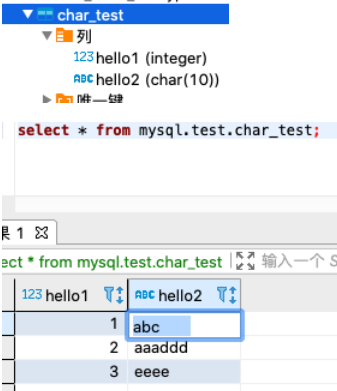

不带空格的话，是无法查到的。

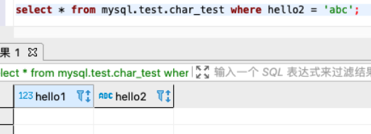

同样适用trim函数，等等也无法查到。

查了下官方的issues。这里也是推荐用户手动补齐空格。比较尴尬。

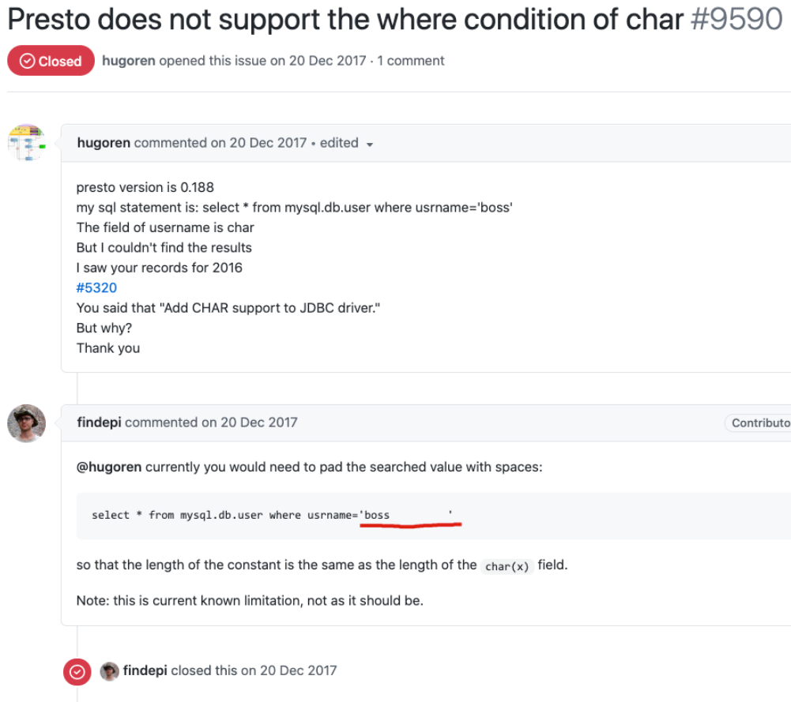

以下是我问题的解决思路：

我认为有2个方向，在执行计划优化的时候对这一块的类型进行操作，或者在最后执行的时候对其进行自动空格补齐或者去除。

那么需要定位到这2个地方。可是我目前不太确定这2个地方的精确位置在哪。

首先找了一些关于char类型实现的和讨论：

官方对char类型的开发issue https://github.com/prestodb/presto/issues/5320

有其他用户提出char的相关讨论 issue https://github.com/prestodb/presto/issues/9590 与 https://github.com/trinodb/trino/issues/3456

这些讨论都没有线索。

我想了想，如果用最快的方式实现的话，应该就是在最末尾执行时对其进行空格补齐或者统一去除。那么这样可以暂时排除在优化阶段去实现。

这样的话，其实就与hive的隐式转换中的类型转换有点像了。这里参考了网上的一篇博客，并借鉴了hive的思路。

大致原理为，我们在引擎中肯定会对各种类型进行封装，比如varchar，char，boolean等等。会封装成VarcharType，CharType等。而且它们又都是在`com.facebook.presto.spi.type` 包中。

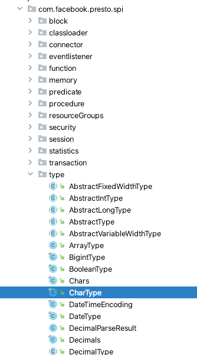

按照presto的spi习惯，有个type的接口设计，肯定就会有相关的type实现。

于是我找了找核心模块里，确实是有的

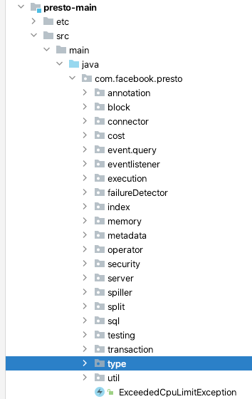

再看里面的类，基本上就明白了一大半了。

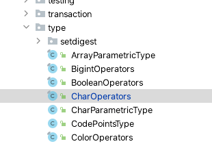

看了里面的代码，进一步确定了，这些`Operators`就是各种类型的具体操作的定义，比如 `比较`，`计算`，等等。但是这里面的代码有个很关键的地方，就比如char举例，它就只能与char类型的数据进行操作，不支持与其他类型操作。

这里与hive比较，基本上可以理解为，presto根本就没去实现隐式转换之类的相关操作。

同时我也看了看trino里的代码，貌似也没实现。

## 解决方案

都已经找到地方了，先测试测试试试，做一个简单的修改。

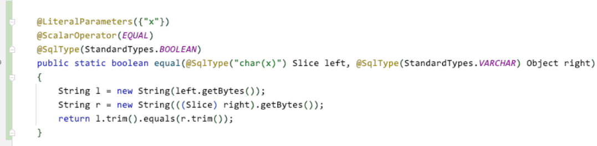

这样修改后，确实是可以了。

原始数据

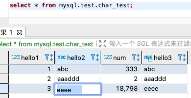

不带空格能查到

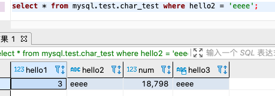

带空格也能查到，相当于与mysql的方式兼容了

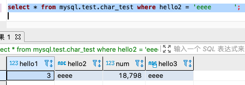

## 补充知识

默认情况下，char类型采用右补空格的方式来填充字符串至规定的长度，

下面是测试情况

```sql
 CREATE TABLE `test` (
 `name1` char(20) NOT NULL,
 `name2` varchar(20) NOT NULL
) ENGINE=InnoDB DEFAULT CHARSET=utf8 
```

```sql
INSERT INTO `test` VALUES (' haha ', ' heihei ');
```

查询一下

```sql
SELECT CONCAT(  '+', name1,  '+' ) , CONCAT(  '+', name2,  '+' ) FROM test
```

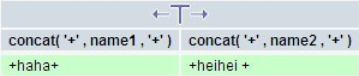

可以看出，char类型的字段，左右空格全部被去除，而varchar类型的字段，左边空格去除，右边空格保留。

官方文档中的解释

https://dev.mysql.com/doc/refman/5.7/en/char.html

比如这一段

```
The length of a CHAR column is fixed to the length that you declare when you create the table. The length can be any value from 0 to 255. When CHAR values are stored, they are right-padded with spaces to the specified length. When CHAR values are retrieved, trailing spaces are removed unless the PAD_CHAR_TO_FULL_LENGTH SQL mode is enabled.
```

当存储CHAR值时，会将余量数据用指定长度的空格右填充。

检索CHAR值时，将删除尾随空格，除非启用了PAD_CHAR_TO_FULL_LENGTH SQL模式。

注意，这里的解释，也就是说如果你主动存了空格，在检索的时候也会把空格一并删除。

所以，需要存空格的数据，是不会使用char类型去存储的。

为什么要用char，与varchar有什么区别。

主要优点：char是固定长度，固定长度的检索是要比动态长度的varchar检索要快速。

---

参考

- https://only2yangcao.github.io/2019/03/29/2019-03-29-Presto%E9%9A%90%E5%BC%8F%E7%B1%BB%E5%9E%8B%E8%BD%AC%E6%8D%A2/