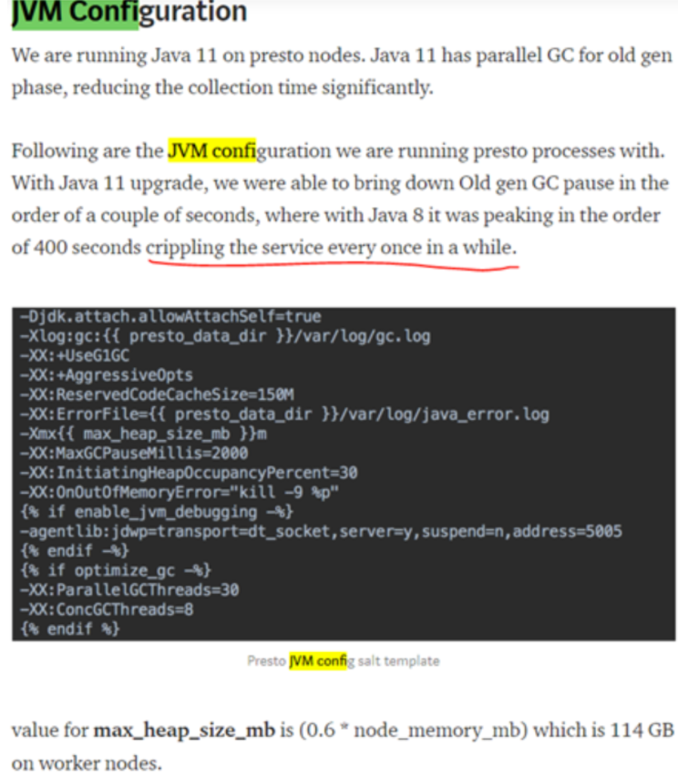
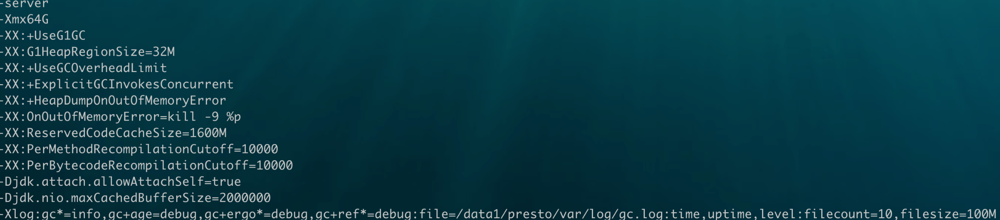

# worker资源问题

[返回目录](../README.md)

---

## 问题描述

错误日志如下

```
com.facebook.presto.operator.PageTransportTimeoutException: 
Encountered too many errors talking to a worker node. The node may have crashed or be under too much load. 
This is probably a transient issue, so please retry your query in a few minutes. 
(http://127.0.0.1:8088/v1/task/20210508_030016_00135_dze99.6.4/results/3/0 - 169 failures, failure duration 300.36s, total failed request time 310.36s)
	at com.facebook.presto.operator.HttpPageBufferClient$1.onFailure(HttpPageBufferClient.java:411)
	at com.google.common.util.concurrent.Futures$CallbackListener.run(Futures.java:1341)
	at java.util.concurrent.ThreadPoolExecutor.runWorker(ThreadPoolExecutor.java:1142)
	at java.util.concurrent.ThreadPoolExecutor$Worker.run(ThreadPoolExecutor.java:617)
	at java.lang.Thread.run(Thread.java:745)
Caused by: java.lang.RuntimeException: java.util.concurrent.TimeoutException: Total timeout 10000 ms
```

```
10-05-2021 07:36:25 CST dws_ph_contract_orderno_fact_3_3_run INFO - Query 
20210509_233038_07389_qp3na 
failed: Encountered too many errors talking to a worker node. The node may have crashed or be under too much load. 
This is probably a transient issue, so please retry your query in a few minutes. 
(http://127.0.0.1:8088/v1/task/20210509_233038_07389_qp3na.2.11/results/10/0 - 168 failures, failure duration 302.41s, total failed request time 312.41s)
```

用户侧的表现就是查询执行失败，并出现该错误。

根据现状有两种可能：

- 真的计算到内存不够了。

- 资源队列划分的不合理。

## 社区讨论

发起者 hong

```
do you have any idea about this Exception:

io.prestosql.operator.PageTransportTimeoutException: Encountered  too many errors talking to a worker node.

In my experience, this happens all the time when testing high concurrency queries. 
One worker will Full GC(or even worse OOM), so other worker can't talk to the worker.
Here is some solution in my mind:

1. reduce the Full GC, can we tune some JVM G1 properties to reduce or avoid the Full GC?
2. is there a configuration of Presto which can tuning the time of workers' http timeout, so maybe after the Full GC, the worker can still go back and the query won't fail.

how about your suggestiones, thanks!
```

有人推荐了一种jvm的参数配置



```
BTW, We try to tune some Presto configuration such as "task.client.timeout=60s , exchange.http-client.request-timeout=600s,  query.remote-task.min-error-duration=5s  " which aimed at make the coordenator and work can communicate with each after Full GC, But it seems not work well. When one of the workers under Full GC, the coordinator will lost the  worker soon.
is there other properties to make it ok?So maybe after the Full GC, the worker can still go back and the query won't fail 
```

另一个回复

```
if you are having super long GC pauses, it's either poorly formed queries, or custom logic/functionality that does too much object invocation, or a bug in Presto.
As you can see from the Yarn blog post - switching to Java 11 helped a lot.  There are no magic configuration parameters in GC that are going to fix your GC problems.
```

作者回复

```
the full gc usually take 1-2minutes. is this too long to make it faster?  change java version is not easy especially on product env
```

另一个回复，主要还是使用G1GC

```
Full GC that is 1-2 minutes, is REALLY LONG. You are stopping the world, pausing all code execution for 2 minutes.
This is a simple introduction to GC tuning with GC1 - https://www.lewuathe.com/tuning-g1-gc-algorithm-on-jvm.html
Read that, try to play.
Also I'm not sure how much memory you are giving Presto, (it depends on the JVM version) but the JVM typically starts struggling to keep up with memory allocation beyond 32GB (on high end servers and modern JVM) you can go up somewhere around 45GB

The First Cry of AtomThe First Cry of Atom
Tuning G1 GC algorithm on JVM
Recently I faced the necessity to tune garbage collection of our Java application. The application is Presto , distributed query execution engine. It requires a lot of memory but needs to achieve high throughput and low latency. So I read a book about tuning Java applications.
```

社区回复 觉得堆内存少了，应该大一点

```
32 is pretty little for Presto. We run eg 180 g heap.
However mind that duration of full GC depends on Java version and CPU speed. If something else is hogging in the background, it will take longer to clean the heap up
```

最后作者回复

都有大内存，说到当并发数上来后，问题还是会出现

```
We have 200GB memory each node while the cluster has 15 workers. One important thing is that even the worker has 300 or 500GB memory, query can still failed due to the concurrency comes to 100. maybe, is this a unavoidable problem which can solve perfectly only by add more resources?
```

目前的思路就是，可能真是内存的问题。但是现在因为对presto的内存池没有很好的理解。所以比较快速的解决方案，应该是对jvm的参数进行调整，然后搭配用户行为监控。

## 解决方案

参考了一些朋友的设置，将jvm参数修改成这样后，效果稍微好了一点。

配置1

```
-XX:G1ReservePercent=15
-XX:InitiatingHeapOccupancyPercent=40
-XX:ConcGCThreads=8
```

配置2



主要是下面3条

```
-XX:PerMethodRecompilationCutoff=10000
-XX:PerBytecodeRecompilationCutoff=10000

-Djdk.nio.maxCachedBufferSize=2000000
```

---

参考

- https://trinodb.slack.com/archives/CFLB9AMBN/p1573089763478100
- http://armsword.com/2018/05/22/the-memory-management-and-tuning-experience-of-presto/