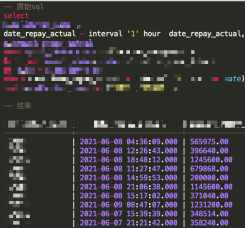
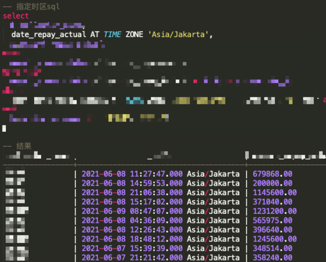
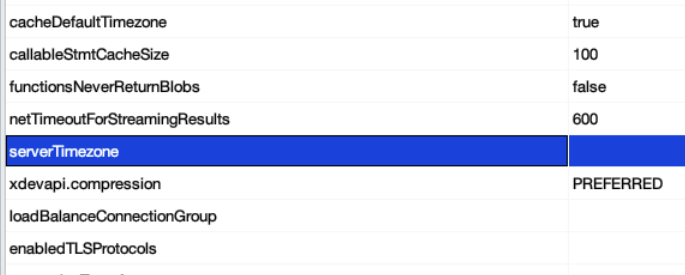
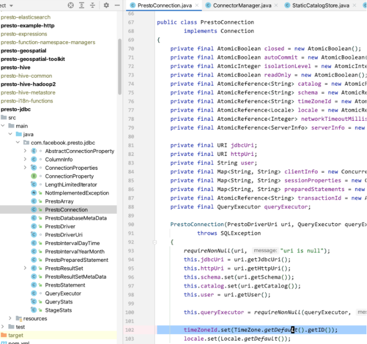

# 时区问题

[返回目录](../README.md)

---

## 问题描述

presto的部署节点与相应的catalog，都处于其他时区，比如东7区的 `Asia/Jakarta`。

presto的客户端可能处于其他时区，比如东8区的 `Asia/Shanghai`。

presto的逻辑是会将双方的时间都先转成UTC，然后再转换成对应的本地时间。

比如要在东8区查询数据范围 `10点-20点` 的数据，那么presto会自动将其转换为对应时区的本地时间。比如东7区的话就会转换为 `9点-19点`。

此时需要明确业务想要查询的数据时间范围。

最终是想查询数据源的 `本地时间` 还是 `对应时间`。

- 本地时间：在客户端查询 `10点-20点` 的数据 就等于 服务端查询对应时区的本地时区时间，比如东7区就是 `9点-19点`。
- 对应时间：在客户端查询 `10点-20点` 的数据 就等于 东7区的 `10点-20点`

## 解决方案

有两种解决方案，在sql中使用时区函数，或者修改服务端时区代码。

### 时区函数

在时间字段后面添加 `AT TIME ZONE 时区` 比如 `AT TIME ZONE 'Asia/Jakarta'`。

原始sql查询



使用时区函数查询



### 修改服务端

因为presto jdbc driver的性质，不能像常规jdbc那样，自己设置时区。

比如在连接字符串里设置这个字段



presto设置了就会出现如下错误

```
Unrecognized connection property 'serverTimezone'
```

其实就是客户端的代码逻辑里没支持这些。不让用户自己设置。

跟源码里发现，如果用户没设置，在建立连接时，就会读操作系统的默认时区。



那么如果想实现第二种，对应时间的话。

就是去修改服务端session相关的代码，将里面转换时区的逻辑暂时取消，让用户连接进去后，不接收客户端的时区，全用服务端的时区。

代码逻辑大致如下：

`com.facebook.presto.server.HttpRequestSessionContext`

```
// timeZoneId = servletRequest.getHeader(PRESTO_TIME_ZONE);
        log.debug("time zone we got from client: %s, but we just ignore it, to use server time zone: %s",
                servletRequest.getHeader(PRESTO_TIME_ZONE), TimeZone.getDefault().getID());
        timeZoneId = null;
```