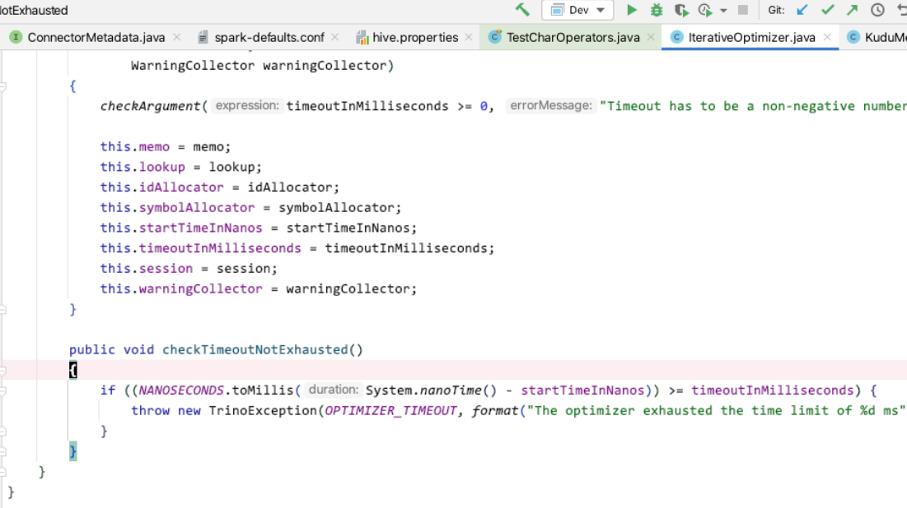

# 调试代码的超时限制

[返回目录](../README.md)

---

## 问题描述

在进行源代码调试的时候，会容易出现一个超时错误，错误现象如下

这个逻辑主要是在优化器优化的的阶段。

默认超时限制是180秒？我们仔细想想，什么样的sql需要180秒的优化时间？这么长肯定有问题了。

检查这个超过的具体代码位置为

**presto**

**trino**

## 解决方案

如果我们要暂时忽略这个超时的话，可以在那个检测的地方，把超时检测的逻辑暂时注释掉

这样我们方便我们调试代码

