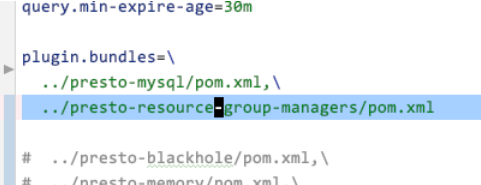

# 资源文件加载错误

[返回目录](../README.md)

---

## 问题描述

```
2021-06-13T11:26:25.520+0800	INFO	main	io.airlift.bootstrap.LifeCycleManager	Life cycle starting...
2021-06-13T11:26:25.520+0800	INFO	main	io.airlift.bootstrap.LifeCycleManager	Life cycle startup complete. System ready.
2021-06-13T11:26:25.521+0800	INFO	main	com.facebook.presto.metadata.StaticCatalogStore	-- Added catalog mysql using connector mysql --
2021-06-13T11:26:25.522+0800	INFO	main	com.facebook.presto.execution.resourceGroups.InternalResourceGroupManager	-- Loading resource group configuration manager --
2021-06-13T11:26:25.523+0800	ERROR	main	com.facebook.presto.server.PrestoServer	Resource group configuration manager file is not registered
java.lang.IllegalStateException: Resource group configuration manager file is not registered
	at com.google.common.base.Preconditions.checkState(Preconditions.java:585)
	at com.facebook.presto.execution.resourceGroups.InternalResourceGroupManager.setConfigurationManager(InternalResourceGroupManager.java:161)
	at com.facebook.presto.execution.resourceGroups.InternalResourceGroupManager.loadConfigurationManager(InternalResourceGroupManager.java:148)
	at com.facebook.presto.server.PrestoServer.run(PrestoServer.java:129)
	at com.facebook.presto.server.PrestoServer.main(PrestoServer.java:67)
```

## 解决方案

检查名字和配置内容

如果是在开发模式的 话

需要在etc/config.properties中配置

```
../presto-resource-group-managers/pom.xml
```

