# Presto元数据缓存解析

[返回首页](../../README.md)

---

## 1 简介

PrestoDB 在 2021 年推出了 RaptorX 项目，旨在全面提升查询性能。该项目的重要特性之一是分层缓存机制，通过缓存优化，官方表示查询性能可提升至原来的 10 倍。

本文将介绍分层缓存中的 `元数据缓存` (注意！目前主要是指 Hive 元数据缓存)。

## 2 Presto 元数据缓存源码解析

首先有个问题，为什么要进行 Hive 元数据缓存，在 Presto 查询加速阶段，主要是解决了什么问题？

根据日常维护的经验，常见的瓶颈点有这么几个：

1. 在 SQL 解析、优化、执行，各个阶段都会频繁的与元数据的表信息、分区信息、文件路径(hive location)、统计信息等等交互，每次的交互可能都需要连接外部服务，连大量成本都在连接层面。
2. 需要频繁连接 Hive 元数据服务，中间可能受限于网络、远端服务压力负载等等不可控因素，而造成查询抖动。

可以知道，开启元数据缓存，主要是降低远端 Hive 元数据服务因为网络及其他问题对 Presto 造成影响，保证查询稳定。

元数据缓存对查询性能的提升效果因场景而异。在大多数情况下，元数据操作在整个查询耗时中占比较小，例如在一个耗时10秒的查询中，元数据相关操作可能只占1秒左右。但在频繁查询小表或者元数据服务负载较重的场景下，元数据缓存的作用会更加明显。

元数据缓存开启很简单，在 `etc/catalog/hive.properties` 添加关键配置即可。

```
hive.metastore-cache-scope=ALL
hive.metastore-cache-ttl=30m
hive.metastore-refresh-interval=1d
hive.metastore-cache-maximum-size=100000
```

接下来根据源码，来讲解一些关键功能与流程。

对应源码 **com/facebook/presto/hive/metastore/CachingHiveMetastore.java**

### 2.1 创建与使用等流程

首先可以在 Hive Connector Factory 入口方法里，看到 HiveClientModule 和 HiveMetastoreModule 是分开加载的。

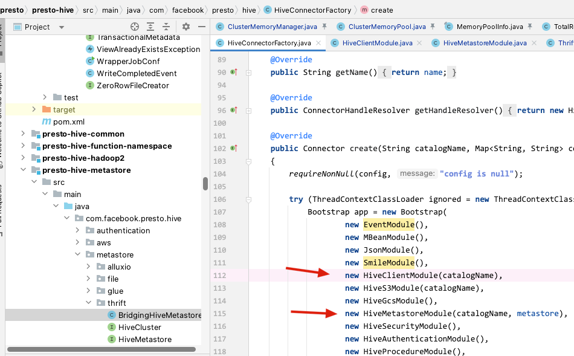

我的理解是， 因为 Presto 在操作 Hive 元数据的时候将 `元数据的操作` 与 `元数据的对接` 分成了 2 个模块。

首先我们先讲一下 `元数据的操作` 模块，HiveClientModule。

在 HiveClientModule 中会绑定一个 HiveMetadataFactory 工厂方法，用于创建元数据的相关操作，最后会返回一个 HiveMetadata 类型的对象去进行元数据相关工作。

在创建 HiveMetadata 前，会构建一个 CachingHiveMetastore 用来实现元数据的缓存功能。

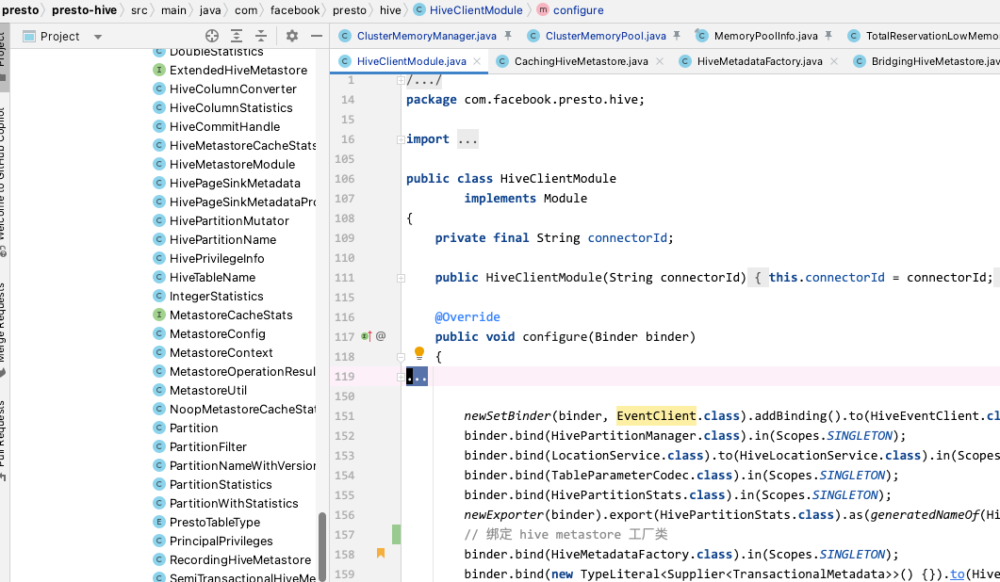

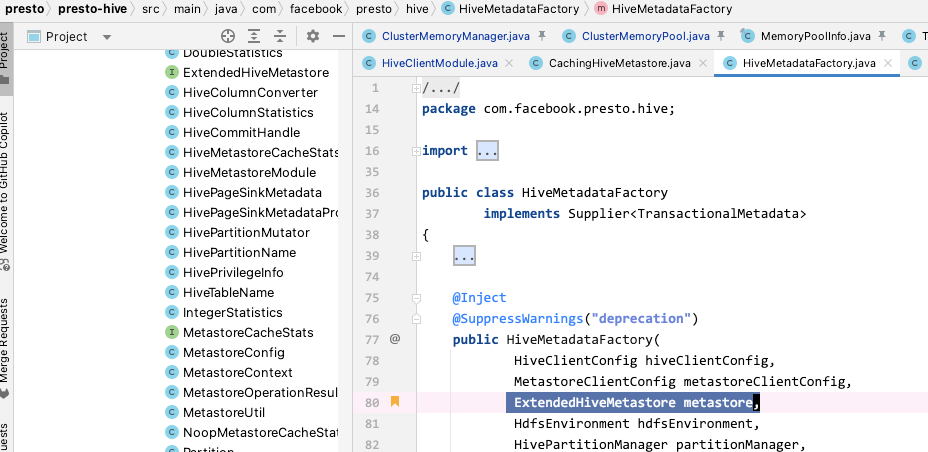

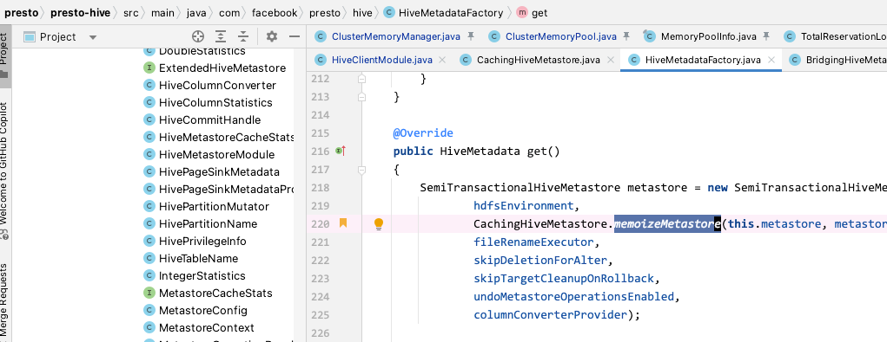

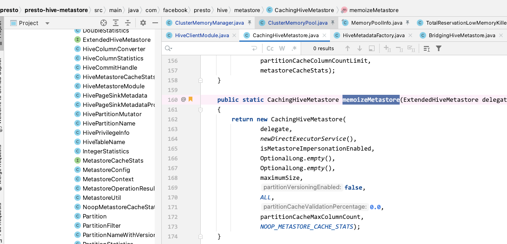

走到 memoizeMetastore 方法会进行 CachingHiveMetastore 的创建，在 CachingHiveMetastore 中，会有各种带有缓存功能元数据操作，比如 getTable、getAllDatabases、getPartition 等等操作。

同时我们注意到，在前面注入 HiveMetadataFactory 时，以及刚才的 CachingHiveMetastore 创建，里面有个 ExtendedHiveMetastore 类型的 delegate 参数，后续代码里的加载，获取等逻辑都会用到这个 delegate，这里也就是我理解的 `元数据的对接`，因为我看代码发现连接元数据不止一种方式，所以我们需要知道一下，它最终是什么。

接下来讲 `元数据的对接` 模块 HiveMetastoreModule。

在 Hive Connector Factory 加载的 HiveMetastoreModule 里，我们可以看到，这里加载了 4 种元数据模块，因为默认配置是 thrift。

最后这里默认的会走到 ThriftMetastoreModule 中。

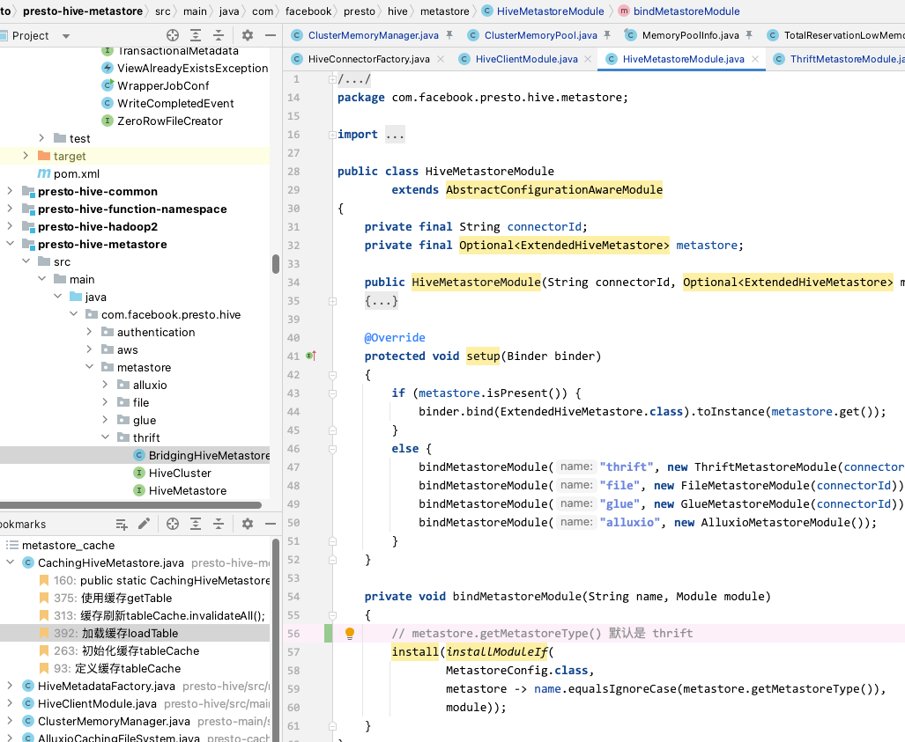

同时在 ThriftMetastoreModule 的初始化中，我们可以看到最后因为没有开启 `hive.metastore-recording-path`，而会走到 BridgingHiveMetastore 这个实现中。

> recording 这个大概意思就是开启一个元数据操作审计，记录到一个文件中。方便在远程调试 Presto 中的查询计划器（planner）和代价优化器（CBO）时查问题，因为它将 Hive Metastore 的所有操作都保存到一个 Json 文件中，方便重放可以调试优化器问题。详情可以看 https://github.com/prestodb/presto/pull/11753

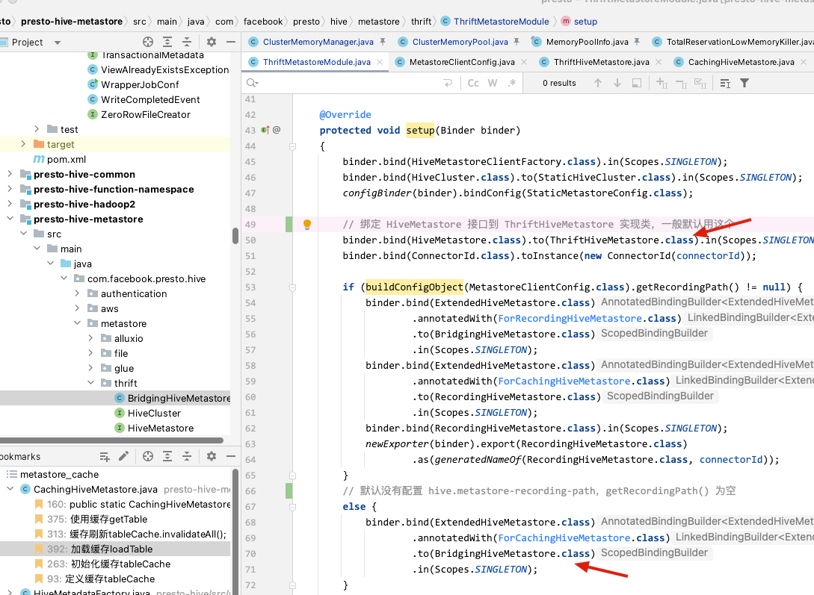

我们在 BridgingHiveMetastore 的构造方法中可以看到引入了 HiveMetastore delegate，在前面的 ThriftMetastoreModule 绑定中，是绑定了 ThriftHiveMetastore，所以最后的 delegate.getTable 是调用 ThriftHiveMetastore 里的 getTable。

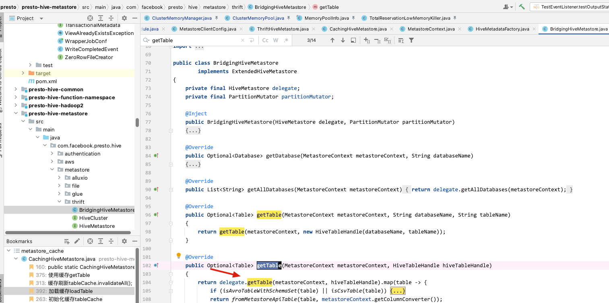

在 ThriftHiveMetastore 相关元数据操作，我们可以理解为是调用了 Hive api 进行元数据的操作。

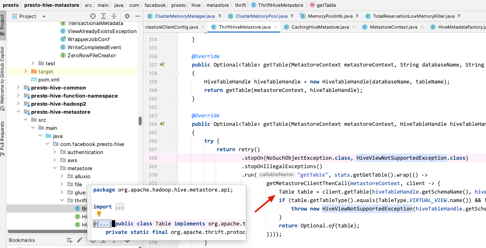


所以在创建与使用这里，我们简单总结一下，如果是选择了默认模式 `Thrift`，最终会使用 Hive Metastore Api 的方式进行元数据的相关操作。

### 2.2 缓存范围与内容

PrestoDB 使用了 Google 的 `com.google.common.cache.LoadingCache` 进行 Hive Metastore 数据缓存。

缓存范围配置对应的区分逻辑如下，可以看到将缓存分成了 2 大类，Metastore 所有数据与单独的 Partition 数据，对应下面枚举的 ALL 和 PARTITION。

```java
public enum MetastoreCacheScope
{
    ALL, PARTITION
}

protected final ExtendedHiveMetastore delegate;
private final LoadingCache<KeyAndContext<String>, Optional<Database>> databaseCache;
private final LoadingCache<KeyAndContext<String>, List<String>> databaseNamesCache;
private final LoadingCache<KeyAndContext<HiveTableHandle>, Optional<Table>> tableCache;
private final LoadingCache<KeyAndContext<String>, Optional<List<String>>> tableNamesCache;
private final LoadingCache<KeyAndContext<HiveTableName>, PartitionStatistics> tableStatisticsCache;
private final LoadingCache<KeyAndContext<HiveTableName>, List<TableConstraint<String>>> tableConstraintsCache;
private final LoadingCache<KeyAndContext<HivePartitionName>, PartitionStatistics> partitionStatisticsCache;
private final LoadingCache<KeyAndContext<String>, Optional<List<String>>> viewNamesCache;
private final LoadingCache<KeyAndContext<HivePartitionName>, Optional<Partition>> partitionCache;
private final LoadingCache<KeyAndContext<PartitionFilter>, List<String>> partitionFilterCache;
private final LoadingCache<KeyAndContext<HiveTableName>, Optional<List<String>>> partitionNamesCache;
private final LoadingCache<KeyAndContext<UserTableKey>, Set<HivePrivilegeInfo>> tablePrivilegesCache;
private final LoadingCache<KeyAndContext<String>, Set<String>> rolesCache;
private final LoadingCache<KeyAndContext<PrestoPrincipal>, Set<RoleGrant>> roleGrantsCache;

private final MetastoreCacheStats metastoreCacheStats;
private final boolean metastoreImpersonationEnabled;
private final boolean partitionVersioningEnabled;
private final double partitionCacheValidationPercentage;
private final int partitionCacheColumnCountLimit;
```
缓存的分类最后是靠不同的 `失效时间、刷新时间、缓存大小` 来区分的。

```java
switch (metastoreCacheScope) {
    case PARTITION:
        partitionCacheExpiresAfterWriteMillis = expiresAfterWriteMillis;
        partitionCacheRefreshMills = refreshMills;
        partitionCacheMaxSize = maximumSize;
        cacheExpiresAfterWriteMillis = OptionalLong.of(0);
        cacheRefreshMills = OptionalLong.of(0);
        cacheMaxSize = 0;
        break;
    case ALL:
        partitionCacheExpiresAfterWriteMillis = expiresAfterWriteMillis;
        partitionCacheRefreshMills = refreshMills;
        partitionCacheMaxSize = maximumSize;
        cacheExpiresAfterWriteMillis = expiresAfterWriteMillis;
        cacheRefreshMills = refreshMills;
        cacheMaxSize = maximumSize;
        break;
    default:
        throw new IllegalArgumentException("Unknown metastore-cache-scope: " + metastoreCacheScope);
}
```

### 2.3 缓存的构建与刷新


缓存的构建，首先创建了一个默认的 `com.google.common.cache.CacheBuilder` 实例，然后根据参数的情况进行配置。

- 如果 expiresAfterWriteMillis 参数存在，就使用 expireAfterWrite 方法设置过期时间。
- 如果 refreshMillis 参数存在，并且满足自动刷新的条件，就使用 refreshAfterWrite 方法设置自动刷新时间。
- 通过链式调用 maximumSize 方法设置最大容量，并调用 recordStats 方法启用统计信息记录。

最后，返回配置好的 CacheBuilder 实例. 注意, 以下的所有操作均在 `com.google.common.cache.LoadingCache` 中操作

```java
// CachingHiveMetastore 构造方法中
...
...
...

databaseCache = newCacheBuilder(cacheExpiresAfterWriteMillis, cacheRefreshMills, cacheMaxSize)
        .build(asyncReloading(CacheLoader.from(this::loadDatabase), executor));
tableNamesCache = newCacheBuilder(cacheExpiresAfterWriteMillis, cacheRefreshMills, cacheMaxSize)
        .build(asyncReloading(CacheLoader.from(this::loadAllTables), executor));

...
...
...


// 创建的缓存创建方法
private static CacheBuilder<Object, Object> newCacheBuilder(OptionalLong expiresAfterWriteMillis, OptionalLong refreshMillis, long maximumSize)
{
    CacheBuilder<Object, Object> cacheBuilder = CacheBuilder.newBuilder();
    // 如果设置了ttl，则使用过期时间策略，不使用自动刷新策略，来对缓存进行刷新
    if (expiresAfterWriteMillis.isPresent()) {
        cacheBuilder = cacheBuilder.expireAfterWrite(expiresAfterWriteMillis.getAsLong(), MILLISECONDS);
    }
    // 如果设置了refresh，且没有设置 ttl 则用自动刷新策略
    // 如果设置了refresh，且设置了 ttl，且 ttl 大于 refresh 则用 自动刷新策略，如果小于则会走上面的逻辑，走过期时间策略
    if (.isPresent() && (!expiresAfterWriteMillis.isPresent() || expiresAfterWriteMillis.getAsLong() > refreshMillis.getAsLong())) {
        cacheBuilder = cacheBuilder.refreshAfterWrite(refreshMillis.getAsLong(), MILLISECONDS);
    }
    return cacheBuilder.maximumSize(maximumSize).recordStats();
}
```

这里简单介绍一下 LoadingCache 核心特性以及我们使用到的 2 个方法

LoadingCache的核心特性：

- 自动加载: 通过CacheLoader自动加载缓存数据
- 并发控制: 保证同一个key只有一个线程在加载数据
- 统计功能: 提供命中率、加载时间等统计信息
- 回收策略: 支持多种缓存回收策略

使用的 2 个方法：

expireAfterWrite和refreshAfterWrite的主要区别:

1. 过期行为:
   - expireAfterWrite: 直接删除过期数据，下次访问同步加载
   - refreshAfterWrite: 保留旧数据，异步刷新，保证请求响应时间

2. 使用场景:
   - expireAfterWrite: 适用于数据一致性要求高的场景
   - refreshAfterWrite: 适用于性能要求高，可以容忍短暂数据不一致的场景

3. 性能影响:
   - expireAfterWrite: 可能造成请求阻塞
   - refreshAfterWrite: 能够提供更平滑的性能表现

这两个方法的区别在于过期策略和刷新策略：

- `expireAfterWrite` 是基于过期时间的策略，缓存项在指定的时间段内没有被访问时，会被自动移除。这种策略适用于缓存数据的有效期明确，且不需要频繁刷新的场景。
- `refreshAfterWrite` 是基于自动刷新的策略，缓存项在指定的时间段内没有被访问时，仍然可以返回旧值，并异步加载新值。这种策略适用于需要在后台更新缓存项的场景，以保持数据的实时性。

需要注意的是，`expireAfterWrite` 和 `refreshAfterWrite` 方法可以根据具体需求单独使用，也可以同时使用。根据缓存的特性和业务需求，可以选择合适的过期策略和刷新策略来优化缓存性能和数据的准确性。


在以上解释中提到的 `下次访问该缓存项时，将触发加载器重新加载该缓存项`，和 `同时启动一个异步线程去加载新值` 对应的代码如下：

```java
databaseNamesCache = newCacheBuilder(cacheExpiresAfterWriteMillis, cacheRefreshMills, cacheMaxSize)
        .build(
            asyncReloading(CacheLoader.from(this::loadAllDatabases), executor) // 异步重新加载缓存项的辅助方法
        );
```

官方解释：`如果您选择使用 Guava 提供的现有实现，可以使用 CacheLoader.from() 方法来创建缓存项加载器。该方法接受一个实现 CacheLoader 接口的对象或方法引用，用于定义加载缓存项的逻辑。在 expireAfterWrite 策略中，当缓存项过期时，会调用加载器的 load 方法重新加载缓存项的值。`


### 2.3 缓存的加载与使用

CachingHiveMetastore 继承了 ExtendedHiveMetastore 接口。

这里面定义了很多元数据操作的方法，比如 getTable、getDatabase、getPartition 等等。

我是理解，在 CachingHiveMetastore 实现这些方法的时候，就一并把缓存功能给做了。

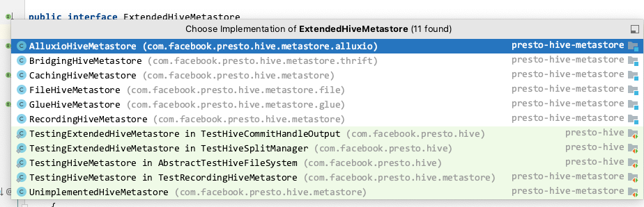

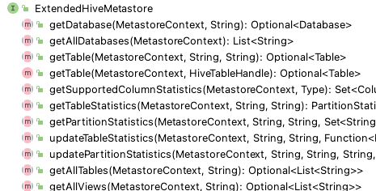


比如在 getTable 时，File、Hudi、Iceberg 等等 

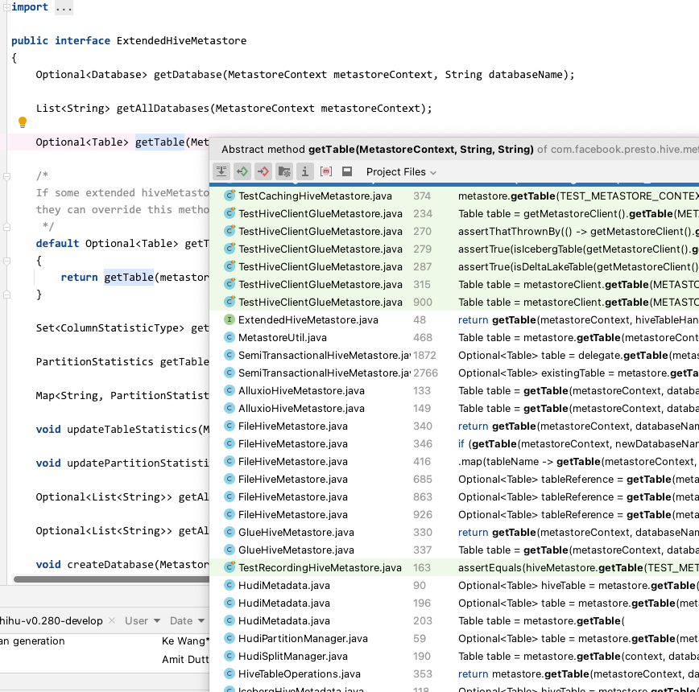

需要注意，在初始化的时候有个加载逻辑，这里的设计是为什么呢？

```java
private CachingHiveMetastore(
            ExtendedHiveMetastore delegate,
            ExecutorService executor,  
            // ***
    {
        // ***
        
        tableCache = newCacheBuilder(cacheExpiresAfterWriteMillis, cacheRefreshMills, cacheMaxSize)
                .build(asyncReloading(CacheLoader.from(this::loadTable), executor));
                
        // ***
    }
 

// 这里的 delegate 是 
private Optional<Table> loadTable(KeyAndContext<HiveTableHandle> hiveTableHandle)
{
    return delegate.getTable(hiveTableHandle.getContext(), hiveTableHandle.getKey());
}

```

理解可能有以下几点：

1. 缓存初始化、预加载
2. 提高查询效率
3. 保证一致性，保证缓存是最新的，与远端的HMS保证一直


## 3 Presto 元数据缓存配置解释

```
hive.metastore-cache-scope=ALL
hive.metastore-cache-ttl=45m
hive.metastore-refresh-interval=50m
hive.metastore-cache-maximum-size=10000000
```

根据前面的源码解析，我的理解为：

- ttl 代表每 间隔 多少 时间，会将相应的 LoadingCache 失效，然后去调用加载器，实现数据重新加载
- refresh-interval 代表每 间隔 多少 时间，会去调用加载器，实现缓存的重新加载，这个配置的目的是保持缓存项的数据实时性，而无需等待缓存项过期或被访问才触发加载

粗略来看，发现2个配置的功能有点相似，但是该如何配置呢？


1.  **`expireAfterWrite`的设置**：
    *   根据数据的有效性和变化频率来决定缓存项的过期时间。如果数据很少发生变化，并且希望在一段时间后强制重新加载最新数据，可以设置较长的过期时间。如果数据频繁变化，需要更频繁地从数据源加载最新数据，可以设置较短的过期时间。
    *   考虑数据的更新频率和重要性。如果数据的更新频率较低，或者对于过期数据的使用不会造成严重的问题，可以设置较长的过期时间。如果数据的更新频率较高，或者对于过期数据的使用会导致严重的问题，可以设置较短的过期时间。
2.  **`refreshAfterWrite`的设置**：
    *   根据数据的变化频率和实时性需求来决定刷新时间间隔。如果数据的变化频率较低，并且实时性要求不高，可以设置较长的刷新时间间隔。如果数据的变化频率较高，需要更频繁地更新数据，可以设置较短的刷新时间间隔。
    *   考虑对于旧值和新值的访问需求。如果对于旧值的访问没有明确要求，而且重要的是尽快获取最新值，可以设置较短的刷新时间间隔。如果对于旧值的访问有特定的需求，并且实时性要求不高，可以设置较长的刷新时间间隔。


当缓存中不存在请求的元数据时，`CachingHiveMetastore` 会通过 `CacheLoader` 自动加载所需的数据。这一过程如下：

1.  **缓存未命中**： 当请求的键在缓存中不存在时，`LoadingCache` 会调用 `CacheLoader` 来加载数据。在这里，通过 `get` 方法获取数据时，如果缓存未命中，会触发 `load` 方法。
2.  **加载数据**： 在 `CacheLoader` 中定义了相应的加载逻辑，例如 `loadTable` 方法：
3.  **更新缓存**： 加载到的数据会自动更新到缓存中，保证下一次请求能够直接从缓存中获取数据。
    

```
private static <K, V> V get(LoadingCache<K, V> cache, K key)
{
    try {
        return cache.getUnchecked(key);
    }
    catch (UncheckedExecutionException e) {
        throwIfInstanceOf(e.getCause(), PrestoException.class);
        throw e;
    }
}
```

在 `get` 方法中，如果缓存中不存在请求的键，`cache.getUnchecked(key)` 会触发 `CacheLoader` 中的 `load` 方法来加载数据，并将结果存入缓存。

## 4 Presto 元数据缓存的监控

监控效果如下：

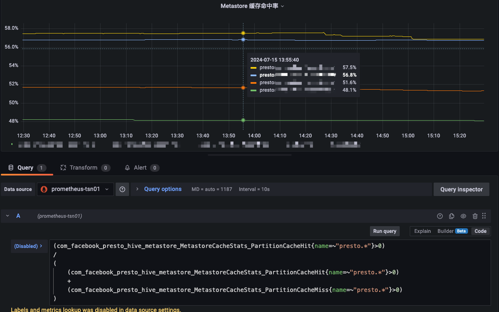

主要的监控指标为：

```
com_facebook_presto_hive_metastore_MetastoreCacheStats_PartitionCacheEviction{name="hive",} 0.0
com_facebook_presto_hive_metastore_MetastoreCacheStats_PartitionCacheHit{name="hive",} 0.0
com_facebook_presto_hive_metastore_MetastoreCacheStats_PartitionCacheMiss{name="hive",} 1.0
com_facebook_presto_hive_metastore_MetastoreCacheStats_PartitionCacheSize{name="hive",} 1.0
com_facebook_presto_hive_metastore_MetastoreCacheStats_PartitionsWithColumnCountGreaterThanThreshold_FifteenMinute_Count{name="hive",} 0.0
com_facebook_presto_hive_metastore_MetastoreCacheStats_PartitionsWithColumnCountGreaterThanThreshold_FifteenMinute_Rate{name="hive",} 0.0
com_facebook_presto_hive_metastore_MetastoreCacheStats_PartitionsWithColumnCountGreaterThanThreshold_FiveMinute_Count{name="hive",} 0.0
com_facebook_presto_hive_metastore_MetastoreCacheStats_PartitionsWithColumnCountGreaterThanThreshold_FiveMinute_Rate{name="hive",} 0.0
com_facebook_presto_hive_metastore_MetastoreCacheStats_PartitionsWithColumnCountGreaterThanThreshold_OneMinute_Count{name="hive",} 0.0
com_facebook_presto_hive_metastore_MetastoreCacheStats_PartitionsWithColumnCountGreaterThanThreshold_OneMinute_Rate{name="hive",} 0.0
com_facebook_presto_hive_metastore_MetastoreCacheStats_PartitionsWithColumnCountGreaterThanThreshold_TotalCount{name="hive",} 0.0
```

## 5 总结

Hive Metastore Cache 其实就是 Guava 包中的 LoadingCache。

其中2个参数：

- ttl 对应 expireAfterWrite
- refresh 对应 refreshAfterWrite
 
简单解释就是：

- 如果设置了ttl，则使用过期时间策略，不使用自动刷新策略，来对缓存进行刷新
- 如果设置了refresh，且没有设置 ttl 则用自动刷新策略
- 如果设置了refresh，且设置了 ttl，且 ttl 大于 refresh 则用 自动刷新策略，如果小于则会走上面的逻辑，走过期时间策略

为什么要配置这2个参数，或者说把它理解为 LoadingCache 的 expireAfterWrite 方法与 refreshAfterWrite 的区别也可以。

LoadingCache 有三种基于时间清理或刷新缓存数据的方式：

- expireAfterAccess: 当缓存项在指定的时间段内没有被读或写就会被回收。
- expireAfterWrite：当缓存项在指定的时间段内没有更新就会被回收（移除key），需要等待获取新值才会返回。
- refreshAfterWrite：当缓存项上一次更新操作之后的多久会被刷新。第一个请求进来，执行load把数据加载到内存中（同步过程），指定的过期时间内比如10秒，都是从cache里读取数据。过了10秒后，没有请求进来，不会移除key。再有请求过来，才则执行reload，在后台异步刷新的过程中，如果当前是刷新状态，访问到的是旧值。刷新过程中只有一个线程在执行刷新操作，不会出现多个线程同时刷新同一个key的缓存。在吞吐量很低的情况下，如很长一段时间内没有请求，再次请求有可能会得到一个旧值（这个旧值可能来自于很长时间之前），这将会引发问题。（可以使用expireAfterWrite和refreshAfterWrite搭配使用解决这个问题）

refreshAfterWrite是在指定时间内没有被创建/覆盖，则指定时间过后，再次访问时，会去刷新该缓存，在新值没有到来之前，始终返回旧值
跟expire的区别是，指定时间过后，expire是remove该key，下次访问是同步去获取返回新值；而refresh则是指定时间后，不会remove该key，下次访问会触发刷新，新值没有回来时返回旧值


```
解释了这么多，可以再来理解对应 Presto Hive Metastore 的配置

1. 如果配置了 hive.metastore-cache-ttl ，则代表缓存会根据配置的时间自动过期。
   如果再去获得已过期的缓存，则相当于重新调用 load 方法，需要等待新的数据返回，可以理解为同步返回。

2. 如果配置了 hive.metastore-refresh-interval 且它的时间小于 hive.metastore-cache-ttl，
   则代表使用缓存自动刷新。
   需要注意的是如果在刷新缓存时有数据访问，如果新值没有到来，则会获得旧值，
   可以理解为异步返回，因为此时有个异步线程在更新数据。
```

