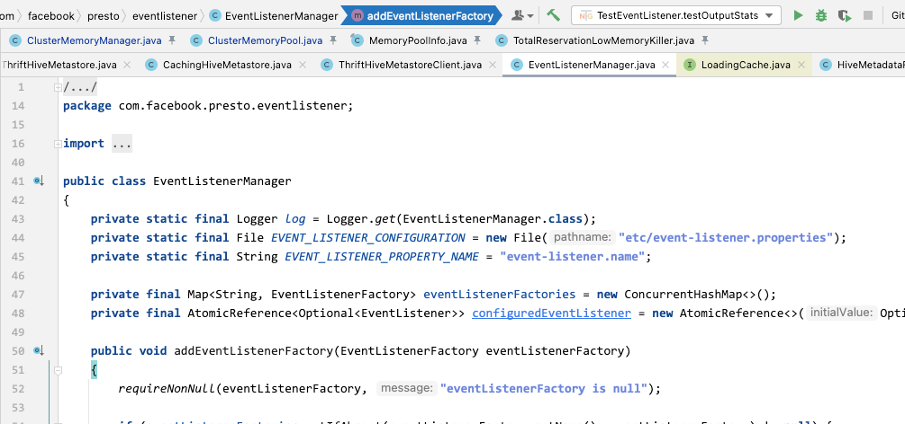
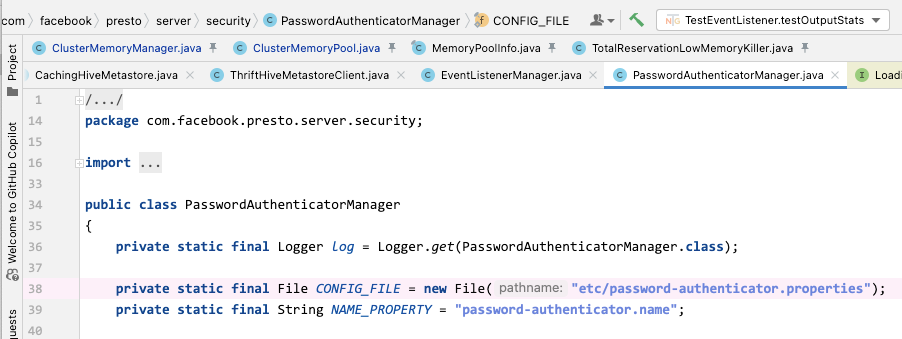
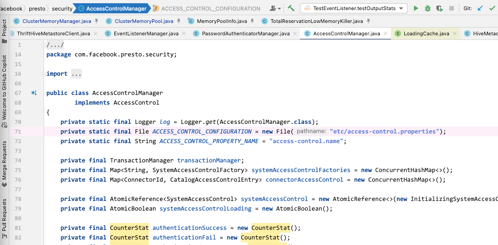

# 二次开发工程体系介绍

[返回首页](../../README.md)

---

> 一句话介绍：Presto&Trino 得益于优秀的插件系统，在企业级大数据体系功能对接的场景中，认证、授权、审计、Hadoop 自定义功能、自定义 UDF、数据湖，全可以实现独立工程开发以插件的方式添加到 Presto 中，不会对主工程造成污染，方便主工程与社区同步。同时又因为 Connector 体系的优秀设计，在对接各种存储、数据库等引擎开发时，也可以实现独立工程的方式。

## 企业基础对接功能

### 审计

https://prestodb.io/docs/current/develop/event-listener.html

presto-main/src/main/java/com/facebook/presto/eventlistener/EventListenerManager.java

### 认证

https://prestodb.io/docs/current/develop/password-authenticator.html

presto-main/src/main/java/com/facebook/presto/server/security/PasswordAuthenticatorManager.java

### 权限

https://prestodb.io/docs/current/develop/system-access-control.html

presto-main/src/main/java/com/facebook/presto/security/AccessControlManager.java

### Hadoop 自定义功能

