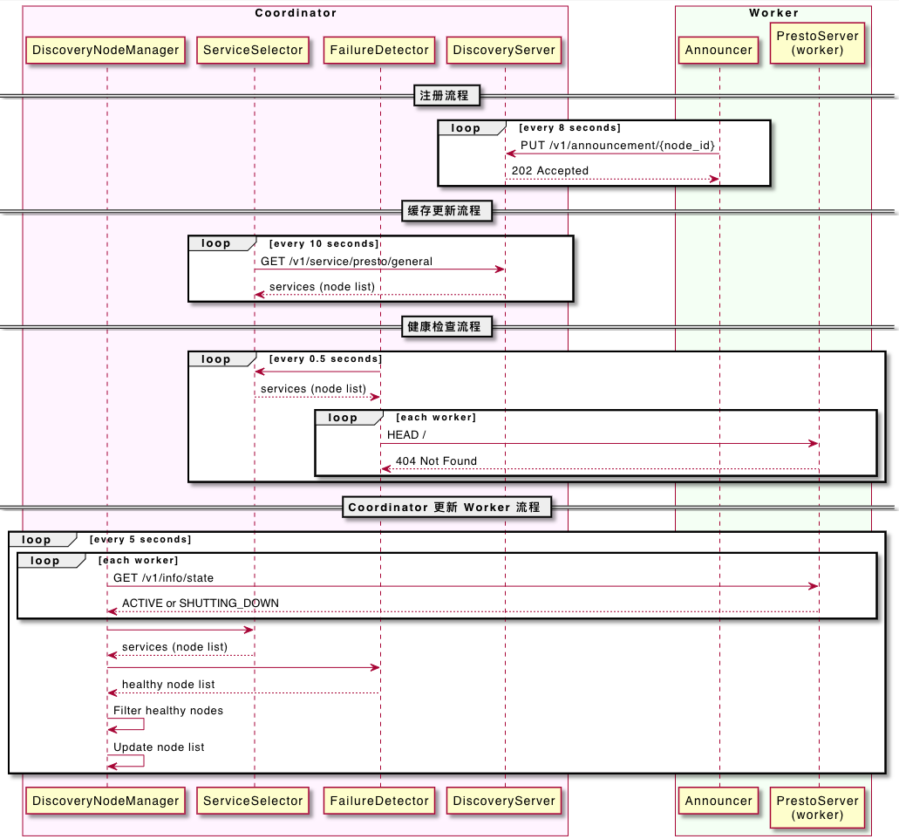
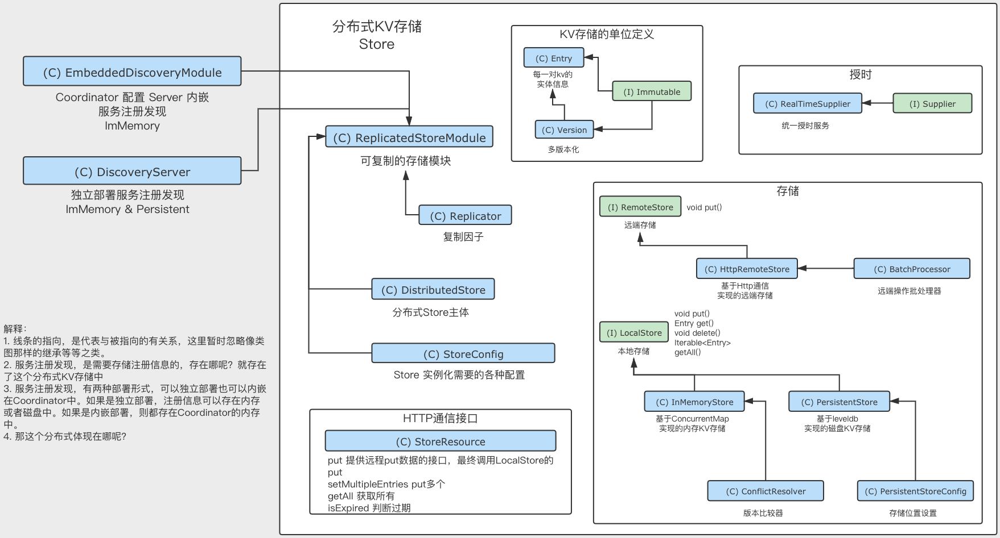

# 服务发现-主要流程介绍篇

[返回首页](../README.md)

---

## 简述

在使用 Presto 的时候有没有想过这几个问题？

1. Presto 是怎么组建集群的？
2. Presto 的 Coordinator 与 Worker 是怎么联系起来的？
3. 配置了个服务发现，它是怎么工作的？

这方面的资料特别少，基本上只有啃源码，但是怎么啃真是一点头绪都没有。于是我搜遍了全网，找了一个日本博主的文章。这篇文章给了我很多启发。

以下主要是对博主的文章进行翻译，然后丰富里面的流程内容，并且带上我自己的理解。

代码主要是 Trino 为主 Presto 为辅结合起来看，如果两边有明显的实现区别，会贴一下两边区别的代码，否则都以 Trino 为主，因为它们的服务注册发现都是基于 airlift 的 discovery 模块实现的。

最后根据文中的内容看看是否能解答这3个问题。

## 四个主要流程讲解

>注：服务注册发现 discovery node manager 的实现主要在密封类 `trino-main/io.trino.metadata.DiscoveryNodeManager` 中，这个是在 Presto 的主体工程中。其他的在 Presto 生态的基础框架中。

Presto 的 Coordinator 利用 discovery node manager 注册或更新 worker nodes 来实现集群化。

Coordinator 就相当于主从架构的主，Worker 就是从，由 Coordinator 来做任务接收、解析、查询执行计划生成、任务调度分发等操作，Worker 只是被动接收信息然后干活，Coordinator 要能与 Worker 联系起来的话，就需要 discovery 中的 Worker 信息。

它们之间的流程主要涉及以下四个流程：

- 1、注册流程，每个 worker node 每 8 秒向 discovery server 注册一次；
- 2、缓存更新流程，service selector 以10秒为间隔更新 discovery server 中注册的节点信息缓存；
- 3、健康检查流程，每 0.5 秒执行一次 worker nodes 的健康检查；
- 4、Coordinator 更新 Worker 流程，discovery node manager 更新 worker node 列表；

对上面的四点，画了个大概的时序图



接下来详细解读这4个流程

### 注册流程

>注：以下内容以内嵌服务发现的方式来讲解

Presto 的服务发现的功能，有 Client 与 Server 两个角色。Coordinator 使用 EmbeddedDiscoveryModule 配置了 Server 角色。Coordinator 和 Worker 使用 DiscoveryModule 配置了 Client 角色，然后 Client 主要使用 Announcer 向 Server 发起注册。

再理解这句话之前，需要知道几个细节，是怎么成为 Coordinator 节点或 Worker 节点的，并且怎么注册到 Discovery 服务中的，并且这些角色是如何启动的。

通过查看 Airlift 项目，发现 Airlift 中的 Discovery 是 Client 端，另一个在 discovery-server 项目里。是两个不同的项目。

- https://github.com/airlift/airlift 客户端的在这里面
- https://github.com/airlift/discovery 服务端的在这里面

**怎么成为Coordinator/Woker节点的呢？**

跟一下代码

```java
// io.trino.server.TrinoServer
...
new Server().start(firstNonNull(version, "unknown")); // 准备启动服务
...

// io.trino.server.Server
public final void start(String trinoVersion)
{
    new EmbedVersion(trinoVersion).embedVersion(() -> doStart(trinoVersion)).run();
}
private void doStart(String trinoVersion)
{
    ...
    ImmutableList.Builder<Module> modules = ImmutableList.builder();
    modules.add(
            new NodeModule(),
            new DiscoveryModule(), // 加载注册发现服务，注意这里是 Discovery 的 client 端
            new HttpServerModule(),
            new JsonModule(),
            new JaxrsModule(),
            new MBeanModule(),
            new PrefixObjectNameGeneratorModule("io.trino"),
            new JmxModule(),
            new JmxHttpModule(),
            new LogJmxModule(),
            new TraceTokenModule(),
            new EventModule(),
            new JsonEventModule(),
            new ServerSecurityModule(),
            new AccessControlModule(),
            new EventListenerModule(),
            new CoordinatorDiscoveryModule(), // 加载 Coordinator 专属的注册发现服务，注意这里是 Discovery 的 Server 端
            new ServerMainModule(trinoVersion), // 加载节点与服务相关的主 Module 在这里确认是启动 Coordinator 还是 Worker
            new GracefulShutdownModule(),
            new WarningCollectorModule());

    ...
    injector.getInstance(Announcer.class).start(); // client 端启动
    
...

// io.trino.server.CoordinatorDiscoveryModule
...
install(new EmbeddedDiscoveryModule()); // 服务端的启动
...


// io.trino.server.ServerMainModule
protected void setup(Binder binder)
{
    ServerConfig serverConfig = buildConfigObject(ServerConfig.class); // 根据配置中的内容
    if (serverConfig.isCoordinator()) {
        install(new CoordinatorModule()); // 成为Coordinator
    }
    else {
        install(new WorkerModule()); // 成为Worker
    }
...
```

Presto的区别

```
Trino，是在启动时，加载了大部分modules，然后有些地方再通过配置去区分。这一块基本上就像是平铺，然后再去控制。
Presto，这里算是做了一下归类，比如把CoordinatorDiscoveryModule集成到了所有与Coordinator有关的地方。
```

下面看一下代码

```java
// com.facebook.presto.server.PrestoServer

@Override
public void run()
{
    verifyJvmRequirements();
    verifySystemTimeIsReasonable();
    Logger log = Logger.get(PrestoServer.class);
    ImmutableList.Builder<Module> modules = ImmutableList.builder();
    modules.add(
            ...
            new ServerMainModule(sqlParserOptions), // 与 Coordinator Worker 角色相关的所有内容都集成在了这里面
            ...

// com.facebook.presto.server.ServerMainModule

public class ServerMainModule
        extends AbstractConfigurationAwareModule
{
    private final SqlParserOptions sqlParserOptions;

    public ServerMainModule(SqlParserOptions sqlParserOptions) { ... }

    @Override
    protected void setup(Binder binder)
    {
        ServerConfig serverConfig = buildConfigObject(ServerConfig.class);

        if (serverConfig.isResourceManager()) {
            install(new ResourceManagerModule());
        }
        else if (serverConfig.isCoordinator()) {
            install(new CoordinatorModule()); // Coordinator的注册服务也集成到里面一起了
        }
        else {
            install(new WorkerModule());
        }

// com.facebook.presto.server.CoordinatorModule

public class CoordinatorModule
        extends AbstractConfigurationAwareModule
{
    @Override
    protected void setup(Binder binder)
    {
        ...
        // discovery server
        install(installModuleIf(EmbeddedDiscoveryConfig.class, EmbeddedDiscoveryConfig::isEnabled, new EmbeddedDiscoveryModule())); // 服务注册
```

**Coordinator/Woker节点如何注册的呢？**

从上面的源码我们可以看出，是在启动服务的时候加载 Module，在 ServerMainModule 中通过配置判断启动 Coordinator 还是 Worker。

注意到在加载 Module 的时候，我们既加载了 Discovery 的 Client，也加载了 Server。他们是怎么区分的呢？

这里有同样也有个细节，也是关于配置文件的。

在启动时，通过加载 DiscoveryModule 来注册 Client 端。在加载 CoordinatorDiscoveryModule 时里面有个对配置文件的判断。

相当于如果配置文件中指明了该节点是 Coordinator，那么会在还会加载一个 EmbeddedDiscoveryModule 来注册 Server 端。

```java
// io.trino.server.CoordinatorDiscoveryModule
protected void setup(Binder binder)
{
    // 注意这个判断，这里如果配置文件中设置为 isEnabled 那么就会加载发现服务的 Server 端，如果没指定发现服务可以单独部署
    if (buildConfigObject(ServerConfig.class).isCoordinator() && buildConfigObject(EmbeddedDiscoveryConfig.class).isEnabled()) {
        install(new EmbeddedDiscoveryModule());
    }
}
```

注意到我们前面说的发现服务是可以单独部署(在官方文档里给出的建议是内嵌)，如果发现服务内嵌在 Coordinator 的话，那么 Coordinator 的 Server 中包含发现服务的 Server，发现服务的 Server 会接收所有 Worker 发现服务 Client 端的请求，同时也会接收 Coordinator 的发现服务 Client 端的请求。

我们可以通过 `/v1/service` 接口可以来验证所有的注册信息。(这里的前提是发现服务内嵌在 Coordinator 中)。

准备了一个测试环境，启动了2个节点，1个Coordinator，1个Worker。

在接口中查看到以下数据，并且发现2台节点应该是都注册的 Client，另一个节点因为是 Coordinator 它是还多注册了一个 server。

```json
{
  "environment": "cdh6_test",
  "services": [
    { ... },
    { ... },
    {
      "id": "25a99b20-bcd4-4f81-881f-8432fdd62557",
      "nodeId": "tcdh31",
      "type": "presto",
      "pool": "general",
      "location": "/tcdh31",
      "properties": {
        "node_version": "",
        "coordinator": "false",
        "http": "http://10.150.31.31:5797",
        "http-external": "http://10.150.31.31:5797",
        "connectorIds": "**"
      }
    },
    { },
    {
      "id": "924b4589-1d63-4bbe-a2f5-78a62f91a4fc",
      "nodeId": "tcdh29",
      "type": "presto-coordinator",
      "pool": "general",
      "location": "/tcdh29",
      "properties": {
        "http": "http://10.150.31.29:5797",
        "http-external": "http://10.150.31.29:5797"
      }
    },
    { ... },
    { ... },
    { ... },
    {
      "id": "d7147db7-cfba-4c57-9d7f-e10183650471",
      "nodeId": "tcdh29",
      "type": "presto",
      "pool": "general",
      "location": "/tcdh29",
      "properties": {
        "node_version": "",
        "coordinator": "true",
        "http": "http://10.150.31.29:5797",
        "http-external": "http://10.150.31.29:5797",
        "connectorIds": "***"
      }
    }
  ]
}
```

Client 通过向 `/v1/announcement/{node_id}` 发送 PUT 请求来向服务器注册自己。注册信息有30秒的生命周期，所以client会定期向服务器发送注册请求。这个间隔是 8 秒，源码如下：

**Client角色启动 Airlift工程 discovery模块 客户端的发送**

```java
// io.trino.server.Server
...
injector.getInstance(Announcer.class).start();
...

// io.airlift.discovery.client.Announcer 客户端发起注册的代码 发起put
// announce 准备开始
public void start()
{
    checkState(!executor.isShutdown(), "Announcer has been destroyed");
    if (started.compareAndSet(false, true)) {
        // announce immediately, if discovery is running
        ListenableFuture<Duration> announce = announce(System.nanoTime(), new Duration(0, SECONDS));
        try {
            announce.get(30, SECONDS); // 30秒的生命中周期
        }
        catch (Exception ignored) {
        }
    }
}

...
// announce 异步发送，在回调函数中进行延迟等待，然后准备下一次的announce
private ListenableFuture<Duration> announce(long delayStart, Duration expectedDelay)
{
    // log announcement did not happen within 5 seconds of expected delay
    if (System.nanoTime() - (delayStart + expectedDelay.roundTo(NANOSECONDS)) > SECONDS.toNanos(5)) {
        log.error("Expected service announcement after %s, but announcement was delayed %s", expectedDelay, Duration.nanosSince(delayStart));
    }

    long requestStart = System.nanoTime();
    // 主要是在announce中发起请求
    ListenableFuture<Duration> future = announcementClient.announce(getServiceAnnouncements()); 

    // 通过future的回调函数异步获得结果
    Futures.addCallback(future, new FutureCallback<Duration>() 
    {
        @Override
        public void onSuccess(Duration expectedDelay)
        {
            errorBackOff.success();

            // wait 80% of the suggested delay
            expectedDelay = new Duration(expectedDelay.toMillis() * 0.8, MILLISECONDS); // 在这里计算得出的8秒，我们继续看下面的代码，看 expectedDela y是怎么变成10秒的
            log.debug("Service announcement succeeded after %s. Next request will happen within %s", Duration.nanosSince(requestStart), expectedDelay);

            scheduleNextAnnouncement(expectedDelay); // 下一次的announce
        }

        @Override
        public void onFailure(Throwable t)
        {
            Duration duration = errorBackOff.failed(t);
            // todo this is a duplicate log message and should be remove after root cause of announcement delay is determined
            log.error("Service announcement failed after %s. Next request will happen within %s", Duration.nanosSince(requestStart), expectedDelay);
            scheduleNextAnnouncement(duration); // 下一次的announce
        }
    }, executor);

    return future;
}

// 下一次的announce
private void scheduleNextAnnouncement(Duration expectedDelay)
{
    // already stopped?  avoids rejection exception
    if (executor.isShutdown()) {
        return;
    }
    long delayStart = System.nanoTime();
    executor.schedule(() -> announce(delayStart, expectedDelay), expectedDelay.toMillis(), MILLISECONDS);
}

// 这里有个细节我们需要注意下。通过代码可以看出，expectedDelay为我们每次延迟时间的。但是它是怎么变成8秒的呢？我们看一下announcementClient的实现，它其实是实现了DiscoveryAnnouncementClient接口。
// io.airlift.discovery.client.DiscoveryAnnouncementClient
public interface DiscoveryAnnouncementClient
{
    Duration DEFAULT_DELAY = new Duration(10, TimeUnit.SECONDS); // 在接口的定义中，有一个默认延迟时间，这里是10秒

    ListenableFuture<Duration> announce(Set<ServiceAnnouncement> services);

    ListenableFuture<Void> unannounce();
}

// 一般我们的实现都是基于Http的协议，所以announce的常用实现在HttpDiscoveryAnnouncementClient中
// io.airlift.discovery.client.HttpDiscoveryAnnouncementClient
public class HttpDiscoveryAnnouncementClient
        implements DiscoveryAnnouncementClient
{
    ...
    @Override
    public ListenableFuture<Duration> announce(Set<ServiceAnnouncement> services)
    {
        requireNonNull(services, "services is null");

        // 获得URI
        URI uri = discoveryServiceURI.get();
        if (uri == null) {
            return immediateFailedFuture(new DiscoveryException("No discovery servers are available"));
        }

        // 构建Request，准备发现请求
        Announcement announcement = new Announcement(nodeInfo.getEnvironment(), nodeInfo.getNodeId(), nodeInfo.getPool(), nodeInfo.getLocation(), services);
        Request request = preparePut()
                .setUri(createAnnouncementLocation(uri, nodeInfo.getNodeId()))
                .setHeader("User-Agent", nodeInfo.getNodeId())
                .setHeader("Content-Type", MEDIA_TYPE_JSON.toString())
                .setBodyGenerator(jsonBodyGenerator(announcementCodec, announcement))
                .build();
        // 发起请求
        return httpClient.executeAsync(request, new DiscoveryResponseHandler<Duration>("Announcement", uri)
        {
            @Override
            public Duration handle(Request request, Response response)
                    throws DiscoveryException
            {
                int statusCode = response.getStatusCode();
                if (!isSuccess(statusCode)) {
                    throw new DiscoveryException(String.format("Announcement failed with status code %s: %s", statusCode, getBodyForError(response)));
                }

                Duration maxAge = extractMaxAge(response);
                // 返回最大时延
                return maxAge;
            }
        });
    }

// 可以看到在进行请求发送时最后会去返回一个 maxAge 最大年龄，应该可以理解为最大的时延，具体我们看extractMaxAge里的实现
private static Duration extractMaxAge(Response response)
{
    String header = response.getHeader(HttpHeaders.CACHE_CONTROL);
    if (header != null) {
        CacheControl cacheControl = CacheControl.valueOf(header);
        if (cacheControl.getMaxAge() > 0) {
            return new Duration(cacheControl.getMaxAge(), TimeUnit.SECONDS);
        }
    }
    return DEFAULT_DELAY; // 这个地方对应了接口中定义的默认值，10秒，通过上面的代码可以看出，如果没有特殊配置的下，请求发出去后，都会返回一个10秒的时延。最后对应到启动时的onSuccess回调函数中 * 0.8 计算得出是8秒。
}
```

这个每隔8秒发一次注册请求的逻辑，是一个值得学习的细节。小总结一下，这块代码多次使用了 ListenableFuture，我们记住2个宗旨，先看 future 对应的启动实现逻辑是什么(这里可能会对应接口然后接入多个实现，也可能是其他)，然后再看回调函数的逻辑。流程为先启动再回调

**discovery工程 discovery-server模块 服务端的接收**

```java
// io.airlift.discovery.server.DynamicAnnouncementResource 服务端接收注册的代码 接收put
@PUT
@Consumes(MediaType.APPLICATION_JSON)
public Response put(@PathParam("node_id") Id<Node> nodeId, @Context UriInfo uriInfo, DynamicAnnouncement announcement)
{
    if (!nodeInfo.getEnvironment().equals(announcement.getEnvironment())) {
        return Response.status(BAD_REQUEST)
                .entity(format("Environment mismatch. Expected: %s, Provided: %s", nodeInfo.getEnvironment(), announcement.getEnvironment()))
                .build();
    }

    String location = firstNonNull(announcement.getLocation(), "/somewhere/" + nodeId.toString());

    DynamicAnnouncement announcementWithLocation = DynamicAnnouncement.copyOf(announcement)
            .setLocation(location)
            .build();

    dynamicStore.put(nodeId, announcementWithLocation);

    return Response.status(ACCEPTED).build();
}
```

服务端从注册接口收到注册信息后，存入到 store 后他们是怎么控制这个30秒的生命周期呢？

```java
// io.airlift.discovery.server.ReplicatedDynamicStore 注册的内容只有30秒有效
@Override
public void put(Id<Node> nodeId, DynamicAnnouncement announcement)
{
    List<Service> services = FluentIterable.from(announcement.getServiceAnnouncements())
            .transform(toServiceWith(nodeId, announcement.getLocation(), announcement.getPool()))
            .toList();

    byte[] key = nodeId.getBytes();
    byte[] value = codec.toJsonBytes(services);

    store.put(key, value, maxAge); // 30秒设置到maxAge这个变量中了
}
```

看代码，这个 store 是一个分布式kv存储。

相当于在启动这个分布式kv存储时，会启动一个过期检查，定时检查 PUT 过来的注册信息，根据里面的生命周期条件来判断是否进行过期释放。

```java
/**
 * A simple, eventually consistent, fully replicated, distributed key-value store.
 */
public class DistributedStore {
    ...
    @Managed
    public void removeExpiredEntries()
    {
        for (Entry entry : localStore.getAll()) {
            if (isExpired(entry)) { // 获取每个注册信息进行是否过期的判断，判断通过则在 store 中执行 delete
                localStore.delete(entry.getKey(), entry.getVersion());
            }
        }
        lastGcTimestamp.set(System.currentTimeMillis());
    }
    private boolean isExpired(Entry entry)
    {
        long ageInMs = timeSupplier.get().getMillis() - entry.getTimestamp();
        return entry.getValue() == null && ageInMs > tombstoneMaxAge.toMillis() ||  // TODO: this is repeated in StoreResource
                entry.getMaxAgeInMs() != null && ageInMs > entry.getMaxAgeInMs();
    }
    ...
}
```

这里简单介绍一下 store 这个分布式KV存储。因为这里设计的比较简单，我们来看看类图。

简单讲一下 store 的大概流程，Presto 在启动的时候会 DiscoveryModule 或 EmbeddedDiscoveryModule 来判断服务发现。如果是内嵌的方式启动，那么就是在 Coordinator 中维护了一个 ConcurrentMap 来存储注册信息。如果是独立部署的话，会使用 leveldb 来存储注册信息。



存储的注册信息内容如下：

```
[
  ...
  ...
  {
    "key": "YmlnZGF0YV9ub2RlX2Nvb3JkaW5hdG9yX2JpZ2RhdGEtMDI0",
    "value": "W3siaWQiOiI4NM..........",
    "version": {
      "sequence": 1630247963930
    },
    "timestamp": 1630247963930,
    "maxAgeInMs": 30000
  },
  {
    "key": "YmlnZGF0YV9ub2RlX2Nvb3JkaW5hdG9yX2JpZ2RhdGEtMDMx",
    "value": "W3siaWQiOi........",
    "version": {
      "sequence": 1630247961528
    },
    "timestamp": 1630247961528,
    "maxAgeInMs": 30000
  }
]
```

看完代码，我们再搭配一下时序图，可以更好的理解流程。


最后我们还可以在日志中发现请求是每 8 秒来一次。

```
[hadoop@ip-172-31-12-132 ~]$ grep /v1/announcement/ /var/log/presto/http-request.log | tail -6
2019-12-30T20:11:58.554Z        172.31.11.228   PUT     /v1/announcement/i-03b318a81b0e7e111    null    i-03b318a81b0e7e111     202     653     0       0       4a9527959d254d12892a7ddb075d07af0000002c3fHTTP/1.1        0       0       -1      null
2019-12-30T20:12:02.427Z        172.31.6.91     PUT     /v1/announcement/i-0a310199806b303fd    null    i-0a310199806b303fd     202     643     0       0       4a9527959d254d12892a7ddb075d07af0000002c44HTTP/1.1        0       0       -1      null
2019-12-30T20:12:03.673Z        172.31.12.132   PUT     /v1/announcement/i-0a4878ec8276e705a    null    i-0a4878ec8276e705a     202     968     0       1       4a9527959d254d12892a7ddb075d07af0000002c46HTTP/1.1        0       0       -1      null
2019-12-30T20:12:06.555Z        172.31.11.228   PUT     /v1/announcement/i-03b318a81b0e7e111    null    i-03b318a81b0e7e111     202     653     0       1       4a9527959d254d12892a7ddb075d07af0000002c49HTTP/1.1        0       0       -1      null
2019-12-30T20:12:10.429Z        172.31.6.91     PUT     /v1/announcement/i-0a310199806b303fd    null    i-0a310199806b303fd     202     643     0       0       4a9527959d254d12892a7ddb075d07af0000002c4bHTTP/1.1        0       0       -1      null
```


### 缓存更新流程

DiscoveryModule 使用 CachingServiceSelector 获取有关在发现服务器上注册的服务的信息。

主服务启动时，会加载 DiscoveryModule 模块

```java
// io.trino.server.Server
public final void start(String trinoVersion)
{
    new EmbedVersion(trinoVersion).embedVersion(() -> doStart(trinoVersion)).run();
}
private void doStart(String trinoVersion)
{
    ...
    ImmutableList.Builder<Module> modules = ImmutableList.builder();
    modules.add(
            ...
            new DiscoveryModule(),
            ...
            ...
```

加载 DiscoveryModule 模块时，会继续加载 CachingServiceSelectorFactory 与 MergingServiceSelectorFactory 来实现缓存刷新。

```java
// io.airlift.discovery.client.DiscoveryModule
@Override
public void configure(Binder binder)
{
    ...
    // bind selector factory
    binder.bind(CachingServiceSelectorFactory.class).in(Scopes.SINGLETON);
    binder.bind(ServiceSelectorFactory.class).to(MergingServiceSelectorFactory.class).in(Scopes.SINGLETON);
    ...
}
```

CachingServiceSelector 每 10 秒向发现服务器发送一个请求以更新节点列表缓存。

```java
// io.airlift.discovery.client.CachingServiceSelector
@Override
public ListenableFuture<List<ServiceDescriptor>> refresh()
{
    ServiceDescriptors oldDescriptors = this.serviceDescriptors.get();
    ListenableFuture<ServiceDescriptors> future;
    if (oldDescriptors == null) {
        future = lookupClient.getServices(type, pool);
    }
    else {
        future = lookupClient.refreshServices(oldDescriptors);
    }
    future = chainedCallback(future, new FutureCallback<ServiceDescriptors>()
    {
        @Override
        public void onSuccess(ServiceDescriptors newDescriptors)
        {
            serviceDescriptors.set(newDescriptors);
            errorBackOff.success();
            Duration delay = newDescriptors.getMaxAge();
            if (delay == null) {
                delay = DEFAULT_DELAY; // 这个变量的默认是10秒
            }
            scheduleRefresh(delay); // 刷新
        }
        @Override
        public void onFailure(Throwable t) { ... }
    }, executor);
    ...
}
```

同样我们也可以在日志里看到更新缓存的日志。由于它是 DiscoveryModule 的一个函数，它从发现服务器获取节点列表，而不考虑 Coordinator 或 Worker。

```
[hadoop@ip-172-31-12-132 ~]$ grep /v1/service/presto /var/log/presto/http-request.log | tail -6
2019-12-30T20:13:03.923Z        172.31.11.228   GET     /v1/service/presto/general      null    i-03b318a81b0e7e111     200     0       962     1       4a9527959d254d12892a7ddb075d07af0000002c8d      HTTP/1.1  0       0       0       null
2019-12-30T20:13:11.591Z        172.31.6.91     GET     /v1/service/presto/general      null    i-0a310199806b303fd     200     0       962     1       4a9527959d254d12892a7ddb075d07af0000002c93      HTTP/1.1  0       0       0       null
2019-12-30T20:13:11.807Z        172.31.12.132   GET     /v1/service/presto/general      null    i-0a4878ec8276e705a     200     0       962     0       4a9527959d254d12892a7ddb075d07af0000002c95      HTTP/1.1  0       0       0       null
2019-12-30T20:13:13.925Z        172.31.11.228   GET     /v1/service/presto/general      null    i-03b318a81b0e7e111     200     0       962     1       4a9527959d254d12892a7ddb075d07af0000002c99      HTTP/1.1  0       0       0       null
2019-12-30T20:13:21.611Z        172.31.6.91     GET     /v1/service/presto/general      null    i-0a310199806b303fd     200     0       962     1       4a9527959d254d12892a7ddb075d07af0000002c9e      HTTP/1.1  0       0       0       null
```

### 健康检查流程

HeartbeatFailureDetector 用作故障检测器。

```java
// io.trino.server.CoordinatorModule
    @Override
    protected void setup(Binder binder)
    {
        ...
        
        // failure detector
        binder.install(new FailureDetectorModule());
        jaxrsBinder(binder).bind(NodeResource.class);
        jaxrsBinder(binder).bind(WorkerResource.class);
        httpClientBinder(binder).bindHttpClient("workerInfo", ForWorkerInfo.class);
        
        ...
    }

// io.trino.failuredetector.FailureDetectorModule
public class FailureDetectorModule
        implements Module
{
    @Override
    public void configure(Binder binder)
    {
        httpClientBinder(binder)
                .bindHttpClient("failure-detector", ForFailureDetector.class)
                .withTracing();

        configBinder(binder).bindConfig(FailureDetectorConfig.class); // 获取健康检查相关配置

        binder.bind(HeartbeatFailureDetector.class).in(Scopes.SINGLETON);

        binder.bind(FailureDetector.class)
                .to(HeartbeatFailureDetector.class)
                .in(Scopes.SINGLETON);

        ExportBinder.newExporter(binder)
                .export(HeartbeatFailureDetector.class)
                .withGeneratedName();
    }
}
```

FailureDetector 主要是定义了状态的一些枚举，具体健康检查是在 HeartbeatFailureDetector 中。

HeartbeatFailureDetector 会以一定的间隔向 worker nodes 发送 HEAD 请求来进行健康检查。

```java
// io.trino.failuredetector
public class HeartbeatFailureDetector
        implements FailureDetector
{
    ...
    private class MonitoringTask
    {
        ...
        private void ping()
        {
            try {
                stats.recordStart();
                httpClient.executeAsync(prepareHead().setUri(uri).build(), new ResponseHandler<Object, Exception>(){...};
            }
            catch(...)
        }
    }
    ...
}
```

默认情况下，健康检查的间隔是500ms, 1分钟的失败率超过0.1就视为异常，这些都写在 FailureDetectorConfig 配置中了。

```java
public class FailureDetectorConfig
{
    private boolean enabled = true;
    private double failureRatioThreshold = 0.1; // ~6secs of failures, given default setting of heartbeatInterval = 500ms
    private Duration heartbeatInterval = new Duration(500, TimeUnit.MILLISECONDS);
    private Duration warmupInterval = new Duration(5, TimeUnit.SECONDS);
    private Duration expirationGraceInterval = new Duration(10, TimeUnit.MINUTES);
    
    ...
}
```

判断是否出现异常的逻辑

```java
private synchronized void updateState()
{
    // is this an over/under transition?
    if (stats.getRecentFailureRatio() > failureRatioThreshold) {
        successTransitionTimestamp = null;
    }
    else if (successTransitionTimestamp == null) {
        successTransitionTimestamp = System.nanoTime();
    }
}

...

public double getRecentFailureRatio()
{
    return recentFailures.getCount() / recentRequests.getCount();
}
```

Presto的区别，这里也与前面的 Worker 的注册流程一样，都集成到了 ServerMainModule 中。在根据条件启动 CoordinatorModule，然后里面会加载健康检查流程

前面的流程就不贴了，主要贴一下最后的代码。

```java
public class CoordinatorModule
        extends AbstractConfigurationAwareModule
{
    @Override
    protected void setup(Binder binder)
    {
        ...
          
        // statement resource
        ...
        
        // resource for serving static content
        ...
        
        // failure detector
        binder.install(new FailureDetectorModule());
        jaxrsBinder(binder).bind(NodeResource.class);
        jaxrsBinder(binder).bind(WorkerResource.class);
        httpClientBinder(binder).bindHttpClient("workerInfo", ForWorkerInfo.class);

...
```

### Coordinator更新Worker流程

在 DiscoveryNodeManager 类中实现了管理 Coordinator 使用的 worker 节点列表。

DiscoveryNodeManager 每 5 秒运行一次 pollWorkers 来更新节点列表和每个节点的状态。

下面去启动更新的大概代码流程：

```java
// io.trino.server.Server
private void doStart(String trinoVersion)
{
    ...
    modules.add(
            ...
            new ServerMainModule(trinoVersion), 
            ...

...

// io.trino.server.ServerMainModule
protected void setup(Binder binder)
{
    ...
    
    // node manager
    discoveryBinder(binder).bindSelector("trino");
    binder.bind(DiscoveryNodeManager.class).in(Scopes.SINGLETON); // 这里绑定DiscoveryNodeManager
    binder.bind(InternalNodeManager.class).to(DiscoveryNodeManager.class).in(Scopes.SINGLETON);
    newExporter(binder).export(DiscoveryNodeManager.class).withGeneratedName();
    httpClientBinder(binder).bindHttpClient("node-manager", ForNodeManager.class)
        .withTracing()
        .withConfigDefaults(config -> {
            config.setIdleTimeout(new Duration(30, SECONDS));
            config.setRequestTimeout(new Duration(10, SECONDS));
        });
...

// io.trino.metadata.DiscoveryNodeManager
@PostConstruct
public void startPollingNodeStates()
{
    nodeStateUpdateExecutor.scheduleWithFixedDelay(() -> {
        try {
            pollWorkers();
        }
        catch (Exception e) {
            log.error(e, "Error polling state of nodes");
        }
    }, 5, 5, TimeUnit.SECONDS);
    pollWorkers();
}
```

pollWorkers流程

```java
// io.trino.metadata.DiscoveryNodeManager

// 由一个ConcurrentHashMap来维护集群中所有node的状态
// RemoteNodeState类中主要有2个成员方法，获得节点状态getNodeState，异步刷新asyncRefresh，
private final ConcurrentHashMap<String, RemoteNodeState> nodeStates = new ConcurrentHashMap<>();

private void pollWorkers()
{
    // 构建一个节点集合，活跃宕机的都收集了
    AllNodes allNodes = getAllNodes();
    Set<InternalNode> aliveNodes = ImmutableSet.<InternalNode>builder()
            .addAll(allNodes.getActiveNodes())
            .addAll(allNodes.getShuttingDownNodes())
            .build();
            
    // 获得活跃节点的id
    ImmutableSet<String> aliveNodeIds = aliveNodes.stream()
            .map(InternalNode::getNodeIdentifier)
            .collect(toImmutableSet());
    
    // 删除不存在的节点，这里使用了Sets容器的difference，来对对两个集合做差集。
    // Remove nodes that don't exist anymore
    // Make a copy to materialize the set difference
    Set<String> deadNodes = difference(nodeStates.keySet(), aliveNodeIds).immutableCopy();
    nodeStates.keySet().removeAll(deadNodes);
    
    // 把新的节点又添加回去
    // Add new nodes
    for (InternalNode node : aliveNodes) {
        nodeStates.putIfAbsent(node.getNodeIdentifier(),
                new RemoteNodeState(httpClient, uriBuilderFrom(node.getInternalUri()).appendPath("/v1/info/state").build()));
    }
    
    // 开始刷新，更新每个节点的状态
    nodeStates.values().forEach(RemoteNodeState::asyncRefresh);
    
    // 刷新内部节点，首先会打印一些日志来显示不活跃的节点，然后使用当前新的节点状态等信息，活跃、非活跃、宕机、协调组成新的allNode信息
    refreshNodesInternal();
}
```

presto的区别

```
在最后的pollWorkers流程中，有个很细节的区别。Trino还是使用的HTTP协议通信。而Presto这边支持了一种新的协议 Thrift。 想一想，为什么呢？
看了看提交记录，这是在2020年的更新，我们看看PR中都有哪些介绍。对应的PR信息 https://github.com/prestodb/presto/pull/13894

主要内容为：

认为HTTP不太可靠，我们可以使用Thrift的方式来通信。
作者贴了个基准测试图，明显的看到稳定性有所提升。

社区里另一个大哥回复：

认为这种方式对延迟特别友好，而且认为这种方式可以提高查询和数据交换的时间。

具体的详细内容可以查看PR，在看里面的讨论时，我们可以思考一个问题，流行的RPC框架有gRPC、Thrift、rpcx、async-rpcx、tarsgo、hprose等等，为什么就选择了Thrift呢？
```

针对更新这一步，主要区别的代码在此。具体 Thrift 的实现这里暂时不贴了。

```java
private void pollWorkers()
{
    ...
    // Add new nodes
    for (InternalNode node : aliveNodes) {
        switch (protocol) {
            case HTTP:
                nodeStates.putIfAbsent(node.getNodeIdentifier(), new HttpRemoteNodeState(httpClient, uriBuilderFrom(node.getInternalUri()).appendPath("/v1/info/state").build()));
                break;
            case THRIFT:
                if (node.getThriftPort().isPresent()) {
                    nodeStates.put(node.getNodeIdentifier(),
                            new ThriftRemoteNodeState(driftClient, uriBuilderFrom(node.getInternalUri()).scheme("thrift").port(node.getThriftPort().getAsInt()).build()));
                }
                else {
                    // thrift port has not yet been populated; ignore the node for now
                }
                break;
        }
    }
    ...
}
```

pollWorkers 后续的流程，先用时序图表示了，时序图如下


节点状态通过请求/v1/info/state获取。

如果您查看每个worker的日志，也可以看到 Coordinator (172.31.12.132) 每 5 秒发出一次请求。

```
[hadoop@ip-172-31-6-91 ~]$ grep /v1/info/state /var/log/presto/http-request.log | tail -3
2019-12-30T20:51:48.469Z        172.31.12.132   GET     /v1/info/state  null    null    200     0       9       0       f2b3905f1ba842e4957ad46855b567f700000048b5      HTTP/1.1        0       0       0null
2019-12-30T20:51:53.47Z 172.31.12.132   GET     /v1/info/state  null    null    200     0       9       0       f2b3905f1ba842e4957ad46855b567f700000048c2      HTTP/1.1        0       0       0       null
2019-12-30T20:51:58.47Z 172.31.12.132   GET     /v1/info/state  null    null    200     0       9       1       f2b3905f1ba842e4957ad46855b567f700000048d0      HTTP/1.1        0       0       0       null
```

## 扩展理解：如何检查没有可用的工作节点

当先前注册的节点消失时，DiscoveryNodeManager 会将以前的活动节点丢失记录到 server.log。

```java
// io.trino.metadata.DiscoveryNodeManager

private void pollWorkers()
{
    ...
    // update indexes
    refreshNodesInternal();
}

...

private synchronized void refreshNodesInternal()
{
    ...

    if (allNodes != null) {
            // log node that are no longer active (but not shutting down)
            SetView<InternalNode> missingNodes = difference(allNodes.getActiveNodes(), Sets.union(activeNodesBuilder.build(), shuttingDownNodesBuilder.build()));
            for (InternalNode missingNode : missingNodes) {
                log.info("Previously active node is missing: %s (last seen at %s)", missingNode.getNodeIdentifier(), missingNode.getHost());
            }
        }
    ...
}
```

如果了解 Presto 中服务发现的工作原理，就会知道如果发生这种情况，会有以下几种可能性：

- discovery server 已经超过 30 秒没有收到来自 Worker 的 PUT 请求 (可以在 `/v1/service/presto/general` 中查看，是否有对应的worker信息缺失)
- Worker 节点最后一分钟健康检查失败的概率超过 10%

因此，在第一种情况下，应该检查 Coordinator 的 http-request.log，看看是否有worker节点对`/v1/announcement/{node_id}`的请求。如果没有来自该 Worker 节点的请求日志，则 Worker 节点很可能已经出现了问题。第二种情况，可以查看 Worker 节点的 `http-request.log`，看是否有`HEAD /`的请求。

如果没有请求`/v1/announcement/{node_id}`，查看 Worker 节点的 `server.log`，检查是否有致命错误。

例如，如果discovery server没有响应，则会记录以下错误日志：

```
2019-12-30T21:04:12.449Z        ERROR   Discovery-4     io.airlift.discovery.client.CachingServiceSelector      Cannot connect to discovery server for refresh (presto/general): Lookup of presto failed for http://ip-172-31-12-132.ap-northeast-1.compute.internal:8889/v1/service/presto/general
2019-12-30T21:04:12.852Z        ERROR   Discovery-0     io.airlift.discovery.client.CachingServiceSelector      Cannot connect to discovery server for refresh (collector/general): Lookup of collector failed for http://ip-172-31-12-132.ap-northeast-1.compute.internal:8889/v1/service/collector/general
2019-12-30T21:04:15.523Z        ERROR   Announcer-3     io.airlift.discovery.client.Announcer   Cannot connect to discovery server for announce: Announcement failed for http://ip-172-31-12-132.ap-northeast-1.compute.internal:8889
2019-12-30T21:04:15.524Z        ERROR   Announcer-3     io.airlift.discovery.client.Announcer   Service announcement failed after 1.00m. Next request will happen within 8000.00ms
```

如果在所有worker节点上看到此类日志，则Coordinator上可能有 Stop The World。也可以检查 Coordinator 的 jvm GC 相关的信息。

## 总结

到此我们可以先回顾一下前面说到的三个问题：

```
1. Presto 是怎么组建集群的？
解答：
Presto 将 Coordinator 与 Worker 都注册到了服务发现中，这样 Coordinator 可以在服务发现中拿到一个 Worker 列表。
相当于一个查询进来后在 Coordinator 中被拆分，然后分发到相应的 Worker 中去执行。以此组建了一个简单的主从架构的集群。

2. Presto 的 Coordinator 与 Worker 是怎么联系起来的？
解答：
这里我们需要分清楚服务发现的部署方式，Presto 提供了两种部署方式，内嵌 Coordinator 与独立部署。
一般我们都是内嵌的方式启动。那么这样就会变相有 Coordinator 与 Worker 的服务发现关系的联系。这里就主要是靠 Worker 首先像服务发现注册后，Coordinator 会根据注册信息在 DiscoveryNodeManager 中每5秒去更新一下现有存活的 Worker，好为后续的任务调度分发做准备。
最终还是会要靠那个 Worker 列表去联系，其实工作的时候是从列表里拿了信息然后向相关的 Worker 通信(注意：现在Presto的大部分通信都还是以HTTP的方式)。

3. 配置了个服务发现，它是怎么工作的？
解答：
这里主要是指我们在配置文件中配置了discovery.uri，后续是怎么工作的。
配置内嵌服务发现后，在启动 Presto 时会进入 Coordinator 的服务发现判断逻辑，然后调用 EmbeddedDiscoveryModule 来启动内嵌的服务发现。最终会使用 ConcurrentMap 来存储注册信息。
我们可以把服务发现理解为一个KV存储，里面就是存了每个节点的注册信息。
每个 Worker 向服务发现注册时，简单理解为向 Coordinator 发送了一个 HTTP 请求，最终会去调用 store 的 put 方法，将注册信息存储下来。
Coordinator 需要工作时会调用 get 相关的方法获得 Worker 的信息，当做任务调度分发的依据。
```

这篇文章主要是讲了，Presto 是怎么组建集群并且 Coordinator 与 Worker 角色与集群的几个主要通信流程。

节点如何成 Coordinator 或 Worker，Worker 又怎么与 Coordinator 注册并产生联系，如何刷新 Worker 注册信息缓存，如何保证 Worker 的健康心跳检查，如何更新客户端的注册信息等等，都对其进行简单的介绍，和主要代码展示。但是这里只是单纯的讲解了几个主要流程，其实还需要搭配实际使用场景来综合讲解，才能够帮助更好的理解。

比如一个查询下来，如何分发到各个 Worker，他们之间的通信关系与这些基础服务发现关系有什么区别与联系呢？

比如某个 Worker 宕机了，整个集群的通信流程会有什么样的容错操作呢？

或者 Coordinator 宕机了，Worker与其的通信是否会有自动重连呢？

发现服务内嵌与独立的这两种部署方式都有什么区别呢？

这些我们将在后续的文章来进行解读。

最后有个细节我们回顾下，Presto 是使用两个项目来完成服务发现的，https://github.com/airlift/airlift 项目中的 discovery 模块提供客户端功能，https://github.com/airlift/discovery 项目中的 discovery-server 提供服务端的功能。需要区分清楚。

---

参考

- https://abicky.net/2019/12/31/064732/
- Presto实战_马特.富勒
