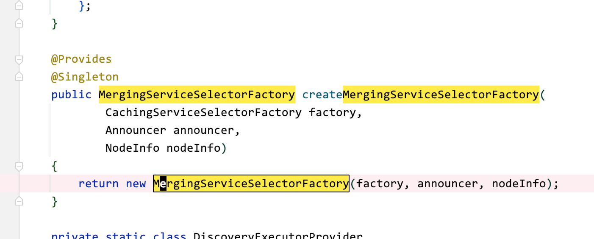
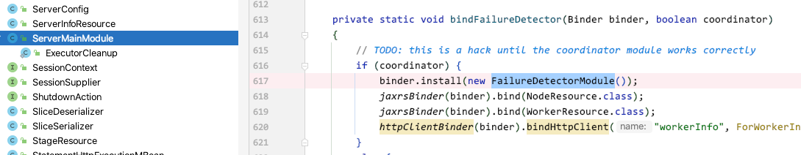
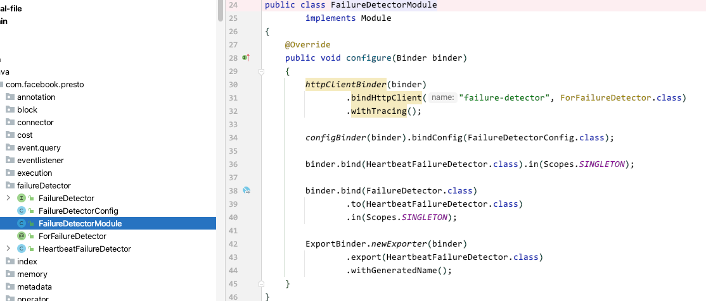
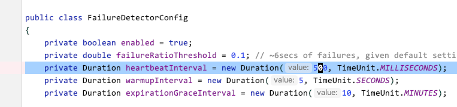
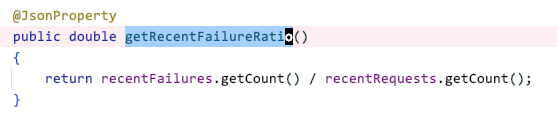
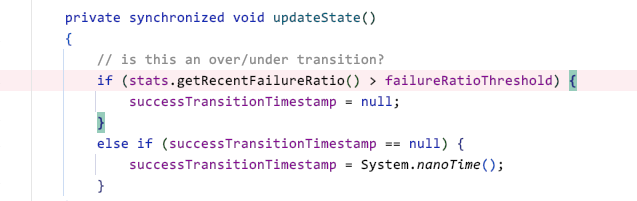
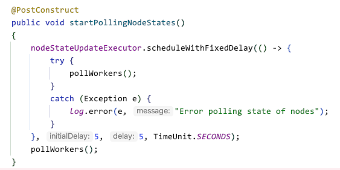
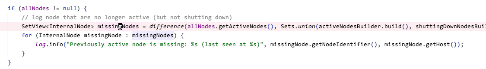

# 服务发现流程

这方面的资料特别少，基本上只有啃源码，但是怎么啃真是一点头绪都没有。于是我搜遍了全网，找了一个日本博主的文章。这篇文章给了我很多启发。

主要是对博主的文章进行翻译，然后丰富里面的流程内容，并且带上我自己的理解。

这里的代码主要是presto与trino结合起来看的，因为它们的服务注册发现都是基于airlift的discovery模块实现的。我是这么想的，比对着两边的代码来看看两个社区之间的代码有没有区别，从这一点可以反映这个引擎的分布式基础是什么样的设计，也可以看出来他们之前在这个基础上的区别。

以下内容主要是翻译自该博主的内容。然后我也添加了一些内容。

## presto有4个Service Discovery相关的主要流程

>服务注册发现(discovery node manager)的实现主要在密封类 DiscoveryNodeManager 中

presto的Coordinator利用discovery node manager注册或更新worker nodes列表，从而实现集群化，那么他们之间的流程主要涉及以下四个：

- Register a node to the discovery server: worker的注册流程，每个worker node每 8 秒向discovery server注册一次
- Update the cache of the node list: service selector: 每 10 秒向discovery server中更新一次注册的节点信息的缓存。
- Perform a health check: ailure detector: 以 0.5 秒的间隔对worker nodes执行健康检查
- Update the node list of the coordinator: discovery node manager更新worker node列表
    - 此信息由Coordinator使用

对上面的四点，画了个大概的时序图

```puml
box "Coordinator" #fff4ff
  participant DiscoveryNodeManager
  participant ServiceSelector
  participant FailureDetector
  participant DiscoveryServer
end box
box "Worker" #f4fff4
  participant Announcer
  participant "PrestoServer\n(worker)" as worker
end box

== Register a node to the discovery server ==

loop every 8 seconds
  Announcer -> DiscoveryServer: PUT /v1/announcement/{node_id}
  DiscoveryServer --> Announcer: 202 Accepted
end

== Update the cache of the node list ==

loop every 10 seconds
  ServiceSelector -> DiscoveryServer: GET /v1/service/presto/general
  DiscoveryServer --> ServiceSelector: services (node list)
end

== Perform a health check ==

loop every 0.5 seconds
  FailureDetector -> ServiceSelector
  ServiceSelector --> FailureDetector: services (node list)
  loop each worker
    FailureDetector -> worker: HEAD /
    worker --> FailureDetector: 404 Not Found
  end
end

== Update the node list of the coordinator ==

loop every 5 seconds
  loop each worker
    DiscoveryNodeManager -> worker: GET /v1/info/state
    worker --> DiscoveryNodeManager: ACTIVE or SHUTTING_DOWN
  end
  DiscoveryNodeManager -> ServiceSelector
  ServiceSelector --> DiscoveryNodeManager: services (node list)
  DiscoveryNodeManager -> FailureDetector
  FailureDetector --> DiscoveryNodeManager: healthy node list
  DiscoveryNodeManager -> DiscoveryNodeManager: Filter healthy nodes
  DiscoveryNodeManager -> DiscoveryNodeManager: Update node list
end
```

接下来详细解读这4个流程

### worker 的注册流程

io.airlift.discovery 为 Presto 提供了服务发现的功能，它有client与server两个角色。Coordinator将通过使用 EmbeddedDiscoveryModule 实现发现服务器的功能。 此外coordinator 和 worker 都通过 DiscoveryModule 具有client角色功能。

再理解这句话之前，需要知道几个细节，是怎么成为Coordinator节点或Worker节点的，并且怎么注册到Discover服务中的。

通过查看airlift框架，发现airlift项目中的discovery是client端，另一个在discovery-server工程里。是两个不同的项目。

- https://github.com/airlift/airlift 客户端的在这里面
- https://github.com/airlift/discovery 服务端的在这里面

**怎么成为Coordinator/Woker节点的呢？**

跟一下代码

```java
// io.trino.server.TrinoServer
...
new Server().start(firstNonNull(version, "unknown")); // 准备启动服务
...

// io.trino.server.Server
public final void start(String trinoVersion)
{
    new EmbedVersion(trinoVersion).embedVersion(() -> doStart(trinoVersion)).run();
}
private void doStart(String trinoVersion)
{
    ...
    ImmutableList.Builder<Module> modules = ImmutableList.builder();
    modules.add(
            new NodeModule(),
            new DiscoveryModule(), // 加载注册发现服务，注意这里是Discovery的client端
            new HttpServerModule(),
            new JsonModule(),
            new JaxrsModule(),
            new MBeanModule(),
            new PrefixObjectNameGeneratorModule("io.trino"),
            new JmxModule(),
            new JmxHttpModule(),
            new LogJmxModule(),
            new TraceTokenModule(),
            new EventModule(),
            new JsonEventModule(),
            new ServerSecurityModule(),
            new AccessControlModule(),
            new EventListenerModule(),
            new CoordinatorDiscoveryModule(), // 加载Coordinator专属的注册发现服务，注意这里是Discovery的server端
            new ServerMainModule(trinoVersion), // 加载节点与服务相关的主module 在这里确认是启动Coordinator还是Worker
            new GracefulShutdownModule(),
            new WarningCollectorModule());

// io.trino.server.ServerMainModule
protected void setup(Binder binder)
{
    ServerConfig serverConfig = buildConfigObject(ServerConfig.class); // 根据配置中的内容
    if (serverConfig.isCoordinator()) {
        install(new CoordinatorModule()); // 成为Coordinator
    }
    else {
        install(new WorkerModule()); // 成为Worker
    }
...
```

**如何注册的呢？**

从上面的源码我们可以看出，是在启动服务的时候，来加载module，在ServerMainModule中通过配置判断启动Coordinator与Worker。

注意到，在加载moudules的时候，我们既加载了Discovery的client，也加载了server。他们是怎么区分的呢？

这里有同样也有个细节，也是关于配置文件的。

在启动server时，通过加载DiscoveryModule来注册client端。在加载CoordinatorDiscoveryModule时里面有个对配置文件的判断。

相当于，如果配置文件中指明了该节点是Coordinator，那么会在还会加载一个EmbeddedDiscoveryModule来注册server端。

```java
// io.trino.server.CoordinatorDiscoveryModule
protected void setup(Binder binder)
{
    if (buildConfigObject(ServerConfig.class).isCoordinator() && buildConfigObject(EmbeddedDiscoveryConfig.class).isEnabled()) {
        install(new EmbeddedDiscoveryModule());
    }
}
```

那么又有个问题了。

启动Worker的时候好理解，我们只注册了client端。启动Coordinator的时候，看代码逻辑是既加载了client又加载了server，是client与server都起了吗？

通过之前了解到presto是暴露了一个`/v1/service`接口可以查看所有的注册信息。

我现在的测试环境启动了2个节点，1个Coordinator，1个Worker。

在接口中查看到以下数据，并且发现，2台节点应该是都注册的client，另一个节点因为是Coordinator它是还多注册了一个server

```json
{
  "environment": "cdh6_test",
  "services": [
    { ... },
    { ... },
    {
      "id": "25a99b20-bcd4-4f81-881f-8432fdd62557",
      "nodeId": "tcdh31",
      "type": "presto",
      "pool": "general",
      "location": "/tcdh31",
      "properties": {
        "node_version": "",
        "coordinator": "false",
        "http": "http://10.150.31.31:5797",
        "http-external": "http://10.150.31.31:5797",
        "connectorIds": "**"
      }
    },
    { },
    {
      "id": "924b4589-1d63-4bbe-a2f5-78a62f91a4fc",
      "nodeId": "tcdh29",
      "type": "presto-coordinator",
      "pool": "general",
      "location": "/tcdh29",
      "properties": {
        "http": "http://10.150.31.29:5797",
        "http-external": "http://10.150.31.29:5797"
      }
    },
    { ... },
    { ... },
    { ... },
    {
      "id": "d7147db7-cfba-4c57-9d7f-e10183650471",
      "nodeId": "tcdh29",
      "type": "presto",
      "pool": "general",
      "location": "/tcdh29",
      "properties": {
        "node_version": "",
        "coordinator": "true",
        "http": "http://10.150.31.29:5797",
        "http-external": "http://10.150.31.29:5797",
        "connectorIds": "***"
      }
    }
  ]
}
```

继续跟着博文走。

client 通过向`/v1/announcement/{node_id}`j发送 PUT 请求来向服务器注册自己。注册信息有30秒的生命周期，所以client会定期向服务器发送注册请求。这个间隔是 8 秒，源码如下：

**airlift工程 discovery模块**

```java
// io.airlift.discovery.client.Announcer 客户端发起注册的代码 发起put
private ListenableFuture<Duration> announce(long delayStart, Duration expectedDelay)
{
    // log announcement did not happen within 5 seconds of expected delay
    if (System.nanoTime() - (delayStart + expectedDelay.roundTo(NANOSECONDS)) > SECONDS.toNanos(5)) {
        log.error("Expected service announcement after %s, but announcement was delayed %s", expectedDelay, Duration.nanosSince(delayStart));
    }

    long requestStart = System.nanoTime();
    ListenableFuture<Duration> future = announcementClient.announce(getServiceAnnouncements()); // 主要是在announce中发起请求，具体的调用代码我们后续领开篇

    Futures.addCallback(future, new FutureCallback<Duration>() // 通过future的回调函数异步获得结果
    {
        @Override
        public void onSuccess(Duration expectedDelay)
        {
            errorBackOff.success();

            // wait 80% of the suggested delay
            expectedDelay = new Duration(expectedDelay.toMillis() * 0.8, MILLISECONDS);
            log.debug("Service announcement succeeded after %s. Next request will happen within %s", Duration.nanosSince(requestStart), expectedDelay);

            scheduleNextAnnouncement(expectedDelay);
        }

        @Override
        public void onFailure(Throwable t)
        {
            Duration duration = errorBackOff.failed(t);
            // todo this is a duplicate log message and should be remove after root cause of announcement delay is determined
            log.error("Service announcement failed after %s. Next request will happen within %s", Duration.nanosSince(requestStart), expectedDelay);
            scheduleNextAnnouncement(duration);
        }
    }, executor);

    return future;
}
```

TODO 这个每隔8秒发一次注册请求的逻辑，是一个值得学习的细节。。。

**discovery工程 discovery-server模块**

```java
// io.airlift.discovery.server.DynamicAnnouncementResource 服务端接收注册的代码 接收put
@PUT
@Consumes(MediaType.APPLICATION_JSON)
public Response put(@PathParam("node_id") Id<Node> nodeId, @Context UriInfo uriInfo, DynamicAnnouncement announcement)
{
    if (!nodeInfo.getEnvironment().equals(announcement.getEnvironment())) {
        return Response.status(BAD_REQUEST)
                .entity(format("Environment mismatch. Expected: %s, Provided: %s", nodeInfo.getEnvironment(), announcement.getEnvironment()))
                .build();
    }

    String location = firstNonNull(announcement.getLocation(), "/somewhere/" + nodeId.toString());

    DynamicAnnouncement announcementWithLocation = DynamicAnnouncement.copyOf(announcement)
            .setLocation(location)
            .build();

    dynamicStore.put(nodeId, announcementWithLocation);

    return Response.status(ACCEPTED).build();
}
```

服务端从注册接口收到注册信息后，存入到store中，后他们是怎么控制这个30秒的生命周期呢？TODO

```java
// io.airlift.discovery.server.ReplicatedDynamicStore 注册的内容只有30秒有效
@Override
public void put(Id<Node> nodeId, DynamicAnnouncement announcement)
{
    List<Service> services = FluentIterable.from(announcement.getServiceAnnouncements())
            .transform(toServiceWith(nodeId, announcement.getLocation(), announcement.getPool()))
            .toList();

    byte[] key = nodeId.getBytes();
    byte[] value = codec.toJsonBytes(services);

    store.put(key, value, maxAge); // 30秒设置到maxAge这个变量中了
}
```

这里有个细节我们注意下，注册的信息的放到了 store中了，那么这个store是什么呢？airlift太猛了，他们自己实现了一个简单的分布式kv存储。

```java
/**
 * A simple, eventually consistent, fully replicated, distributed key-value store.
 */
public class DistributedStore { ... }
```

看完代码，我们再搭配一下时序图，可以更好的理解流程。

```puml
Announcer -> DiscoveryServer: PUT /v1/announcement/{node_id}
DiscoveryServer -> ReplicatedDynamicStore: put(nodeId, announcementWithLocation)
ReplicatedDynamicStore -> DistributedStore: put(key, value, maxAge)
DistributedStore --> ReplicatedDynamicStore
ReplicatedDynamicStore --> DiscoveryServer
DiscoveryServer --> Announcer: 202 Accepted
```


最后我们还可以在日志中发现请求是每 8 秒到达一次。

```
[hadoop@ip-172-31-12-132 ~]$ grep /v1/announcement/ /var/log/presto/http-request.log | tail -6
2019-12-30T20:11:58.554Z        172.31.11.228   PUT     /v1/announcement/i-03b318a81b0e7e111    null    i-03b318a81b0e7e111     202     653     0       0       4a9527959d254d12892a7ddb075d07af0000002c3fHTTP/1.1        0       0       -1      null
2019-12-30T20:12:02.427Z        172.31.6.91     PUT     /v1/announcement/i-0a310199806b303fd    null    i-0a310199806b303fd     202     643     0       0       4a9527959d254d12892a7ddb075d07af0000002c44HTTP/1.1        0       0       -1      null
2019-12-30T20:12:03.673Z        172.31.12.132   PUT     /v1/announcement/i-0a4878ec8276e705a    null    i-0a4878ec8276e705a     202     968     0       1       4a9527959d254d12892a7ddb075d07af0000002c46HTTP/1.1        0       0       -1      null
2019-12-30T20:12:06.555Z        172.31.11.228   PUT     /v1/announcement/i-03b318a81b0e7e111    null    i-03b318a81b0e7e111     202     653     0       1       4a9527959d254d12892a7ddb075d07af0000002c49HTTP/1.1        0       0       -1      null
2019-12-30T20:12:10.429Z        172.31.6.91     PUT     /v1/announcement/i-0a310199806b303fd    null    i-0a310199806b303fd     202     643     0       0       4a9527959d254d12892a7ddb075d07af0000002c4bHTTP/1.1        0       0       -1      null
```


### service selector向discovery server中更新注册的节点信息的缓存

DiscoveryModule 使用 CachingServiceSelector 获取有关在发现服务器上注册的服务的信息。

严格的说是MergingServiceSelector，但是MergingServiceSelector拥有CachingServiceSelector，查询发现服务器的是CachingServiceSelector。



CachingServiceSelector 每 10 秒向发现服务器发送一个请求以更新节点列表。

如果您实际查看discovery server日志，您会看到请求每 10 秒到达一次。 由于它是 DiscoveryModule 的一个函数，它从发现服务器获取节点列表，而不考虑Coordinator或Worker。

```
[hadoop@ip-172-31-12-132 ~]$ grep /v1/service/presto /var/log/presto/http-request.log | tail -6
2019-12-30T20:13:03.923Z        172.31.11.228   GET     /v1/service/presto/general      null    i-03b318a81b0e7e111     200     0       962     1       4a9527959d254d12892a7ddb075d07af0000002c8d      HTTP/1.1  0       0       0       null
2019-12-30T20:13:11.591Z        172.31.6.91     GET     /v1/service/presto/general      null    i-0a310199806b303fd     200     0       962     1       4a9527959d254d12892a7ddb075d07af0000002c93      HTTP/1.1  0       0       0       null
2019-12-30T20:13:11.807Z        172.31.12.132   GET     /v1/service/presto/general      null    i-0a4878ec8276e705a     200     0       962     0       4a9527959d254d12892a7ddb075d07af0000002c95      HTTP/1.1  0       0       0       null
2019-12-30T20:13:13.925Z        172.31.11.228   GET     /v1/service/presto/general      null    i-03b318a81b0e7e111     200     0       962     1       4a9527959d254d12892a7ddb075d07af0000002c99      HTTP/1.1  0       0       0       null
2019-12-30T20:13:21.611Z        172.31.6.91     GET     /v1/service/presto/general      null    i-0a310199806b303fd     200     0       962     1       4a9527959d254d12892a7ddb075d07af0000002c9e      HTTP/1.1  0       0       0       null
```

### 通过Failure detector实现健康检查

HeartbeatFailureDetector 用作故障检测器。





HeartbeatFailureDetector会以一定的间隔向worker nodes发送HEAD请求来进行健康检查。

默认情况下，健康检查的间隔是500ms, 1分钟的失败率超过0.1就视为异常。







### Discovery node manager更新worker node列表

DiscoveryNodeManager 类，管理了Coordinator使用的worker 节点列表

DiscoveryNodeManager 每 5 秒运行一次 pollWorkers 来更新节点列表和每个节点的状态。



时序图如下

```puml
participant DiscoveryNodeManager
participant RemoteNodeState
participant HeartbeatFailureDetector
participant MergingServiceSelector
participant Announcer
participant CachingServiceSelector

DiscoveryNodeManager -> DiscoveryNodeManager: pollWorkers()
activate DiscoveryNodeManager
  loop each nodeStates.values()
    DiscoveryNodeManager -> RemoteNodeState: asyncRefresh()
  end

  DiscoveryNodeManager -> DiscoveryNodeManager: refreshNodesInternal()
  activate DiscoveryNodeManager
    DiscoveryNodeManager -> MergingServiceSelector: selectAllServices()
    MergingServiceSelector -> Announcer: getServiceAnnouncements()
    Announcer --> MergingServiceSelector: serviceAnnouncements
    MergingServiceSelector -> CachingServiceSelector: selectAllServices()
    CachingServiceSelector --> MergingServiceSelector: serviceDescriptors
    MergingServiceSelector --> DiscoveryNodeManager: merge(serviceAnnouncements, serviceDescriptors)
    loop each service descriptor
      DiscoveryNodeManager -> HeartbeatFailureDetector: getFailed()
      HeartbeatFailureDetector --> DiscoveryNodeManager: failed services
    end
    note right
     Filter healthy services
    end note

    loop each service descriptor
      DiscoveryNodeManager -> RemoteNodeState: getNodeState()
      RemoteNodeState --> DiscoveryNodeManager: node state
    end
    note right
     Separate descriptors by their node state
    end note

    DiscoveryNodeManager -> DiscoveryNodeManager: update allNodes
  deactivate DiscoveryNodeManager
deactivate DiscoveryNodeManager
```

节点状态通过请求/v1/info/state获取。

如果您查看每个worker的日志，您可以看到Coordinator (172.31.12.132) 每 5 秒发出一次请求。

```
[hadoop@ip-172-31-6-91 ~]$ grep /v1/info/state /var/log/presto/http-request.log | tail -3
2019-12-30T20:51:48.469Z        172.31.12.132   GET     /v1/info/state  null    null    200     0       9       0       f2b3905f1ba842e4957ad46855b567f700000048b5      HTTP/1.1        0       0       0null
2019-12-30T20:51:53.47Z 172.31.12.132   GET     /v1/info/state  null    null    200     0       9       0       f2b3905f1ba842e4957ad46855b567f700000048c2      HTTP/1.1        0       0       0       null
2019-12-30T20:51:58.47Z 172.31.12.132   GET     /v1/info/state  null    null    200     0       9       1       f2b3905f1ba842e4957ad46855b567f700000048d0      HTTP/1.1        0       0       0       null
```

另外，好像只有三种状态：ACTIVE、SHUTTING_DOWN、ACL（presto-server的版本和coordinator不同）。


### 检查何时没有可用的工作节点

当先前注册的节点消失时，DiscoveryNodeManager 会将“以前的活动节点丢失”记录到 server.log。



如果了解 Presto 中服务发现的工作原理，就会知道如果发生这种情况，会有以下几种可能性：

- discovery server已经超过 30 秒没有收到来自worker的 PUT 请求 (可以在/v1/service/presto/general中查看，是否有对应的worker信息缺失)
- Worker 节点最后一分钟健康检查失败的概率超过 10%。

因此，在第一种情况下，应该检查Coordinator的http-request.log，看看是否有worker节点对`/v1/announcement/{node_id}`的请求。 如果没有来自该worker节点的请求日志，则worker节点很可能已经出现了问题。第二种情况，可以查看worker节点的http-request.log，看是否有`HEAD /`的请求。

如果没有请求`/v1/announcement/{node_id}`，查看worker节点的server.log，检查是否有致命错误。

例如，如果discovery server没有响应，则会记录以下错误日志：

```
2019-12-30T21:04:12.449Z        ERROR   Discovery-4     io.airlift.discovery.client.CachingServiceSelector      Cannot connect to discovery server for refresh (presto/general): Lookup of presto failed for http://ip-172-31-12-132.ap-northeast-1.compute.internal:8889/v1/service/presto/general
2019-12-30T21:04:12.852Z        ERROR   Discovery-0     io.airlift.discovery.client.CachingServiceSelector      Cannot connect to discovery server for refresh (collector/general): Lookup of collector failed for http://ip-172-31-12-132.ap-northeast-1.compute.internal:8889/v1/service/collector/general
2019-12-30T21:04:15.523Z        ERROR   Announcer-3     io.airlift.discovery.client.Announcer   Cannot connect to discovery server for announce: Announcement failed for http://ip-172-31-12-132.ap-northeast-1.compute.internal:8889
2019-12-30T21:04:15.524Z        ERROR   Announcer-3     io.airlift.discovery.client.Announcer   Service announcement failed after 1.00m. Next request will happen within 8000.00ms
```

如果在所有worker节点上看到此类日志，则Coordinator上可能有 Stop The World。 检查Coordinator的 GC 日志是个好主意。


---

参考

- https://abicky.net/2019/12/31/064732/

